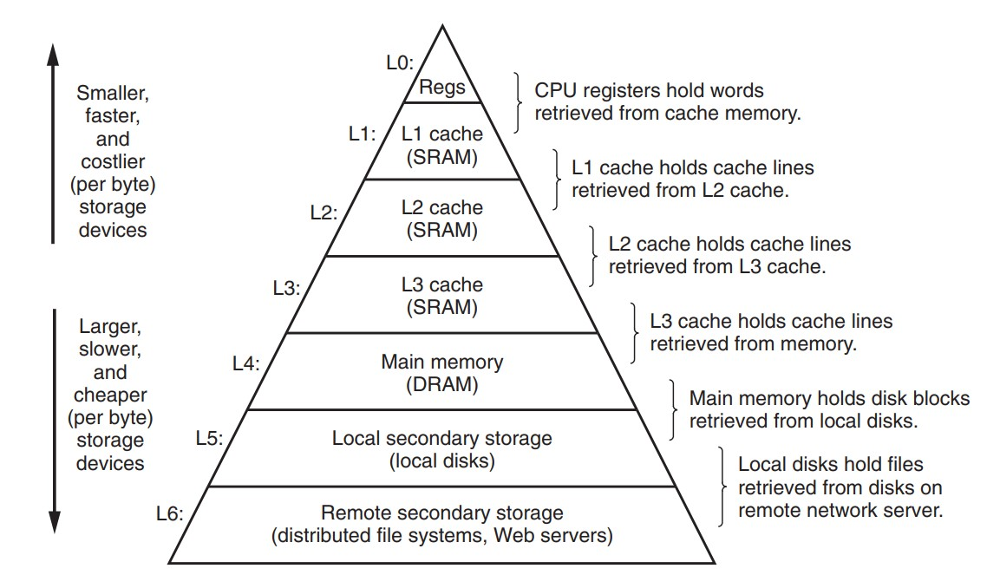
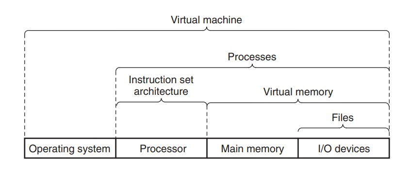
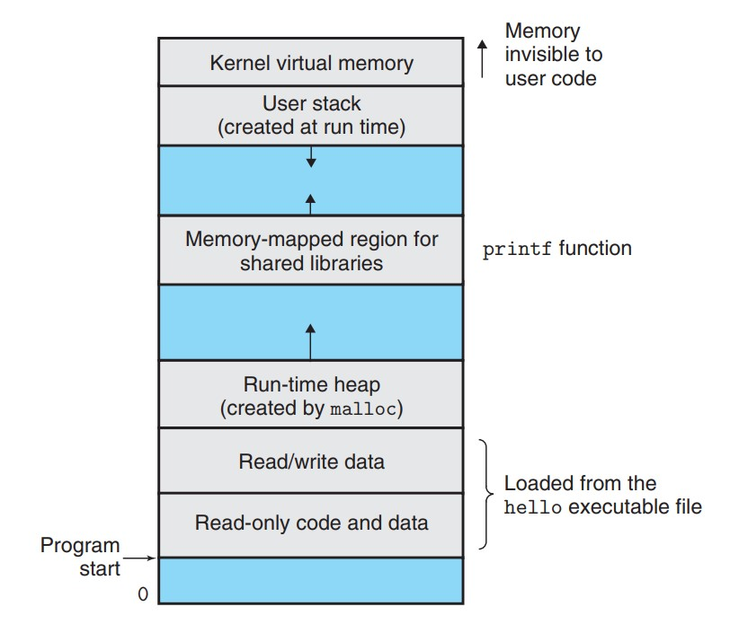

# Ⅰ 计算机系统漫游 A Tour of Computer Systems

***

### 程序翻译的过程

* **预处理器**：根据以字符#开头的命令，修改源程序，例如：`#include <stdio.h>`命令暗示预处理器读取对应头文件中的内容，并将其插入源程序中。
* **编译器**：将修改后的源程序翻译成汇编语言。
* **汇编器**：将汇编语言翻译成机器语言指令，并打包成可重定位目标程序，对应二进制文件。
* **链接器**：将可重定位目标程序和预编译好了的目标文件进行合并，得到可执行目标文件，例如：程序调用`printf`函数，其有提供一个单独的预编译好了的目标文件`printf.o`。
  
### 存储设备的层次结构

主要思想：上一层的存储器作为低一层的存储器的高速缓存。

### 操作系统层面的抽象

* **进程**：操作系统对一个正在运行的程序的一种抽象，在一个系统上可以同时交错运行多个进程，而每个进程都好像在单独使用硬件，操作系统实现这种交错执行的机制称为上下文切换。在进程之下还可以细分出线程，一个进程实际上可以由多个称为线程的执行单元组成。
* **虚拟内存**：操作系统对每个进程单独使用的内存的一种抽象，又称虚拟地址空间，这实际上是一种假象。
* **文件**：即字节序列，每个I/O设备都可以看作文件。

### 虚拟内存

* **只读代码/数据**：直接按照可执行文件的内容初始化。
* **运行时堆**：当调用`malloc`之类的函数时，运行时堆会进行动态地扩展和收缩。
* **共享库**：存放像C标准库和数学库之类的代码/数据。
* **用户栈**：实现函数调用，可以动态地扩展和收缩。
* **内核虚拟内存**：为内核保留的无法读写的禁区。

### Amdahl 定律

当对系统某个部分加速时，其对系统整体性能的影响取决于该部分的重要性和加速程度。

* $\alpha$：系统某部分所需执行时间与总执行时间的比例
* $k$：该部分的性能提升比例
* $S$：加速比 $S=\frac{1}{(1-\alpha)+\frac{\alpha}{k}}$

Amdahl 定律的主要观点：要想显著加速整个系统，必须提升全系统中相当大的部分的速度。