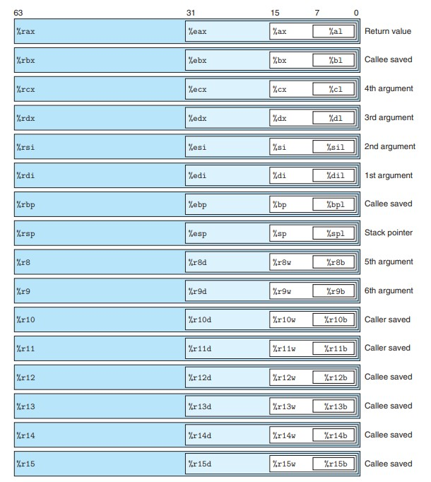
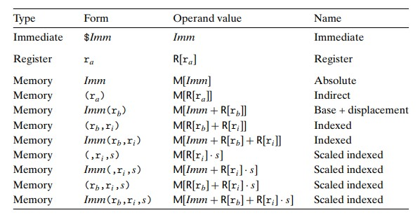

# Ⅲ 程序的机器级表示   Machine-Level Representation of Programs

***

## 3.1 历史观点  A Historical Perspective

略。

***

## 3.2 程序编码  Program Encodings

### 寄存器

* **程序计数器（PC）**：存放下一条将要被执行的指令的地址。（在 x86-64 中用 %rip 表示）
* **整数计数器**：存放 64 位的值，一共 16 个。
* **条件码寄存器**：存放最近执行的算术或逻辑指令的状态信息。
* **向量寄存器**：存放一个或多个整数或浮点数。

***

## 3.3 数据格式  Data Formats

### 数据类型大小

Intel 用术语“字”表示 16 个 bit，称 32 位数为“双字”，称 64 位数为“四字”。

***

## 3.4 访问信息  Accessing Information

### 整数寄存器（通用目的寄存器）

* 对于生成小于 8 字节结果的指令，寄存器中剩余字节有以下规则：生成 1 字节或 2 字节结果的指令会保持剩下的字节不变；生成 4 字节结果的指令会将高 4 位置为 0。
* %rsp 为栈指针，用来指明运行时栈的结束位置。

### 操作数格式

### 数据传送指令MOV

作用：把数据从源位置复制到目的位置，不做任何变化，两个位置不能全是内存。

* **movb**：传送 1 个字节
* **movw**：传送 2 个字节
* **movl**：传送 4 个字节
* **movq**：传送 8 个字节
* **movabsq**：传送 8 个字节（绝对）

MOV 指令只会更新目的操作数指定的寄存器字节或者内存位置，唯一的例外是 movl 指令以寄存器作为目的时，会将该寄存器的高位全设为 0。

常规的 movq 指令只能以表示为 32 位补码数字的立即数作为源操作数，然后符号扩展为 64 位。但 movabsq 指令能直接以 64 位立即数作为源操作数，并且只能以寄存器为目的。

以下两类 MOV 指令将较小的源值复制到较大的目的。MOVZ 类进行零扩展，MOVS 类指令进行符号扩展。

* **movzbw**：零扩展，1 个字节到 2 个字节
* **movzbl**：零扩展，1 个字节到 4 个字节
* **movzbq**：零扩展，1 个字节到 8 个字节
* **movzwl**：零扩展，2 个字节到 4 个字节
* **movzwq**：零扩展，2 个字节到 8 个字节  
$~$
* **movsbw**：符号扩展，1 个字节到 2 个字节
* **movsbl**：符号扩展，1 个字节到 4 个字节
* **movsbq**：符号扩展，1 个字节到 8 个字节
* **movswl**：符号扩展，2 个字节到 4 个字节
* **movswq**：符号扩展，2 个字节到 8 个字节
* **movslq**：符号扩展，4 个字节到 8 个字节
* **cltq**：符号扩展，%eax 到 %rax，无操作数

### 入栈指令PUSH与出栈指令POP

* **pushq $S$**：将 8 个字节压入栈（栈指针 -8 并传送数据至内存）
* **popq $D$**：将 8 个字节弹出栈（栈指针 +8 并传送内存中的对应数据至寄存器$D$）

***

## 3.5 算术与逻辑操作  Arithmetic and Logical Operations

### 地址加载指令leaq

作用：将有效地址写到目的操作数，或者简洁地描述算术操作。

### 一元和二元操作指令

* **INC**：自加 1
* **DEC**：自减 1
* **NEG**：数值取反
* **NOT**：按位取反
$~$
* **ADD**：加
* **SUB**：减
* **IMUL**：乘
* **XOR**：异或
* **OR**：或
* **AND**：与
* **SAL**：左移
* **SAR**：算术右移
* **SHR**：逻辑右移

### 128位操作指令

* **imulq $S$**：有符号全乘法
  第一个 64 位参数存在 %rax 中，另一个为 $S$，乘积的高 64 位存在 %rdx 中，低 64 位存在 %rax 中。
* **mulq $S$**：无符号全乘法
  数据存放位置同 imulq
* **idivq $S$**：有符号除法
  被除数的高 64 位存在 %rdx 中，低 64 位存在 %rax 中，除数为 $S$，商存在 %rax 中，余数存在 %rdx 中。
* **divq $S$**：无符号除法
  数据存放位置同 idivq
* **cqto**：转换 16 字节，隐含读出 %rax 的符号位，并将它复制到 %rdx 的所有位

***

## 3.6 控制  Control

### 条件码

条件码寄存器各自只有 1 位，描述最近的算数或逻辑操作的属性。除了 leaq 指令以外，其余的算数逻辑操作指令都会设置相应的条件码。

* **CE（进位标志）**：最近的操作使最高位产生了进位
* **ZF（零标志）**：最近的操作结果为 0
* **SF（符号标志）**：最近的操作结果为负数
* **OF（溢出标志）**：最近的操作导致补码溢出

以下两个指令只会设置条件码，而不会改变其他寄存器：

* **CMP $S_1$，$S_2$**：基于 $S_2-S_1$ 设置条件码，分为 cmpb，cmpw，cmpl，cmpq
* **TEST $S_1$，$S_2$**：基于 $S_1\&S_2$ 设置条件码，分为 testb，testw，testl，testq

`testq %rax,%rax`用于检查 %rax 是正数/负数/零。

条件码