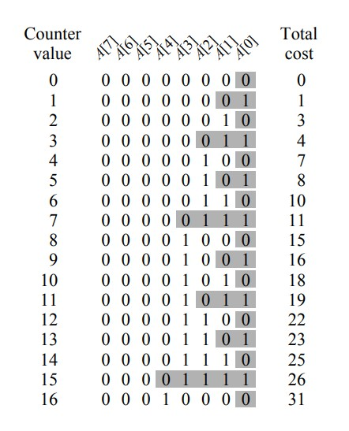

<span style="font-family: 'Times New Roman';">

# Chapter1 AVL Tree,Splay Tree and Amortized Analysis

***

## 1.1 AVL Tree 平衡树

### 定义

对于一棵普通的二叉搜索树，其插入、搜索和删除都可以在$O(h)$时间内完成，$h$为树的高度。但存在斜树的情况，使得$h$趋向于$N$，$N$为节点个数。因此，我们需要调整树的结构，使其在维持二叉搜索树的性质同时，能够尽量减小高度，使得$h=O(\log N)$恒成立。

满足以下条件的二叉搜索树称为**AVL树**（高度平衡）:

* 左右子树都是AVL树
* 左右子树高度差不超过1

即：AVL树中的任意一个节点都满足左右子树高度差不超过1。

定义节点node的**平衡因子**（约定空树的高度为-1）：

$$BF(node)=h_L-h_R$$

因此对于AVL树中的任意一个节点node：

$$BF(node)=0,1,-1$$

### 旋转

对于AVL树的插入操作，有可能会破坏某些节点的平衡，因此需要从出错节点开始进行树的旋转，在保持BF的正确性的同时保持BST的顺序性。


BF出错节点的查找顺序：从新插入的节点开始一直向上寻找，直到找到一个|BF|>1的节点。

!!! Note
    在插入的时候，可能导致多个节点的平衡被破坏，但只需要一次旋转操作即可让所有平衡被破坏的节点恢复。

**RR旋转：** 

新插入的节点位于BF出错节点（A）的右孩子（B）的右子树中，此时旋转一次：


**LL旋转：** 

与RR旋转类似，新插入的节点位于BF出错节点的左孩子的左子树中，同样旋转一次：


**LR旋转：** 

新插入的节点位于BF出错节点的左孩子的右子树中，此时旋转两次，先让C成为B的父节点，再让C成为A的父节点：


**RL旋转：** 

与LR旋转类似，新插入的节点位于BF出错节点的右孩子的左子树中，同样旋转两次：


### 时间复杂度

AVL树搜索、插入和删除（不作要求）的时间复杂度：

$$T=O(h)=O(\log N)$$

$h$为AVL树的高度。设$n_h$为AVL树的最少节点数，根节点的左右子树的高度为$h-1$或$h-2$，为了使节点数最少，应使左子树高度为$h-1$，右子树高度为$h-2$（或者相反）。因此可以推出：

$$n_h=n_{h-1}+n_{h-2}+1$$

$$n_h\approx\frac{1}{\sqrt{5}}(\frac{1+\sqrt{5}}{2})^{h+3}$$

$$h=O(\log N)$$

***

## 1.2 Splay Tree 伸展树

Splay树并不像AVL树那样严格平衡，其只需要保证从空树开始，任意$M$次连续的操作（插入、搜索和删除）至多用时$O(M\log N)$，实现这个目的的关键在于**将每次操作的节点移动至根节点的位置**。

### splay操作

splay操作将$X$旋转至根节点，同时保持BST的性质。记$X$的父节点为$P$，$P$的父节点为$G$。

* **zig：**  
  情况：$P$为根节点  
  操作：旋转一次，旋转$X$和$P$
* **zig-zag：**  
  情况：$P$不为根节点且$X$和$P$左右节点属性相反  
  操作：旋转两次，先旋转$X$和$P$，再旋转$X$和$G$，使得最后$X$同时作为$P$和$G$的父节点
* **zig-zig：**   
  情况：$P$不为根节点且$X$和$P$左右节点属性相同  
  操作：旋转两次，先旋转$P$和$G$，再旋转$X$和$P$，使得$X<P<G$的关系变为$X>P>G$的关系


!!! Note
    splay操作不仅将访问节点移动至根节点，同时能减小树的高度。

### deletion操作

* 第一步：find$X$（先通过BST的性质找到$X$，再通过splay操作将$X$旋转至根节点）
* 第二步：将$X$移走（此时留下左子树$T_L$和右子树$T_R$）
* 第三步：FindMax($T_L$)（找到左子树的最大元素后将其取出，作为新树的根节点）
* 第四步：让$T_R$成为新树的右子树

***

## 1.3 Amortized Analysis 摊还分析

### 基本概念

$$average\leqslant amortized\leqslant worst$$

**平均分析：** 

在一系列操作中考虑不同操作的概率，由于每一种操作有其时间复杂度，因此可以按概率分布计算每次操作的平均值。

**最差分析：** 

考虑每一种操作的最差时间复杂度，但是当遇到一系列操作时，如果每个操作都按照最差情况考虑，则有可能不存在对应的情况。

**摊还分析：** 

对于一系列操作，同样也是考虑每一种操作的最差时间复杂度，但有些不可能的操作情况会被排除掉，最后同样进行平均计算，得到的复杂度一定比最差分析好，因为排除掉了不可能的所谓最差序列，又一定比平均分析差，因为取的是所有可能中最差的一种。但请注意，**摊还分析要从空结构开始**。

三种摊还分析的方法：**聚合法**，**记账法**，**势能法**。

### Aggregate Method 聚合法

若已知可能出现的操作序列中最差的序列，并且知道每种操作对应的数量和时间，则可以直接将所有的操作时长加起来得到最坏时间$T(n)$，除以操作次数$n$，得到的$\frac{T(n)}{n}$即为摊还时间复杂度。

### Accounting Method 记账法

为每种操作（注意是种类）预先分配一个固定的摊还成本，实际成本低于摊还成本的操作会将多余的成本（credit）存储，以弥补实际成本高于摊还成本的操作。

记第$i$次操作的实际成本为$c_i$，摊还成本为$\hat{c_i}$，则对于任意的操作次数$n$，都要有

$$\sum\limits_{i=1}^n\hat{c_i}\geqslant\sum\limits_{i=1}^nc_i$$

即保证每次操作后账本中的储蓄非负，这是我们假定摊还成本的依据，这样可以保证摊还复杂度一定大于平均复杂度。

这种方法实际上是在对摊还成本进行猜测，然后进行验证。

### Potential Method 势能法

每一步操作的实际成本$c_i$都将数据结构从$D_{i-1}$改变为$D_i$，因此每一步操作设置的摊还成本可定义为

$$\hat{c_i}=c_i+\varphi(D_i)-\varphi(D_{i-1})$$

其中$\varphi$为**势能函数**，由当前数据结构的某一特征决定，如树的高度，元素的总数等。

与记账法不同，记账法是对**每一种操作**定义摊还成本，而势能法是对**每一步操作**定义摊还成本。在势能分析中，我们只需要保证最后$\varphi(D_n)\geqslant\varphi(D_0)$即可，因此条件比记账法更宽。

### 例1：堆栈操作

* `Push`：将单个元素入栈，实际时间开销为$O(1)$
* `Pop`：将单个元素出栈，实际时间开销为$O(1)$
* `MultiPop`：将$k$个元素出栈，实际时间开销为为$O(\min\\{|Stack|,k\\})$

!!! Note
    后续为了说明方便，时间开销省略$O$符号。

**聚合法：**

聚合法需要找到可能的最坏情况：因为`Push`和`Pop`的开销均为1，而`MultiPop`的开销明显更大，因此我们希望一次`MultiPop`能带来尽可能大的开销，实际对应的情况为：`Push`进行$n-1$次，最后一次`MultiPop`，这种情况耗时最长，为$2n-2$，对应$O(n)$。

摊还复杂度：

$$T_{amortized}=\frac{O(n)}{n}=O(1)$$

**记账法：**

一开始为三种操作预先分配好摊还成本，其中`Push`为2，`Pop`和`MultiPop`为$0$。

设一共进行$n$次操作，按照摊还成本来计算，记`Push`一共$n_1$次，则总摊还成本为$2n_1$，由于$2n_1\leqslant2n$，所以总摊还成本为$O(n)$。

接下来证明：每一次操作之后盈余都不为负，因此实际总成本更低。对于每一次`Push`，实际上只会带来1的开销，但我们假设摊还成本为2，因此在$k$次`Push`之后，我们累积获得了$k$的储蓄，而这些储蓄在任意次`Pop`和`MultiPop`后都不会变成负数，因为这两种操作的实际开销最多等于栈中剩余的元素个数，即$k$。也就是说我们摊还成本给多了，实际成本用不到那么多。

摊还复杂度：

$$T_{amortized}=\frac{O(n)}{n}=O(1)$$

**势能法：**

设势能函数$\varphi$为栈中的元素数量，每个元素贡献1个势能，满足$\varphi(D_n)\geqslant\varphi(D_0)$。

* 对于`Push`，元素进栈，势能+1，摊还成本为$1+1=2$
* 对于`pop`，元素出栈，势能-1，摊还成本为$1-1=0$
* 对于`MultiPop`，$k$个元素出栈，势能$-k$，摊还成本为$k-k=0$

因此所有的摊还成本之和为$2n_1$，其中$n_1$为`Push`的次数，即$O(n)$。

摊还复杂度：

$$T_{amortized}=\frac{O(n)}{n}=O(1)$$

### 例2：二进制计数器

使用长度为$k$的数组$A$来表示$k$个bit的数字，$A[0]$为最低位，$A[k-1]$为最高位，表示的数字$x=\sum\limits_{i=0}^{k-1}A[i]·2^i$，$x$初始为0，只有一个操作`Increment`，表示$x$自增1，伪代码如下：

```c linenums="1"
Increment(A)
{
  i=0;
  while(i<A.length and A[i]==1)
  {
    A[i]=0;
    i=i+1;
  }
  if(i<A.length)
  {
    A[i]=1;
  }
}
```



**聚合法：**

对于$A[0]$，在$n$次操作中最多改变$n$次，耗时为$n$；对于$A[1]$，在$n$次操作中最多改变$\lfloor\frac{n}{2}\rfloor$次，耗时为$\lfloor\frac{n}{2}\rfloor$；······；对于$A[k-1]$，在$n$次操作中最多改变$\lfloor\frac{n}{2^{k-1}}\rfloor$次，耗时为$\lfloor\frac{n}{2^{k-1}}\rfloor$。

综上，最坏的总耗时不超过

$$n+\frac{n}{2}+···+\frac{n}{2^{k-1}}=O(n)$$

摊还复杂度：

$$T_{amortized}=\frac{O(n)}{n}=O(1)$$

**记账法：**

假定摊还成本：从$0$到$1$的一次操作收费为2，从$1$到$0$的一次操作收费为0，即将`Increment`视作两种子操作的组合。

实际操作时，对于这一位从$0$到$1$的实际设定操作其实只消耗1，因此将剩下的1放在这一位上，作为储蓄，用于之后将这一位设置回0时使用（每次设置的实际成本均为1）。此时总盈余等于所有位中1的数量，非负。而从$0$到$1$的操作最多进行$n$次，消耗$2n$，因此摊还成本为$O(n)$。

摊还复杂度：

$$T_{amortized}=\frac{O(n)}{n}=O(1)$$

**势能法：**

对于每一次`Increment`之后，定义数列中1的个数为势能函数$\varphi(D_i)$，由于一开始没有1，所以势能为0，末势能一定高于0，势能函数有效。

假设第$i$次`Increment`让$t_i$个bit从1变到0，则实际成本为$t_i+1$，势能变化为$1-t_i$。

因此根据定义的公式，摊还成本为：

$$\hat{c_i}=(t_i+1)+(1-t_i)=2$$

总摊还成本为$2n$，对应$O(n)$。

摊还复杂度：

$$T_{amortized}=\frac{O(n)}{n}=O(1)$$

### 例3：用势能法分析Splay树

定义每次操作之后的势能：

$$\varphi(T)=\sum\limits_{i\in T}\log S(i)$$

其中$T$表示操作对应的树，$i$表示这棵树中的任意节点，$S(i)$表示节点$i$的后代总数（包括节点$i$本身）。

记$\log S(i)=R(i)$，可大致理解为节点$i$对应的子树的秩（树高），以下的$R_1(i)$表示相应操作前节点$i$的秩，$R_2(i)$表示相应操作后节点$i$的秩。

!!! Note
    若$a+b\leqslant c$，则$\log a+\log b\leqslant2\log c-2$


**Zig：**

实际成本：

$$c_i=1$$

摊还成本：

$$\hat{c_i}=c_i+R_2(X)-R_1(X)+R_2(P)-R_1(P)$$

由于

$$R_2(P)\leqslant R_1(P)$$

因此

$$\hat{c_i}\leqslant 1+R_2(X)-R_1(X)$$

**Zig-zag：**

实际成本：

$$c_i=2$$

摊还成本：

$$\hat{c_i}=c_i+R_2(X)-R_1(X)+R_2(P)-R_1(P)+R_2(G)-R_1(G)$$

易知：

$$R_2(X)=R_1(G)$$

因此抵消。由于

$$S_2(P)+S_2(G)\leqslant S_2(X)$$

因此由数学公式可得：

$$R_2(P)+R_2(G)\leqslant 2R_2(X)-2$$

因此可将式中的常数项抵消

$$\hat{c_i}\leqslant 2(R_2(X)-R_1(X))$$

**Zig-zig：**

实际成本：

$$c_i=2$$

摊还成本：

$$\hat{c_i}=c_i+R_2(X)-R_1(X)+R_2(P)-R_1(P)+R_2(G)-R_1(G)$$

同理：$R_2(X)$可以和$R_1(G)$抵消。

$$R_2(P) < R_2(X)$$

$$R_1(P)>R_1(X)$$

$$R_1(X)+R_2(G)\leqslant 2R_2(X)-2$$

因此
$$\hat{c_i}=2-R_1(X)+R_2(P)-R_1(P)+R_2(G)\leqslant 3(R_2(X)-R_1(X))$$  

对于某一次整体操作（例如find），其中会涉及到若干次子操作（`Zig`，`Zig-zag`，`Zig-zig`），需要进行累加。`Zig`子操作至多执行1次，`Zig-zag`和`Zig-zig`执行次数未知。

先将`Zig-zag`的摊还成本进一步放缩为$3(R_2(X)-R_1(X))$，假设`Zig-zag`和`Zig-zig`总共进行$n$次，则摊还成本为

$$\sum\limits_{i=1}^n3(R_2(X)-R_1(X))$$

由于第$i$项中的$R_2(X)$等于第$i+1$项中的$R_1(X)$，因此前后抵消得到

$$3(R_2(X)-R_1(X))$$

其中$R_2(X)$为节点$X$经过$n$次`Zig-zag`和`Zig-zig`后最终的秩，$R_1(X)$为节点$X$最初的秩。对`Zig`（如果有的话肯定在最后）也进一步放缩为$1+3(R_2(X)-R_1(X))$，此处的$R_1(X)$等于另外两个操作摊还成本中的$R_2(X)$，因此也抵消，最后得到：

$$T_{amortized}=1+3(R_2(X)-R_1(X))\rightarrow 3\log S(X)-2\rightarrow O(\log N)$$