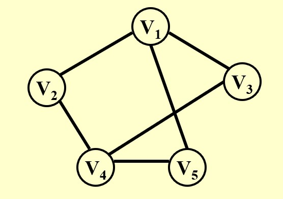
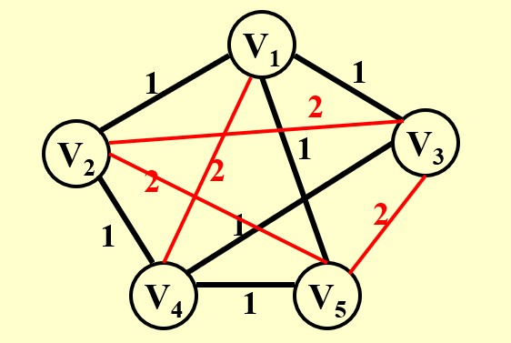
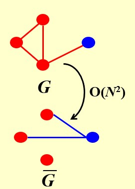

# Chapter10 NP Completeness NP完全性

***

### 10.1 引入

**回忆：**

* 欧拉回路问题：给定一张图，找到一条回路，使得这条回路经过图上的所有边，且不重复
* 汉密尔顿回路问题：给定一张图，找到一条回路，使得这条回路经过图上的所有顶点，且不重复

两个问题描述类似，但第二个问题的解决算法远比第一个问题复杂。

* 最短路径问题
* 最长路径问题

同样的，两个问题描述类似，但第二个问题的解决算法远比第一个问题复杂。

**简单问题的定义：**

如果一个问题能够被某个算法在**多项式的时间复杂度**内解决，则我们称这个问题是**简单**的。

!!! Example
    $O(N\log N)$是简单的  
    $O(N!)$是复杂的  
    $O(2^N)$是复杂的  

最简单的问题：能在$O(N)$的时间内被解出，因为至少有$N$个输入。

最复杂的问题：给定答案，依然无法判定。

!!! Example
    **停机问题：**  
    是否存在编译器能够检测出死循环？  
    用一套程序$P$来检测：  
    如果存在循环，则输出“YES”；  
    否则$P$进入循环。  
    如果用$P$来检验自己，则产生矛盾。  

***

## 10.2 NP类（Nondeterministic Polynomial-time）

**图灵机：**

组成：无限的内存（磁带） + 探头（读写数据） + 控制器（控制探头的位置和功能）

* **确定性图灵机：** 根据当前状态能唯一确定下一状态
* **不确定性图灵机：** 根据当前状态不能唯一确定下一状态，但是假如在接下来可能的状态中只存在唯一一个正确的状态，则状态可以转移过去

**NP问题：**

一个问题属于**NP问题**当且仅当对于任何可能的解，我们都可以**在多项式的时间复杂度内验证其是否正确**。

**P问题:**

一个问题属于**P问题**当且仅当其能**在多项式的时间复杂度内被解决**，P问题一定是NP问题。

**NP-Complete 问题：**

NP问题中最难的问题。

所有的NP问题都可以归约为任意一个NPC问题，因此，只要我们能解决任意一个NPC问题，则可以解决所有的NP问题。（虽然不同的NP问题通过归约的方式，可能会归约到不同的NPC问题，但所有NPC问题之间本质上是等价的）

**规约：**

假设有一个抽象问题$A$，对于其任意一个实例问题$\alpha\in A$，我们都可以在多项式时间内将其转化为另一个实例问题$\beta$，其中$\beta\in B$，$B$为另一个抽象问题。如果任意$\beta$能被解决（不一定是多项式时间），且其解与$\alpha$的解一致，则我们称$A$可以规约到$B$。

如果$A$能归约到$B$，那么$A$不会比$B$难。因为如果$A$比$B$难，意味着$A$不能在多项式时间内被解决，而$B$可以，但$A$能通过多项式时间转化为$B$，因此矛盾。$A$可能比$B$简单的原因是，除了$B$（困难问题）以外，$A$可能会归约到简单问题，则此时的$A$为简单问题。

!!! Note
    难易≠快慢

***

## 10.3 汉密尔顿回路问题与旅行商问题的规约

**如何证明一个问题是NPC问题：证明一个已知的NPC问题能归约到该问题。**

原因：

我们已知：若$A$能归约到$B$，则$B$不会比$A$简单。

现在我们想证明一个问题是NPC问题，说明我们想证明它足够难，因此，要用一个已知的足够难的问题去规约它，才能符合规约的难易关系。

**问题描述：**

假设我们已知汉密尔顿回路问题是NPC问题，证明旅行商问题也是NPC问题。

!!! Success "Definition"
    **旅行商问题（TSP）：**  
    
    给定一个完全图（任意两个节点都有边相连），每条边都有权重，是否存在一条回路，使得这条回路经过所有的节点，且权重和最小。（或者给定$K$，是否存在一条回路，使得这条回路经过所有的节点，且权重和小于$K$）

**规约思路：**

汉密尔顿回路问题相当于上述的$A$，旅行商问题相当于$B$，求证：$A$能归约到$B$。

易知，旅行商问题是NP问题。

以下图为例，此时对应汉密尔顿回路问题的一个实例。

已有的边权重设置为1，没有的边补全，权重设置为2。此时对应旅行商问题的一个实例。转换是多项式时间复杂度的。

现在要证明：图一存在汉密尔顿回路当且仅当图二存在权值之和为节点个数的回路。

正推：若图一存在汉密尔顿回路，则其一定走过所有节点，且经过的边权重为1，权重和为节点个数，也就是图二旅行商问题的解。

反推：若图二存在权值之和为节点个数的回路，则其一定不包含红色的边，因为一定是$N$条边 ，每条边为1,总和为$N$，因此一定是图一的汉密尔顿回路。

!!! Note
    我们可以理解为，求图一中是否有汉密尔顿回路，等价于求图二中是否有旅行商问题的最优解，二者解一致。  
    因此，对于汉密尔顿回路的任意一个实例，我们都可以向上面一样在多项式时间内转化为旅行商问题的一个实例。

***

## 10.4 Formal-Language Framework

**Problem：**

一个问题分为两个部分：**abstract problem**和**instance problem**。

汉密尔顿回路问题这个大类就是一个抽象问题，而给定了一张图的具体的汉密尔顿回路问题就是一个实例。

将实例的集合记为$I$，每个实例的解组成的集合记为$S$，抽象问题$Q$就是从$I$到$S$的一个映射。

例如最短路径问题等，要找的是最短路径，属于优化问题。**所有的优化问题都可以转化为判定问题**。

!!! Example
    给定一张具体的图。  
    优化版本的最短路径问题：$U$和$V$之间的最短路径是多少？  
    判定版本的最短路径问题：给定$K$，$U$和$V$之间的最短路径是否小于$K$？

对于判定问题，其具有的一个很好的性质是输出空间非常简单，0或1。好处是规约时判断解是否一致比较方便。因为有的规约并不是很显然的关系，可能一个问题的解是几何表达的，另一个问题的解是数学表达的，这时候就很难判断两个解是否一致。

现在我们只考虑判定问题。

**Encoding：**

现在，一切都用计算机语言的01字符串表述。$\Sigma=\{0,1\}$

所有的01串组成的庞大的全集记为$\Sigma^*$

因此，01串的一个子集$L$的补集即为$\Sigma^*-L$。

对于一个算法$A$，$A$接收一个01串作为输入，如果输出为1，记为$A$接受了这个01串，否则记为$A$拒绝了这个01串。

对于一个判定问题，可以将其表达为答案为1的所有实例的集合。如果有一个算法，实例在上述集合中则接受，否则拒绝，则称这个问题能够被这个算法判定。更通俗地表述为，给定一个问题的一个解，如果算法能判断是否符合要求，则这个算法能够判定这个问题。

!!! Example
    给定一张图，$A$和$B$之间是否有小于2的路径？  
    如何表达这个问题？  
    从图中可以看出，$A$到$B$的路径有$ACB$和$ADB$，用这两条路径（转变为01串）组成的集合来表达这个问题。  
    如果一个算法接受输入，输入来自这个集合，输出1；否则输出0，则称这个算法能判定这个问题。  

**其他的补充表述：**

若一个NP问题的补也是NP问题，则称其为**co-NP问题**。

若问题$L_1$能在多项式时间内被规约到$L_2$，则记为

$$L_1\leqslant_P L_2$$

***

## 10.5 最大团问题与顶点覆盖问题的规约

**问题描述：**

假设我们已知最大团问题是NPC问题，证明顶点覆盖问题也是NPC问题。

!!! Success "Definition"
    **最大团问题（clique problem）：**  
    
    给定一张无向图和一个整数$K$，图中是否存在至少含有$K$个节点的完全子图？

**规约思路：**

最大团问题相当于上述的$A$，顶点覆盖问题相当于$B$，求证：$A$能归约到$B$。

易知，顶点覆盖问题是NP问题。

图一对应最大团问题的一个实例，图二对应顶点覆盖问题的一个实例。图一到图二取了一个补集。

求证：当图一存在规模为$K$的团当且仅当图二可以涂$N-K$个节点满足要求。

正推：若图一存在规模为$K$的团，对于两个节点，若其没有边相连，则至少有一个不在团内，这两个节点在图二中一定有边相连。因此，那些在图一中不在团内的节点，在图二中都是要涂色的节点。

反推省略。