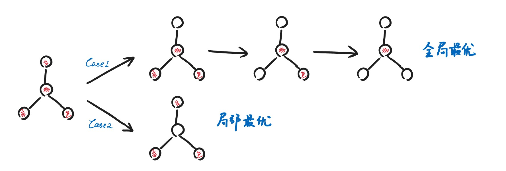

<span style="font-family: 'Times New Roman';">

# Chapter12 Local Search 局部搜索

***

## 12.1 基本概念

局部搜索的大致思路是随机一个起始点，与周围的点进行比较，找到一个更小的点，朝那个点移动，直到到达一个比周围值都要小的点。

局部搜索是近似解决问题的，其目标往往在于局部最优而不是全局最优（极值点而不是最值点）。

**局部搜索的框架：**

* **Local：**
  * 在可行的选择中定义邻居，即相邻需要比较的对象
  * 如何衡量优劣
* **Search：**
  * 从有意义的可行解出发，在邻居中寻找更好的解
  * 不断重复，直到无法在邻居中找到更好的解

**Neighbor Relation：**

对于当前解$S$，定义其邻居的集合为$N(S)$，$N(S)$中的每一个元素$S'$都是在$S$基础上细微修正后得到的相邻的可行解。邻居和当前点的差别不能太大，否则可能跳过最优解；也不能太小，否则比较耗时。

```c linenums="1"
SolutionType Gradient_descent()
{   
    Start from a feasible solution S;//从任意一个可行解S出发
    MinCost=cost(S);
    while(1)
    {
        S’=Search(N(S));//Search函数会找到S的邻居中最好的
        CurrentCost=cost(S’);
        if(CurrentCost<MinCost )
        {
            MinCost=CurrentCost;    
            S=S’;
        }
        else break;
    }
    return S;
}
```

***

## 12.2 The Vertex Cover Problem 顶点覆盖问题

**问题描述：**

对于一张给定的无向图$G=(V,E)$，找到最小的$K$，使得存在一种给$G$中$K$个顶点涂色的方法，满足任意一条边连接的两个顶点中至少有一个被涂色。

**初步思路：**

如何评估优劣：比较两个涂色点集哪一个更小（$K$小）。

第一步的$S$是什么：涂色点集为全部的点，因为全涂色一定可行，此时$K=N$。

如何构造邻居：寻找比$S$点数小1的可行解，此时$K=N-1$，若能找到这样的邻居则继续类似策略，但如果运气不好则会陷入局部最优。



**改进：The Metropolis Algorithm**

允许算法回溯（反悔）。

两个改动：

* 改动一：不再在S的邻居中找最好的来和S比较，而是随机挑选一个可行的
* 改动二：如果随机挑选的这个邻居不如S，那么有一定概率S依然会跳到这个邻居（否则S依旧保持原位）

!!! Note
    可以将跳转到更差邻居的概率设置为$e^{-\frac{\Delta\cos t}{kT}}$，均为给定的超参。  
    我们希望在邻居不如S的情况下，如果差值越大，则跳过去的概率越小。那么，我们设置超参时最好设置其随迭代次数发生变化，使得迭代初期的跳转概率大一些，迭代末期的跳转概率小一些。 （Simulated Annealing） 

***

## 12.3 Hopfield Neural Networks 神经网络

**问题描述：**

给定图$G=(V,E)$，每条边的权重$w_e$可正可负。

若$w_e<0$，则希望对应的两个节点状态相同；若$w_e>0$，则希望对应的两个节点状态不同。$|w_e|$表示意愿的强度。

现在给定未确定节点状态的$G$，需要为每个节点分配二元状态（正负），分配完后，如果$w_e$被满足（$w_es_us_v<0$），则成为好边，否则成为坏边。

对于一个节点，如果其好边的权重和大于等于坏边的权重和，则我们称这个节点被满足，即

$$\sum\limits_{v:e=(u,v)\in E}w_es_us_v\leqslant 0$$

如果所有的节点都被满足，则称这个分配是一个稳定状态。

现在需要找到一种分配方法，得到稳定状态。

**State-flipping Algorithm：**

初始状态：每个点的状态随机（$\pm 1$）。

邻居：相比于当前状态，选择一个没有被满足的节点，将其状态翻转。

```c linenums="1"
ConfigType State_flipping()
{
    Start from an arbitrary configuration S;
    while ( ! IsStable(S) ) {
        u = GetUnsatisfied(S);
        su = - su;
    }
    return S;
}
```

但是否能保证结果会变得更好？因为有可能跟这个节点相连的其他节点也会变得不满足。

同样的，如果是否压根就不存在稳定状态，导致这个算法无法终止？

**解答：**

不再以当前状态中被满足的节点的个数作为衡量好坏的标准，而是以**好边的边权和**作为衡量标准：

$$\varphi(S)=\sum\limits_{e~is~good}|w_e|$$

如果找到一个没有被满足的节点，将其反转，那么好边的边权和一定会增加。

因此，回答上面两个问题，结果确实会变得更好，且算法会终止，因为好边的边权和有上限。

因此，我们可以将这个问题转化为一个优化好边边权和的局部搜索的问题。但这个问题依赖于节点数$V$和边权和$W=\sum\limits_{e}|w_e|$，只能在伪多项式时间内解决。

***

## 12.4 The Maximum Cut Problem 最大割问题

**问题描述：**

给定一个无向图$G=(V,E)$，每条边有权重，找到一个划分$V$的方法（分成两个集合），使得划分后的两个集合之间的边权和尽可能地大。

!!! Example
    有很多派对，每个派对要么上午要么下午，每个同学都想参加其中的两个派对，如何分配派对的时间，使得满足的同学尽可能的多？  
    转化为最大割问题即为：节点表示派对，对应两种状态（上午或下午），如果某同学想参加某两场派对，则作为一条边，将两个对应节点相连。

**解决思路：**

目标函数即为集合$A$和$B$之间的边权和。

初始状态：随机划分$V$。

邻居：选择一个节点，将其划分到另一个集合。

事实上最大割问题是Hopfield Neural Networks的一个特例，对应所有的$w_i>0$。因此我们的目标函数可改成所有好边的权重和。邻居的选择策略也同理，选择一个节点翻转，这个节点满足与之相同集合的边权和大于与之不同集合的边权和。

**能否取到最优解：**

结论是不能，因为最大割问题是NP-hard问题，近似比为2。

**Big-improvement-flip：**

对周围更好的邻居进行判断，检查能优化多少，只有超过一定程度时才会转移（设置阈值）。

该方法对近似比没有显著影响，但是极大地提高了算法的效率。

**k-flip：**

每次选择$k$个节点进行翻转，然后从邻居中选择最优的。这样可以增加步长，减少迭代次数。

然而，要选择最优的邻居比较复杂。因此提出一种贪心算法。先翻转一个节点，使得优化最多，固定；然后再翻转一个节点，使得优化最多，以此类推，直到翻转$k$个节点。