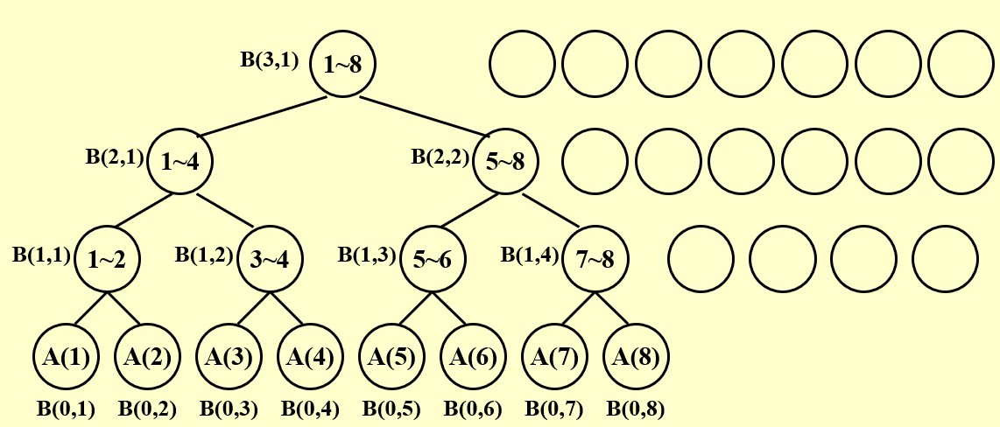
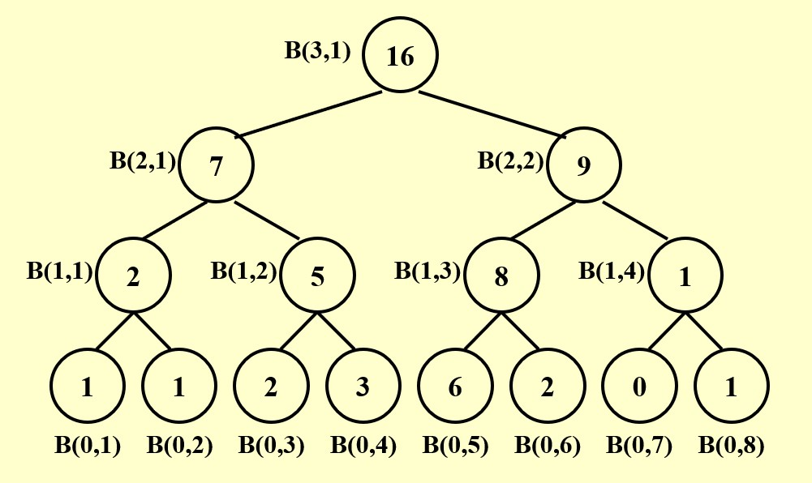
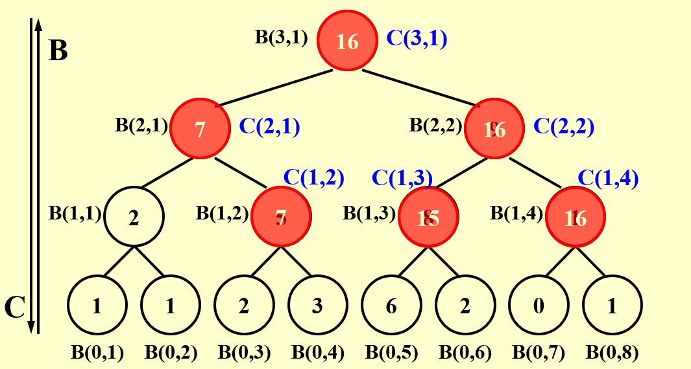
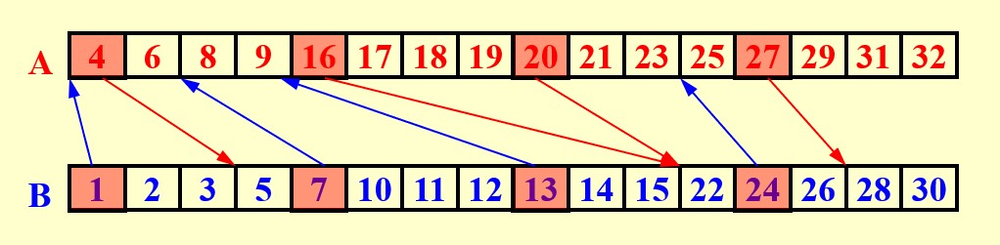

<span style="font-family: 'Times New Roman';">

# Chapter14 Parallel Algorithms 并行算法

***

## 14.1 基本概念

并行分为机器并行和算法并行，我们在此处谈论的是算法并行，其模型分为两种：**Parallel Random Access Machine (PRAM)** 和 **Work-Depth (WD)**。

!!! Note
    PRAM和WD的区别在于：PRAM获得若干处理器，在任务完成之前，这些处理器就算不在工作也不会释放；WD每一步操作都会请求一定数量的处理器。


!!! Example
    假设有$N$个处理器$P_1,P_2,···,P_N$，其共享内存，并独立与之交互。  
    假设当前的任务是将数组$B[N]$的$N$个值一一复制到$A[N]$，则串行算法下耗时$O(N)$，而并行算法下耗时$O(1)$，因为$P_i$负责将$B[i]$复制到$A[i]$，所有处理器同时运行。  
    假设当前的任务是将数组$B[N]$的前$i$个数值之和复制到$A[i]$，即$A[1]=B[1]$，$A[2]=B[1]+B[2]$，···，$A[N]=B[1]+B[2]+···+B[N]$，则串行算法下耗时$O(N^2)$，并行算法下耗时$O(N)$。

**Access Conflicts：**

当出现读写冲突时，有以下三种解决方法：

* **Exclusive-Read Exclusive-Write (EREW)**：禁止同时读写
* **Concurrent-Read Exclusive-Write (CREW)**：允许同时读，禁止同时写
* **Concurrent-Read Concurrent-Write (CRCW)**：允许同时读写  
    * **Arbitrary rule**：随意取一个
    * **Priority rule**：为不同处理器分配优先级，同时读写时取优先级最高的
    * **Common rule**：判断要写入的值是否一致，若一致则写入，否则不写入

***

## 14.2 The Summation Problem 求和问题

**问题描述：**

输入$A[1],A[2],···,A[N]$，输出$A[1]+A[2]+···+A[N]$。

**并行思路：**



简单起见，假设$N=8$，且有$N$个处理器。

我们用$B(h,i)$表示第$h$次处理且用第$i$个处理器处理后得到的数值，同样可以表示高度为$h$的一行的第$i$个节点。

通过以上平衡树，我们可以得知：第0次处理时，8个处理器都各自载入数组的一个元素；第1次处理时，$P_1$处理$A[1]+A[2]$，$P_2$处理$A[3]+A[4]$，$P_3$处理$A[5]+A[6]$，$P_4$处理$A[7]+A[8]$，其余处理器闲置；第2次处理时，$P_1$处理$(A[1]+A[2])+(A[3]+A[4])$，$P_2$处理$(A[5]+A[6])+(A[7]+A[8])$，其余处理器闲置；第3次处理时同理，得到最终结果。

$$B(h,i)=B(h-1,2i-1)+B(h-1,2i)$$

$$T(N)=O(\log N)$$

**PRAM伪代码：**

```c linenums="1"
for Pi,1≤i≤N pardo//表示该循环的操作是并行的
    B(0,i)=A(i);
end

for h=1 to logN do
    if(i≤ N/2^h) B(h,i)=B(h-1,2i-1)+B(h-1,2i);
    else stay idle;
end

output;
```

!!! Note
    如果我们将闲置也看作执行一种操作，则PRAM中所有处理器最后执行的操作数一致。

**WD伪代码：**

```c linenums="1"
for Pi,1≤i≤N pardo
    B(0,i)=A(i);
end

for h=1 to logN do
    for Pi,1≤i≤N/2^h pardo
        B(h,i)=B(h-1,2i-1)+B(h-1,2i);
    end
end

output;
```

**衡量指标：**

Work load $W(N)$：总操作数

Worst-case running time $T(N)$：最坏情况下的总运行时间

$P(N)=\frac{W(N)}{T(N)}$：算法刚好需要的处理器的数量。例如，假设一个操作对应一个单位的时间，$W(N)=100$，$T(N)=50$，则$P(N)=2$，表示有两个处理器同时工作。

当可用处理器数量$p\leqslant\frac{W(N)}{T(N)}$时，所需时间为$\frac{W(N)}{p}$。

更一般的，对于任意可用的处理器数量$p$，所需时间为$\frac{W(N)}{p}+T(N)$

!!! Note
    以上的概念是渐近等价的，即对于任意大的$N$，三个式子处于同一复杂度下。

我们可以将$W(N)$理解为串行算法时的$T(N)$，因此，在上例中

$$T(N)=O(\log N)$$

$$W(N)=O(N)$$

***

## 14.3 Prefix-Sums 求前缀和

**问题描述：**

输入$A[1],A[2],···,A[N]$，输出$A[1]$，$A[1]+A[2]$，···，$A[1]+A[2]+···+A[N]$。

**并行思路：**

我们与例一一样，构造平衡树，但我们将引入新的符号$C(h,i)$，属于高度为$h$的一行的第$i$个节点，表示从第一个叶子一直加到以这个节点为根节点的子树的最右边的叶子，即

$$C(h,i)=\sum\limits_{k=1}^\alpha A[k]$$

其中，$(0,\alpha)$即为以这个节点为根节点的子树的最右边的叶子。

我们发现，第$i$个叶子节点的C值即为$A[1]+A[2]+···A[i]$，因此我们只需要找到所有叶子的C值即可。

C值的计算需要依赖B值，因此我们先从下往上依次计算每个节点的B值。



然后，我们能找到以下规律：

* 如果一个节点是根节点，则其C值等于自身B值
* 如果一个节点是右孩子，则其C值等于其父节点的C值
* 如果一个节点是左孩子，则其C值等于其叔叔的C值加上自身B值

因此，从根节点依次往下可以计算出每个节点的C值。



$$T(N)=O(\log N)$$

$$W(N)=O(N)$$

**伪代码：**

```c linenums="1"
The same with example1;
for h=logN to 0
    for i even,1≤i≤n/2^h pardo//右孩子
        C(h,i)=C(h+1,i/2);
    end
    for i=1 pardo//所在高度第一个左孩子
        C(h,1)=B(h,1);
    end
    for i odd,3≤i≤n/2^h pardo//剩余左孩子
        C(h,i)=C(h+1,(i-1)/2)+B(h,i);
    end

output;
```

***

## 14.4 Merging 合并问题

**问题描述：**

输入升序序列$A[1],A[2],···,A[N]$和$B[1],B[2],···,B[N]$，所有元素各不相同，输出合并后的升序序列$C[1],C[2],···,C[2N]$。

**并行思路：Partioning 分割法**

!!! Note
    分割法与分治法类似，都是将大问题分解为小问题，但分治法是一种处理思路，其会不断分解直到最小规模的子问题，再由下往上解决；而分割法是一种处理手段，用于并行计算，其只会将当前问题分为$p$个规模为$\frac{N}{p}$的子问题，一般不会再往下分，而是并行地求解这些子问题，最后再进行合并。

我们给出符号定义$RANK(j,A)$，表示在数组$A$中比$B[j]$小的元素个数。若$RANK(j,A)=i$，则表示$A[i]<B[j]<A[i+1]$。

因此，处理合并问题的关键在于求出$A$中所有元素的$RANK(i,B)$和$B$中所有元素的$RANK(j,B)$（ranking problem），因为求完后便有

```c linenums="1"
for Pk,1≤k≤N pardo
    C[k+RANK(k,B)]=A[k];
end
for Pk,1≤k≤N pardo
    C[k+RANK(k,A)]=B[k];
end
```

以下有两种思路求得所有元素的rank。

**法一：Binary Search**

```c linenums="1"
for Pi,1≤i≤N pardo
    RANK(i,B)=BS(A[i],B);//表示在序列B中二分查找A[i]
    RANK(i,A)=BS(B[i],A);
end
```

对于序列A的一个元素$A[i]$，我们可以通过二分查找在序列$B$中找到其应该处在的位置，即rank，对于序列$B$中的元素同理。

由于每一个查找都不会相互影响，因此可以考虑并行查找，这样

$$T(N)=O(\log N)$$

$$W(N)=O(N\log N)$$

**法二：Serial Ranking**

```c linenums="1"
i=j=0;
while(i,j≤N)
{
    if(A[i+1]<B[j+1]) RANK(++i,B)=j;
    else RANK(++j,A)=i;
}
```

设置两个指针，分别从$A$和$B$开头往后移动，比较大小，对于更小的那个，相当于找到了自己的rank。整体上的算法是串行的。

$$T(N)=W(N)=O(N)$$

**Parallel Ranking：**

Parallel Ranking是在Serial Ranking的基础上加上分割法与并行的思路。

第一步：分割

将原本的序列分割成$p$个子序列，其中

$$p=\frac{N}{\log N}$$

子问题的大小为$\log N$。

对于每个子序列，其分别包括$A$的子序列和$B$的子序列，从这两个子序列中分别选择第一个元素作为代表，即

$$A_{sel}(i)=A[1+(i-1)\log N]$$

$$B_{sel}(i)=B[1+(i-1)\log N]$$

其中$1\leqslant i\leqslant p$。

然后分别计算这$2p$个代表的rank。（暂时不考虑如何计算）

第二步：连线



如图所示画出箭头，箭头的出发元素在另一序列中应当处在的位置（rank）即为箭头所指位置。

事实上，任意两个箭头都不相交。

第三步：Actual Ranking

将每两个箭头之间的元素划分为一组，组与组之间并行计算rank。

因此，最多划分为$2p$组，每组的大小为$O(\log N)$。

$$T(N)=O(\log N)$$

$$W(N)=O(p\log N)=O(N)$$

***

## 14.5 Maximum Finding 找最大值

**问题描述：**

输入$A[1],A[2],···,A[N]$，输出其中的最大值。

**版本一：Compare All Pairs**

又名“大蛇丸算法”。

两两进行比较，小的那个被贴上loser的标签，剩下没有标签的即为最大值。

这里第一次的两两比较一共有$O(N^2)$次而不是$\frac{N}{2}$次，因为一次性直接比完出结果。

$$T(N)=O(1)$$

$$W(N)=O(N^2)$$

**版本二：**

分割+分治

分割法体现在：将大小为$N$的问题划分为$\sqrt{N}$个规模为$\sqrt{N}$的子问题，这$\sqrt{N}$个子问题并行求解得到各自的最大值，然后这$\sqrt{N}$个最大值用Compare All Pairs算法得到最终的最大值。

分治法体现在：对于规模为$\sqrt{N}$的子问题，可以进一步将其划分为$n^{\frac{1}{4}}$个规模为$n^{\frac{1}{4}}$的子问题，不停的划分，而每一组子问题都是并行计算的。

$$T(N)\leqslant T(\sqrt{N})+c_1~\Rightarrow ~T(N)=O(\log\log N)$$

$W(N)\leqslant\sqrt{N}W(\sqrt{N})+c_2N~\Rightarrow~ W(N)=O(N\log\log N)$

**版本三：Doubly-logarithmic Paradigm**

先将规模为$N$的问题分割成$\frac{N}{\log\log N}$个规模为$h=\log\log N$的子问题，这$\frac{N}{\log\log N}$个子问题各自用线性比较的方法找到最大值（因为子问题的规模很小），同时这些子问题的求解是并行的；然后得到$\frac{N}{\log\log N}$个局部最大值，这些局部最大值再用版本二的方法进行比较。

$$T(N)=O(h+\log\log(N/h))=O(\log\log N)$$

$$W(N)=O(h\times(\frac{N}{h})+(\frac{N}{h})\log\log(\frac{N}{h}))=O(N)$$

**版本四：Random Sampling**

先从$N$个元素中并行地随机选出$N^{\frac{7}{8}}$个元素，允许重复。

这一步

$$T(N)=O(1)$$

$$W(N)=O(N^{\frac{7}{8}})$$

然后将$N^{\frac{7}{8}}$个元素分割成更小规模，每个子问题的规模为$N^{\frac{1}{8}}$，一共有$N^{\frac{3}{4}}$个子问题。

这些子问题全部使用Compare All Pairs算法并行求解，然后得到$N^{\frac{3}{4}}$个最大值。

这一步

$$T(N)=O(1)$$

$$W(N)=O(N^{\frac{1}{4}})$$

对于$N^{\frac{3}{4}}$个元素，再次分割成$N^{\frac{1}{2}}$个规模为$N^{\frac{1}{4}}$的子问题，依然并行使用Compare All Pairs算法求解。得到$N^{\frac{1}{2}}$个最大值。

这一步

$$T(N)=O(1)$$

$$W(N)=O(N^{\frac{1}{2}})$$

最后，对于$N^{\frac{1}{2}}$个最大值，直接使用Compare All Pairs算法求解，得到最终的最大值。

这一步

$$T(N)=O(1)$$

$$W(N)=O(N)$$

综上：

$$T(N)=O(1)$$

$$W(N)=O(N)$$

但是，假如最大值一开始没有被随机到怎么办？

得到最大之后，我们和剩下的$N^{\frac{1}{8}}$并行比较，如果最大值在剩余的里面，则再一次使用版本四，否则直接输出，以此类推。