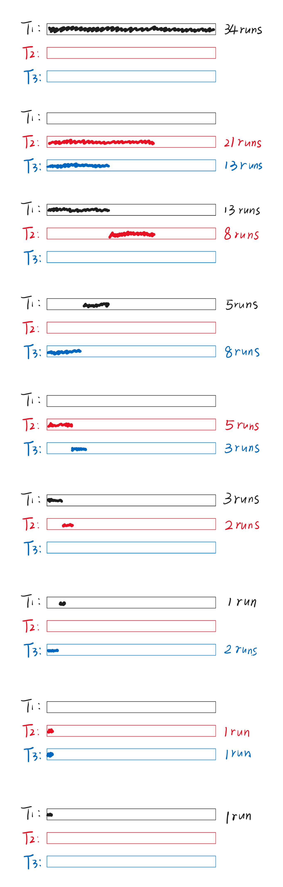

# Chapter15 External Sorting 外部排序

***

## 15.1 基本概念

由于内存有限，因此大量的数据储存在外部（磁盘），如何与内部（内存）的数据进行交互，是我们需要考虑的问题。

!!! Example
    有数组$a$，我们需要得到第$i$个值$a[i]$。若$a$位于内存，则我们只需要$O(1)$的时间就能得到；若$a$位于磁盘，则我们需要找到对应的磁道和扇区，得到后还要进行相应的传输，这种情况的耗时一般较大，且与访问设备有关。

接下来的例子中，我们限定外部存储空间为一条一条的磁带，每个磁带都有一个读写头，读写头只能从左往右移动，或者在到达最右边的时候直接回到最左边。

***

## 15.2 Sorting

**问题描述：**

假设内存大小$M=3$。

现在有$N=13$个数据位于磁带$T_1$上，想要对其进行排序。

**算法流程：**

我们可以考虑将这13个数据分成几个block，每个block的大小和内存大小一致（不考虑没放满的）。

$T_1$：【81 94 11】【96 12 35】【17 99 28】【58 41 75】【15】

每次将一个block放入内存进行排序（这里内部的排序实现没有要求）：

MEM：【11 81 94】

排序完后的block叫作一个run，我们将第一个run放到磁带$T_2$上：

$T_2$：【11 81 94】

之后再将第二个block放入MEM排序得到第二个run，放入磁带$T_3$；剩下的以此类推，交替放在$T_2$和$T_3$上，于是得到：

$T_2$：【11 81 94】【17 28 99】【15】

$T_3$：【12 35 96】【41 58 75】

接下来，按照归并排序的思路，【11 81 94】和【12 35 96】归并排序得到新的run，放入$T_1$（因为$T_1$已经闲置，所以可以重新利用），【17 28 99】和【41 58 75】也归并排序，得到的run放入$T_4$，与之前类似，不断地合并，并交替放置在$T_1$和$T_4$：

$T_1$：【11 12 35 81 94 96】【15】

$T_4$：【17 28 41 58 75 99】

继续归并：

$T_2$：【11 12 17 28 35 41 58 75 81 94 96 99】

$T_3$：【15】

最后一次归并即可得到升序序列。

操作次数（pass）：

$$1+\lceil\log_2(\frac{N}{M})\rceil$$

第一次放置，剩下$\lceil\log_2(\frac{N}{M})\rceil$次归并。

**优化方向：**

* seek time：读写头从最右边移动到最左边的耗时，与pass次数一致
* 读写block/run的时间
* 内存中$M$个元素排序的时间
* 磁带上从input buffer到output buffer的合并时间

**减少pass次数：k-way merge**

每一次归并排序可以不仅仅只分别放置在2个条带上，而是放在$k$个条带上来进行合并。

例：对原本的例子进行3-way merge。

初始放置：

$T_1$：【81 94 11】【96 12 35】【17 99 28】【58 41 75】【15】

第一次归并：

$T_2$：【11 81 94】【41 58 75】

$T_3$：【12 35 96】【15】

$T_4$：【17 28 99】

第二次归并：

$T_1$：【11 12 17 28 35 81 94 96 99】

$T_5$：【15 41 58 75】

$T_6$：NULL

第三次归并即可得到升序序列。

此时，pass次数为

$$1+\lceil\log_k(\frac{N}{M})\rceil$$

!!! Note
    在归并时，我们需要一次比较$k$个数据，可以使用最小堆的数据结构。  
    例如，在第一次归并中，11，12，17被放入堆中，得到11最小，于是取出，放入81，进行最小堆的调整，这个时候12又被放到了根节点的位置，以此类推。

我们发现，虽然pass次数减少了，但所需要的磁带数增加了，需要$2k$条。

**只使用3条磁带进行2-way merge：**

我们之前的策略中，第一次放置时是两条磁带一次放置的，最后两条磁带上run的个数差不超过1。但如果我们一开始不均匀放置，则可以达到只用3条磁带进行2-way merge的目的。

假设一开始$T_1$有34个run，先在$T_2$上放21个run，$T_3$上放13个run。

然后，$T_2$的前13个run和$T_3$的13个run依次合并，得到新的13个run，放入$T_1$，$T_2$剩下8个run。

然后，$T_1$的前8个run和$T_2$的8个run依次合并，得到新的8个run，放入$T_3$，$T_1$剩下5个run。

之后以此类推，便能得到升序序列。这样不均匀分布的好处是，对磁带需求少，只需要$k+1$条磁带，且pass次数不会增加太多。

我们发现，第一次放置怎么放是有讲究的。若run的总数为Fibonacci数$F_N$，则第一次放置时应当将其不均匀地划分为$F_{N-1}$和$F_{N-2}$。

更进一步，若为k-way merge，则$F_N^{(k)}=F_{N-1}^{(k)}+···+F_{N-k}^{(k)}$。其中，$F_N^{(k)}=0(0\leqslant N\leqslant k-2)$，$F_{k-1}^{(k)}=1$。

若初始的run的总数不为Fibonacci数，则可以考虑往小一点的Fibonacci数靠（扔掉一些run），或者往大的Fibonacci数靠（加一些虚拟的run）。

**在并行操作下处理buffer：**

概念更新：

每一个block里含有一组元素，每一个run里含有$M=3$个block。假设内存只有两个input buffer（仅能放置两个block），一个output buffer（仅能放置一个block）。

对于内存中的排序，每次将两个block分别放入内存的input buffer，逐个排序放入output buffer，当output buffer放满后，其才会将数据依次写入磁带。

问题是：output buffer一定是在两个block的数据比到一半就已经满了（因为output buffer的大小只有总的input buffer的二分之一），这个时候input buffer的数据不能再对比了，而是要等output buffer写到磁带结束，出现效率冗余。

为了并行CPU操作（两个block的数据的排序）和I/O操作（output buffer的数据写入磁带），我们可以将output buffer划分为两个区域，在第一个区域放满之后就与磁带交互，之后比较排序的结果放入第二个区域。

另一个问题针对input buffer。假设小的数据全在第一个input buffer内，则会导致第一个input buffer的数据全进入output buffer，而第二个input buffer需要等待新的block载入第一个input buffer才能再次进行比较排序，这样在I/O上又会有冗余。

同样的解决思路是，将两个input buffer各自也均匀划分为两个区域，一个区域读完则逐个读入新的数据，而另一个区域则同时进行比较排序。

总结下来，如果将划分后的一个区域看作一个新的buffer，则k-way merge需要$2k$个input buffer和2个output buffer。

$k$增加$\rightarrow$input
buffer增加$\rightarrow$内存大小不变的情况下buffer的大小减小$\rightarrow$磁带上block的大小减小$\rightarrow$读写头从最右边移动到最左边的耗时（seek time）增加

**生成更长的run（replacement selection）：**

如果run变长，则run的总数降低，会带来一系列的优化。

例如，对于第一个block【81 94 11】，将其放入内存中进行排序（最小堆结构），得到最小的11，放入磁带中，这时候内存中空出来了一个位置，如果可以放入下一个数据进行排序，则可以使run变长。

下一个数据为96，可以放入，排序后最小的数据为81，放入磁带中11的后面，但我们发现下一个数据是12，如果也放入内存排序，则其会变成最小的放入磁带中81的后面，会出问题。因此，只有要读入内存的数据比写入磁带的数据大，才可以将该数据读入内存参与排序。

同样可行的想法是无论大小照样放入内存，只是进行标记等。

平均下来，每个run的长度可以达到$2M$。

**最小化合并时间：**

例如，有4个run，长度分别为2，4，5，15。什么顺序合并效率最高？

如果先是2和4合并，得到的6和5合并，得到的11和15合并，则总耗时2+4+6+5+11+15=43。

最好的方法是使用类似霍夫曼编码的方法，构建霍夫曼树，总耗时与树高成比例。

