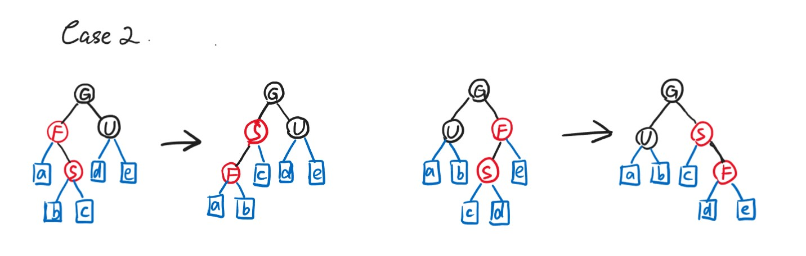

# Chapter2 Red-Black Tree and B+ Tree 红黑树和B+树

***

## 2.1 Red-Black Tree 红黑树

### 基本概念

**节点形式：**

在红黑树中，所有叶子节点的左右孩子并不是NULL，而是指向**哨兵节点**，根节点的父亲也指向哨兵节点。

**定义：**

* 每个节点或红或黑
* 根节点为黑
* 哨兵（每个叶子节点连接的空节点，在红黑树中直接被当做叶子节点）为黑
* 红色节点的孩子为黑
* 对于任意节点，从该节点到其后代叶子节点（即哨兵）的所有路径的黑色节点数量相等

满足以上五个条件的BST称为**红黑树**。

**黑高：**

对于任一节点$x$的黑高$bh(x)$，指的是从$x$开始（不包括$x$）到叶子节点（即哨兵）的路径中黑色节点的数量。$bh(tree)=bh(root)$。

引理：有$N$个内部节点（指除了哨兵以外的节点）的红黑树高度至多为$2\log (N+1)$。

!!! Tip "Proof"
    **①求证：对于任意节点$x$，$sizeof(x)\geqslant 2^{bh(x)}-1$**  

    其中$sizeof(x)$表示以节点$x$为根节点的树的元素数量  
    数学归纳法：按照高度进行归纳  
    若$x$的高度为$0$，则为NULL，$sizeof(x)=2^0-1=0$，成立  
    假设对于高度不超过$k$的节点$x$都成立，现考虑节点$x$高度为$k+1$  
    其左右孩子的黑高为$bh(x)$（左右孩子为红色）或$bh(x)-1$（左右孩子为黑色）  
    左右子树高度不超过$k$，因此$sizeof(child)\geqslant 2^{bh(child)}-1\geqslant 2^{bh(x)-1}-1$  
    $sizeof(x)=1+2sizeof(child)\geqslant 2^{bh(x)}-1$  

    **②求证：$bh(tree)\geqslant h(tree)/2$**

    由红黑树的第四条性质即可得证  

    综上：$sizeof(root)=N\geqslant 2^{bh(tree)}-1\geqslant 2^{h/2}-1$，$h\leqslant 2\log(N+1)$  

### Insert

时间复杂度：

$$T(N)=O(\log N)$$

首先按照BST的比较性质将新的节点$S$插入到对应位置，**预置为红色**（这样能够保证每一条路径的黑色节点数都没有改变）。

**如果插入$S$后，$S$的父亲$F$是黑色的，则无需任何调整。** 如果$F$是红色的，则必有$F$的父亲$G$是黑色的（第四条性质），分以下三种情况讨论：

**情况一：**

**$S$的叔叔$U$是红色的。** 此时将父亲$F$和叔叔$U$染黑，将祖父$G$染红。若$G$的父亲为黑，则问题解决；否则问题上推，变成情况一、情况二或情况三。

**情况二：**

**$S$的叔叔$U$是黑色的，且$S$是靠近$U$的。** 此时将$S$和父亲$F$旋转，问题转化为情况三。

**情况三：**

**$S$的叔叔是黑色的，且$S$是远离$U$的。** 此时将父亲$F$和祖父$G$旋转并交换颜色，问题解决。

!!! Note
    如果待操作节点没有叔叔，则视哨兵为叔叔。由于哨兵是黑色的，因此为情况一。

***

### Delete

时间复杂度：

$$T(N)=O(\log N)$$

红黑树的节点删除问题，最后都会转化为删除一个叶子节点的问题，这个时候每个位置的节点颜色保持不变，只是改变相应的键值。

转化成删除叶子节点的问题后，如果删除的叶子节点为红色，则直接删除即可；如果删除的叶子节点为黑色，则需要分情况讨论。

若要删除一个黑色的叶子节点，则该叶子节点所在的路径的黑高必定-1，红黑树的第五条性质被破坏，因此，在删除该节点之前，我们要在该节点所在位置再多染一次黑色，这样删除掉该节点之后，由于之前在该位置已经提前染了一次黑色，所以最后的黑高没变。

但是问题在于，在删除该节点之前，该节点处于一种**双黑**的状态。如果用0表示红色，1表示黑色，则该节点的对应值为2，因此我们要想办法将这$2分散到整棵树中，即通过再染色和旋转，使得该节点所在的路径仍比其他路径的黑高多1，但没有双黑的情况，这样，如果删除掉该节点，那么会获得红黑树的平衡。

**情况一：** 

**双黑节点$X$的父亲为黑，兄弟为红。**  
解决方法：父亲黑转红，兄弟红转黑，将兄弟旋转至最高。

**情况二：** 

**双黑节点$X$的兄弟为黑，远近侄子均为黑。**  
解决方法：双黑节点恢复为黑，兄弟黑转红，父亲如果为红则转黑，如果为黑则转双黑。

**情况三：** 

**双黑节点的兄弟为黑，近侄子为红，远侄子为黑。**  
解决方法：兄弟黑转红，近侄子红转黑，兄弟、远近侄子三个节点旋转，将近侄子旋转至最高。

**情况四：** 

**双黑节点的兄弟为黑，远侄子为红。**  
解决方法：远侄子红转黑，兄弟和父亲颜色互换，将兄弟旋转至最高。

!!! Note
    与Insert操作一样，同样注意哨兵的作用。

!!! Note
    口诀（来自徐镜春老师）:  
    兄弟红易兄弟黑，换色斜旋接着推  
    侄黑父红换兄色，父侄全黑兄染红，上推  
    近侄红来远侄黑，换色斜旋模样改  
    远侄红来令其黑，父兄换色斜旋坠  

!!! Note
    Delete操作涉及到的旋转次数最多只为3次，因为只有情况一，情况三和情况四会有旋转，但这三种情况各自最多只进行一次。

***

## 2.2 B+ Tree B+树

### 基本概念

$M$阶的B+树有以下的结构性质：

* 根节点要么直接是一个叶子，要么有$[2,M]$个孩子
* 除了根节点或叶子的其他节点有$[\lceil \frac{M}{2}\rceil,M]$个孩子
* 所有的叶子深度相同
* 每个非根的叶子有$[\lceil \frac{M}{2}\rceil-1,M-1]$个键值
* 每个非叶子节点的第$i$个索引为其第$i+1$个子树中的最小键值
* 键值按升序排列

### Find

如果要查询$x$，首先在根节点寻找索引$a_i\leqslant x<a_{i+1}$，则$x$在根节点的第$i+1$个子树中，用同样的方法依次沿着索引节点查询，直到锁定$x$所在的叶子，升序遍历（或者二分查找）叶子的所有键值即可查询到$x$。

**时间复杂度：**

要从根走到叶子，需要访问$\log_M N$个节点。

对于经过的每一个节点，需要与其元素一一比较，如果顺序遍历则耗时$O(M)$，如果二分查找则耗时$O(\log M)$。

因此Find总耗时可达到

$$T(N)=\log_M N\cdot O(\log M)=O(\log N)$$

此时与$M$无关。

### Insert

* 首先类似于Find操作，找到待插入元素$x$所在的叶子中的对应位置
* 如果叶子不饱和，则直接插入
* 如果叶子饱和，则看一下该叶子的左右兄弟是否饱和，如果有不饱和的则进行分配，并更新其上方的索引（此为更巧妙的做法，一般直接为下一步）
* 如果兄弟都饱和，则考虑将该叶子平均分成两个叶子，并更新其上方的索引
* 若索引也饱和，则也考虑分裂，步骤类似，直到没有问题为止

**时间复杂度：**

首先也有一个Find的操作，耗时$O(\log N)$。

然后考虑最坏的情况，也就是要一直分裂到根，此时耗时对应树高，即$O(\log_M N)$，每次分裂耗时$O(M)$。

因此Insert总耗时为

$$T(N)=O(\log N)+O(\log_M N)\cdot O(M)=O(\frac{M\log N}{\log M})$$

### Delete

与Insert操作类似，分裂改为合并。

时间复杂度也与Insert操作一致，为

$$T(N)=O(\frac{M\log N}{\log M})$$