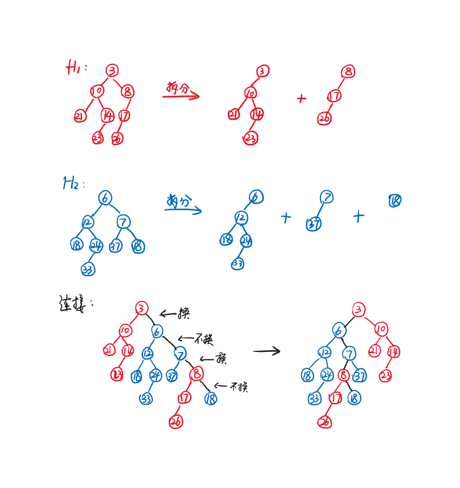

# Chapter3 Leftist Heap and Skewed Heap 左式堆与斜堆

***

## 3.1 Leftist Heap 左式堆

### 基本概念

**目标：**

加快堆的合并。

**结构性质：**

* 与堆类似（二叉树，且每个节点的键值均小于其孩子的键值），但**不是完全二叉树**
* 任意一个节点的$npl$值对应的路径为从其不断向右走的路径（左孩子的$npl$不小于右孩子的$npl$）

**$npl$（null path length）：**

$npl(X)$指的是从节点$X$开始，走到其后代任意一个**外节点**（孩子不饱和）的最短路径长度。

$$npl(NULL)=-1$$

$$npl(External)=0$$

$$npl(X)=\min\\{npl(X's~child)\\}+1$$

**定理:**

一个右路径（从根节点出发一路往右）长度为$r$的左式堆至少含有$2^r-1$个节点。

!!! Note
    一个有$N$个节点的左式堆的右路径长度至多为$\log N$。

启发：若将所有操作都集中在右路径上，则可以获得$O(\log N)$的时间复杂度，这也是我们想要的。

### Merge

时间复杂度：

$$T(N)=O(\log N)$$

假设有两棵要合并的树$H_1$，$H_2$。

**1.递归算法：**

* **第一步：**
  比较$H_1$和$H_2$的根节点大小（假设$H_1$的根节点小于$H_2$）
* **第二步：**
  将$H_1$的右子树与$H_2$合并（递归）
* **第三步：**
  将合并好的新树连接到$H_1$的根节点上，成为新的右子树
* **第四步：**
  如果新树的左子树根节点的$npl$小于右子树，则左右子树互换
* **第五步：**
  更新根节点的$npl$

递归终止情况：要合并的两棵树中至少有一棵是空树。

伪代码：

```c linenums="1"
LeftistHeap Merge1(LeftistHeap H1,LeftistHeap H2)
{
    if(H1==NULL)return H2;
    if(H2==NULL)return H1;//终止条件：存在空树
    if(H1->root->key<H2->root->key)return Merge2(H1,H2);
    else return Merge2(H2,H1);//保证Merge2的第一个参数的根节点大小大于等于第二个参数的
}
```

```c linenums="1"
LeftistHeap Merge2(LeftistHeap H1,LeftistHeap H2)
{
    if(H1->left==NULL)H1->left=H2;//单一节点的情况
    else
    {
        H1->right=Merge1(H1->right,H2);//第二步和第三步
        if(H1->left->npl<J1->right->npl)SwapChildren(H1);//第四步
        H1->npl=H1->right->npl+1;//第五步
    }
    return H1;
}
```

**2.迭代算法：**

* **第一步：**
  将每棵树拆分为根+左子树的形式（根+左子树看作一个整体）
* **第二步：**
  对于每个整体，按序排列根节点并连接，形成新树的右路径，此时右路径上的每一个节点的左子树保持不变
* **第三步：**
  从下往上检查$npl$，必要时交换左右子树，并依次更新$npl$
  


第一步和第二步实际上是融合在一起的。两个指针分别沿着$H_1$的右路径和$H_2$的右路径，哪个指向的节点小，就把哪个节点连到新树里，相应的指针往下走。

### Insert

可以把要插入的节点看作只有一个节点的树，然后Merge操作。

### DeleteMin

先删掉根节点，再对左右子树进行Merge操作。

***

## 3.2 Skew Heap 斜堆

### 基本概念

!!! Note
    斜堆之于左式堆，相当于Splay tree之于AVL tree。

**目标：**

控制均摊时间为$O(\log N)$。

斜堆与左式堆唯一的不同是：斜堆在Merge操作中，**不管左右子树的$npl$值为多少，都进行左右子树互换**，此时也不需要计算任何的$npl$。

!!! Note
    右路径最大节点的孩子不动（理论上只有一个左儿子，这个左儿子不用换到右边去）。

### 对斜堆的均摊分析（势能法）

由于斜堆的操作（Insert，Merge，DeleteMin）以Merge为核心，因此我们只需要分析Merge。我们尝试用势能法证明：对于两个斜堆$H_1$和$H_2$，其分别有$n_1$和$n_2$个节点，则合并$H_1$和$H_2$的摊还复杂度$T(N)=O(\log N)$，其中$N=n_1+n_2$。

定义$\varphi(H_i)$为势能函数，等于heavy node的个数。

!!! Success "Definition"
    **heavy node:** 右子树节点数$>$左子树节点数（也有版本为$\geqslant$）  
    反之则为**light node**

设$H_3$为$H_1$和$H_2$合并后的新堆，$H_1$右路径上轻节点的个数为$l_1$，重节点的个数为$h_1$；$H_2$右路径上轻节点的个数为$l_2$，重节点的个数为$h_2$。

左右子树互换时，相应的节点会改变轻重状态，但会进行左右子树互换的节点只位于右路径上。

则实际开销的最坏情况

$$c_i=l_1+l_2+h_1+h_2$$

即两棵树的右路径长度之和。

摊还开销

$$\hat{c_i}=c_i+\varphi(H_3)-(\varphi(H_1)+\varphi(H_2))$$

$$\varphi(H_1)+\varphi(H_2)=h_1+h_2+h$$

其中$h$为不在右路径上的重节点个数。

现在来考察合并之后的情况。

对于右路径上的任意一个重节点，在右边插入节点后右边的节点数量更多了，这个节点更重了，左右子树交换后这个节点一定变成轻节点，即合并前的重节点一定在合并后变成轻节点。

而对于右路径上的任意一个轻节点，右子树的节点数增加了1，有可能右子树的节点更多，也可能更少，左右子树互换后同理，因此合并后的轻重未知。

因此我们可以进行放缩，合并后重节点最多的情况是：所有右路径上的重节点变成轻节点，所有右路径上的轻节点变成重节点，而不在右路径上的节点轻重不变，即

$$\varphi(H_3)\leqslant l_1+l_2+h$$

因此

$$\hat{c_i}\leqslant (l_1+l_2+h_1+h_2)+(l_1+l_2+h)-(h_1+h_2+h)=2(l_1+l_2)$$

由于

$$l_1+l_2=O(\log n_1+\log n_2)=O(\log N)$$

因此

$$T_{amortized}=O(\log N)$$

!!! Note
    右路径上的轻节点数$l=O(\log N)$  
    理由：为了让一棵树的右路径上轻节点个数尽可能的多，我们需要让右路径更长，同时让上面的轻节点数占比更大，于是，对于右路径上的每一个节点，我们都尽可能使其左子树的节点个数略大于右子树的节点个数（计算时看作相等），这时树高为$\log N$，右路径上的轻节点数$l=O(\log N)$。