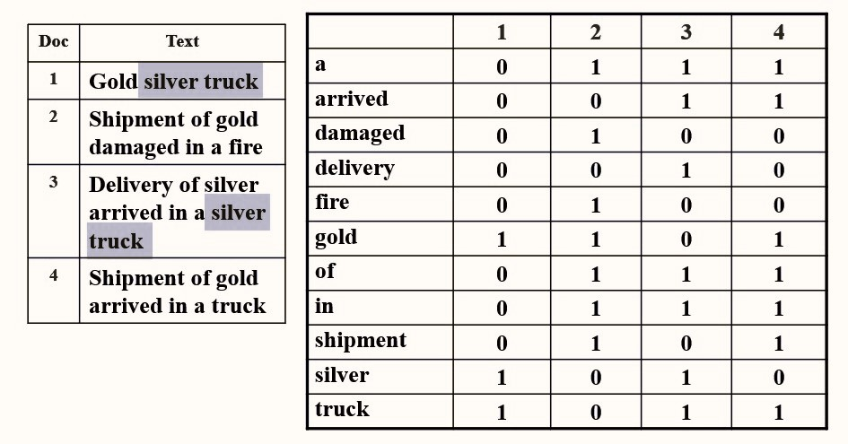
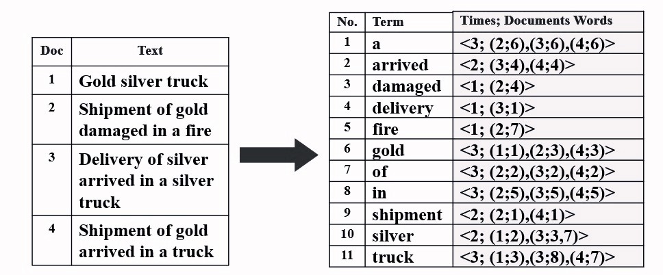

# Chapter4 Inverted File Index 倒排索引

***

## 4.1 问题引入

**如何找到含有目标关键词的网页？**

**思路一：** 遍历所有网页

**思路二：** 相关发生矩阵（Term-Document Incidence Matrix）

例如：要查询“silver truck”，我们可以分别对“silver”和“truck”进行查询，其分别出现在第1、3个文档和第1、3、4个文档，因此取交集，最终查询得到第1、3个文档。

$$silver\& truck=1010\&1011=1010$$

**潜在问题：**

如果某个文档含有“silver”和“truck”，但二者并无关联，或者先后顺序调换，则这个文档并不是我们的目标，但也会被检索到。虽然如此，过去许多的浏览器选择忽略这个问题，将文本看作单词的集合而不是序列（**词袋假设**）。

矩阵过于庞大，不仅是单词的维度上，还是网页的维度上。

**思路三：** 倒排索引（Inverted File Index）

***

## 4.2 倒排索引

称为“倒排”的原因：文档包含哪些单词→单词属于哪些文档（行与列的互换）

改进：对于某个单词和某个包含该单词的文档，我们还在后面列举其出现在文档中的位置。

!!! Note
    标注每个单词频率（一个单词出现在几个文档中）的原因：   
    便于加快取交集的过程。例如，要查询的一段文字中含有许多单词，那么需要进行很多次取交集。如果我们从频率低的单词开始取交集，则可以很快排除大量的情况，加快取交集的过程。

**词干提取（Word Stemming）：**

将一个单词还原为其词干。

例如：Process，processing，processes，processed都应被还原为process。

**停用词（Stop Words）：**

例如a，the，it等，这些单词出现的频率过高，不适合用于倒排索引。

**索引结构：**

* 搜索树
* 哈希表

优劣比较：

对于单次查询，哈希表只需要常数时间，而搜索树的查询时间与单词长度有关； 

而对于顺序查询，由于搜索树的相邻单词具有相关性，因此更有利。 

**分布式索引（Distributed Indexing）：**

当单词和文档数量过多时采用的解决方法。

* **Term-partitioned Index**
  按照**单词首字母**来进行划分，如$A\sim C$，$D\sim F$，···，$X\sim Z$等，$A\sim C$服务器中存储的为以$A\sim C$为首字母的单词的倒排表。
* **Document-partitioned Index**
  按照**文档编号**进行划分，如$1\sim 10000$，$10001\sim 20000$，···，$90001\sim 100000$等，$1\sim 10000$服务器中存储的为第$1$到$10000$号的文档对应的倒排表。

在现实生活中，按照文档编号划分更加常用。因为服务器都面临的崩溃的危险，如果按照首字母划分，假如$A\sim C$服务器崩溃，那么查询所有对应单词都没有返回结果；但是如果按照文档编号划分，假如$1\sim 10000$服务器崩溃，那么我只是少掉了这$10000$个可搜索的文档，这在庞大的文档集合中是影响不大的，至少能有返回结果。

**动态索引（Dynamic Indexing）：**

若有新加入的文件：

对于已在词典的单词，更新其信息；对于不在词典的单词，新添加至词典。

我们常常将新加入的文件放入**辅助索引（auxiliary index）** 中，其一般比较小；而原本的文件都放在**主索引（Main Index）** 中，其一般比较大。当要进行搜索时，同时会对主索引和辅助索引进行搜索。每隔一段时间，会将辅助索引的内容合并到主索引中。

若有待删除的文件：

并不实际删除，而是打上标记，使得后续搜索不会将其作为结果。

**压缩（Compression）：**

* 删去停用词；

* 当文件很多时，其编号过大，因此可以考虑用较小的相对索引代替较大的绝对索引。

**阈值化（Thresholding）：**

返回结果层面：

对于一次查询，其结果数量可能十分庞大，因此需要限制返回结果的数量。

* 对于布尔查询无效（例如(`A AND B) OR (C AND (NOT D))`表示含有`A`和`B`，或者含有`C`且不含有`D`的文档），因为其数量庞大，结果复杂，很难保证限制得到的结果最优
* 截断也会导致一些真正重要的文档被忽略

!!! Note
    网页排序：  
    由于网页之间有超链接的存在，因此以网页为节点，超链接为有向边，可以画出一张有向图。如果一个重要的网页有指向另一个网页的超链接，则我们可以认为另一个网页也是重要的，因此提高其排名。  
    例如网页$A$同时被网页$B$和网页$C$超链接，但是$B$使用的超链接只指向$A$，而$C$使用的超链接除了$A$以外还指向了许多其他的网页，那么$B$的重要程度对$A$的影响就会比$C$更大。

输入信息层面：

按照频率对查询词进行排序，更重视频率低的单词。

**评估：**

* 建立倒排表的速度

* 搜索的速度

* 搜索结果的好坏

$~$|Relevant（相关）|Irrelevant（不相关）
---|---|---
**Retrieved（搜索到）**|$R_R$|$I_R$
**Not Retrieved（未搜索到）**|$R_N$|$I_N$

**准确率（Precision）：**$P=\frac{R_R}{R_R+I_R}$

**召回率（Recall）：**$R=\frac{R_R}{R_R+R_N}$

准确率和召回率往往只能二者取其一。