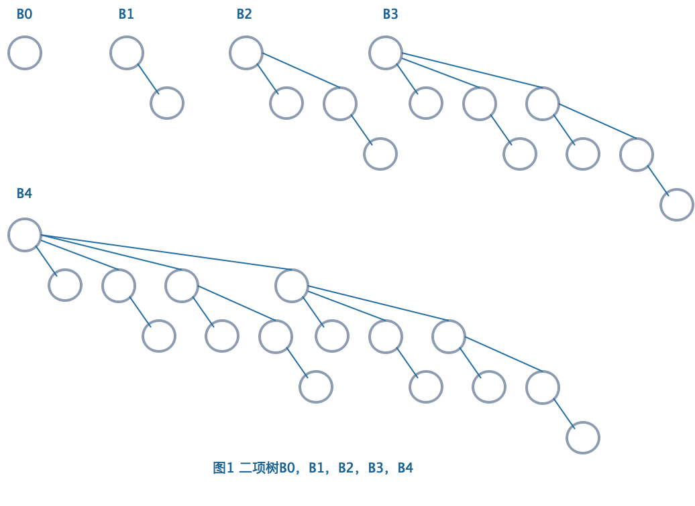

<span style="font-family: 'Times New Roman';">

# Chapter5 Binomial Queue 二项堆

***

## 5.1 基本概念

二项堆不是一棵树，而是由多棵树组成的森林，森林中的每一棵树是一棵**二项树（binomial tree）**。

记高度为$k$的二项树为$B_k$。将$B_{k-1}$的根节点连接到另一棵$B_{k-1}$的根节点上，作为其子树，得到的新树即为$B_k$（二项树的递归定义）。



性质：

* $B_k$的根节点有$k$个子节点
* $B_k$一共有$2^k$个节点
* $B_k$在深度为$d$（根节点深度为$0$）的节点数为$C_k^d$（二项堆名称的由来）

二项堆中的每个二项树都遵循最小堆的性质，即**父节点的键值小于其孩子节点的键值**。

不考虑具体键值，任意大小的优先队列可以被唯一表示为一个二项堆。

!!! Example
    如果优先队列有13个节点，由于$13=2^0+0\times 2^1+2^2+2^3=1101_2$，因此其可以表示为一个$B_0$，一个$B_2$，一个$B_3$组成的二项堆（注意：唯一表示中不可能出现两个$k$相同的$B_k$）。

***

## 5.2 操作

**数据结构：**

主结构：指针数列，第$i$个位置存放指向$B_i$的指针

二项树：链表，采用first-child-next-sibling的连接方式


```c
struct BinQueue//二项堆的主结构定义
{
    int N;//总节点数
    BinTree Trees[MaxTree];//指针数列，存放指向每一棵二项树的指针
}

struct Node//二项堆的节点定义
{
    KeyType Key;//键值
    Position LeftChild;//左孩子
    Position NextSibling;//右兄弟
}
```

### FindMin

最小的节点位于某一个$B_k$的根节点处（二项堆里的二项树符合最小堆的性质）。

对于一个有$N$个节点的二项堆，最多有$\lceil\log N\rceil$棵二项树，因此最多需要检查根节点$\lceil\log N\rceil$次。

时间复杂度：

$$T=O(\log N)$$

!!! Note
    如果对二项堆内的二项树进行维护（例如以根节点的键值大小排序），那么FindMin操作的时间复杂度可降至$O(1)$。

### Merge


实际上类似于**二进制的竖式计算**，一一合并的二项树深度相同，仅需比较根节点的键值，将大的连到小的上即可。

Merge所需的时间对应二进制位上合并的次数，一共需要合并的次数（位数）对应$H_1$和$H_2$的二项树棵数，二项树棵数对应$\log N$。

时间复杂度：

$$T=O(\log N)$$

其中$N=N_1+N_2$。

**伪代码：**

```c linenums="1"
BinTree Combine(BinTree T1,BinTree T2)//合并两棵二项树
{
    if(T1->Key>T2->key)return Combine(T2,T1);//保证T1的根节点更小
    T2->NextSibling=T1->LeftChild;
    T1->LeftChild=T2;
    return T1;
}

BinQueue Merge(BinQueue H1,BinQueue H2)//合并两个二项堆
{
    BinTree T1,T2,Carry=NULL;
    int i,j;
    for(i=0,j=1;j<=H1->N+H2->N;i++,j*=2)//i用来控制数组的位数，j用来控制循环次数，因为MaxTree=logN
    {
        T1=H1->Trees[i];
        T2=H2->Trees[i];
        switch(4*!!Carry+2*!!T2+!!T1)//将Carry，T2，T1的有无用二进制表示，例如101表示“有Carry，无T2，有T1”
        {
            case 0://000
            case 1:break;//001
            case 2://010
                    {
                        H1->Trees[i]=T2;
                        H2->Trees[i]=NULL;
                        break;
                    }
            case 3://011
                    {
                        Carry=Combine(T1,T2);
                        H1->Trees[i]=NULL;
                        H2->Trees[i]=NULL;
                        break;
                    }
            case 4://100
                    {
                        H1->Trees[i]=Carry;
                        H2->Tress[i]=NULL;
                        break;
                    }
            case 5://101
                    {
                        Carry=Combine(T1,Carry);
                        H1->Trees[i]=NULL;
                        break;
                    }
            case 6://110
                    {
                        Carry=Combine(T2,Carry);
                        H2->Trees[i]=NULL;
                        break;
                    }
            case 7://111
                    {
                        H1->Trees[i]=Carry;
                        Carry=Combine(T1,T2);
                        H2->Trees[i]=NULL;
                    }
        }
    }
    H1->N+=H2->N;//更新总节点数
    return H1;
}
```

### Insert

实际上是Merge的特殊情况。

时间复杂度：如果最小的空置二项树为$B_i$（数组第$i$个位置为NULL），则

$$T(N)=Const\cdot(i+1)=O(1)$$

从空堆开始连续插入$N$个节点的最差总耗时为$O(N)$，均摊时间复杂度为$O(1)$。（分析详见二进制计数器）

### DeleteMin

定义一开始的二项堆为$H$。

* **第一步：**
  进行FindMin，找到最小元素，其所在二项树为$B_k$
  该步耗时：$O(\log N)$

* **第二步：**
  将$B_k$从$H$中移走，剩下的二项树组成的二项堆定义为$H'$
  该步耗时：$O(1)$

* **第三步：**
  单独对$B_k$操作，将$B_k$的根节点移走（$H$的最小元素），剩下的子树拆散成一棵棵二项树，形成的新的二项堆定义为$H''$
  该步耗时：$O(\log N)$

* **第四步：**
  对$H'$和$H''$进行Merge
  该步耗时：$O(\log N)$

时间复杂度：

$$T=O(\log N)$$

**伪代码：**

```c linenums="1"
KeyType DeleteMin(BinQueue H)
{
    BinQueue DeletedQueue;
    Position DeletedTree,OldRoot;
    KeyType Min=∞;
    int i,j,MinTree;
    for(i=0;i<MaxTree;i++)//遍历所有二项树
    {
        if(H->Trees[i]&&H->Trees[i]->Key<Min)//寻找最小节点
        {
            Min=H->Trees[i]->Key;
            MinTree=i;
        }
    }
    DeletedTree=H->Trees[MinTree];//获得待操作的树
    H->Trees[MinTree]=NULL;//原本对应的位置抹去
    OldRoot=DeletedTree;//保留待删除的节点
    DeletedTree=DeletedTree->LeftChild;//将待操作的树的根节点（待删除节点）移走
    free(OldRoot);//删除节点
    DeletedQueue=Initialize();//拆分得到的二项堆数列初始化
    DeletedQueue->N=(1<<MinTree)-1;//2^MinTree-1 
    for(j=MinTree–1;j>=0;j––)//拆分过程
    {  
	    DeletedQueue->Trees[j] =DeletedTree;
	    DeletedTree=DeletedTree->NextSibling;
	    DeletedQueue->Trees[j]->NextSibling=NULL;
	}
    H->N=H->N-DeleteQueue->N-1;
    H=Merge(H,DeletedQueue);
    return Min;
}
```

### DecreaseKey

假定已经知道要进行Decrease的节点的具体位置，接下来要做的只是不断地向上与父节点交换，直到恢复最小堆的性质

时间复杂度：

$$T=O(\log N)$$

## 5.3 回顾

$~$|二叉堆|左式堆|斜堆|二项堆|斐波那契堆
---|---|---|---|---|---
Insert|$O(\log N)$|$O(\log N)$|$O(\log N)$|$O(1)$|$O(1)$
Merge|$O(N)$|$O(\log N)$|$O(\log N)$|$O(\log N)$|$O(1)$
DeleteMin|$O(\log N)$|$O(\log N)$|$O(\log N)$|$O(\log N)$|$O(\log N)$
DecreaseKey|$O(\log N)$|$O(\log N)$|$~$|$O(\log N)$|$O(1)$