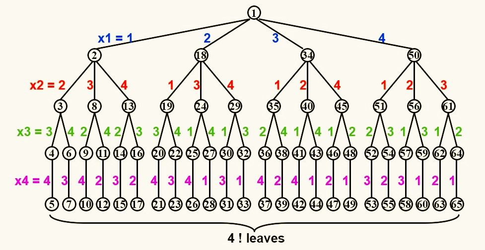
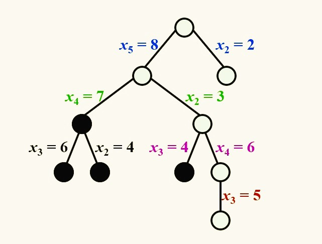
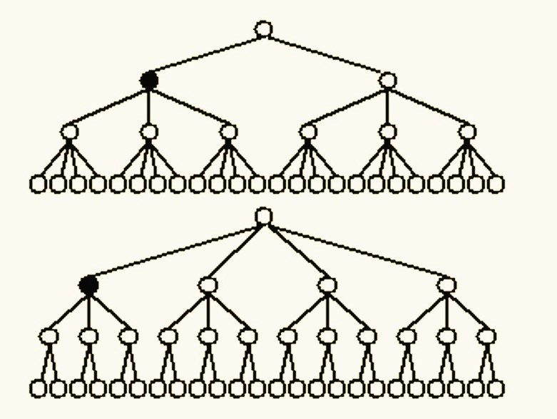
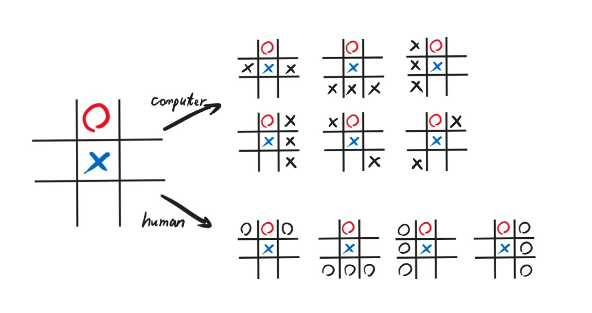
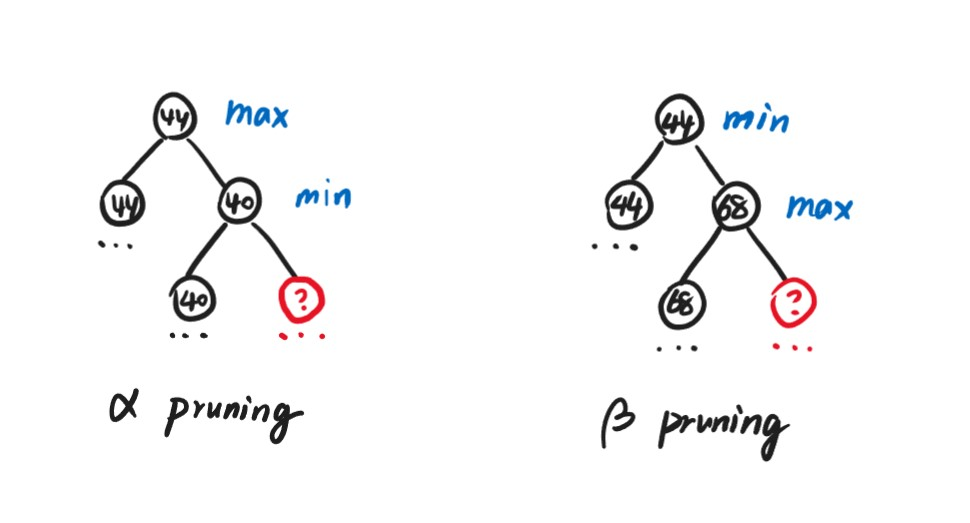
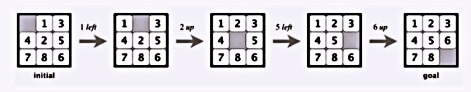

<span style="font-family: 'Times New Roman';">

# Chapter6 Backtracking 回溯法

***

## 6.1 基本概念

对于一个问题，一个肯定有效的解决方法为：枚举出所有可能的解，再一一验证。

回溯法的精髓在于：在枚举所有可能的解的同时，通过**剪枝**排除掉相当一部分不符合要求的解。

当我们得到一个不完全解$(x_1,x_2,···,x_i)$后，我们添加$x_{i+1}$，检查$(x_1,x_2,···,x_i,x_{i+1})$是否还符合要求，如果符合要求，则继续添加，否则回到$(x_1,x_2,···,x_i)$，尝试添加$x_{i+2}$等其他可能，若所有可能经过尝试都不成功，则再往后回溯到$(x_1,x_2,···,x_{i-1})$，以此类推。

!!! Example
    **假设某棵树的节点只有0或1，试找一条全是0的路径。**  

    枚举法：先找出所有路径，再依次检查  
    回溯法：一步一步向下走，如果走到1，则在该位置剪枝，回到上一个0重新走  
    深度优先：找到一条符合要求的路径  
    广度优先：找到最短的符合要求的路径  
    深度和广度均可：找到所有符合要求的路径  

***

## 6.2 典例

### 八皇后问题

$Q_i$：第$i$行的皇后（已保证所有皇后不在同一行）  
$x_i$：第$i$行的皇后所在的列  
求解：$(x_1,x_2,···,x_8)$  
要求：

* $x_i\neq x_j~(i\neq j)$（保证所有皇后不在同一列）
* $(x_i-x_j)/(i-j)\neq\pm1~(i\neq j)$（保证所有皇后不在同一斜边）

回溯法求解思路（以四皇后为例）：

**第一步：构造游戏树（game tree）**



每一条边表示采取一次行动（落子），每一个节点表示一种状态。例如：节点1表示未放棋子的初始状态，节点1和2之间的边表示采取了将第一行的皇后放在第一列的动作，于是得到了新的棋盘状态，用节点2表示。

**第二步：深度优先搜索（后序遍历）**

!!! Note
    实际上并没有游戏树被真正地构造出来，其只是一个抽象概念。

### 收费站问题（The Turnpike Reconstruction Problem）

**问题描述：**

在一条直线上放置$N$个收费站，两两之间满足给定的距离限制，求解收费站的放置方法。

**解决思路：**

以距离限制

$$\\{1,2,2,2,3,3,3,4,5,5,5,6,7,8,10\\}$$

为例：

**第一步：**

由于距离限制数等于$\frac{N(N-1)}{2}$，因此可以计算出收费站的数量$N=6$。

**第二步：**

令第一个收费站的位置$x_1=0$，则由最大距离限制可知$x_6=10$，此时距离限制还剩

$$\\{1,2,2,2,3,3,3,4,5,5,5,6,7,8\\}$$

**第三步：**

在剩余的限制中再次寻找最大的距离，发现为8，此时有两种情况，分别是$x_5=8$和$x_2=2$。假设选择$x_5=8$，则从距离限制的集合中又可以删掉$x_5-x_1=8$和$x_6-x_5=2$，因此距离限制还剩

$$\\{1,2,2,3,3,3,4,5,5,5,6,7\\}$$

!!! Note
    对于当前的距离限制的集合，其最大的距离限制对应的两个收费站一定有一个$x_1$或者$x_6$，因为如果两个收费站都在中间，那么其距离一定小于其中一个收费站到$x_1$或$x_6$的距离。  
    针对上述情况：若8对应的其中一个收费站为$x_1$，则另一个必为$x_5$，即当前未被确定的最远收费站，因为若为其他的收费站，则$x_1$到$x_5$的距离必然超过8，与最大距离的假设不符；另一种情况同理。

**第四步：**

同第三步，找最大的距离限制后分情况，选择一种情况后删除相应的距离限制，如果发现矛盾则回溯，没有发现则继续向前。



**伪代码：**

```c linenums="1"
bool Reconstruct(x[],D[],N,left,right)
//x[]为收费站坐标，D[]为距离限制，N为收费站总数，x[1],···,x[left-1]和x[right+1],···,x[N]已经确定
Found=False;
if(D is empty)return True ;//距离限制清空表示找到解
maxD=FindMax(D[]);//找到最大的距离限制
//第一种情况：X[right]=MaxD
OK=Check(maxD,N,left,right)//检查与其他收费站的距离限制是否满足
if(OK)
{
    for(i=1;i<=left-1;i++)Delete(|x[right]-x[i]|,D[]);
    for(i=right+1;i<=N;i++)Delete(|x[right]-x[i]|,D[]);//将相关的距离限制从集合中删除
    Found=Reconstruct(X[],D[],N,left,right-1);//继续求解
    if(!Found)
    {
        for(i=1;i<=left-1;i++)Insert(|x[right]-x[i]|,D[]);
        for(i=right+1;i<=N;i++)Insert(|x[right]-x[i]|,D[]);//若发现之后走不通，则将原本删除的距离补回集合
    }
}
//如果第一种情况不成立，则进入第二种情况，x[left]=x[N]-MaxD
if(!Found)
{
    OK=Check(x[N]-Max[D],N,left,right);
    if(OK)
    {
        x[left]=x[N]-MaxD;
        for(i=1;i<=left-1;i++)Delete(|x[left]-x[i]|,D[]);
        for(i=right+1;i<=N;i++)Delete(|x[left]-x[i]|,D[]);
        Found=Reconstruct(x[],D[],N,left+1,right);
        if(!Found)
        {
            for(i=1;i<=left-1;i++)Insert(|x[left]-x[i]|,D[]);
            for(i=right+1;i<=N;i++)Insert(|x[left]-x[i]|,D[]);
        }
    }
    return Found;
}
```

### 木棒拼接问题

对于同一问题，在构建树的过程中，先后顺序也十分重要。如下图的两棵树，虽然最后结果相同，但第一棵树一开始的分支少，后面的分支多；第二棵树一开始的分支多，后面的分支少。我们在构建树的时候，倾向于第一棵树，因为这样的话一次剪枝就可以剪掉更多。



相关的问题为**木棒拼接问题**。

**问题描述：**

现在有9根木棒碎片，长度集合为

$$\\{5,2,1,5,2,1,5,2,1\\}$$

现在要将这些碎片拼成几根长度相同的木棒，求能够拼成的最短木棒的长度。

**解决思路：**

对于这个问题，我们进行简化，假设最短木棒的长度给定，先考虑如何用这些碎片拼成这几根木棒。

事实上，越长的碎片约束越多，因此我们优先考虑安置长的碎片，比如先将长度为$5$的碎片放在相应位置，再依次考虑次长的碎片，这里的思想实际上就是构建一棵一开始分支少的树。

***

### 井字棋问题（Tic-tac-toe）

**最小最大搜索：**

定义某一盘面的**评估函数**：

$$f(P)=W_{computer}-W_{human}$$

其中，$W$指的是在当前盘面下可能获胜的情况数。例如，在下图的盘面下，$W_{computer}=6$，$W_{human}=4$，$f(P)=2$（计算机玩家为“叉”，人类玩家为“圈”）



对于当前定义的评估函数，人类玩家需要尽量减小$f(P)$，计算机玩家需要尽量增大$f(P)$。

**$\alpha-\beta$剪枝：**



对于$\alpha$剪枝，当前的主体为max，需要采取最大化的策略，而可能的策略为min采取的最小化策略。例如左图，max发现右边的策略已经不会提供更大的分数了，因为min已经取了40，之后的问号部分若比40小，则min取更小，情况更差；若问号部分比40大，则min也不会更新，因此，问号部分被max剪枝。$\beta$剪枝相反，但同理。

### 八数码问题



**问题描述：**

使用尽量少的步骤，利用唯一的空格，通过挪动方块到达指定状态。

**解决思路：**

以下提供一些剪枝思路：

* 可以记录节点状态（当前盘面），如果发现重复了则剪枝
  
* 还可以和目前已知的最优解进行对比，如果步数更多则剪枝
  
* 还可以计算空格（甚至所有数字）从初态到末态最少需要移动的步数，同样与目前已知的最优解进行对比，如果步数更多则剪枝