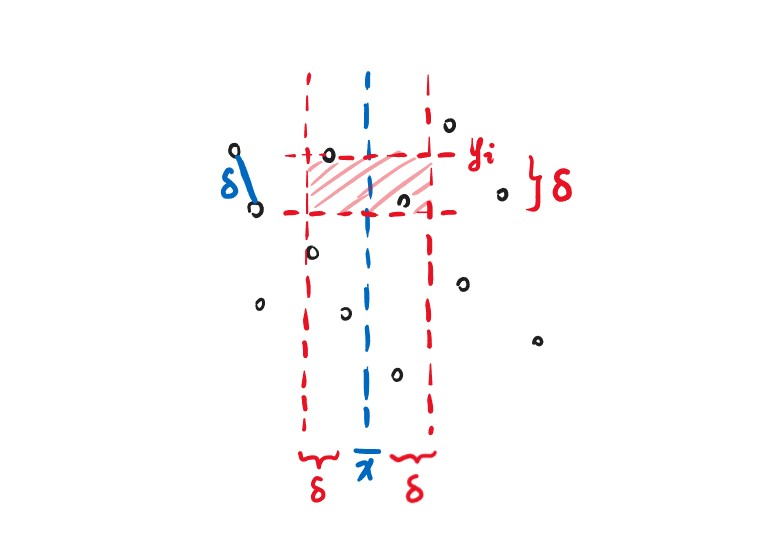
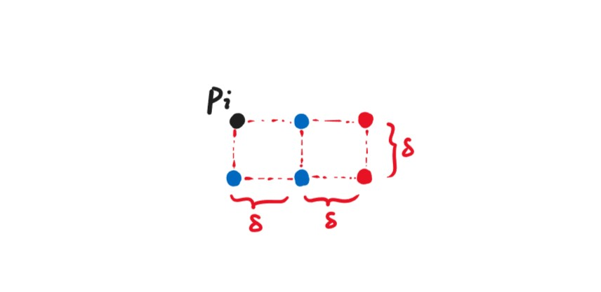
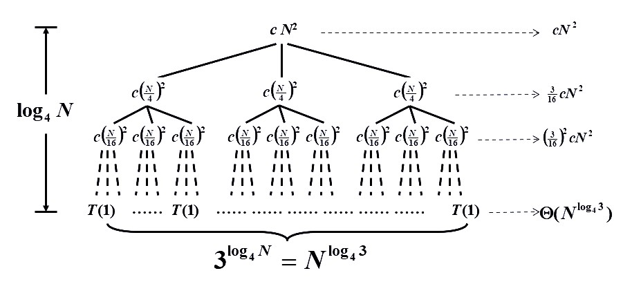
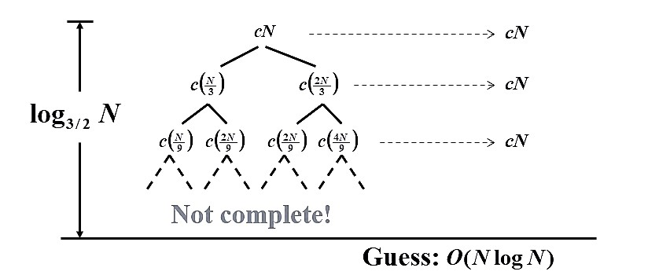

<span style="font-family: 'Times New Roman';">

# Chapter7 Divide and Conquer 分治法

***

## 7.1 基本概念

**核心思想：**

将复杂的总任务拆分成简单的子任务，分别完成子任务后再进行合并。

**通用范式（假设均匀拆分）：**

$$T(N)=aT(\frac{N}{b})+f(N)$$

其中，$a$表示拆分成的子任务个数，$T(\frac{N}{b})$表示每个子任务的耗时，$f(N)$表示合并的耗时。

!!! Example
    **最长子序列：$O(N\log N)$**

    问题描述：对于给定的序列，如$[-1,10,2,-1,5,-2,1,-1]$，从中选出最长的连续子序列，使得该子序列所有元素之和取最大值。

    解决思路：将序列均分为两组，分别为$[-1,10,2,-1]$和$[5,-2,1,-1]$，分别找出左右子列的最长子列（Divide and Conquer），然后再考虑中间切开的地方（Combine）。

    对于从中间延伸的情况，我们分别考虑向左延伸和向右延伸，向左延伸找到$10,2,-1$，向右延伸找到$5$，拼接起来就是从中间延伸的最长子列。

    最后，将三个子列（左：$[10,2]$ 右：$[5]$ 中：$[10,2,-1,5]$）一一比较，得到结果。

!!! Example
    **树的遍历：$O(N)$**

    问题描述：给定树的后序遍历（$DEBFCA$）和中序遍历（$DBEACF$），求树的结构。

    解决思路：先由后序遍历得到根节点$A$，再由中序遍历得到左子树的元素$DBE$和右子树的元素$CF$。

    分别对$DBE$和$CF$重复上述操作（Divide and Conquer），再将得到的左右子树与根$A$相连（Combine）。

!!! Example
    **归并排序：$O(N\log N)$**

    详见“数据结构基础”。

***

## 7.2 典例：最近点对问题（Closest Points Problem）

**问题描述：**

给定平面上的$N$个点，找到距离最近的一对点。

**解决思路：**

假设xy平面，我们可以将这些点按照x坐标进行排序，找到中位数并在此处划分，于是就有了左边的点集和右边的点集。

对于左边点集和右边点集，分别找到最小点对（Divide and Conquer）。

接下来寻找横跨中线的点对，涉及剪枝：

* 若点到中线的距离都已经大于目前找到的最优解了，则剪枝
* 上述是在横向上剪枝，对于枚举到的某个点，还可以在纵向上比较，只需要再查看与这个点纵向距离小于目前最优解的点即可（这时可能需要将所有点在$y$方向上排序，这样便于枚举，超出范围即剪枝）

于是，设所有点的横坐标均值为$\overline{x}$，在左半部分和右半部分找到的当前最优解为$\delta$，我们考虑所有横坐标在$[\overline{x}-\delta,\overline{x}+\delta]$的点$p_1,p_2,···,p_k$，其按照纵坐标由大到小的顺序排列，即$y_1\geqslant y_2\geqslant···\geqslant y_k$，因此我们从$p_1$遍历到$p_k$，对于遍历到的第$i$个点$p_i$，我们只需要检查$[\overline{x}-\delta,\overline{x}+\delta]\times[y_i-\delta,y_i]$这一块区域中其他点到$p_i$的距离即可。



对于每一个点$p_i$，我们需要考虑其对应的搜索区域内最多有几个点。我们已知如果同为左半边（或者右半边）的点，其距离不能小于$\delta$，因此我们发现按照如下方式放置时，最多还需考虑$p_i$以外的5个点。



实际上，与$p_i$同侧的点并不需要考虑（假设中线上的点算作与$p_i$同侧），因此需要考虑的点数还可以减少至2个。

不管怎么说，按照上述思路寻找中间最近点对，每个$p_i$都消耗常数级的时间，因此

$$f(N)=O(N)$$

**伪代码：**

```c linenums="1"
//按照y坐标进行排序，最大为P1
for(i=1;i<=NumPointsInStrip;i++)//从上到下遍历所有横坐标在-δ到+δ的点
{
    for(j=i+1;j<=NumPointsInStrip;j++)//遍历在Pi下面的点，根据纵坐标由近到远
    {
        if(Dist_y(Pi,Pj)>δ)break;//如果纵坐标之差已经超过当前最优解，则纵坐标只差更大的点也没有必要再遍历了
        else if(Dist(Pi,Pj)<δ)δ=Dist(Pi,Pj);
    }
}
```

***

## 7.3 分治法的时间复杂度分析

$$T(N)=aT(\frac{N}{b})+f(N)$$

### 替代法 Substitution Method

先猜结果，再验证。例如

$$T(N)=2T(\lfloor\frac{N}{2}\rfloor)+N$$

猜测：

$$T(N)=O(N\log N)$$

验证：**数学归纳法**

假设对于$\forall m<N$，均成立

$$T(m)=O(m\log m)$$

则对于$m=\lfloor\frac{N}{2}\rfloor$，存在常数$c>0$，使得

$$T(\lfloor\frac{N}{2}\rfloor)\leqslant c\lfloor\frac{N}{2}\rfloor\log(\lfloor\frac{N}{2}\rfloor)$$

因此

$$T(N)\leqslant 2c\lfloor\frac{N}{2}\rfloor\log(\lfloor\frac{N}{2}\rfloor)+N\leqslant cN(\log N-\log2)+N\leqslant cN\log N$$

因此成立

$$T(N)=O(N\log N)$$

!!! Note
    注意到，$N=1$时代入不成立，但我们只需要找到$c>0$，使得当$N$大于某个数之后一直成立即可。

!!! Note
    如果猜测的结果太小，例如$T(N)=O(N)$  
    经过数学归纳法也会得到：  
    $T(N)\leqslant cN+N=O(N)$  
    但这是错误的，因为必须要证$T(N)\leqslant cN$，常数需要保持一致，后面不能加上其他的。

### 递归树法 Recursion-tree Method

构建递归树来计算总耗时。

例：

$$T(N)=3T(\frac{N}{4})+\Theta(N^2)$$



除了叶子节点以外的每个节点上的数值表示合并其子节点结果所需的时间，叶子节点均为$T(1)$，表示分治到最小。

在本例中，我们很容易得到树高为$\log_4N$，叶子节点的总数为$3^{\log_4N}=N^{\log_43}$，第$i$层总的合并时间为$(\frac{3}{16})^icN^2$。

总耗时为树的所有节点相加，因此：

$$T(N)=\sum\limits_{i=0}^{\log_4N-1}(\frac{3}{16})^icN^2+\Theta(N^{\log_43})<\sum\limits_{i=0}^{\infty}(\frac{3}{16})^icN^2+\Theta(N^{\log_43})=O(N^2)$$

虽然如此，递归树法并不总是适用，反例为：

$$T(N)=T(\frac{N}{3})+T(\frac{2N}{3})+cN$$

根据通式构造的递归树如下：



此时的递归树不是完全树，其生长是不均衡的，因此很难计算节点总和，此时我们可以先根据递归树来猜测时间复杂度，再用替代法进行验证。

### 主方法 Master Method

对于通式：

$$T(N)=aT(\frac{N}{b})+f(N)$$

我们对$f(N)$进行讨论：

* 若存在常数$\epsilon>0$，使得$f(N)=O(N^{\log_ba-\epsilon})$，则$T(N)=\Theta(N^{\log_ba})$
* 若$f(N)=\Theta(N^{\log_ba})$，则$T(N)=\Theta(N^{\log_ba}\log N)$
* 若存在常数$\epsilon>0$，使得$f(N)=\Omega(N^{\log_ba+\epsilon})$，且存在常数$c<1$，使得$af(\frac{N}{b})<cf(N)$，则$T(N)=\Theta(f(N))$

!!! Note
    第一种情况，说明叶子数占主导地位；  
    第三种情况，说明合并操作占主导地位。

**主方法的第二种形式：**

* 若存在常数$K>1$，使得$af(\frac{N}{b})=Kf(N)$，则$T(N)=\Theta(N^{\log_ba})$
* 若$af(\frac{N}{b})=f(N)$，则$T(N)=\Theta(f(N)\log_bN)$
* 若存在常数$\kappa<1$，使得$af(\frac{N}{b})=\kappa f(N)$，则$T(N)=\Theta(f(N))$

**主方法的第三种形式：**

已知$T(N)=aT(\frac{N}{b})+\Theta(N^k\log^pN)$，$a\geqslant1$，$b>1$，$p\geqslant0$，则

$T(N)=\begin{cases}  
    O(N^{\log_ba}),a>b^k\\\  
    O(N^k\log^{p+1}N),a=b^k\\\  
    O(N^k\log^pN),a<b^k 
\end{cases}$