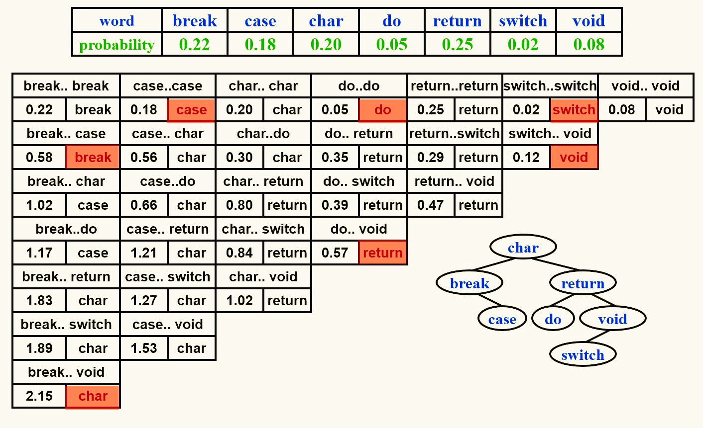
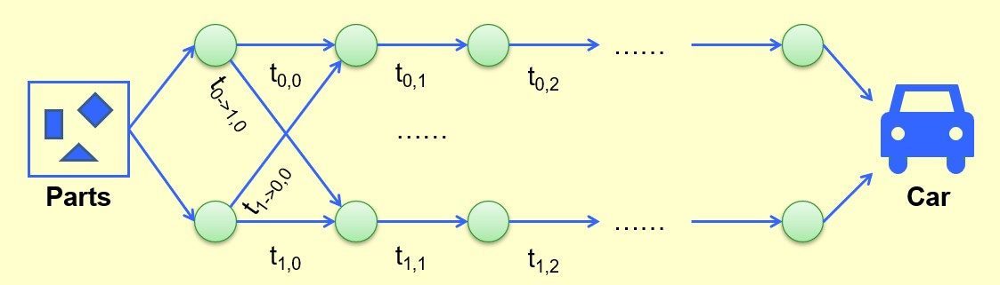

<span style="font-family: 'Times New Roman';">

# Chapter8 Dynamic Programming 动态规划

***

## 8.1 基本概念

与分治法类似：将大问题拆分成小问题。

与分治法不同：使用存储结构（如table）来保存每一个小问题的结果，而不是像分治法一样使用递归。

!!! Example
    **例：Fibonacci数**  
    **$F(N)=F(N-1)+F(N-2)$**  

    若使用分治法：  
    ```c linenums="1" 
    int Fib(int N)
    {
        if(N<=1)
        {
            return 1;
        }
        else
        {
            return Fib(N-1)+Fib(N-2)
        }
    }
    ```  
    时间开销：$T(N)\geqslant T(N-1)+T(N-2)$  
    $T(N)\geqslant F(N)$（指数级）  
    时间开销很大的原因：大量的重复计算  
    例如：要算$F(6)$，我们需要算一遍$F(4)$；但要算$F(5)$，我们又需要再算一遍$F(4)$。  
    因此我们的解决思路是：将每次计算得到的结果存起来，即动态规划。

    若使用动态规划：  
    ```c linenums="1"
    int Fib(int N)
    {
        if(N<=1)return 1;
        Last=NextToLast=1;//F(0)=F(1)=1
        for(i=2;i<=N;i++)
        {
            Answer=Last+NextToLast;//F(i)=F(i-1)+F(i-2)
            NextToLast=Last;//Update F(i-2)
            Last=Answer;//Update F(i-1)
        }
        return Answer;
    }
    ```
    时间开销：$T(N)=O(N)$  

以上例为例：

$F(N)$实际上是一个**状态函数**。

$F(N)=F(N-1)+F(N-2)$实际上是一个**状态转移方程**。

***

## 8.2 典例

### Ordering Matrix Multiplications 顺序矩阵乘法

**问题描述：**

对于$M_{1[a\times b]}\times M_{2[b\times c]}$，其耗时为$a\times b\times c$。

我们发现，对于以下矩阵乘法：

$$M_{1[10\times 20]}\times M_{2[20\times 50]}\times M_{3[50\times 1]}\times M_{4[1\times 100]}$$

若以以下顺序相乘（顺序一）：

$$M_{1[10\times 20]}\times [M_{2[20\times 50]}\times (M_{3[50\times 1]}\times M_{4[1\times 100]})]$$

总耗时为$125000$。

若以以下顺序相乘（顺序二）：

$$[M_{1[10\times 20]}\times (M_{2[20\times 50]}\times M_{3[50\times 1]})]\times M_{4[1\times 100]}$$

总耗时为$2200$。

我们可以发现，使用不同的顺序，可以得到很大的耗时差异，因此我们的问题就是：**对于$M_1\times M_2\times ···\times M_n$，计算的最短耗时为多少？**

**解决思路：**

设$b_n$为计算$M_1\times M_2\times ···\times M_n$的总顺序数。

设

$$M_{ij}=M_i\times···\times M_j$$

则

$$M_{1n}=M_{1i}\times M_{i+1,n},~i\in [1,n-1]$$

由此可知：

$$b_n=\sum\limits_{i=1}^{n-1}b_ib_{n-i}$$

设$m_{ij}$为计算$M_i\times···\times M_j$的最短耗时（即**状态函数**），$M_i$为$r_{i-1}\times r_i$的矩阵。

我们可以推得**状态转移方程**：

$$m_{ij}=\min\limits_{i\leqslant l<j}\\{m_{il}+m_{l+1,j}+r_{i-1}r_lr_j\\}$$

事实上，使用DP还有一个条件是**最优子结构**，即当前问题的最优解是仅依赖于子问题的最优解的。

检查是否是最优子结构的方法：将某个子问题的最优解替换为次优解，如果当前问题的解无法变得更优，甚至变得更差，则说明是最优子结构。

由于$m_{ij}$一共有$O(N^2)$种，且在每一轮循环中枚举$l$耗时$O(N)$，因此总耗时为：

$$T(N)=O(N^3)$$

我们发现，状态函数$m_{ij}$的两个参数$i$和$j$分别表示连乘矩阵的首尾，我们更多地用$m_{ki}$来表示状态参数，其中$i$依然表示连乘矩阵的第一个矩阵，而$k$表示连乘矩阵的数量，即**规模**，这样便于我们从小规模到大规模依次求解，因为**大规模的求解依赖于小规模**。

**伪代码：**

```c linenums="1"
void MinTime(int r[],int N, int m[][])//r[]存放矩阵长宽，m[][]存放最短耗时，相当于状态函数
{
    int i,j,k,l;//i为起始位置，j为终止位置，k为规模
    int CurrentM;//CurrentM
    m[][]=0;//所有的状态函数初始化为0
    for(k=1;k<N;k++)//从小规模到大规模依次求解，因为大规模的求解依赖于小规模
    {
        for(i=1;i<=N;i++)
        {
            j=i+k;
            m[i][j]=∞;
            for(l=i;l<j;l++)
            {
                CurrentM=m[i][l]+m[l+1][j]+r[i-1]*r[l]*r[j];//计算某个l下得到的最短耗时
                if(CurrentM<m[i][j])
                {
                    m[i][j]=CurrentM;
                }
            }
        }
    }
    return;
}
```

### Optimal Binary Search Tree 最优BST

**问题描述：**

给定$N$个单词$w_1<w_2<···<w_N$（大小比较按照字典序），对于每一个单词$w_i$，其访问频率为$p_i$，现在需要构造一棵二叉搜索树，使得访问这些单词的期望代价最小，即

$$t(N)=\sum\limits_{i=1}^Np_i(1+d_i)$$

取最小值，其中$d_i$为单词$w_i$所处的深度（根节点深度为$0$）。

**解决思路：**

我们的直观感觉是，$p_i$大的单词应该浅一些，$p_i$小的单词应该深一些，但我们发现使用贪心或者AVL并没有得到最小的期望代价，原因是由于二叉树的性质，一些本可以放置单词的位置被浪费了。

为了用动态规划解决这个问题，我们给出如下定义：

设$T_{ij}$为单词$w_i$到$w_j$所构成的最优BST，由于这些单词按照字典序是相邻的，因此其必然位于同一棵树中。

设$c_{ij}$为$T_{ij}$对应的期望代价（即**状态函数**）；

设$r_{ij}$为$T_{ij}$的根；

设$W_{ij}=\sum\limits_{k=i}^jp_k$。

综上可得状态转移方程：

$$c_{ij}=\min\limits_{i\leqslant l<j}\\{c_{il}+c_{l+1,j}+W_{ij}\\}$$

!!! Note
    由于左右子树不会相互影响，因此满足最优子结构。  
    由于子树的下沉，所以在$c_{ij}$的求解过程中所有元素深度都要加1。



时间复杂度：

$$T(N)=O(N^3)$$

### All-Pairs Shortest Path 所有最短路径

**问题描述：**

本质：**Floyd Algorithm** [跳转指路](../Discrete Mathematics/Chapter9.md#second-chapter)

给定一张有$N$个节点$v_1,v_2,···,v_N$的无负权边的无向图，给定任意两个节点$v_i$，$v_j$，求其最短路径。

**解决思路：**

与之前的状态函数定义不同的是，这个问题不能简单地直接用点的个数作为规模，而是应该如下定义**状态函数**$D_{ijk}$：

$i$和$j$分别表示这是在求节点$v_i$和$v_j$之间的最短路径，$k$表示可以用编号为$1\sim k$的节点作为中间跳板，而编号以外的节点不能在计算最短路径时使用。

**状态转移方程**为：

$$D_{ijk}=\min\\{D_{ij,k-1},D_{ik,k-1}+D_{kj,k-1}\\}$$

状态转移方程的解释：

$D_{ijk}$表示从节点$v_i$到节点$v_j$的最短路径，仅能使用编号$1\sim k$的节点作为中间跳板，对于节点$v_k$，我们不知道最短路径是否使用其作为中间跳板，因此我们将当前问题分成使用$v_k$（$D_{ik,k-1}+D_{kj,k-1}$）和不使用$v_k$（$D_{ij,k-1}$）的两个子问题，哪个更小哪个就是当前问题的解。

时间复杂度：

$$T(N)=O(N^3)$$

**伪代码：**

```c linenums="1"
void AlPairs(int A[][];int D[][];int N)//A[][]为表示图的邻接矩阵，D[][]用于存放节点之间的最短路径（状态函数）
{
    int i,j,k;
    D[][]=A[][];//初始化，如果两节点之间没有直接相连则定义为∞
    for(k=1;k<=N;k++)//k表示当前使用编号1~k的节点作为中间跳板，相当于逐一添加
    {
        for(i=1;i<=N;i++)
        {
            for(j=1;j<=N;j++)
            {
                if(D[i][k]+D[k][j]<D[i][j])//如果发现添加节点k后可以取得更短路径，则进行更新
                {
                    D[i][j]=D[i][k]+D[k][j];
                }
            }
        }
    }
    return;
}
```

### Product Assembly 产品组装问题

**问题描述：**

从零件加工到完整产品有两条生产线，从上一工序到下一工序都有一个对应耗时，加工过程中可以转移生产线，但转移生产线会有额外的耗时。求最短耗时。



**解决思路：**

状态转移方程：

$$f_{ij}=\min\limits_{i\in\\{0,1\\}}\\{f_{i,j-1}+t_{(i,j-1)\rightarrow(i,j)}\\}$$


其中，$i$表示第$i$条生产线，$j$表示第$j$个工序。$f_{ij}$表示从初始到第$i$条生产线的第$j$个工序的最短耗时。