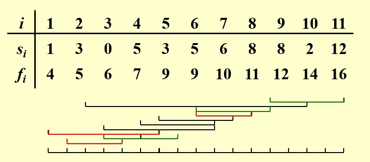

# Chapter9 Greedy Algorithms 贪心算法

***

## 9.1 基本概念

贪心算法常用于解决**优化问题**。

!!! Success "Definition"
    **优化问题：**  
    给定一系列的限制和一个目标函数，在可行解（feasible solution）中找到能使目标函数取最优值的解，即最优解（optimal solution）。

贪心算法在每一步都采取最优策略，之后不会再更改，且保证每一步均可行。

!!! Note
    贪心算法只有在**局部最优=全局最优**时有效。
    贪心算法无法保证能找到最优解，但其找到的解会与最优解十分接近，因此，当寻找最优解耗时过长时可以考虑用贪心算法的解近似替代。
    例如：在使用回溯法求最优解的时候，我们往往会遇到难以剪枝的情况，此时我们可以考虑用贪心算法得到一个近似最优解，以此作为剪枝条件，如果当前枚举到的情况甚至不如该解，则直接剪枝。

***

## 9.2 Activity Selection Problem 活动选择问题

**问题描述：**

假设有$n$个活动$S=\\{a_1,a_2,···,a_n\\}$，都需要用到同一间教室，每个活动$a_i$占用的时间区间为$[s_i,f_i)$，且假设$f_1\leqslant f_2\leqslant ···\leqslant f_n$，求能够安排的最多活动数量

**动态规划：**

设$S_{ij}$表示开始时间在$a_i$结束之后，结束时间在$a_j$开始之前的最大兼容活动集合（集合中的两两活动时间不重叠）。

设$c_{ij}$表示从活动$a_i$结束到活动$a_j$开始这段时间内能够安排的最多活动数量，即$S_{ij}$的元素个数。

$$c_{ij}=\begin{cases}
    0,S_{ij}=\emptyset\\\
    \max\limits_{a_k\in S_{ij}}\\{c_{ik}+c_{kj}+1\\},S_{ij}\neq\emptyset
\end{cases}$$

实际上其中存在冗余。例如，在最优解中有$a_k$，$a_l$，且满足$a_i<a_k<a_l<a_j$，我们可能在计算$c_{ij}$时锁定$a_k$，然后在计算$c_{kj}$时锁定$a_l$；也可能在计算$c_{ij}$时锁定$a_l$，然后在计算$c_{il}$时锁定$a_k$。两种不同方式的状态转移，导向同一组解$a_k$，$a_l$，从而导致计算的冗余。

本质原因：我们想要的是集合，但我们选出的是序列。

因此需要将序列的选择转变为集合的选择：强行定下顺序，使得只能得到$a_k$，$a_l$顺序的解，不能得到$a_l$，$a_k$顺序的解。

**优化后的动态规划：**

设$S_i$表示活动$a_1,a_2,···,a_i$的最大兼容活动集合（集合中的两两活动时间不重叠）。

设$c_i$表示$S_i$的元素个数，我们最后所求即为$c_n$。

$$c_i=\max\\{c_{i-1},c_k+1\\}$$

其中$c_{i-1}$表示不选择$a_i$时，$a_1,a_2,···,a_i$中的最多兼容活动数量。因为不选择$a_i$，所以相当于是$a_1,a_2,···,a_{i-1}$中的最多兼容活动数量。

$c_k+1$表示选择$a_i$时，$a_1,a_2,···,a_i$中的最多活动兼容数。活动$a_k$满足其结束时间早于$a_i$的活动时间，且使得$c_k$取最大值，即$a_1,a_2,···,a_k$中能安排最多数量的兼容活动。

现在来检查冗余情况。假设一共有三个活动$a_1,a_2,a_3$，最优解有两个活动，其中一个为$a_3$。从正向推，看$c_0$如何推出$c_2$。

从$c_0$可以推出任意一个只选了一个活动的状态：

* 情况一：只选了$a_1$：$c_1=c_0+1=1$
* 情况二：只选了$a_2$：$c_2=c_0+1=1$（$a_1$与$a_2$不兼容）
* 情况三：只选了$a_3$：$c_3=c_0+1=1$（$a_1$或$a_2$都与$a_3$不兼容）

对于选择了两个活动的状态（最优解，其中一个为$a_3$）：

* 情况一：由前一个情况一推得：$c_3=c_1+1=2$（$a_1$与$a_3$兼容，$a_2$与$a_3$不兼容）
* 情况二：由前一个情况二推得：$c_3=c_2+1=2$（$a_1$与$a_2$不兼容，$a_2$与$a_3$兼容，但我们也可以从中推出$a_1$与$a_3$兼容）

从中我们可以看出，如果$a_1$与$a_3$兼容，那么就没有必要找$a_2$了。然而由于动态规划实际的顺序是从后往前，因此会先去找$c_2$，比$c_1$计算时间更久（因为$c_2$的计算可能还需要$c_1$），因此产生冗余。

实际上正向的思考过程就是贪心算法。

**不同的贪心算法：**

1.开始时间早的优先（失败）

2.耗时短的优先（失败）

3.冲突少的优先（失败）

4.结束时间早的优先（成功）

**贪心算法的证明：**

**证明1：得到的解是合法的**

显然成立。

**证明2：得到的解是最优的**

定义子问题$S_k=\\{a_i|s_i\geqslant f_k\\}$，即在$a_k$结束后才开始的活动集合，该子问题求解的是在$a_k$结束后能安排的最多活动数量。

如果我们确定了$a_1$，即问题中最早结束的活动，那么这个问题的最优解理应为子问题$S_1$的最优解+1。对于子问题$S_1$，假设其中最早结束的活动为$a_i$，则$S_1$的最优解理应为子问题$S_i$的最优解+1。以此类推。

现在的问题是，凭什么一个子问题中最早结束的活动一定在该子问题的最优解中（**贪心选择性质**），以及凭什么已经确定的活动数量加上子问题的最优解一定是原问题的最优解（**最优子结构性质**）？

!!! Tip "Proof"
    **活动选择问题的贪心选择性质：**

    假设原问题的最优解不包含$a_1$，那么在最优解的其他活动中挑选一个最早结束的活动$a_k$，用$a_1$替换，一定不会让解变差，毕竟$a_1$的结束时间比$a_k$还早，不会引起冲突。

!!! Tip "Proof"
    **活动选择问题的最优子结构性质：**

    已经确定的活动如果替换，则根据贪心选择性质，解并不会更优；同理，子问题的最优解替换成次优解，原问题的解也会更差。

**问题变形：**

为每个活动$a_i$附加一个分值$w_i$，如何安排才能得到最大分数？

$$c_i=\max\\{c_{i-1},c_k+w_i\\}$$

***

## 9.3 Huffman Codes 霍夫曼编码

**问题描述：**

给定了不同字符和相应的使用频率，构建一棵用于霍夫曼编码的树，使得期望编码长度最小。

!!! Note
    方法详见离散数学，用最小堆来实现。

**贪心算法的正确性：**

* **贪心选择性质：**  
  对于字符集$S$，$x,y\in S$是其中频率最低的两个字符，则在$S$的某个最优霍夫曼编码中，$x$和$y$的编码长度相同，且只有最后一位不同。

* **最优子结构性质：**  
  对于字符集$S$，$x,y\in S$是其中频率最低的两个字符，我们用频率为$x$，$y$之和的字符$z$来替换$x$和$y$，得到字符集$S'$，则在$S'$的任意一个最优霍夫曼编码中，我们总可以将叶子节点$z$替换为直接连接$x$和$y$的内部节点，得到$S$的某个最优霍夫曼编码。

