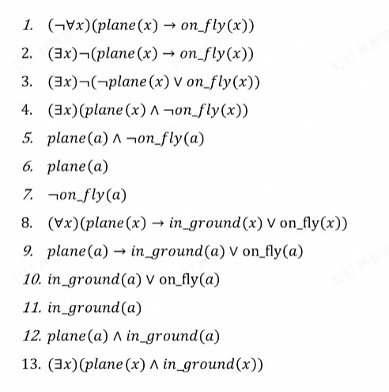
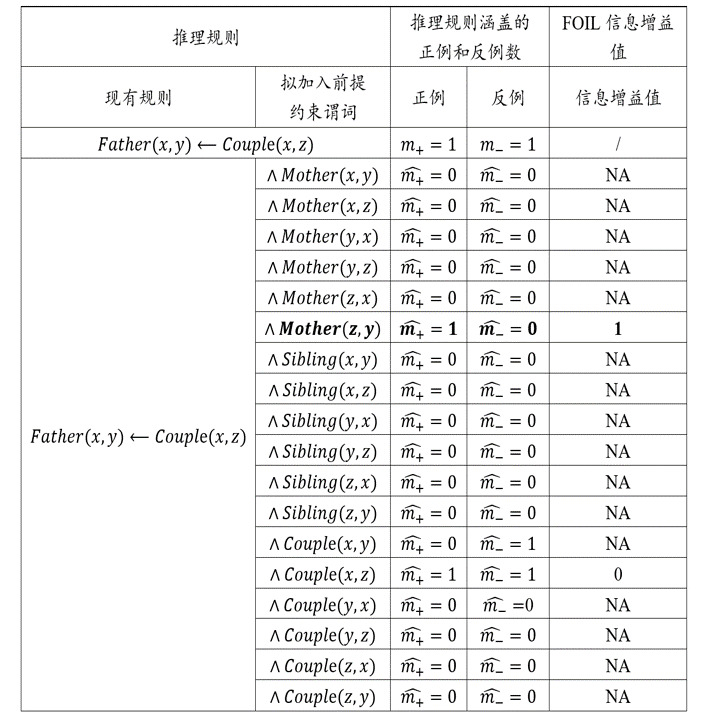

# Chapter 1 逻辑与推理

***

## 1.1 命题逻辑

**命题：**

确定为**真**或为**假**的陈述句。

!!! Example
    **“我正在说谎”**  
    不是一个命题，因为其是悖论，无法判断真假。

**原子命题：**

不包含其他命题作为其组成部分的命题，又称**简单命题**。

在命题逻辑中是最基本的单位，对原子命题的内部结构不做任何解析。

若干原子命题可通过逻辑运算符来构成复合命题。

**逻辑推理：**

逻辑推理是根据某种特定策略，从前提出发推出结论的过程。

!!! Example
    **已知：**  
    **$\alpha\vee\beta,~\alpha\rightarrow\gamma,~\beta\rightarrow\gamma$为真**  
    **应用归结法证明命题$\gamma$为真。**   

    1.$\alpha\vee\beta$（已知）  
    2.$\neg\alpha\vee\gamma$（第二个条件的转换）  
    3.$\neg\beta\vee\gamma$（第三个条件的转换）  
    4.$(\neg\alpha\vee\gamma)\wedge(\neg\beta\vee\gamma)$（由2和3）   
    5.$(\neg\alpha\wedge\neg\beta)\vee\gamma$（对4使用分配律）  
    6.$\neg(\alpha\vee\beta)\vee\gamma$（对5使用De Morgan定律）  
    7.$\gamma$（1和6归结）  

**范式：**

有限个简单合取式构成的析取式称为**析取范式**。

有限个简单析取式构成的合取式称为**合取范式**。

析取范式与合取范式统称为**范式**。

***

## 1.2 谓词逻辑

命题逻辑无法表达局部与整体、一般与个别的关系，因此需要谓词逻辑来刻画主体（个体和群体）之间的逻辑关系。

在谓词逻辑中，将原子命题进一步细化，分解出**个体**、**谓词**和**量词**，来表达个体与总体的内在联系和数量关系，这就是谓词逻辑的研究内容。

!!! Example
    **已知每架飞机或者停在地面或者飞在天空，且并非每架飞机都飞在天空，求证：有些飞机停在地面。**  

    形式化：  
    plane($x$)：$x$是飞机  
    in_ground($x$)：$x$停在地面  
    on_fly($x$)：$x$飞在天空  
    已知：  
    ($\forall x$)(plane($x$)$\rightarrow$in_ground($x$)$\vee$on_fly($x$))  
    ($\neg\forall x$)(plane($x$)$\rightarrow$on_fly($x$))  
    求证：  
    ($\exists x$)(plane($x$)$\wedge$in_ground($x$))  
    具体证明如下：  
    

***

## 1.3 知识图谱推理

**知识图谱**由有向图构成，用于描述实体与实体之间的关系，实体用节点表示，节点之间的连线表示关系。

以上图为例，红色虚线表示我们想要推理得到的关系。如果定义以下推理规则：

$$(\forall x)(\forall y)(\forall z)(Mother(z,y)\wedge Couple(x,z)\rightarrow Father(x,y))$$

就可在现有知识$Mother(James,Ann)$和$Couple(James,David)$基础上进行推理，得到新的知识$Father(David,Ann)$。

### 归纳逻辑程序设计（ILP）

**ILP**使用一阶谓词逻辑进行知识表示，通过修改和扩充逻辑表达式对现有知识进行归纳，完成推理任务，得到普适性的推理规则，再根据该推理规则得到结论。对于本例，需要依据给出的知识图谱，推理得到以下规则：

$$(\forall x)(\forall y)(\forall z)(Mother(z,y)\wedge Couple(x,z)\rightarrow Father(x,y))$$

然后推得新的知识。

**FOIL归纳推理：**

FOIL是ILP的代表方法，通过**序贯覆盖**学习推理。

!!! Success "Definition"
    **序贯覆盖：** 即逐条归纳，在训练集上每学到一条规则，就将该规则覆盖的训练样例去除，然后以剩下的训练样例组成训练集重复上述过程，由于每次只处理一部分数据，也被称为“分治”策略。

**算法思路：**

从一般到特殊，逐步添加目标谓词的前提约束谓词，直到所构成的推理规则不覆盖任何反例。

添加前提约束谓词后所得推理规则的质量好坏由**信息增益值**来评估。

$$FOIL_{Gain}=\widehat{m_+}\cdot(\log_2\frac{\widehat{m_+}}{\widehat{m_+}+\widehat{m_-}}-\log_2\frac{m_+}{m_++m_-})$$

其中，$\widehat{m_+}$和$\widehat{m_-}$分别是增加前提约束谓词后所得到的新推理规则的正例数和反例数，$m_+$和$m_-$分别是原推理规则的正例数和反例数。

输入：目标谓词$P$（规则头），$P$的正例，$P$的反例，其他背景知识

输出：归纳推理得到的规则

* 步骤1：假设前提约束谓词$A_1，A_2，···，A_n$，对于不同的$A_i$得到假设推理规则：$A_i\rightarrow P$
* 步骤2：对于不同的假设推理规则，分别计算FOIL信息增益值
* 步骤3：选取能带来最大信息增益值的前提约束谓词（例如$A_k$）加入到原来的推理规则，得到新的推理规则，然后更新正反例
* 步骤4：在新的推理规则下从步骤1开始重复，直到没有反例，所得到的规则就是目标

对于本例，目标谓词$P$为：

* $Father(x,y)$

$P$的正例为：

* $(David,Mike)$

$P$的反例为：

* $(David,James)$
* $(James,Ann)$
* $(James,Mike)$
* $(Ann,Mike)$

!!! Note
    只有在已知两个实体之间存在的关系且确定这一关系与目标谓词相悖时，才能将这两个实体用于构建目标谓词的反例。    

其他背景知识： 

* $Couple(David,James)$
* $Mother(James,Ann)$
* $Mother(James,Mike)$
* $Sibling(Ann,Mike)$

**步骤1和步骤2：**

给定目标谓词$Father(x,y)$，此时推理规则只有目标谓词，因此推理规则所覆盖正例和反例样本数分别是训练样本中正例和反例的数目，即1和4，因此$m_+=1$，$m_−=4$。

**分析案例1：**

如果将$Mother(x,y)$作为前提约束谓词加入推理规则，可得到$Mother(x,y)\rightarrow Father(x,y)$。在表中所提供背景知识中，$Mother(x,y)$有两个实例，即$Mother(James, Ann)$和$Mother(James, Mike)$。对于$Mother(James, Ann)$这一实例，$x=James$，$y=Ann$，将$x$和$y$代入$Father(x,y)$得到$Father(James, Ann)$，为反例；同理，另一个也是反例。因此推理规则$Mother(x,y)\rightarrow Father(x,y)$所覆盖的正例和反例数量分别为0和2，代入公式会得到非法解，记为NA。

**分析案例2：**

如果将$Couple(x,z)$作为前提约束谓词加入推理规则，可得到$Couple(x,z)→Father(x,y)$。在背景知识中，$Couple(x,z)$只有一个实例$Couple(David, James)$，即$x=David$，$z=James$，将其代入$Father(x,y)$得到$Father(David, 𝑦)$。在训练样本中存在正例$Father(David, Mike)$以及反例$¬Father(David, James)$，因此覆盖的正例和反例数目均为1。

!!! Note
    具体步骤归纳：  

    * 根据假定的前提约束谓词$A_i$构建表达式$A_i\rightarrow P$
    * 根据已知的和$A_i$对应的背景知识将具体对象代入$x$，$y$等变量，得到带有具体对象的$P$
    * 与$P$的正反例一一比对，如果能对应上则对应例子数量加一

经计算得到$Couple(x,z)$带来的增益最大，于是将其加入到推理规则中，得到新的推理规则

$$Couple(x,z)\rightarrow Father(x,y)$$

并更新对应的正反例，于是只剩一个正例$Father(David,Mike)$和一个反例$\neg Father(David,James)$。

**重复步骤1和步骤2：**

经计算得到$Mother(z,y)$带来的增益最大，于是将其加入到推理规则中，得到新的推理规则

$$Couple(x,z)\wedge Mother(z,y)\rightarrow Father(x,y)$$

并更新对应的正反例，此时不覆盖任何反例，推理结束，得到推理规则。根据该推理规则，可以得到最终结论。

### 路径排序算法（PRA）

**PRA**将实体之间的关联路径作为特征，得到每一对实体的特征向量，依据特征向量的相似度进行分类，得到相似关系。PRA主要分为以下三步：

* **特征抽取：** 确定哪些作为节点对的特征
* **特征计算：** 为每一对节点计算特征向量
* **分类器训练：** 根据不同的特征向量，将节点对进行分类，则与目标关系一样的有大概率分到一组

对于本例，目标关系是$Father$，简单起见，只生成4组训练样例（节点对）：

* $(David,Mike)$ 正
* $(David,James)$ 反
* $(James,Ann)$ 反
* $(James,Mike)$ 反

**特征抽取：**

为上述每组训练样例采集一个路径，这条路径“间接”连接对应的两个节点：

* $(David,Mike)$：$Couple\rightarrow Mother$
* $(David,James)$：$Father\rightarrow Mother^{-1}$
* $(James,Ann)$：$Mother\rightarrow Sibling$
* $(James,Mike)$：$Couple\rightarrow Father$

!!! Note
    $Mother^{-1}$表示$Mother$路径反向。

我们就以每组节点是否能通过这些路径连接作为特征，能连接为1，不能连接为0。

**特征计算：**

* $(David,Mike)$：$[1,0,0,0]$
* $(David,James)$：$[0,1,0,0]$
* $(James,Ann)$：$[0,0,1,0]$
* $(James,Mike)$：$[0,0,1,1]$

**分类器训练：**

对于$(David,Ann)$，得到其特征向量为$[1,0,0,0]$，与$(David,Mike)$一致，所以其对应关系也大概率相同，于是得到结论。

***

## 1.4 概率推理

在图数据中，如果两个节点之间存在连边，则可视为这两个节点之间具有概率依赖关系而相互影响。在这类图中，可用概率描述两个相连节点之间的关联，而不是假设节点之间的影响一定会百分之百发生，这种图被称为**概率图**，而基于概率图进行的推理被称为**概率推理**。

### 贝叶斯网络

**贝叶斯网络**用有向无环图来表示，其用有向边来表示节点和节点之间的单向概率依赖，刻画了依赖关系。

贝叶斯网络满足**局部马尔可夫性**，即在给定一个节点的父节点的情况下，该父节点有条件地独立于这个节点的非后代节点。

贝叶斯网络中所有因素的联合分布等于所有节点的P（节点|父节点）的乘积。

!!! Example
    
    P(多云、下雨、洒水车、路湿)=P(多云)P(下雨|多云)P(洒水车|多云)P(路湿|洒水车,下雨)

### 马尔可夫逻辑网络

**马尔可夫逻辑网络**用无向图表示，其用无向边来表示节点和节点之间的相互概率依赖，刻画了谓词命题之间的组合。

马尔可夫逻辑网络为每条规则赋予一定的权重，用于计算断言成立的概率。

$$P(x)=\frac{1}{Z}\exp(\sum\omega_in_i(x))$$

其中，$Z$为一固定常量，$\exp$为自然指数函数，$\omega_i$为第$i$条规则的权重，$n_i(x)$为$x$情况下第$i$条规则的逻辑取值0/1。

!!! Example  
      
      
    现在要计算“如果下雨（无论是否有灯光秀），在室外举行开学典礼”的概率：  

    * 规则1逻辑取值为1
    * 规则2逻辑取值为1
    * 规则3逻辑取值为0
    * 规则4逻辑取值为1

    $P=\frac{1}{Z}\exp(1\times1+9\times1+5\times0+7\times1)=\frac{1}{Z}\exp(17)$  

***

## 1.5 因果推理

略