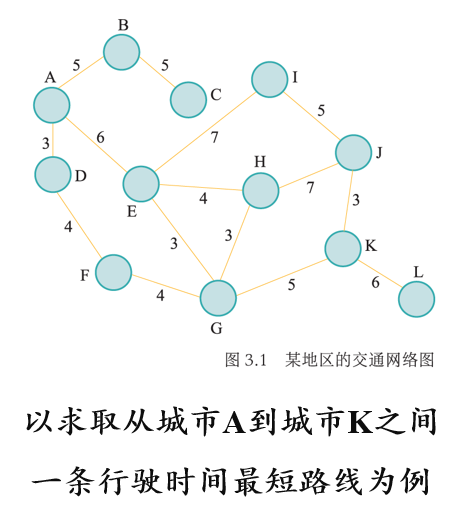
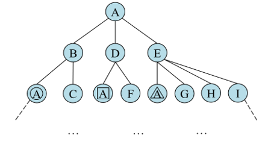
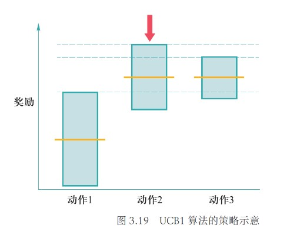

# Chapter 2 搜索与求解

***

## 2.1 搜索算法基础

### 相关术语

**状态：**

状态是对搜索算法和搜索环境当前所处情形的描述信息，在本例中对应当前位于的城市。

**动作：**

算法从一个状态转移到另一个状态所采取的行为被称为动作，在本例中对应乘坐一趟列车从当前城市到下一城市。

**状态转移：**

算法选择了一个动作之后，其所处状态也会发生相应变化，这个过程被称为状态转移（由动作触发）。

**路径：**

将状态转移过程中经历的状态记录下来，可以得到一个状态序列，这个状态序列被称为一条路径。

**代价：**

每条路径对应一个代价，在本例中对应通过该路径的时间开销，图中每条边上的数值即为单步代价取值。

**目标测试：**

目标测试函数用于判断状态$S$是否为目标状态，但判断结果为真并不意味着找到的路径是最短的。

搜索算法可以被看成是一个构建**搜索树**的过程，从根节点（初始状态）开始，不断展开每个节点的后继节点，直到某个节点通过了目标测试。

!!! Note
    搜索树第三层有三个标号均为$A$的节点，其分别被圆圈、正方形和三角形框住，其表示同一城市，但对应从初始状态出发的不同路径。

### 算法评价指标

* **完备性：** 当问题存在解时，算法是否能保证找到一个解
* **最优性：** 搜索算法是否能保证找到的第一个解是最优解
* **时间复杂度：** 找到一个解所需时间
* **空间复杂度：** 在算法的运行过程中需要消耗的内存量

完备性和最优性刻画了算法找到解的能力以及所求的解的质量，时间复杂度和空间复杂度衡量了算法的资源消耗。

一般地，时间复杂度使用扩展的总节点数来衡量，空间复杂度通过同时记录的节点数来衡量。

**用于估计复杂度的变量：**

* **b：** 分支因子，即搜索树中每个节点最大的分支数目
* **d：** 根节点到最浅的目标节点的路径长度
* **m：** 搜索树中路径的最大可能长度
* **n：** 状态空间中状态的数量

### 搜索算法框架

在树搜索算法中，集合$F$用于保存搜索树中可用于下一步探索的所有候选节点，这个集合被称为**边缘集合**，有时也被叫做**开表**。

对于每一轮搜索，先从$F$中取出一个节点$n$，如果$n$能通过目标测试，则返回从初始节点到$n$的路径（不一定是最佳路径），否则对节点$n$进行**扩展**，即将$n$的所有后继节点放入$F$中，进入下一轮搜索。

实际上，给定当前节点，并不是所有的后继节点都值得探索，在某些情况下，主动放弃一些后继节点能够提高搜索效率而不会影响最终的搜索结果，甚至能解决一些死循环问题，这种做法叫做**剪枝**。

!!! Example
    **广度优先算法：队列形式**  

    时间复杂度：$O(b^d)$  
    空间复杂度：$O(b^d)$  
    完备性：√  
    最优性：只有每条路径代价为1时为√  

    **深度优先算法：栈形式**  
    
    时间复杂度：$O(b^m)$  
    空间复杂度：$O(bm)$  
    完备性：×  
    最优性：×  

***

## 2.2 有信息（启发式）搜索

**辅助信息：**

* **评价函数$f(n)$：** 用于决定从当前节点$n$出发，下一个要访问的后继节点是哪个
* **启发函数$h(n)$：** 从节点$n$到目标节点之间的理论最小代价，一般已经提供，作为额外信息参考
* **代价函数$g(n)$：** 表示从起始节点到节点$n$的开销（当前最小代价，经过计算后已知）
* **c(n,a,n')：** 从节点$n$执行动作$a$到达节点$n'$的单步代价
* **h\*(n)：** 从节点$n$到目标节点之间的实际最小代价，通过计算得到

### 贪婪最佳优先搜索

**评价函数$f(n)$=启发函数$h(n)$**

以上述例子为例，给定启发函数为任意一个城市与终点城市$K$之间的直线距离，评价函数相同，每到一个节点，先找到其所有的后继节点，然后依次比较这些节点的评价函数，挑出最小的一个（直线距离最短），然后继续前进，直到到达$K$。

* 时间复杂度：$O(b^m)$  
* 空间复杂度：$O(b^m)$  
* 完备性：√（但如果不排除环路则是不完备的）  
* 最优性：×  

!!! Note
    时空复杂度解释：  
    贪婪最佳优先搜索在最坏情况下需要遍历所有的节点（$b^m$个），因为每次挑评价函数最小的节点一直往下走并不一定能到达目标，只能说几率比较大，因此时间复杂度和空间复杂度均为$O(b^m)$。  

### A*搜索

**评价函数$f(n)$=代价函数$g(n)$+启发函数$h(n)$**

以上述例子为例，给定启发函数为任意一个城市与终点城市$K$之间的直线距离，每到一个节点，先找到其所有的后继节点，然后计算出这些节点的评价函数，依次比较这些节点的评价函数，然后继续前进，直到到达$K$。

!!! Note
    值得注意的是并非只在当前节点的后继节点中比较，当前节点的兄弟节点甚至更上一层的也要参与比较挑出最小的一个，在示例的“扩展节点$H$”中有所体现。

A*搜索的完备性和最优性取决于搜索问题和启发函数的性质。

### A*搜索性能分析

一个良好的启发函数需要满足如下两种性质：

**可容性：**

对于任意节点$n$，有

$$h(n)\leqslant h^*(n)$$

即估计代价不超过实际代价。

在上例中，两个城市之间的行驶距离不会小于两个城市之间的直线距离，因此列车以最大行驶速度通过直线距离花费的时间必然不会超过实际代价，将该时间作为启发函数是满足可容性的。

**一致性：**

对于任意节点$n$和$n'$，有

$$h(n)\leqslant c(n,a,n')+h(n')$$

在上例中，假设节点$n$和$n'$分别对应城市$s$和$s'$，将单步代价$c(n,a,n')$重新定义为两个城市的直线距离，则由三角不等式，城市$s$到目标城市的直线距离一定不超过城市$s$和$s'$之间的直线距离与城市$s'$到目标城市的直线距离之和，因此以当前城市与目标城市之间的直线距离对应的时间作为启发函数是满足一致性的。

**满足一致性的启发函数一定满足可容性。**

**A*算法的完备性：**

如果所求解问题和启发函数满足：

* 搜索树中分支数量是有限的，即每个节点的后继节点数量是有限的
* 单步代价的下界是一个正数
* 启发函数有下界
  
那么A*算法满足完备性。

**A*算法的最优性：**

如果启发函数是可容的，那么A*算法满足最优性。

***

## 2.3 对抗搜索

在一个竞争的环境中，智能体之间通过竞争实现相反的利益，一方最大化这个利益，另外一方最小化这个利益。

**形式化描述：**

* **状态：** 包括当前的游戏局面和当前行动的智能体
* **动作：** 给定状态$s$，动作指的是$player(s)$在当前局面下可以采取的操作$a$，$a$所属的动作集合记为$actions(s)$
* **状态转移：** 给定状态$s$和动作$a$，状态转移函数$result(s,a)$决定了在$s$状态采取动作$a$后所得后继状态
* **终局状态检测：** 终止状态检测函数$terminal\_test(s)$用于测试游戏是否在状态$s$结束
* **终局得分：** 终局得分$utility(s,p)$表示在终局状态$s$时玩家$p$的得分

### 最小最大搜索

以井字棋为例。

每一层表示当前的状态$s$，左侧标明的是$player(s)$，即在状态$s$下即将采取动作$a$改变当前状态的玩家，终局有三种状态，分别是玩家1获胜、平局和玩家0获胜，对应的终局得分分别是+1、0和-1。

在这个问题下，玩家1总是会选择能够最大化自己得分的搜索树分支，玩家0总是会选择能够最小化自己得分的搜索树分支，最小最大搜索的名字由此而来。

推广：以最大化得分为目标的玩家称为玩家Max，以最小化得分为目标的玩家称为玩家Min。

上图中，叶子节点表示不同的终局得分，当状态为$B$时，此时轮到Min行动，为了使终局得分最小化，其会选择动作$b_1$，此时$B$旁边就有了一个分数，表示Min在状态$B$采取行动后可以达到的最小终局得分（当前玩家的最优得分），状态$C$，$D$同理。

而对于状态$A$，Max行动，在已知采取不同行动后可能的终局得分（状态$B$，$C$，$D$旁边的分数）的情况下，其会选择动作$a_1$，因为这样可以达到最大终局得分（当前玩家的最优得分）。

现在，$minimax(s)$表示在状态$s$下，对应玩家采取行动后能获得的相对于该玩家的最优终局得分，则可归纳得到：

$$minimax(s)=\begin{cases}
  utility(s),~if~terminal\_test(s)\\\
  \max_{a\in actions(s)}\{minimax(result(s,a))\},~if~player(s)=Max\\\
  \min_{a\in actions(s)}\{minimax(result(s,a))\},~if~player(s)=Min
\end{cases}$$

**伪代码：**

* 完备性：√（只要搜索树是有限的）
* 最优性：√（只要双方一直在按照最优策略交替采取行动）
* 时间复杂度：$O(b^m)$
* 空间复杂度：$O(bm)$

!!! Note
    最小最大搜索实际上执行了一个完整的深度优先搜索，因此时空复杂度与深度优先搜索一致。

**缺点：**

如果搜索树极大，由于需要遍历所有节点，因此无法快速返回结果；

返回最优结果的前提是对手也在按照最优策略行动。

### $\alpha$-$\beta$剪枝搜索

在最小最大搜索的基础上采取**剪枝**的方法，减少需要搜索的节点数，且不影响最终结果。

以上图为例，叶子节点并不代表终局状态，而是各自代表一棵子树，搜索算法还不知道动作$c_2$和$c_3$对应的子树收益，此时Max在根节点所能得到的最大分数为

$$minimax(A)=\max(\min(3,9,10),\min(2,x,y),\min(10,5,1))=\max(3,\min(2,x,y),1)=3$$

与$x$，$y$无关，因此可以被剪枝。

现在进行推广。

**$\alpha$剪枝：**

在确定Max节点$m'$的收益时，已知其Min子节点$m$提供的收益为$\alpha$，那么对于$m$的兄弟的某个Min后继（后代）节点$n$，若其目前能够为其Max父节点$n'$提供的收益已经小于$\alpha$，则其未被访问的后继节点被剪枝。

**$\beta$剪枝：**

在确定Min节点$m'$的收益时，已知其Max子节点$m$提供的收益为$\beta$，那么对于$m$的兄弟的某个Max后继（后代）节点$n$，若其目前能够为其Min父节点$n'$提供的收益已经大于$\beta$，则其未被访问的后继节点被剪枝。

无论一个节点位于Min还是Max，都可以通过上述情况找到一个上界和一个下界，即可以为每个节点设置一个$\alpha$和一个$\beta$。

在设计算法时，没有必要为了计算一个节点的上下界，而枚举所有会影响当前节点$\alpha$和$\beta$的节点，只需要**继承其父节点的$\alpha$和$\beta$，然后进行更新。对于Max节点，如果其后继的Min节点的收益大于当前的$\alpha$，则将$\alpha$更新为该收益；对于Min节点，如果其后继的Max节点的收益小于当前的$\beta$，则将$\beta$更新为该收益。**

根节点（Max节点）的$\alpha$初始化为$-\infty$，$\beta$初始化为$+\infty$。随着搜索算法的执行，每个节点的$\alpha$和$\beta$不断更新，$\alpha$逐渐增大，$\beta$逐渐减小。**当某个节点的$\alpha>\beta$，则其尚未被访问的后继节点被剪枝。**

!!! Example
    
    

!!! Note
    当某个节点所有的后继节点都已遍历完（包括被剪枝），则其$\alpha$和$\beta$就已经确定，收益也可以因此确定。Max节点的收益取$\alpha$，Min节点的收益取$\beta$。

**伪代码：**

***

## 2.4 蒙特卡洛树搜索

### 多臂赌博机问题

假设智能体面前有$K$个赌博机，每个赌博机有一个臂膀。每次转动一个赌博机臂膀，赌博机则会随机吐出一些硬币或不吐出硬币，将所吐出的硬币的币值用收益分数来表示。现在假设给智能体$\tau(\tau>K)$次转动臂膀的机会，那么智能体如何选择赌博机、转动$\tau$次赌博机臂膀，能够获得更多的收益分数？

**形式化描述：**

* **状态：** 摇过第$i$个赌博机之后的状态记为$s_i$，因此除了初始状态$s_0$（未摇动任何赌博机），共有状态$s_1,s_2,···,s_K$
* **动作：** 摇动第$i$个赌博机的动作记为$a_i$，共有动作$a_1,a_2,···,a_K$
* **状态转移：** 执行动作$a_i$后，状态转移到$s_i$
* **奖励：** 假设从第$i$个赌博机获得收益分数的分布为$D_i$，均值为$\mu_i$，如果智能体在第$t$次行动中选择摇动第$l_t$个赌博机，则其在第$t$次行动中所得收益分数$\hat{r_t}$服从分布$D_{l_t}$，$\hat{r_t}$称为第$t$次行动的奖励，一般假定$\hat{r_t}\in[0,1]$

**诲值函数：** 

根据智能体前$T$次动作，可定义诲值函数

$$\rho_T=T*\max\limits_{i=1,···,K}\\{\mu_i\\}-\sum\limits_{t=1}^T\hat{r_t}$$

即$T$次操作的最优策略的期望得分减去智能体的实际得分，问题求解的目标在于最小化诲值函数的期望。

#### 贪心算法策略

智能体记录下每次摇动的赌博机和获得的相应收益分数。给定第$i$个赌博机，记在过去$t-1$次摇动赌博机的行动中，一共摇动第$i$个赌博机的次数为$T_{(i,t-1)}$。于是，可以计算得到第𝑖个赌博机在过去$T_{(i,t-1)}$次被摇动过程中的收益分数平均值$\overline{x_{i,T_{(i,t-1)}}}$。这样，智能体在第$t$步，只要选择$\overline{x_{i,T_{(i,t-1)}}}$最大的赌博机进行摇动。

贪心选择策略的不足之处在于：某个赌博机被摇动越多次，其返回的收益估值越精确，之后智能体会更倾向于继续摇动该赌博机，从而忽略了其他从未摇动或很少摇动的赌博机，而失去了可能的机会。

上述困境体现了**探索**和**利用**之间存在的对立关系。贪心算法更倾向于利用，缺少探索，因此需要引入改变其惯性的内在动力，使其能够访问那些尚未被充分访问过的空间。

#### $\epsilon$-贪心算法

第$t$次行动的选择：

$$l_t=\begin{cases}
  \max\\{\overline{x_{i,T(i,t-1)}}\\},p=1-\epsilon\\\
  random~i\in\\{1,2,···,K\\},p=\epsilon
\end{cases}$$

即**以$1-\epsilon$的概率选择在过去$t-1$次行动中所得平均收益分数最高的赌博机进行摇动；以$\epsilon$的概率随机选择一个赌博机进行摇动。**

$\epsilon$-贪心算法的不足之处在于：没有将每个动作被探索的次数纳入考虑范围，可能存在一个给出更好奖励期望的动作，但因为智能体对其探索次数少而认为其期望奖励小。因此，需要对那些探索次数少或几乎没有被探索过的动作赋予更高的优先级。

#### 上限置信区间算法（UCB）

**UCB**的特点是**优先探索估计值不确定度高的动作**，此外，如果从已有探索样本中知道一个动作的奖励估计值极端偏小，那么即使该动作的估计值的不确定度很大，算法也没有必要将其作为优先探索对象。

!!! Example
    

    以上图为例：动作1虽然估计值的不确定度很大，但相比于动作2和动作3来说已经极端偏小了，所以并不优先考虑；对于动作2和动作3，其均值相同，但动作2的奖励期望取值的不确定度（估计范围）更大，于是置信上界更大，被优先考虑。

**UCB计算：**

在第$t$次时选择使得

$$e^{-2T_{(i,t-1)}\delta^2},~\delta=C\sqrt{\frac{2\ln t}{T_{(i,t-1)}}}$$

足够小的动作$a_{lt}$，$l_t$由以下式子计算得到：

$$l_t=\max\\{\overline{x_{i,T_{(i,t-1)}}}\\}+C\sqrt{\frac{2\ln t}{T_{(i,t-1)}}}$$

其中，$\overline{x_{i,T_{(i,t-1)}}}$为执行动作$a_i$所得收益的均值，$T_{(i,t-1)}$为摇动第$i$个赌博机的次数，$C$为给定超参。

### 蒙特卡洛树搜索算法

蒙特卡洛树搜索算法分为以下四个步骤：

* **选择：** 指算法从搜索树的根节点开始，向下递归选择子节点，直至到达叶子节点或者到达具有还未被扩展过的子节点的节点$L$，每一次选择以UCB值作为选择依据
* **扩展：** 选择结束后，如果到达的不是叶子节点（终局节点），而是具有还未被扩展过的子节点的节点，则随机扩展它的一个未被扩展过的后继边缘节点$M$
* **模拟：** 从节点$M$出发，采用随机策略（常用）模拟扩展搜索树，直到找到一个终止节点，获得一个终局结果
* **反向传播：** 依据这个终局结果回溯更新从$M$节点一直到根节点的所有收益分数之和以及访问次数

!!! Example
    以下图来具体分析，每个节点左侧的数字表示目前经过该节点所得收益分数之和，右侧的数字表示访问次数。

    

    第一步：选择（a）  
    搜索树中已有三个节点，分别计算第二层的UCB值（将左右的数字代入公式），左边的UCB值更大，因此选择左侧的节点$L$，由于$L$有未被扩展的子节点，因此选择阶段结束。

    第二步：扩展（b）  
    算法随即扩展了一个未被扩展的子节点$C$，将收益分数之和和访问次数均初始化为0（因为其还没有得到相关数据），图中虚线框表示$L$未被扩展的其他子节点，标记其UCB值为$+\infty$，表示下次访问到$L$时必然扩展这些未被扩展的子节点。

    第三步：模拟（c）  
    从节点$C$出发，通过随机策略得到最后的一个可能终局得分为3。

    第四步：反向传播（d）  
    从节点$C$开始回溯更新，路径上所有的节点的访问次数+1，MIN层节点现有总分加上终局得分分数，MAX层节点现有总分减去终局得分分数。

!!! Note
    在对抗搜索中，玩家MIN总是期望最小化终局得分，因此在MIN层选择其子结点时，其目标并非选取奖励最大化的子结点，而是选择奖励最小化的结点，为了统一使用上限置信区间算法求解，算法将MIN层的子结点（即MAX层结点）的总分记为其相反数。

**伪代码：**

