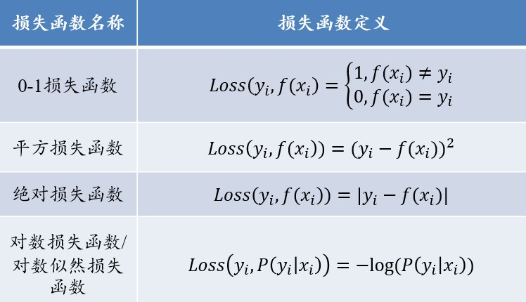
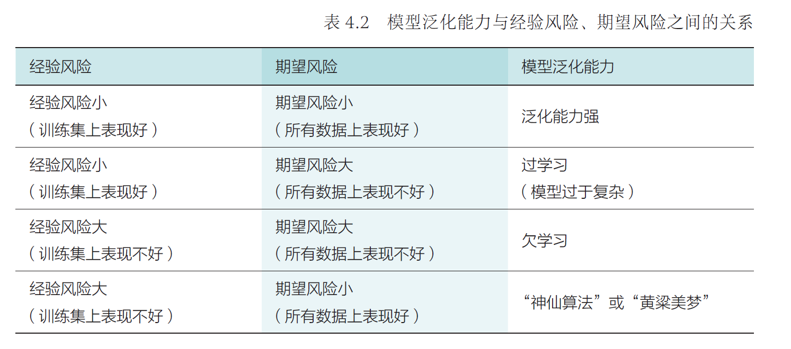
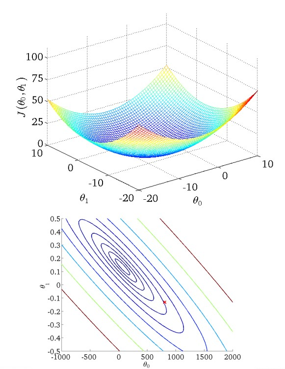
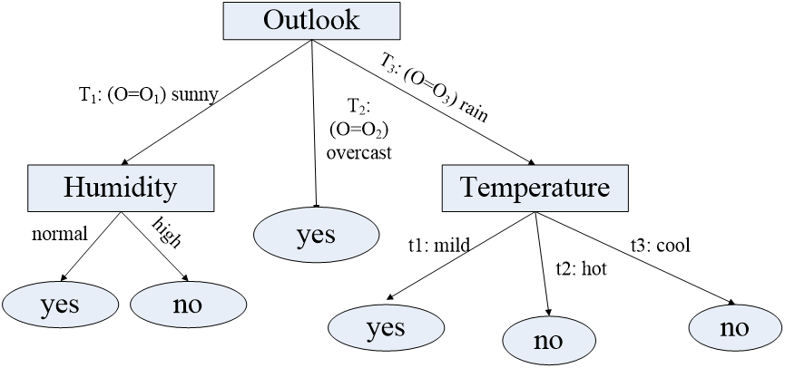
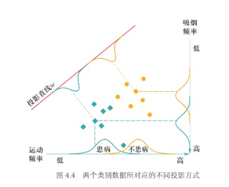
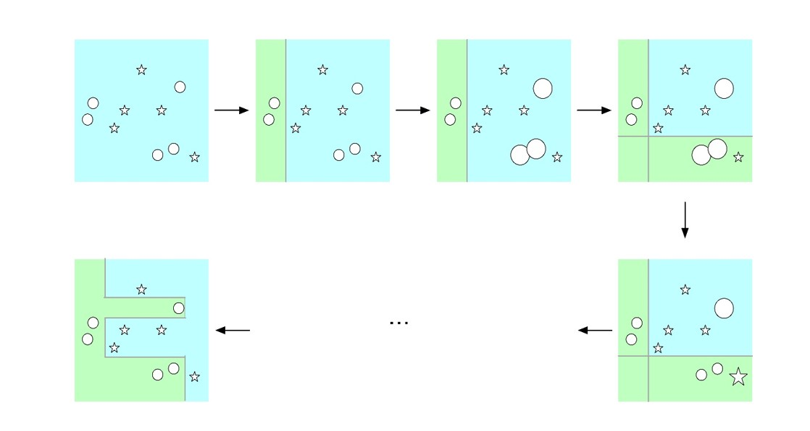
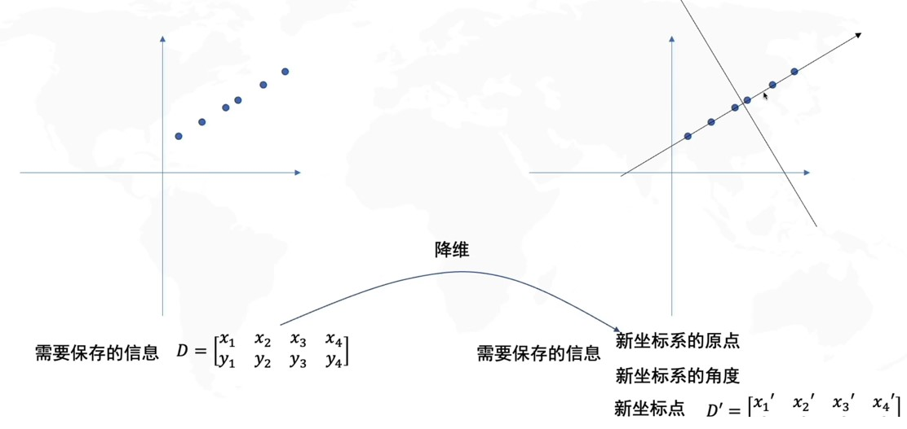
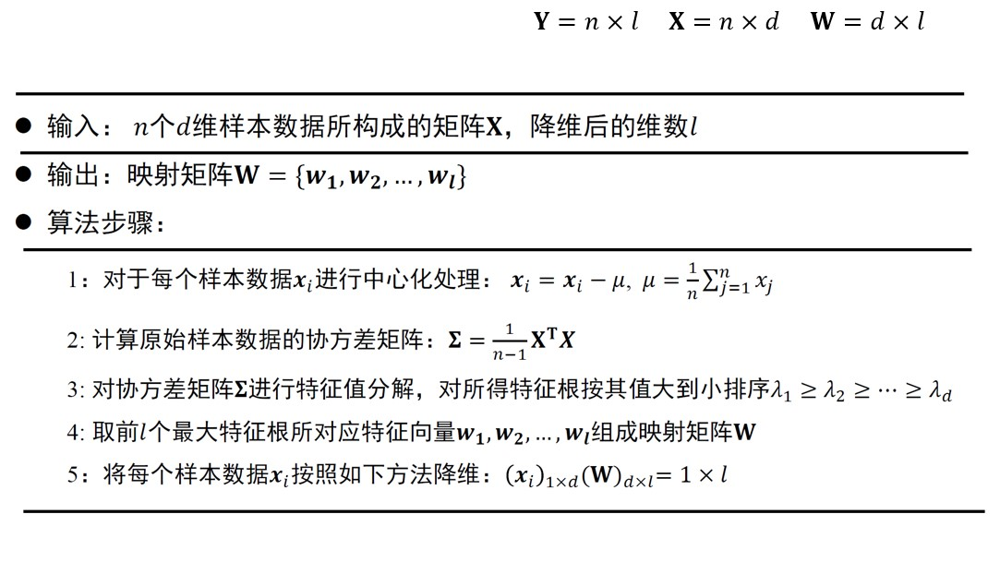
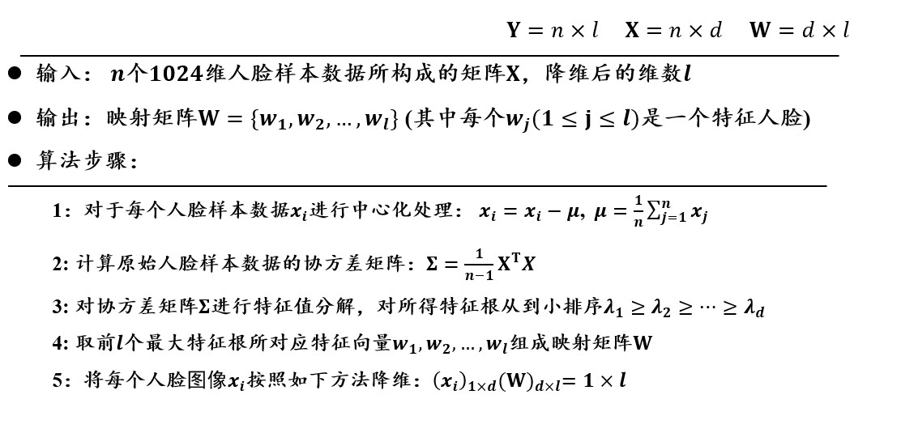

# Chapter3 机器学习

***

**机器学习的分类：**

* **监督学习：** 数据有标签，一般为回归或分类等任务
* **无监督学习：** 数据无标签，一般为聚类或降维等任务
* **强化学习：** 序列数据决策学习，一般从环境交互中学习

***

## 3.1 监督学习

### 监督学习的基本概念

训练集中一共有$n$个标注数据，第$i$个标注数据记为$(x_i,y_i)$，其中第$i$个样本数据为$x_i$，$y_i$是$x_i$的标注信息。

我们的目标是建立一个映射函数$f:x\mapsto y$，使得$f(x_i)$尽量等于$y_i$。

**损失函数：**

对于$x_i$，损失函数用于计算真实值$y_i$与预测值$f(x_i)$之间的差距，我们的目标是**使得损失函数总和尽可能小**。

**训练数据/测试数据/未知数据：**

用训练数据集学习映射函数$f$

用测试数据集测试映射函数$f$

用未知数据集使用映射函数$f$

**经验风险/期望风险：**

经验风险|期望风险
---|---
$\frac{1}{n}\sum\limits_{i=1}^nLoss(y_i,f(x_i))$|$\int_{x\times y}Loss(y,f(x))P(x,y)dxdy$
训练集中数据（有限）产生的平均损失|测试集中数据（无限）产生的联合分布期望损失
经验风险越小，说明学习模型对训练数据拟合程度越好|期望风险越小，说明学习模型越好

当训练数据数$n\rightarrow\infty$时，经验风险趋于期望风险。

**过学习/欠学习：**

**结构风险最小化：**

为了防止过学习，结构风险最小化在经验风险的基础上引入**正则项**或**惩罚项**来降低模型复杂度，既最小化经验风险，又力求降低模型复杂度，在二者间寻找平衡：

$$\frac{1}{n}\sum\limits_{i=1}^nLoss(y_i,f(x_i))+\lambda J(f)$$

其中，$J(f)$是正则化因子或惩罚项因子，$\lambda$是调整惩罚强度的系数。

**模型性能度量方法：**

以二分类问题为例，$n$为训练样例总数，正例总数为$P$，反例总数为$N$，真正例、假正例、真反例、假反例的数量分别为$TP$、$FP$、$TN$、$FN$。

* **准确率：$ACC=\frac{TP+TN}{P+N}$：** 若正负样本比例不均衡，则不是一个度量模型的好方法
* **错误率：$errorRate=\frac{FP+FN}{P+N}$：** 1-准确率
* **精确率：$precision=\frac{TP}{TP+FP}$：** 表示被模型预测为正例的样本中实际为正例的比例
* **召回率：$recall=\frac{TP}{TP+FN}$：** 表示所有正例样本中被模型预测为正例的比例
* **综合分类率：$F1score=\frac{2}{\frac{1}{precision}+\frac{1}{recall}}$：** 精确率和召回率的调和平均，在尽可能提高二者的同时减小差异

**判别模型：**

学习目标：映射函数$f$或者条件概率分布$P(Y|X)$

**生成模型：**

学习目标：联合概率分布$P(X,Y)$（通过似然概率$P(X|Y)$和类概率$P(Y)$的乘积来求取）

### 回归分析

分析不同变量之间存在关系的研究叫**回归分析**，刻画不同变量之间关系的模型被称为**回归模型**。

**单变量线性回归：**

符号表示：

* $m$：训练集样本数
* $x$：输入变量/特征
* $y$：输出变量/目标
* $(x_i,y_i)$：第$i$个训练样本
* $h$：解决方案/函数/假设

单变量线性回归分析即拟合一条直线：

$$h_\theta(x)=\theta_0+\theta_1(x)$$

使用误差平方和函数：

$$J(\theta_0,\theta_1)=\frac{1}{m}\sum\limits_{i=1}^m(h_\theta(x_i)-y_i)^2$$

作为回归问题的**代价函数**，来衡量预测值与真实值的接近程度。

我们的目标是**选择合适的$\theta_0$和$\theta_1$，使得$J(\theta_0,\theta_1)$最小化。**

**梯度下降算法：**

梯度下降算法是最常见的一种函数最小化算法。

优化思路：

* 设置一组初始的参数（比如说设置$\theta_0=\theta_1=0$），作为优化的起点
* 不断改变$\theta_0$，$\theta_1$，使$J(\theta_0,\theta_1)$减小，直到到达最小值，这里的实现思路是**选择该点处下降最快（最陡峭）的方向**：

$$\theta_0'=\theta_0-\alpha\frac{\partial}{\partial\theta_0}J(\theta_0,\theta_1)$$

$$\theta_1'=\theta_1-\alpha\frac{\partial}{\partial\theta_1}J(\theta_0,\theta_1)$$

$$\theta_0=\theta_0'$$

$$\theta_1=\theta_1'$$

!!! Note
    多个参数的更新应当同步进行。

$\alpha$为控制迈步大小的**正参数（学习率）**，偏导数为迈步的大小和方向。

即便学习率保持不变，梯度下降仍然能够收敛到局部最优（偏导数逐渐减小直到0）。

对于线性回归模型，只有一个全局最优点，因此不用担心陷入“局部”最优的问题，其局部最优即为全局最优。

批量梯度下降|随机梯度下降|小批量梯度下降
---|---|---
在梯度下降的每一步都使用训练集的全部样本|每次只使用一个样本|每次使用一部分样本
最精确，但样本数较大时速度慢|速度最快，但相对不精确|折中，在实际运用中最为常见

**最小二乘法：**

实际上即为针对于单变量线性回归的梯度下降算法，可简化为：求解方程组

$$\begin{cases}
    \frac{\partial J(\theta_0,\theta_1)}{\partial\theta_0}=0\\\
    \frac{\partial J(\theta_0,\theta_1)}{\partial\theta_1}=0
\end{cases}$$

**逻辑回归：**

若要研究某一事件发生的概率与若干因素之间的关系，这种情况下不适合用线性回归模型，因为其对离群点非常敏感，导致模型建模不稳定，结果有偏。应当使用**逻辑回归模型**：

$$\ln\frac{p}{1-p}=\beta_0+\beta_1x_1+···+\beta_qx_q\Rightarrow p=\frac{1}{1+e^{-(\beta_0+\beta_1x_1+···+\beta_qx_q)}}$$

**优势比：$OR=\frac{p}{1-p}$**

函数性质：单调递增，值域为$(0,1)$，当输入$x=[x_1,···,x_q]$趋于一定数值后，输出$p$无限逼近1或0，当$z=\beta_0+\beta^Tx=0$时，输出$p$为0.5。

!!! Note
    单纯的逻辑回归模型只能解决二分类问题。

### 决策树

**决策树**是一种通过树形结构进行分类的监督学习方法，每个非叶子节点表示对分类目标在某个属性上的一个判断，每个叶子节点表示一种分类结果，因此决策树可以看作一系列以叶子节点为输出的决策规则。

建立决策树的过程，就是不断选择属性值对样本集进行划分，直至每个子样本集为同一类别的过程。要解决的问题有：

* 收集属性完全且分类好的数据
* 确定用于分类的属性
* 选择最佳的分类原则
* 设计分类停止条件  
  
    * 节点包含的数据太少不足以分裂
    * 继续分裂数据集对树生成的目标(例如ID3中的熵下降准则)没有贡献
    * 树的深度过大不宜再分

通用的决策树分裂目标是**使整棵树的熵总量最小**。

**信息熵：**

**信息熵**是一种衡量集合纯度的指标。信息熵越大，说明属性分配越平均，集合的不确定度大，纯度低，不具有鉴别度；信息熵越小，说明属性分配越一致，集合的不确定度小，纯度高，具有鉴别度。

给定一个集合$S$，其中的样本最终被分类为$y_1,y_2,···,y_n$，比例依次为$p_1,p_2,···,p_n$，则$S$的信息熵为

$$E(S)=-\sum\limits_{i=1}^np_i\log_2p_i$$

**信息增益：**

**信息增益**是衡量集合纯度增大程度（集合不确定性减少程度）的指标，作为决策树分支属性选择的依据。

给定一个集合$S$，其依据属性$A$分类得到集合$S_1,S_2,···,S_m$，则$S$中属性$A$的信息增益为

$$G(S,A)=E(S)-E(A)=E(S)-\sum\limits_{i=1}^{m}\frac{|S_i|}{|S|}E(S_i)$$

**ID3算法流程：**

* 计算当前的信息熵
* 考察任一属性，分成若干子集
* 每个子集计算信息熵，然后计算得到每个属性的信息增益
* 从所有属性中选择信息增益最大的属性作为当前决策

!!! Example
      
    **根据天气的四个属性，使用ID3算法，构建决策树。**  

    记“适合打网球”为“正例”，“不适合打网球”为“反例”  
    初始状态下，14个实例中有9个正例5个反例  
    $E(Initial)=-(\frac{9}{14}\log_2\frac{9}{14}+\frac{5}{14}\log_2\frac{5}{14})=0.940$  
    若选择Outlook为下一步的分类属性，则分成Sunny（2正3负），Overcast（4正0负），Rain（3正2负）  
    $E(A)=-\frac{5}{14}(\frac{2}{5}\log_2\frac{2}{5}+\frac{3}{5}\log_2\frac{3}{5})-\frac{4}{15}(\frac{4}{4}\log_2\frac{4}{4}+\frac{0}{4}\log_2\frac{0}{4})-\frac{5}{15}(\frac{3}{5}\log_2\frac{3}{5}+\frac{2}{5}\log_2\frac{2}{5})=0.694$  
    因此，这种划分的信息增益是  
    $G(Initial,Outlook)=0.940-0.694=0.246$  
    同理  
    $G(Initial,Temperature)=0.029$  
    $G(Initial,Humidity)=0.151$  
    $G(Initial,Wind)=0.048$  
    Outlook属性的增益值最大，因此以其作为分类依据，分得三个子集，生成三个子节点  
    对每个子节点递归采用上述过程，直至每个节点都成为叶子节点  
      

**存在问题：**

若把“编号”也作为一个候选划分属性，则其信息增益一般远大于其他属性，这时容易导致模型过拟合，即**信息增益对可取值数目较多的属性有所偏好。**

**增益率：**

增益率的核心思想是对分支过多进行惩罚，除了计算属性划分后的信息增益以外，还要计算划分行为本身带来的信息。

$$GainRatio(S,A)=\frac{Gain(S,A)}{-\sum\limits_{i=1}^m\frac{|S_i|}{S}\log_2\frac{|S_i|}{S}}$$

相比于直接根据信息增益选择分类属性，更好的方式是**先在候选属性中找出信息增益高于平均水平的属性，再从中选取增益率最高的。**

**剪枝处理：**

* **预剪枝：** 对每个节点在划分前进行评估，若当前节点的划分不能带来决策树泛化性能提升，则停止划分并将当前节点记为叶节点，其类别标记为训练样例数最多的类别  
  
  * 优点：降低过拟合风险，减小时间开销
  * 缺点：有欠拟合风险

* **后剪枝：** 先从训练集生成一棵完整的决策树，然后自底向上地对非叶节点进行考察，若将该节点对应的子树替换为叶节点能带来决策树泛化性能提升，则将该子树替换为叶节点  
  
  * 优点：欠拟合风险小
  * 缺点：时间开销大

### 线性判别分析（LDA）

**LDA**是一种**基于监督学习的降维方法**，对于一组具有标签信息的高维数据样本，LDA利用其类别信息，将其线性投影到一个低维空间上，实现**类内间隔尽可能小，类间间隔尽可能大**。

**二分类问题：**

设样本集$D=\{(x_1,y_1),(x_2,y_2),···,(x_n,y_n)\}$，其中

$x_i\in R^d$，为第$i$个样本的$d$个属性组成的向量；

$y_i$为第$i$个样本的标签（最终分类结果），$y_i\in\{C_1,C_2\}$；

投影函数$y(x)=w^Tx$，将样本投影到一维空间，我们需要求的就是最佳的$w\in R^d$。

!!! Note
    这里的$x$和$w$均为列向量，即$d\times 1$。

!!! Tip "Proof"
    **第一步：分别计算两个类别一开始的均值向量**

    $$m_1=average(x_i),~y_i=C_1$$  

    $$m_2=average(x_i),~y_i=C_2$$

    **第二步：分别计算两个类别投影之后的协方差矩阵**

    $$s_1=\sum\limits_{y_i=C_1}(w^Tx_i-w^Tm_1)^2=w^T[\sum\limits_{y_i=C_1}(x_i-m_1)(x_i-m_1)^T]w=w^T\sum_1w$$

    $$s_2=\sum\limits_{y_i=C_2}(w^Tx_i-w^Tm_2)^2=w^T[\sum\limits_{y_i=C_2}(x_i-m_2)(x_i-m_2)^T]w=w^T\sum_2w$$

    其中，$w$未知，作为参数保留。
    $s_1$，$s_2$均为实数，可用来衡量同一类别中样本之间的分散程度，为了使类内间隔尽可能小，需要最小化$s_1+s_2$的取值。

    **第三步：构建需要最大化的目标函数**

    我们已知需要最小化$s_1+s_2$（类内间隔最小化），还需要最大化两个类别投影之后的均值向量之差（类间间隔最大化），因此，给出函数：

    $$J(w)=\frac{||w^Tm_1-w^Tm_2||^2}{s_1+s_2}$$

    我们的目的是找到$w$，使得$J(w)$取最大值。

    $$J(w)=\frac{||w^T(m_2-m_1)||^2}{w^T\sum_1w+w^T\sum_2w}=\frac{w^T(m_2-m_1)(m_2-m_1)^Tw}{w^T(\sum_1+\sum_2)w}=\frac{w^TS_bw}{w^TS_ww}$$

    $S_b=(m_2-m_1)(m_2-m_1)^T$称为**类间散度矩阵**，衡量两个类别均值点之间的分离程度；
    $S_w=\sum_1+\sum_2$称为**类内散度矩阵**，衡量每个类别中数据点的分离程度。

    **第四步：求$w$，使得$J(w)$取最大值**

    由于$J(w)$的分子和分母都是关于$w$的二项式，因此最后的解只与$w$的方向有关，与$w$的长度无关，因此可令分母$w^TS_ww=1$，然后用**拉格朗日乘子法**来求解这个问题。

    忽略中间过程，最后的结论为：

    $$w=S_w^{-1}(m_2-m_1)$$

**多分类问题：**

总类别数为$K$，需要从$n$维降到$r$维。

投影矩阵为$n\times r$矩阵

$$W=(w_1,w_2,···,w_r)$$

投影函数

$$y(x)=W^Tx$$

第$i$类样本投影之前的均值向量为$m_i$，所有样本投影之前的均值向量为$m$；第$i$类样本的总数为$N_i$，所有样本的总数为$N$。

类间散度矩阵

$$S_b=\sum\limits_{i=1}^K\frac{N_i}{N}(m_i-m)(m_i-m)^T$$

类内散度矩阵

$$S_w=\sum\limits_{i=1}^K\sum_i$$

其中

$$\sum_i=\sum\limits_{x\in class~i}(x-m_i)(x-m_i)^T$$

结论：所求投影矩阵$W$由$S_w^{-1}S_b$前$r$个最大特征值所对应的特征向量$(w_1,w_2,···,w_r)$组成。

### Ada Boosting算法

**Ada Boosting算法**通过**集成**手段来达到提升算法性能的目的。

**核心思想：**

对于一个复杂的分类任务，可以将其分解为若干子任务（**弱分类器**），然后将若干子任务完成方法综合，最终完成该复杂任务（**强分类器**）。

**核心问题：**

* **改变训练数据的权重：** 提高在上一轮中分类错误样本的权重
* **将一系列弱分类器组合成强分类器：** 通过加权来提高分类误差小的弱分类器的权重，让其在最终分类中起到更大作用

**算法描述：**

**第一步：初始化每个训练样本的权重**

假设有$N$个待分类的样本$(x_1,y_1),(x_2,y_2),···,(x_N,y_N)$，则每个样本的权重为$w_{1i}=\frac{1}{N}$，权重状态记为$D_1=(w_{11},w_{12},···,w_{1N})$。

**第二步：使用权重状态为$D_m$的训练数据来学习得到第$m$个弱分类器$G_m$，并计算其分类误差**

$$err_m=\sum\limits_{i=1}^Nw_{mi}I(G_m(x_i)\neq y_i)$$

当$G_m(x_i)\neq y_i$时$I$取1，否则取0。

**第三步：计算弱分类器$G_m$的权重**

$$\alpha_m=\frac{1}{2}\ln\frac{1-err_m}{err_m}$$

**第四步：更新训练数据的分布权重**

$$w_{m+1,i}=\begin{cases}
    \frac{w_{mi}}{Z_m}e^{-\alpha_m},G_m(x_i)=y_i\\\
    \frac{w_{mi}}{Z_m}e^{\alpha_m},G_m(x_i)\neq y_i\\
\end{cases}$$

$Z_m$为归一化因子。

可见，如果某个样本无法被第$m$个弱分类器分类成功，则需要增大该样本权重，否则减少该样本权重。这样，被错误分类样本会在训练第$m+1$个弱分类器时被重点关注。

在每一轮学习过程中，Ada Boosting算法均在**划重点**（重视当前尚未被正确分类的样本）。

**第五步：线性加权组合弱分类器得到强分类器**

$$f(x)=\sum\limits_{i=1}^M\alpha_mG_m(x)$$

$$G(x)=sign(f(x))$$

将样本分为$+1$和$-1$。

***

## 3.2 无监督学习

### 无监督学习的基本概念

寻找数据中存在的结构和模式。

**重要因素：**

* **数据特征**
* **相似度函数：** 基于所提取的特征来计算数据之间的相似性

### K均值聚类（K-means）

**K均值聚类**的目的在于将数据依据其特征聚类到不同的集合，**最小化类内距离，最大化类间距离**。

K均值聚类要求特征变量连续，数据没有异常值。其找到的是一个局部最优，但不能保证找到全局最优。其同时也是一个容易受到初始值影响的迭代算法。

输入：$n$个数据（只有特征，没有标签），$x_i=(x_{i1},x_{i2},···,x_{im})$

输出：$K$个集合

**第一步：随机初始化$K$个聚类质心$C=\{c_1,c_2,···,c_K\}$**

每个聚类质心$c_j$所对应的集合为$G_j$。

**第二步：将每个待聚类的数据放入唯一一个聚类集合中**

计算数据$x_i$和质心$c_j$之间的距离

$$d(x_i,c_j)=\sqrt{\sum\limits_{k=1}^m(x_{ik}-c_{jk})^2}$$

计算完与所有质心的距离之后，将$x_i$放入与之距离最近的质心所对应的集合。

**第三步：根据聚类结果，更新质心**

设聚类集合$G_j$的元素数量为$|G_j|$。

其质心更新后为

$$c_j=\frac{1}{|G_j|}\sum\limits_{x_i\in G_j}x_i$$

**第四步：算法循环迭代，直到满足条件**

* 到达迭代次数上限
* 前后两次迭代中，聚类质心基本不变

**缺点：**

* 需要事先确定聚类数目$K$
* 初始化聚类质心对结果影响较大
* 迭代的时间开销较大
* 欧氏距离假设数据每个维度（特征）的重要性是一样的
* 对数据的尺度敏感，例如长度特征的以米还是厘米为单位会对最后的结果有影响
* 对于位于聚类边缘的点的判定过于绝对

### 主成分分析（PCA）

**PCA**是一种**基于非监督学习的降维方法**，通过分析找到数据特征的主要成分，使用这些主要成分来代替原始数据，降维后的结果保持原始数据固有结构，或者说最大限度保持原始高维数据的总体方差结构，**把每个样本当作一个类，最大化类间间隔（方差）。**

!!! Example
    

    如上图所示，原本的数据有两个特征（$x$和$y$），但我们显然能发现这两个特征是有关联的，因此我们通过主成分分析进行降维，得到主要成分（$z$），用$z$替代$x$和$y$，依然能够保持数据之间的差异性（离散程度），但由于维度的降低，分析起来更加方便。

对向量形式的数据要进行的根本操作：

* **找新的坐标原点**
  求所有数据的中心坐标
* **找新的坐标系（方差最大的地方）**
  依靠协方差矩阵来求转过的角度

**算法动机：**

* 将$d$维特征数据映射到$l$维空间，去除原始数据之间的冗余性
* 将原始数据向这些数据方差最大的方向进行投影。一旦发现了方差最大的投影方向，则继续寻找保持方差第二的方向且进行投影（保证方向的正交性）
* 每个数据所得到最好的$l$维特征就是使得每一维上样本方差都尽可能大

**算法描述：**

在主成分分析中，最优化的方差等于原始样本数据$X$的协方差矩阵$\Sigma$的特征值之和。为了使方差最大，可以求出协方差矩阵$\Sigma$的特征向量和特征值，然后取前$l$个最大特征值所对应的特征向量组成映射矩阵$W$即可。

**降维后维数$l$的确定：**

当我们不知道降维到多少维合适时，我们可以定义一个比重阈值$\alpha\in(0,1]$，只要$l$满足：

$$\frac{\sum\limits_{i=1}^l\lambda_i}{\sum\limits_{i=1}^d\lambda_i}\geqslant\alpha$$

则降维后的数据包含的信息已经达到了一定的占比，我们可以认为此时的$l$是合适的。

**线性判别分析和主成分分析的差异：**

### 特征人脸方法

特征人脸方法是一种应用**主成分分析**来实现人脸图像降维的方法，其本质是用**一种称为特征人脸的特征向量按照线性组合形式**来表达每一张原始人脸图像，进而实现人脸识别。

假设一张图像的分辨率为$32\times 32=1024$，每个像素包含一个灰度数值，则可以获得一个1024维的列向量。

但由于人脸具有一定的拓扑结构，像素点之间有较强的空间关系，因此可以使用一个低维向量来表达原始图像大部分的信息，这就是要使用主成分分析的原因。

**算法描述：**

**具象解释：**

每个人脸特征向量$w_i$与原始人脸数据$x_i$的维数是一样的，均为1024。可将每个特征向量还原为$32\times 32$的特征人脸，一共$l$个。

将每幅人脸分别与每个特征人脸做矩阵乘法，得到一个相关系数，一共得到$l$个相关系数。

每幅人脸是所有特征人脸的线性组合（系数即为上述）。

在后续人脸识别分类中，就使用这$l$个系数来表示原始人脸图像。计算两张人脸是否相似时，不是去计算两个$32\times 32$矩阵是否相似，而是去计算两个人脸所对应的$l$个系数是否相似。

**缺点：**

主成分分析生成的特征人脸只能提取原始图像中存在的全局信息，而无法提取局部信息。