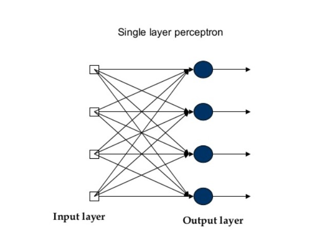
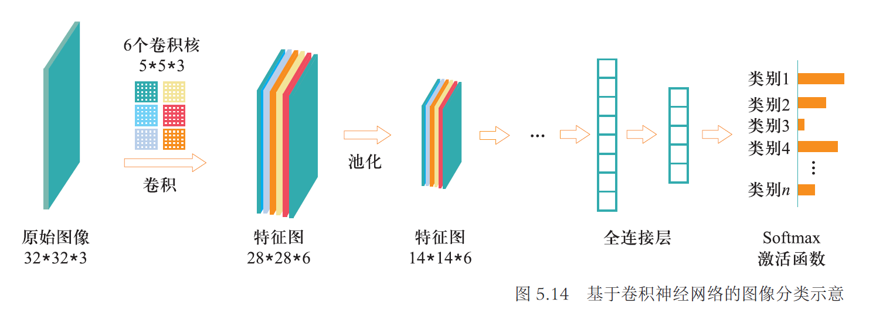
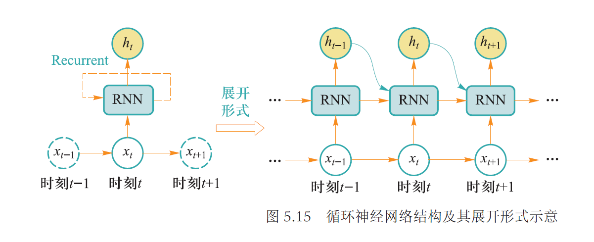
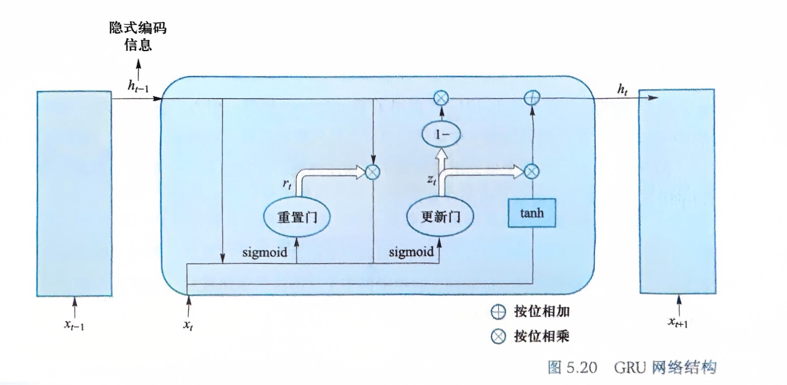

# Chapter4 深度学习

***

## 4.1 前馈神经网络

### 前馈神经网络

**MCP模型：**

**MCP模型**是最早的神经网络雏形，也是人工神经网络中最基本的结构。给定$n$个二值化的输入数据$x_i$和相应的权重$w_i$，MCP神经元模型对输入数据**线性加权求和**，然后使用函数$\phi$将加权求和结果**非线性映射**，结果根据阈值$\theta$二分为0或1，以完成二分类的任务，即

$$y=\phi(\sum\limits_{i=1}^nw_ix_i)$$

MCP模型模拟的是一个**神经元**，如果线性加权累加结果大于阈值$\theta$，则神经元处于兴奋状态，向后传递1的信息；否则神经元处于抑制状态而不向后传递信息。神经元是深度学习模型中的基本单位。

**激活函数：**

神经网络多以**激活函数**来实现单个神经元的**非线性映射变换**，通过对多个非线性函数进行组合，来实现对输入信息的非线性变换。在MCP模型中即为$\Phi$。

!!! Note
    激活函数必须是连续可导的。

!!! Note
    sigmoid函数和tanh函数都会面临梯度消失问题，但relu函数不会。

**特殊的激活函数：softmax**

$$softmax(x_i)=\frac{e^{x_i}}{\sum\limits_{j=1}^ke^{x_j}}$$

softmax函数一般用于**多分类问题**中，其反映的是**将输入数据$x_i$映射到第$i$个类别的概率**。

由于softmax输出结果的值累加起来为1，因此可将输出概率最大的作为分类目标。

!!! Example
      
    给定某个输入数据，可得到三个初始分类结果$x_1=4$，$x_2=1$，$x_3=-4$。通过softmax函数得到输入数据分别以95.25%，4.71%，0.04%的概率归属于类别1，类别2，类别3。基于这样的概率值，可判断输入数据属于第一类。

**（单层）感知机：**

一种简单的人工智能网络，单层感知机可以看作多个MCP模型的结合，仅由一个输入层和一个输出层构成，但二者仍有不同之处：

* 单层感知机在加权求和时还会加上一个**偏置项**
* 单层感知机的权重并不是预先设置好的，而是通过多次迭代训练得到的，利用了**损失函数**进行优化

即感知机引入了**学习**的概念。

但是，单层感知机只能区分线性可分数据，对于XOR这类非线性可分的逻辑函数，单层感知机无法模拟其功能。

**前馈神经网络：**

实际上就是多层感知机，其包括**输入层**，**输出层**和**隐藏层**，每个节点表示一个神经元。

* 每个神经元只接受前一级的输入，只输出到下一级，没有反馈
* 层与层之间是**全连接**的，即相邻层之间的神经元完全成对连接，但层内的神经元不相互连接

前馈神经网络可以模拟复杂非线性函数的功能，所模拟函数的复杂性取决于隐藏层的数目和各层中神经元的数目。

### 误差反向传播算法（BP）

**损失函数：**

**损失函数**又称为**代价函数**，用于计算模型预测值与真实值之间的误差。有两种常用的损失函数：**均方误差损失函数**和**交叉熵损失函数**。

!!! Example
      
    设数据$x$属于类别1，一共有三个类别，因此$y=(y_1,y_2,y_3)=(1,0,0)$为$x$的实际分布概率，预测分布概率为$\hat{y}=(\hat{y_1},\hat{y_2},\hat{y_3})$，因此希望$\hat{y_1}$远大于$\hat{y_2}$和$\hat{y_3}$。

1.均方误差损失函数：

$$MSE=\frac{1}{n}\sum\limits_{i=1}^n(y_i-\hat{y_i})^2$$

其中，训练数据$x_i$对应的真实输出为$y_i$，模型的预测值为$\hat{y_i}$。

2.交叉熵损失函数：

$$H(p,q)=-\sum\limits_{i=1}^np(x_i)\log q(x_i)$$

其中，$p$是样本的真实概率分布，$q$是模型预测的概率分布，交叉熵越小，$p$和$q$的分布越接近，预测概率和实际概率的差距越小。

!!! Example
    
    模型1在三个样本上的交叉熵平均值：  
    $\frac{-(0\times \log 0.3+0\times\log 0.3+1\times\log 0.4)-(0\times \log 0.3+1\times\log 0.4+0\times\log 0.3)-(1\times \log 0.1+0\times\log 0.2+0\times\log 0.7)}{3}\approx 1.38$  
    模型2在三个样本上的交叉熵平均值：  
    $\frac{-(0\times \log 0.1+0\times\log 0.2+1\times\log 0.7)-(0\times \log 0.1+1\times\log 0.7+0\times\log 0.2)-(1\times \log 0.3+0\times\log 0.4+0\times\log 0.3)}{3}\approx 0.64$  
    模型2预测性能优于模型1预测性能。

**梯度下降：**

在多元函数中，某一点的梯度是对每一变量所求导数组成的向量，其方向为函数在该点增加最快的方向，梯度大小为多元函数在该点的最大变化率。

梯度的反方向是损失函数值下降最快的方向，因此是损失函数求解的方向。

**误差反向传播算法：**

**误差反向传播算法**是一种将输出层误差反向传播给隐藏层进行参数更新的方法，将误差**从后向前传递**，分摊给各层所有单元，从而获得各层单元所产生的误差，进而依据这个误差来让各层单元负起各自责任，修正各单元参数。

为了使损失函数$L$减小，需要求$L$对于$w_1$的偏导，然后按照损失函数梯度的反方向选取一个微小的增量，来调整$w_1$的取值

$$w_1^{new}=w_1-\eta\times\frac{\partial L}{\partial w_1}$$

$$\frac{\partial L}{\partial w_1}=\frac{\partial L}{\partial O}\frac{\partial O}{\partial \chi}\frac{\partial \chi}{\partial w_1}$$

链式求导实现了损失函数对某个自变量求偏导，好比将损失误差从输出端项输入端逐层传播，通过这个传播过程来更新自变量取值。

!!! Example
     
    **给定一个包含输入层、一层隐藏层和输出层的前馈神经网络，完成三分类问题。对于输入数据$(x_1,x_2,x_3)$，$y_1$，$y_2$，$y_3$只有一个取1，其余两个取0，激活函数为Sigmoid函数。求$w_7$的偏导。**  

    以下为每个中间神经元承担的任务：  
      
    损失函数
    $$L=\frac{1}{3}\sum\limits_{i=1}^3(\hat{y_i}-y_i)^2$$
    $L$对$w_7$的偏导  
    $$\delta_7=\frac{\partial L}{\partial w_7}=\frac{\partial L}{\partial \hat{y_1}}\frac{\partial \hat{y_1}}{\partial in_{o_1}}\frac{\partial in_{o_1}}{\partial w_7}$$  
    其中  
    $$\frac{\partial L}{\partial \hat{y_1}}=\frac{2}{3}(\hat{y_1}-y_1)$$
    $$\frac{\partial \hat{y_1}}{\partial in_{o_1}}=\hat{y_1}(1-\hat{y_1})$$
    $$\frac{\partial in_{o_1}}{\partial w_7}=out_{h_1}$$

    **更复杂地，求$w_1$的偏导。**   

    $\delta_1=\frac{\partial L}{\partial w_1}$  
    $=\frac{\partial L}{\partial \hat{y_1}}\frac{\hat{y_1}}{w_1}+\frac{\partial L}{\partial \hat{y_2}}\frac{\hat{y_2}}{w_1}+\frac{\partial L}{\partial \hat{y_3}}\frac{\hat{y_3}}{w_1}$  
    $=\frac{\partial L}{\partial\hat{y_1}}\frac{\partial\hat{y_1}}{\partial in_{o1}}\frac{\partial in_{o1}}{\partial out_{h1}}\frac{\partial out_{h1}}{\partial in_{h1}}\frac{\partial in_{h1}}{\partial w_1}+\frac{\partial L}{\partial\hat{y_2}}\frac{\partial\hat{y_2}}{\partial in_{o2}}\frac{\partial in_{o2}}{\partial out_{h1}}\frac{\partial out_{h1}}{\partial in_{h1}}\frac{\partial in_{h1}}{\partial w_1}+\frac{\partial L}{\partial\hat{y_3}}\frac{\partial\hat{y_3}}{\partial in_{o3}}\frac{\partial in_{o3}}{\partial out_{h1}}\frac{\partial out_{h1}}{\partial in_{h1}}\frac{\partial in_{h1}}{\partial w_1}$  
    $=(\frac{\partial L}{\partial\hat{y_1}}\frac{\partial\hat{y_1}}{\partial in_{o1}}\frac{\partial in_{o1}}{\partial out_{h1}}+\frac{\partial L}{\partial\hat{y_2}}\frac{\partial\hat{y_2}}{\partial in_{o2}}\frac{\partial in_{o2}}{\partial out_{h1}}+\frac{\partial L}{\partial\hat{y_3}}\frac{\partial\hat{y_3}}{\partial in_{o3}}\frac{\partial in_{o3}}{\partial out_{h1}})\frac{\partial out_{h1}}{\partial in_{h1}}\frac{\partial in_{h1}}{\partial w_1}$  
    $=(\delta_7+\delta_8+\delta_9)\frac{\partial out_{h1}}{\partial in_{h1}}\frac{\partial in_{h1}}{\partial w_1}$  

***

## 4.2 卷积神经网络

### 卷积

图像中像素点具有很强的空间依赖性，**卷积**就是针对像素点的空间依赖性来对图像进行处理的一种技术。

**卷积核：**

卷积核是一个二维矩阵，矩阵中的数值为进行卷积计算时所采用的权重，通过**数据驱动机制**学习得到。

图像经过特定的卷积核滤波后，所得到的卷积结果可认为是保留了像点所构成的特定空间分布模式，称为**特征图**。

如果卷积核中心位置的权重系数越小且与其它卷积权重系数差别越小，则卷积所得到图像滤波结果越模糊，这被称为**图像平滑操作**。

由于无法以被卷积图像边界的像素点为中心形成卷积核大小的图像子块区域，因此边界像素点无法参与卷积运算。由于参与像素点的减少，图像的分辨率逐渐降低，层层抽象，层层约减，称为**下采样操作**。

**填充：**

为了使边缘位置的图像像素点也能参与卷积运算，**填充**技术在边缘像素点周围填充0，形成与卷积核同样大小的图像子块区域。在这种情况下，卷积后的图像分辨率不变，不存在下采样。

**步长：**

表示卷积核每次移动经过的像素点，增大步长可以跳过更多的像素点。

**感受野：**

卷积所得结果中，每个输出点的取值仅依赖于其在输入图像中该点及其邻域区域点的取值，与这个区域之外的其他点取值均无关，该区域被称为**感受野**。

在卷积神经网络中，感受野是卷积神经网络每一层输出的**特征图**上的像素点在输入图像上映射的区域大小。也就是说，感受野是特征图上一个点对应输入图像上的区域。

人的视觉神经细胞对不同的视觉模式具有**特征选择性**，即不同视觉神经细胞对边界、运动和颜色等不同信息具有强弱不同的选择性。因此，不同卷积核可被用来刻画视觉神经细胞对外界信息感受时的不同选择性。

假设被卷积图像的大小为$w\times w$，卷积核大小为$F\times F$，上下左右四个边缘填充像素行/列数为$P=[\frac{F}{2}]$，步长为$S$，则被卷积结果的分辨率为

$$\frac{w-F+2P}{S}+1$$

### 池化

在图像处理中，可用某一区域子块的统计信息（如最大值或均值等）来刻画该区域中所有像素点呈现的空间分布模式，以替代区域子块中所有像素点取值，即为**池化**。

对输入的特征图进行**下采样**，以获得最主要的信息。

### 卷积神经网络

对于输入的海量标注数据，通过多次迭代训练，卷积神经网络在若干次卷积操作，池化操作和激活函数操作下，最后通过全连接层来学习得到输入数据的特征表达，即**分布式向量表达**。

* 卷积层负责提取图像中的局部特征
* 池化层用来大幅降低参数量级(降维)
* 激活函数层负责非线性化
* 全连接层类似传统神经网络的部分，用来输出想要的结果（总结）

一个卷积神经网络需要学习的参数：卷积核、全连接层权重，激活函数参数。

卷积操作利用了图像像素点之间存在的空间局部依赖性，使得卷积操作可捕获图像局部特征，但是无法明了图像全局特征。在一系列卷积操作后，使用全连接层可将不同的局部特征进行组合，完成对全局特征的挖掘。

!!! Note
    全连接计算可等效为卷积核为1×1的卷积运算。

### 正则化

用来提高神经网络的泛化能力，**缓解过拟合问题**。

**Dropout：**

在训练神经网络过程中，每次参数更新时随机丢掉一部分神经元来减少神经网络复杂度，防止过拟合。

**批归一化：**

随着神经网络深度的增加，输入数据经过激活函数若干次非线性变换后，整体分布逐渐向非线性函数的值域两端偏移。

批归一化通过规范化的手段，把神经网络每层中任意神经元的输入值分布改变到均值为0、方差为1的**标准正态分布**。经过批归一化处理，激活函数的输入值被映射到非线性函数梯度较大的区域，使得梯度变大，从而克服梯度消失问题，加快收敛速度。

**L1-Norm & L2-Norm：**

L1范数为模型参数中各个元素的绝对值之和。

L2范数为模型参数中各个元素的平方和的开方。

两种范数通过在损失函数中添加额外的惩罚项来防止过拟合。

***

## 4.3 循环神经网络

**循环神经网络**是一类处理**序列数据**（如文本句子、视频帧等具有前后依赖关系的数据）时所采用的网络结构，其本质是希望**模拟人所具有的记忆能力**，在学习过程中记住部分已经出现的信息，并利用所记住的信息影响后续结点输出。

### 循环神经网络模型

在每一时刻$t$，循环神经网络单元会读取当前输入数据$x_t$和前一时刻输入数据$x_{t-1}$所对应的隐式编码结果$h_{t-1}$，一起生成$t$时刻的隐式编码结果$h_t$。接着将$h_t$后传，去参与生成$t+1$时刻输入数据$x_{t+1}$的隐式编码$h_{t+1}$。

$$h_t=\Phi(Ux_t+Wh_{t-1})$$

其中，$\Phi$是激活函数（一般为Sigmoid函数或者Tanh函数），$U$和$W$为模型参数。通过上式的不断展开，可以发现$h_t$与$h_{t-1},h_{t-2},···,h_1$都有关，体现了记忆的功能。

将循环神经网络展开后可以得到一个和前馈神经网络相似的网络结构，可利用误差反向传播算法和梯度下降算法来训练模型参数，这种训练方法称为**沿时间反向传播算法**。由于循环神经网络每个时刻都有一个输出，因此在计算损失时，通常需要将所有时刻（或部分时刻）的损失进行累加。

**循环神经网络分类：**

* **多对多：** 多个输入$x_1,x_2,···,x_n$，通过循环神经网络得到多个隐式编码$h_1,h_2,···,h_n$，再将$h_n$作为另一个循环神经网络的第一个输入，得到多个输出$y_1,y_2,···,y_n$
* **多对一：** 前一部分和多对多一样，但得到$h_n$后直接映射到一个输出$y_1$
* **一对多：** 单个输入$x$直接映射到$y$，然后将$y$作为输入，后半部分和多对多一样

**梯度传递：**

以词性标注为例。输入单词序列$x_1,x_2,···,x_T$，在时刻$t$，输入单词$x_t$，参数$W_x$将$x_t$映射为隐式编码$h_t$，参数$W_o$将$h_t$映射为预测输出$O_t$，$h_{t-1}$通过参数$W_h$参与$h_t$的生成。

假设时刻$t$的隐式编码为

$$h_t=tanh(W_xx_t+W_hh_{t-1}+b)$$

使用交叉熵损失函数来计算时刻$t$预测输出与实际输出的误差$E_t$，整个序列产生的误差为

$$E=\frac{1}{2}\sum\limits_{t=1}^TE_t$$

若要根据时刻$t$所得误差更新参数$W_x$，则

$$\frac{\partial E_t}{\partial W_x}=\sum\limits_{i=1}^t\frac{\partial E_t}{\partial O_t}\frac{\partial O_t}{\partial h_t}(\prod\limits_{j=i+1}^t\frac{\partial h_j}{\partial h_{j-1}})\frac{\partial h_i}{\partial W_x}$$

对于过长的序列，容易引发**梯度消失问题**。

### 长短时记忆网络（LSTM）

为了应对梯度消失问题，**长短时记忆网络（LSTM）**引入了**内部记忆单元**和**门**两种结构。

**门：**

* **输入门：** 控制有多少信息流入当前时刻内部记忆单元
* **遗忘门：** 控制上一时刻内部记忆单元中有多少信息可累积到当前时刻内部记忆单元
* **输出门**

**符号含义：**

符号|含义
---|---
$x_t$|时刻$t$的输入数据
$i_t$|输入门的输出：$i_t=sigmoid(W_{xi}x_t+W_{hi}h_{t-1}+b_i)$
$f_t$|遗忘门的输出：$f_t=sigmoid(W_{xf}x_t+W_{hf}h_{t-1}+b_f)$
$o_t$|输出门的输出：$o_t=sigmoid(W_{xo}x_t+W_{ho}h_{t-1}+b_o)$
$c_t$|内部记忆单元的输出：$c_t=f_t\odot c_{t-1}+i_t\odot tanh(W_{xc}x_t+W_{hc}h_{t-1}+b_c)$
$h_t$|时刻$t$输入数据的隐式编码：$h_t=o_t\odot tanh(c_t)$

!!! Note
    $\odot$表示向量中对应元素按位相乘。

!!! Note
    在内部记忆单元和隐式编码中，使用tanh函数而不是继续使用sigmoid函数，是因为tanh函数的值域为$(-1,1)$，使得tanh函数在进行信息整合的时候可以起到信息增减的效果。

内部记忆单元信息$c_t$好比人脑的长时记忆，隐式编码$h_t$代表了短时记忆。

### 门控循环单元（GRU）

**GRU**是一种对LSTM简化的深度学习模型。与LSTM相比，其不再使用记忆单元来传递信息，仅使用**隐藏状态**来进行信息的传递。因此，相比LSTM，GRU有更快的计算速度。

**更新门**信息输出：

$$z_t=sigmoid(W_zx_t+U_zh_{t-1}+b_z)$$

**重置门**信息输出：

$$r_t=sigmoid(W_rx_t+U_rh_{t-1}+b_r)$$

**隐式编码**输出：

$$h_t=(1-z_t)\odot h_{t-1}+z_t\odot tanh(W_hx_t+U_r(r_t\odot h_{t-1})+b_h)$$

更新门类似于LSTM中的遗忘门和输入门，其决定要添加哪些信息和忘记哪些信息，即控制前一时刻的状态信息被保留到当前状态中的程度。更新门的值越大，说明前一时刻的状态信息保留越多。

重置门用于控制忽略前一时刻的状态信息的程度。重置门的值越小，说明信息可通过的程度越低，信息被忽略得越多。