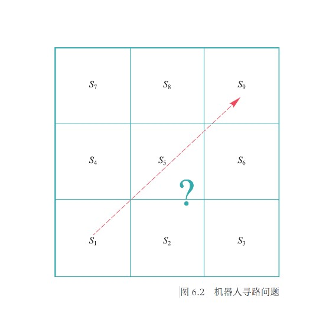
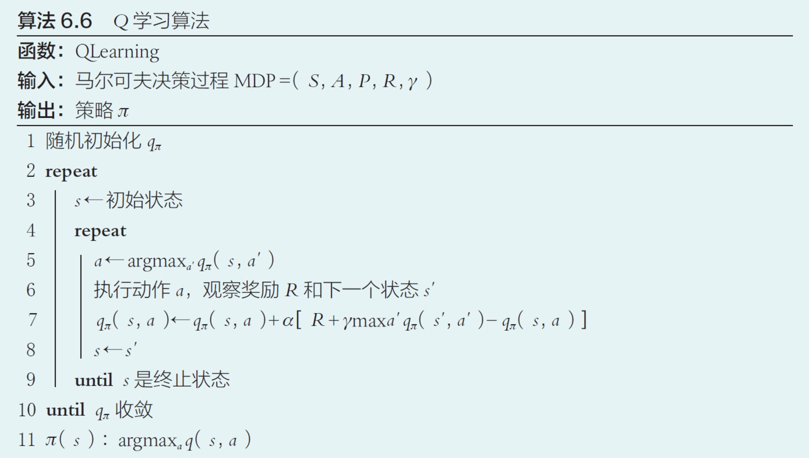

# Chapter5 强化学习

***

## 5.1 强化学习的基本概念

### 强化学习的基本概念

**强化学习**是智能体在与环境交互中学习能帮助其获得最大化奖励这一策略的过程。在每一次迭代中，智能体根据当前策略选择一个动作，该动作影响环境，导致环境发生改变，智能体此时从环境得到状态变化和奖励反馈等信息，并根据这些反馈更新其内部策略。

**形式化描述：**

* **智能体：** 强化学习的主体与核心，做出判断与动作
* **环境：** 智能体以外的一切的统称，能与智能体交互
* **状态：** 智能体对环境的一种理解和编码，代表对智能体决策产生影响的信息
* **动作：** 智能体对环境产生影响的方式
* **策略：** 智能体当前状态下执行动作的依据
* **奖励：** 智能体采取动作后从环境获得的收益，一般正值代表实际奖励，负值代表实际惩罚

**特点：**

* 基于评估
* 交互性
* 序列决策

### 马尔可夫决策过程

!!! Example
    **让机器人向上或向右从$s_1$移动到$s_9$，不得越界。**
    

    智能体：迷宫机器人   
    环境：3×3的方格  
    状态：机器人在当前时刻所处方格，取值范围为$\\{s_1,···,s_9,s_d\\}$，$s_d$表示出界状态  
    动作：向上或向右移动一个方格  
    奖励：到达$s_9$的正奖励和越界的负奖励，其他时刻不被奖赏也不被惩罚  

**离散随机过程：**

一个随机过程实际上是一列随时间变化的随机变量，其中当时间是离散量时，一个随机过程可以表示为$\\{S_0,S_1,S_2,···\\}$，其中每个$S_t$都是一个随机变量，这被称为**离散随机过程**。

**离散马尔可夫过程：**

满足**马尔科夫性**（即$S_{t+1}$只与$S_t$相关）的离散随机过程称为**离散马尔可夫过程（马尔科夫链）**。

!!! Success "definition"
    **马尔可夫性：** 下一时刻的状态$S_{t+1}$只由当前状态$S_t$决定。  
    $$P(S_{t+1}=s_{t+1}|S_0=s_0,S_1=s_1,···,S_t=s_t)=P(S_{t+1}=s_{t+1}|S_t=s_t)$$

现在回到这个问题。

**随机变量序列：**

$$\\{S_0,S_1,S_2,···\\}$$

表示机器人的移动过程，$S_t$表示机器人第$t$步所处方格位置，取值范围为$S=\\{s_1,s_2,···,s_9,s_d\\}$，称为**状态集合**。

**状态转移概率：**

$$P(S_{t+1}|S_t)$$

满足马尔可夫性。

**奖励函数：**

$$R(S_t,S_{t+1})$$

表示从第$t$步状态到第$t+1$步状态所获得的奖励，简记为$R_{t+1}$。在机器人寻路问题中，当$S_{t+1}=s_9$时奖励值为1，当$S_{t+1}=s_d$时奖励值为-1，其余情况为0。

**回报（反馈）：**

$$G_t=R_{t+1}+\gamma R_{t+2}+\gamma^2R_{t+3}+···$$

其中，$\gamma\in[0,1]$为**折扣因子（衰退系数）**。

回报反映了某个时刻后所得到累加奖励，当折扣因子小于1时，越是遥远的未来对累加回报的贡献越少。

**马尔可夫奖励过程（MRP）：**

$$MRP=\\{S,P,R,\gamma\\}$$

该形式化定义包括状态集、状态转移概率集、奖励集和折扣因子。这个模型虽然能用奖励和回报来刻画智能体的目标，但仍然不能体现其能动性，还缺乏**动作**。

**动作集合：**

$A=\\{up,right\\}$

由于引入了动作，所以需要修改状态转移概率为$P(S_{t+1}|S_t,a_t)$，表示在状态$S_t$下采取动作$a_t$转移到状态$S_{t+1}$的概率；修改奖励函数为$R(S_t,a_t,S_{t+1})$，表示状态在$S_t$下采取动作$a_t$转移到状态$S_{t+1}$的奖励。

**马尔可夫决策过程（MDP）：**

$$MDP=\\{S,A,P,R,\gamma\\}$$

在马尔可夫奖励过程的基础上引入**动作**。

!!! Example
    

!!! Note
    一般情况下，初始状态和终止状态并不包含在马尔可夫决策过程的定义中，因为其可被认为是独立于问题的固定状态。本章在定义具体问题时暂时包含。

**轨迹：**

马尔可夫过程中产生的状态序列，表示为

$$(S_0,a_0,R_1,S_1,a_1,R_2,S_2,···,S_T)$$

轨迹的长度可以有限也可以无限，有限则为**分段问题**，无限则为**持续问题**。

**片段（回合）：**

分段问题（有终止状态的问题）中，一个从初始状态到终止状态的完整轨迹称为一个片段（回合）。

### 策略

**策略函数：**

$$\pi:S\times A\mapsto [0,1]$$

其中$\pi(s,a)$表示在状态$s$下采取动作$a$的概率；如果在给定的$s$下只有一个动作选择$a$（确定的），则记为

$$a=\pi(s)$$

一个好的策略函数需要最大化每一时刻的回报值，回报值需要根据一次包含了终止状态的轨迹序列来计算。

**价值函数：**

$$V:S\mapsto R$$

$$V_{\pi}(s)=E_{\pi}(G_t|S_t=s)$$

表示在第$t$步状态为$s$时，按照策略$\pi$行动后在未来所获得的回报期望。

**动作-价值函数：**

$$q:S\times A\mapsto R$$

$$q_{\pi}(s,a)=E_{\pi}(G_t|S_t=s,A_t=a)$$

表示在第$t$步状态为$s$时，按照策略$\pi$采取动作$a$后，在未来所获得的回报期望。

!!! Note
    价值函数和动作-价值函数比回报本身更加准确地刻画智能体的目标。

**强化学习问题定义：**

给定一个马尔可夫决策过程$MDP=(S,A,P,R,\gamma)$，学习一个最优策略$\pi^*$，对任意$s\in S$使得$V_{\pi^*}(s)$值最大。

### 贝尔曼方程

$$V_{\pi}(s)=\sum\limits_{a\in A}\pi(s,a)q_{\pi}(s,a)~~~~~~~(1)$$

即可用动作-价值函数来表示价值函数。

$$q_{\pi}(s,a)=\sum\limits_{s'\in S}P(s'|s,a)[R(s,a,s')+\gamma V_{\pi}(s')]~~~~~~~(2)$$

即可用价值函数来表示动作-价值函数。

将 **（2）** 代入 **（1）** 得到**价值函数的贝尔曼方程**：

$$V_{\pi}(s)=\sum\limits_{a\in A}\pi(s,a)\sum\limits_{s'\in S}P(s'|s,a)[R(s,a,s')+\gamma V_{\pi}(s')]~~~~~~~(3)$$

说明价值函数取值与时间没有关系，只与策略$\pi$、在策略$\pi$下从某个状态转移到其后续状态所取得的回报以及在后续所得回报有关。

状态$s$可获得的好处$V_{\pi}(s)$由两个部分构成：

* 状态$s$下执行当前动作所得到的瞬时奖励
* 在后续状态所获得回报期望的折扣值

将 **（1）** 代入 **（2）** 得到**动作-价值函数的贝尔曼方程**：

$$q_{\pi}(s,a)=\sum\limits_{s'\in S}P(s'|s,a)[R(s,a,s')+\gamma \sum\limits_{a'\in A}\pi(s,a)q_{\pi}(s',a')]~~~~~~~(4)$$

说明动作-价值函数取值同样与时间没有关系，而是与瞬时奖励和下一步的状态和动作有关。

在状态$s$下采取动作$a$后获得的好处由两个部分组成：

* 在状态$s$下采取动作$a$后带来的瞬时奖励
* 进入后续状态后，根据当前策略选择动作所得期望回报的折扣值

求解最优策略的一种方法就是求解最优的价值函数或者动作-价值函数。

***

## 5.2 基于价值的强化学习

从一个任意的策略开始，首先计算该策略下价值函数或动作-价值函数（**策略评估**），然后根据价值函数调整改进策略使其更优（**策略优化**），不断迭代这个过程直到策略收敛(**通用策略迭代**)。

**策略优化定理：**

对于确定的策略$\pi$和$\pi'$，如果对于任意状态$s\in S$

$$q_{\pi}(s,\pi'(s))\geqslant q_{\pi}(s,\pi(s))$$

那么对于任意状态$s\in S$，有

$$V_{\pi'}(s)\geqslant V_{\pi}(s)$$

即策略$\pi'$不比$\pi$差。

!!! Note
    注意，$q_{\pi}(s,\pi'(s))$的含义是只在当前这一步将动作修改为$\pi'(s)$，未来的动作仍然按照$\pi$的指导进行。

优化改进：

$$\forall s\in S,~\pi'(s)=argmax_aq_{\pi}(s,a)$$

!!! Example
    

    $q_{\pi}(s_1,up)=\sum\limits_{s'\in S}P(s'|s_1,up)[R(s_1,up,s')+\gamma V_{\pi}(s')]$  
    $=1\times(0+0.99\times 0.3)$  
    $=0.297$  
    $q_{\pi}(s_1,right)=\sum\limits_{s'\in S}P(s'|s_1,right)[R(s_1,right,s')+\gamma V_{\pi}(s')]$  
    $=1\times(0+0.99\times 0.4)$  
    $=0.396$  
    因此，智能体在$s_1$的策略应改成向右移动。

### 策略评估方法

根据策略$\pi$来计算相应的价值函数$V_{\pi}$或动作-价值函数$q_{\pi}$。

#### 动态规划

我们已知关于价值函数的贝尔曼方程：

$$V_{\pi}(s)=\sum\limits_{a\in A}\pi(s,a)\sum\limits_{s'\in S}P(s'|s,a)[R(s,a,s')+\gamma V_{\pi}(s')]$$

其中，$\pi$、$P$、$R$都是已知的。如果将每个状态的价值函数都看作未知数，则可以得到$|S|$个方程组成的$|S|$一次方程组。

我们可以用高斯消元法解出所有解，但更好的方法是使用**迭代法**求解，其与**动态规划**的思想不谋而合。在递推关系基础上利用动态规划思想求解价值函数，统称为**策略评估动态规划法**。以下使用的是**高斯-赛德尔迭代法**。

**输入：** 策略$\pi$，状态转移概率$P$，奖励函数$R$

**输出：** 价值函数$V_{\pi}$

**流程：**

* 随机初始化$V_{\pi}$，即对于每个状态$s$，给$V_{\pi}(s)$一个随机的初始值
* 遍历$s\in S$，通过价值函数的贝尔曼方程更新$V_{\pi}(s)$
* 不断遍历，直到$V_{\pi}$收敛

**缺点：**

* 需要事先知道状态转移概率（了解环境的运作机理）
* 无法处理状态集合很大甚至无限的情况

#### 蒙特卡洛采样

蒙特卡洛采样避免了对转移概率$P$的依赖，用样本均值估计期望。

**输入：** 策略$\pi$

**输出：** 价值函数$V_{\pi}$

**流程：** 

* 随机初始化$V_{\pi}$，即对于每个状态$s$，给$V_{\pi}(s)$一个随机的初始值
* 从可能的起始状态开始按照策略$\pi$采样得到足够多的轨迹$D_1,D_2,···$
* 对于每一个$s$，在这些轨迹里找到其出现的轨迹，得到这些轨迹里$s$分别对应的回报
* 将这些回报取平均值即可近似估计$V_{\pi}(s)$，这里用到的是价值函数的最基本定义

**优点：**

* 不依赖状态之间的转移概率
* 能够将计算资源集中在感兴趣的状态上，以克服状态过多时计算效率低下的问题

**缺点：**

* 不同轨迹对应的回报可能方差很大，对价值函数的估计不准确
* 在实际问题中，最终反馈需要在终止状态才能知晓，导致采样轨迹序列较长，反馈周期较长

#### 时序差分

时序差分法可看作蒙特卡洛采样法和动态规划的结合。

**输入：** 策略$\pi$

**输出：** 价值函数$V_{\pi}$

**流程：** 

* 随机初始化$V_{\pi}$，即对于每个状态$s$，给$V_{\pi}(s)$一个随机的初始值
* 随机令某个$s$为初始状态，根据策略$\pi$选择一个动作$a$，更新$V_{\pi}(s)$为$(1-\alpha)V_{\pi}(s)+\alpha[R(s,a,s')+\gamma V_{\pi}(s')]$，更新$s$为$s'$
* 继续重复上述过程，直到$s$是终止状态
* 不断重复步骤2、3，直到$V_{\pi}$收敛

时序差分同时借鉴了动态规划和蒙特卡洛采样。时序差分与动态规划一样，不断地更新价值函数直到收敛，但其不需要知道转移概率，而是通过采样动作$a$和设置权重$\alpha$来更新；时序差分与蒙特卡洛采样一样，通过采样若干个片段来进行价值函数更新，但其并非使用一个片段中的终止状态所提供的实际回报值来估计价值函数，而是根据下一个状态的价值函数来估计，这样就克服了采样轨迹的稀疏性可能带来样本方差较大的不足问题，同时也缩短了反馈周期。

### 基于价值的强化学习算法

现在有了策略优化和策略评估的方法，根据策略迭代的思路，只需要迭代执行这两个步骤，就能得到求解强化学习问题的算法，直观思路如下：

!!! Note
    PolicyEvaluation函数可以使用动态规划、蒙特卡洛树采样或时序差分，原本的价值函数改为动作-价值函数。

出现的问题是：由于策略评估函数本身也是迭代求解的，加上整体的迭代求解会严重影响算法的效率；另一方面，随着迭代次数的增多，动作-价值函数的变化也会越来越小，不足以影响新策略的取值。

**价值迭代算法：**

以更细的粒度进行策略评估和策略优化。在策略评估动态规划法的基础上，每次迭代只对一个状态进行策略评估和策略优化。

**Q学习：**

我们已知了不同的策略评估方法，但策略评估只是根据已有策略算出价值，并没有对策略进行修正，完整的强化学习需要策略评估与策略优化，Q学习就是一套相对完整的强化学习流程。

* 随机初始化动作价值函数
* 随机挑选一个状态$s$开始
* 在当前状态下找到能带来最大收益的动作$a$
* 更新对应的动作-价值函数
* 智能体根据动作$a$来到下一状态
* 重复第3、4、5步，直到终止，结束内循环
* 重复第2步，直到收敛，结束外循环
* 最终策略的确定就是每个状态选择能带来最大收益的动作

Q学习基于时序差分，直接记录和更新动作-价值函数$q_{\pi}$而不是价值函数$V_{\pi}$，这是因为策略优化要求已知动作-价值函数$q_{\pi}$，如果算法仍然记录价值函数$V_{\pi}$，在不知道状态转移概率的情况下将无法求出$q_{\pi}$。

!!! Example
      
    上图是机器人寻路的一次轨迹，方框表示当前机器人的位置，左边数字表示$q_{\pi}(s,up)$，右边数字表示$q_{\pi}(s,right)$。在（a）中，机器人初始状态$s=s_1$，根据Q学习的算法选择动作$a=up$，更新$q_{\pi}(s,up)$（$\alpha=0.5$），更新状态$s$，来到图（b），之后以此类推，直到终止状态，完成一次轨迹的更新。  
    
    上图是3次轨迹更新依次对应的结果。  

但是，如果我们改变$q_{\pi}$的初始化，可能会导致策略的失效。如果外部刺激不足以使机器人尝试新的策略，那么不妨从内部入手为智能体改变固有策略来添加一个探索的动力。

### 探索与利用

**$\epsilon-$贪心探索策略：**

为了使算法摆脱侧重部分状态而忽略剩余状态的情况。

在原本的Q学习算法上作出的唯一改动是：原本的Q学习算法选择动作$a$的依据是当前状态下能得到最大动作-价值函数的动作（$a\leftarrow argmax_{a'}q_{\pi}(s,a')$），而$\epsilon-$贪心策略改为：

$$a\leftarrow\begin{cases}
    argmax_{a'}q_{\pi}(s,a'),p=1-\epsilon\\\
    random~a\in A,p=\epsilon
\end{cases}$$

即：在状态$s$，以$1-\epsilon$的概率来选择带来最大回报的动作，或者以$\epsilon$的概率来随机选择一个动作。

!!! Note
    动作$a$的采样策略使用$\epsilon-$贪心策略，但$q_{\pi}(s,a)$的更新策略依然涉及的是最佳选取策略。更新策略与采样策略不同的方法，叫做**离策略方法**。

但是，依旧存在问题：

* 状态数量过多导致依然有状态无法被采样到
* 无法用一张表存放无限的$q_{\pi}$

解决方法：

将$q_{\pi}$参数化，用一个非线性回归模型（神经网络）来拟合，这样不仅可以用有限的参数刻画无限的状态，由于回归函数的连续型，没有探索过的状态也可通过周围的状态来估计。

**深度Q学习：**

用深度神经网络拟合$q_{\pi}$，通俗来讲，就是所有的$q_{\pi}$不再需要用表存起来，而是依据原本参数$s$，$a$和额外引进的参数$\theta$映射到某个值。

!!! Note
    第7行，损失函数$L(\theta)$刻画了$q_{\pi}$的估计值（$R+\gamma\max_{a'}q_{\pi}(s',a';\theta)$）与当前值（$q_{\pi}(s,a;\theta)$）的平方误差。

    第8行，利用梯度下降法优化参数$\theta$。