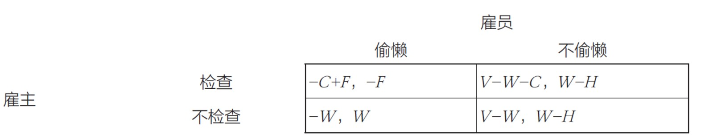

# Chapter6 人工智能博弈

***

## 6.1 博弈论的相关概念

**博弈的要素：**

* **参与者：** 博弈的决策主体
* **策略：** 参与者可以采取的行动方案，如果参与者可以通过一定概率分布来选择若干个不同的策略，这样的策略称为**混合策略**；若参与者每次行动都选择某个确定的策略，这样的策略称为**纯策略**
* **收益：** 参与者在不同局势下得到的利益，混合策略下对应的玩家收益称为**期望收益**
* **规则：** 对参与者行动的先后顺序、参与者获得信息多少等内容的规定

**研究范式：**

建模者对参与者规定可采取的策略集和取得的收益，观察当参与者选择若干策略以最大化其收益时会产生什么结果。

!!! Example
    **囚徒困境（纯策略）**  
      
    在囚徒困境中，最优解为两人同时沉默，但是两人实际倾向于选择同时认罪（均衡解）。  

**博弈的分类：**

* **合作博弈与非合作博弈：** 参与者是否组成联盟
* **静态博弈与动态博弈：** 前者的参与者同时决策（或互相不知道对方的决策），后者的参与者所采取行为的先后顺序由规则决定，且后行动者知道先行动者所采取的行为
* **完全信息博弈与不完全信息博弈：** 是否所有的参与者均了解其他参与者的策略集、收益等信息。在完全信息博弈中，若博弈的参与者直到所有参与者之前采取的行动，则称为**完美信息博弈**

!!! Example
    囚徒困境：非合作、静态、完全信息的不完美信息

**纳什均衡：**

**博弈的稳定局势**即为**纳什均衡**，指的是参与者所作出的这样一种策略组合，在该策略组合上，**任何参与者单独改变策略都不会得到更多好处**。因此其他人不改变策略时，没有人会改变自己的策略。（**本质：不后悔**）

!!! Note
    在博弈中能达到纳什均衡的基础是博弈参与者完全理性。

!!! Example
    以囚徒困境为例：纳什均衡的局势是甲和乙均认罪，现在让甲改变策略，如果甲沉默，那么其就要从服刑5年变成服刑10年，乙也同理。

!!! Example
    **混合策略下纳什均衡的例子：雇主-雇员**

    雇主是否检查工作与雇员是否偷懒。  
    $V$：雇员给雇主带来的收益  
    $W$：雇员的工资  
    $H$：雇员工作付出的成本  
    $C$：雇主检查的成本  
    $F$：雇主发现雇员偷懒时雇员要交给雇主的罚款  
    不同局势下雇主和雇员各自的收益如下：  
      
    设雇主检查概率为$\alpha$，雇员偷懒的概率为$\beta$，则期望收益如下：  
      
    在纳什均衡下，任何参与者单独改变策略都不会得到更多好处，因此$$T_1=T_2$$

    $$T_3=T_4$$ 
    因此在纳什均衡下的概率：  
    $$\alpha=\frac{H}{W+F}$$

    $$\beta=\frac{C}{W+F}$$  
    我们可以将$\alpha$代入雇主的收益，得到
    $$V-W-\frac{CV}{W+F}$$

    对$W$求导，得到当$W=\sqrt{CV}-F$时，雇主的收益最大，这是雇主为了获得最大利益应该给雇员发放的工资。  

**纳什定理：**

若参与者有限，每位参与者的策略集有限，收益函数为实值函数，则博弈必存在混合策略意义下的纳什均衡。（只是存在性，但如何求解或近似仍是研究重点）

**策梅洛定理：**

对于任意一个有限步的双人完全信息零和动态博弈，一定存在先手必胜策略或后手必胜策略或双方保平策略。

***

## 6.2 博弈策略求解

### 虚拟遗憾最小化算法

**相关定义：**

设有$N$个玩家，每个玩家$i$在博弈中采取的策略为$\sigma_i$。

所有$N$个玩家的策略集合：

$$\sigma=\\{\sigma_1,\sigma_2,····,\sigma_N\\}$$

除了玩家$i$以外，其他玩家的策略集合：

$$\sigma_{-i}=\\{\sigma_1,\sigma_2,···,\sigma_{i-1},\sigma_{i+1},···,\sigma_N\\}$$

在给定策略组合$\sigma$下，玩家$i$在终局的收益记为$u_i(\sigma)$。

在给定其他玩家的策略组合$\sigma_{-i}$的情况下，玩家$i$的**最优反应策略**为$\sigma_i^*$，即

$$u_i(\sigma_i^*,\sigma_{-i})=\max\limits_{\sigma_i\in\Sigma_i}u_i(\sigma_i,\sigma_{-i})$$

其中$\Sigma_i$是玩家$i$可以选择的所有策略集合。当玩家$i$采用最优反应策略时，能够获得最大收益。

在策略组合$\sigma^*$中，如果每个玩家的策略相对于其他玩家的策略都是最优反应策略，则策略组合

$$\sigma^\*=\\{\sigma_1^\*,\sigma_2^\*,···,\sigma_N^\*\\}$$

就是一个**纳什均衡策略**。在所有玩家的策略集合为纳什均衡策略时，对于任意一个玩家$i$，都有

$$u_i(\sigma^\*)=\max\limits_{\sigma_i\in\Sigma_i}u_i(\sigma_1^\*,\sigma_2^\*,···,\sigma_i,···,\sigma_N^\*)$$

**遗憾最小化算法：**

遗憾最小化算法是一种根据以往博弈过程中所得遗憾程度来选择未来行为的方法。

玩家$i$在过去$T$轮中采取策略$\sigma_i$的累加遗憾值：

$$Regret_i^T(\sigma_i)=\sum\limits_{t=1}^T[u_i(\sigma_i,\sigma_{-i}^t)-u_i(\sigma^t)]$$

其中，$\sigma^t$和$\sigma_{-i}^t$分别表示第$t$轮种所有玩家的策略组合以及除了玩家$i$外的策略组合。累加遗憾值表示的是在过去$T$轮中，玩家$i$在每一轮中选择策略$\sigma_i$所得收益与采取其他策略所得收益之差的累加。

在得到玩家$i$的所有可选策略的遗憾值后，可以根据遗憾值的大小来选择后续第$T+1$轮博弈的策略，这种选择方式被称为**遗憾匹配**。

通常认为遗憾值为负数的策略不能提升收益，因此定义**有效遗憾值**：

$$Regret_i^{T,+}(\sigma_i)=\max\\{Regret_i^T(\sigma_i),0\\}$$

玩家$i$在第$T+1$轮选择策略$\sigma_i$的概率为

$$P(\sigma_i^{T+1})=\begin{cases}
    \frac{Regret_i^{T,+}(\sigma_i)}{\sum\limits_{\sigma_i'\in\Sigma_i}Regret_i^{T,+}(\sigma_i')},\sum\limits_{\sigma_i'\in\Sigma_i} Regret_i^{T,+}(\sigma_i')>0\\\
    \frac{1}{|\Sigma_i|},else
\end{cases}$$

!!! Note
    依照一定的概率行动是为了防止对手发现自己所采取的策略。

!!! Example
    **石头剪刀布**

    

    第一轮，假设A出R，B出P，则$u_A(R,P)=-1$，$u_B(P,R)=1$  
    A在第一轮没有选择出P的遗憾值

    $$Regret_A^1(P)=u_A(P,P)-u_A(R,P)=0-(-1)=1$$

    其余遗憾值类似计算，A在第一轮没有选择出S的遗憾值为2，没有选择出R的遗憾值为0，因此A在下一轮出P、S、R的概率分别为$\frac{1}{3}$，$\frac{2}{3}$和0。
    同理，可以算出B接下来将等可能随机出P、S、R。
    假设A在第二轮按照遗憾值最大的策略出S，B随机出了一个R，则A的累加遗憾值如下：

    

**虚拟遗憾最小化算法：**

并不是所有的博弈都像石头剪刀布一样一局定胜负，而是需要序贯决策才能判断胜负，这个时候需要计算状态转移序列中每个状态的**虚拟遗憾值**，这就是**虚拟遗憾最小化算法**。

将博弈过程抽象成一棵博弈树，每个中间节点都是一个信息集$I$。

在信息集$I$下，玩家可以采取的行动集合记为$A(I)$，玩家$i$采取的行动$a_i\in A(I)$为其策略$\sigma_i$的一部分。在信息集$I$下采取行动$a$所代表的策略记为$\sigma_{I\rightarrow a}$。

再一次博弈中，所有玩家交替采取的行动序列记为$h$（从根节点到当前节点的路径），对于所有玩家的策略集合$\sigma$，$h$出现的概率记为$\pi^\sigma(h)$。在策略组合$\sigma$下，所有能够到达信息集$I$的行动序列的概率累加就是该信息集的出现概率，即

$$\pi^{\sigma}(I)=\sum\limits_{h\in I}\pi^{\sigma}(h)$$

将博弈所有终局（叶子节点）组成的集合记为$Z$，对于任意一个终局$z\in Z$，玩家$i$的收益记作$u_i(z)$。给定行动序列$h$，依照策略组合$\sigma$到达$z$的概率记为$\pi^{\sigma}(h,z)$。

在策略组合$\sigma$下，对于玩家$i$，从根节点到当前节点的行动序列$h$的虚拟价值为

$$v_i(\sigma,h)=\sum\limits_{z\in Z}\pi_{-i}^{\sigma}(h)\times\pi^{\sigma}(h,z)\times u_i(z)$$

其中，$\pi_{-i}^{\sigma}(h)$表示不考虑玩家$i$的策略到达当前节点的概率，$\pi^{\sigma}(h,z)$表示从当前节点到叶子节点的概率，$u_i(z)$表示叶子节点的收益。

玩家$i$在基于路径$h$到达当前节点采取行动$a$的遗憾值：

$$r_i(h,a)=v_i(\sigma_{I\rightarrow a},h)-v_i(\sigma,h)$$

对能够到达同一个信息集$I$的所有行动序列的遗憾值进行累加，可得到$I$的遗憾值：

$$r_i(I,a)=\sum\limits_{h\in I}r_i(h,a)$$

$$Regret_i^T(I,a)=\sum\limits_{t=1}^Tr_i^t(I,a)$$

$$Regret_i^{T,+}(I,a)=\max\\{Regret_i^T(I,a),0\\}$$

$$\sigma_i^{T+1}(I,a)=\begin{cases}
    \frac{Regret_i^{T,+}(I,a)}{\sum\limits_{a\in A(I)}Regret_i^{T,+}(I,a)},\sum\limits_{a\in A(I)} Regret_i^{T,+}(I,a)>0\\\
    \frac{1}{|A(I)|},else
\end{cases}$$

算法步骤：

* 初始化遗憾值和累加策略表为0
* 采用随机选择的方法来决定策略
* 利用当前策略与对手进行博弈
* 计算每个玩家采取每次行为后的遗憾值
* 根据博弈结果计算每个行动的累加遗憾值大小来更新策略
* 重复3)到5)步若干次，不断的优化策略
* 根据重复博弈最终的策略，完成最终的动作选择

### 安全子博弈

**安全子博弈**指的是在子博弈的求解过程中，得到的结果一定不差于全局的**近似解**。

***

## 6.3 博弈规则设计

设计博弈的规则使得博弈的最终局势能尽可能达到整体利益的最大化。

### 双边匹配问题

与资源匹配相关的需要双向选择的决策问题(如求职就业、报考录取等)，称为**双边匹配问题**。在双边匹配问题中，需要双方互相满足对方的需求才会达成匹配。

**稳定婚姻匹配问题：**

$n$个男性的集合$M=\{m_1,m_2,···,m_n\}$

$n$个女性的集合$F=\{f_1,f_2,···,f_n\}$

对于任意一个男性$m_i$，都有自己爱慕女性的顺序，对于任意一个女性也同理。

算法的最终目标是为$n$个男性和$n$个女性一一匹配，尽量满足多数人的期望。

**算法流程（GS算法）：**

* 单身男性向最喜欢的女性表白
* 所有收到表白的女性从向其表白男性中选择最喜欢的男性，暂时匹配
* 未匹配的男性继续向没有拒绝过他的女性表白。收到表白的女性如果没有完成匹配，则从这一批表白者中选择最喜欢男性。即使收到表白的女性已经完成匹配，但是如果她认为有她更喜欢的男性，则可以拒绝之前的匹配者，重新匹配
* 如此循环迭代，直到所有人都成功匹配为止

### 单边匹配问题

类似于以物易物方式的交换匹配问题（如室友的匹配或者是座位的分配），称为**单边匹配问题**，这些问题中分配的对象都是不可分的标的物，他们只能属于一个所有者，且可以属于任何一个所有者。

**稳定室友匹配问题：**

假设某寝室有A，B，C，D四位同学和1，2，3，4四个床位，当前给四位同学随机分配四个床位，偏好如下：

需要满足尽可能多的期望。

**算法流程（TTC算法）：**

* 首先记录每个标的物的初始占有者，或者对物品进行随机分配。
* 每个交易者连接一条指向他最喜欢的标的物的边，并从每一个标的物连接到其占有者或是具有高优先权的交易者。
* 此时形成一张有向图，且必存在环，这种环被称为“交易圈”，对于交易圈中的交易者，将每人指向结点所代表的标的物赋予交易者，同时交易者放弃原先占有的标的物，占有者和匹配成功的标的物离开匹配市场。
* 接着从剩余的交易者和标的物之间重复进行交易圈匹配，直到无法形成交易圈，算法停止

