

# Chapter1 Image Formation

***

## Camera and Lens

对于三维空间的信息，我们如果只用一个平面来接收，则得到的是一片模糊。因为三维空间上的每个点都有无数条光线，到达平面上的每个位置，而不是一一映射。

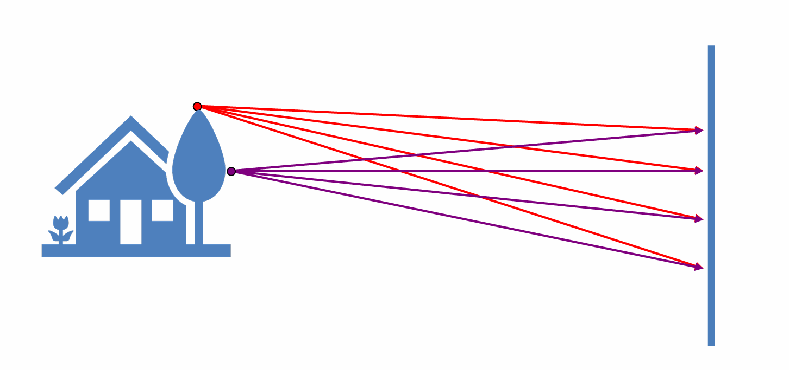

要想拍清楚，就需要让每个点只有一条光线到达平面上，因此在平面前加一个小孔，称为**光圈（aperture）**，整个模型称为**针孔相机（pinhole camera）**。

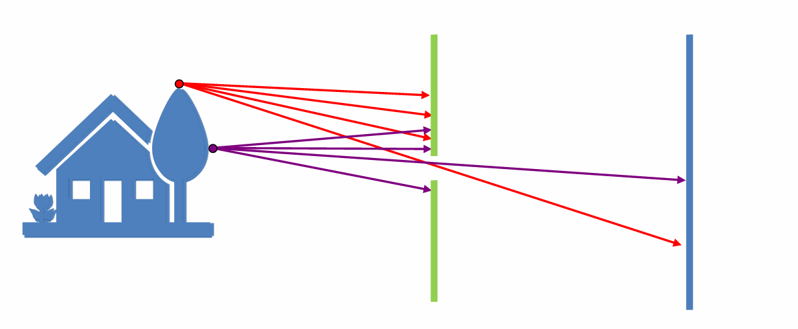

!!! Note
    **孔不是越小越好：**

    * 通光量太小
    * 衍射

**凸透镜（lens）：**

和小孔成像类似，但能获得更多光。其中有**高斯成像公式**

$$\frac{1}{i}+\frac{1}{o}=\frac{1}{f}$$

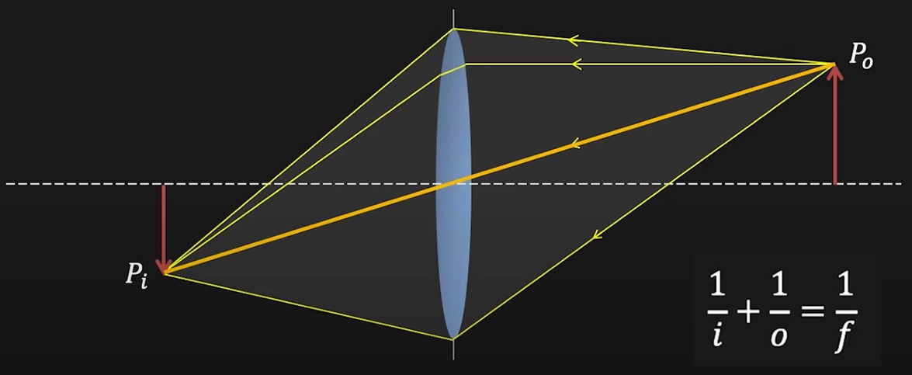

!!! Note
    当 $o\rightarrow\infty$ 时，$f=i$。由于现实中 $o$ 远大于 $i$，因此我们默认 $f=i$ 成立。

**放大率（magnification）：**

$$m=\frac{h_i}{h_o}=\frac{i}{o}=\frac{f}{o}$$

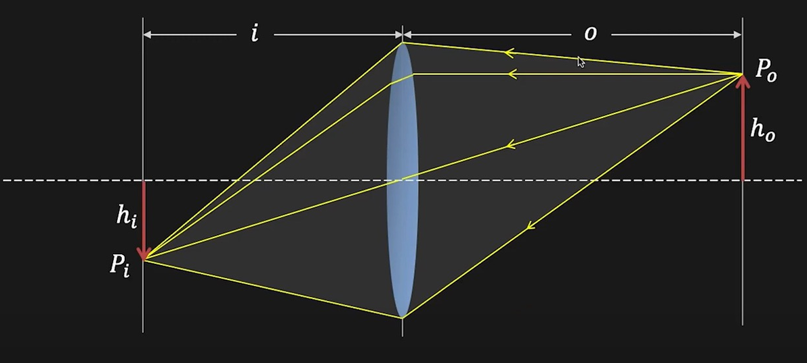

这就解释了为什么长焦镜头拍到的东西更大。因为焦距越大，放大率越大。

**视野（field of view, FOV）：**

视野就是观察范围，通常用一个角度来表示（angle of view）。

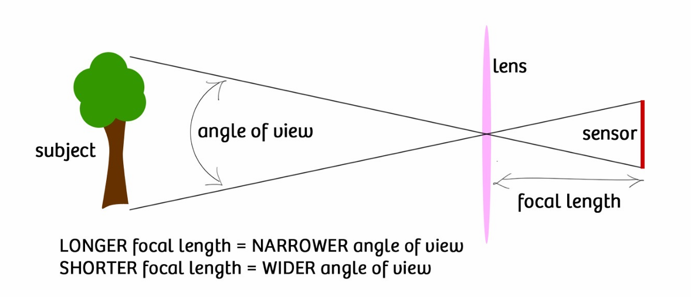

与视野有关的是焦距和传感器大小。焦距越小，传感器越大，视野就越广。

!!! Note
    传感器还对接收光强有影响。底片大说明接受光线能力强，同样光线下（尤其是弱光），拍出的图片更清晰。

!!! Note
    我们一般讲等效焦距，即原本焦距根据传感器大小进行归一化。

**光圈（aperture）：**

光圈控制了多少光经过凸透镜汇聚到像平面上。光圈越大，进光量越大。光圈的直径记为 $D$。

**F-number:**

$$N=\frac{f}{D}$$

使用 F-number 是因为光圈大小也要拿焦距参考。

**失焦（lens defocus）：**

像平面相对于镜头位置固定的时候，只有物距为 $o$ 的特定平面上的东西才能拍清楚，否则会形成模糊光斑（失焦）。设光斑直径为 $b$，则有

$$\frac{b}{D}=\frac{|i'-i|}{i'}$$

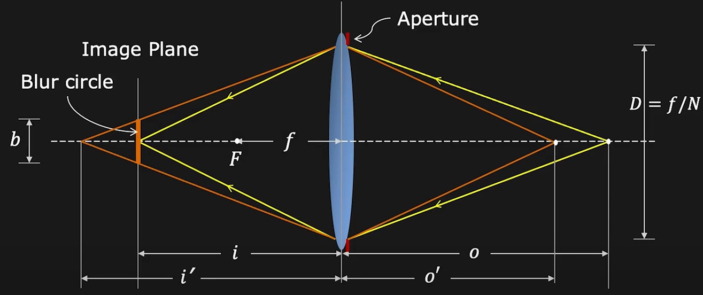

**景深（depth of field, DOF）：**

理论上每次只能拍清楚一个平面，但实际上在特定范围内的东西都能拍清楚，这个前后范围就叫景深。之所以存在特定范围，是因为图像本身由像素构成，所以有一个容忍度，只要光斑比像素小就行。

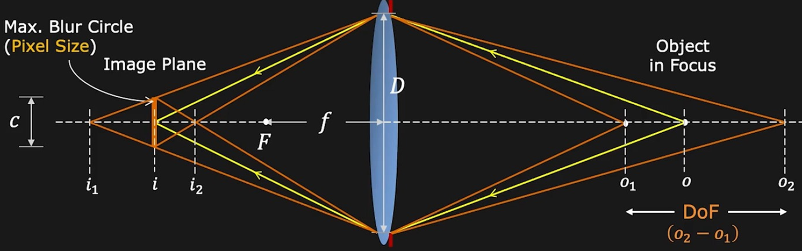

设 $C$ 为 pixel size，则有

$$C=\frac{f^2(o-o_1)}{No_1(o-f)}$$

$$C=\frac{f^2(o_2-o)}{No_2(o-f)}$$

可以得到景深：

$$o_2-o_1=\frac{2of^2cN(o-f)}{f^4-c^2N^2(o-f)^2}$$

!!! Note
    **如何模糊背景：**

    * 更大的光圈
    * 更长的焦距
    * 更近的前景
    * 更远的后景

***

## Geometric Image Formation

如何将三维空间的点映射成二维空间的点？

**透视投影（perspective projection）：**

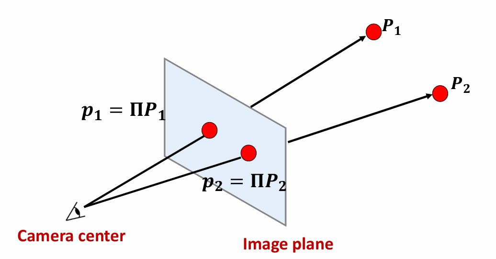

设相机中心位于原点，对于三维空间的一个点 $P=(x,y,z)$，投影到二维空间的一个点 $P'=(u,v)$。

已知焦距为 $f$，像距近似为 $f$，物距为 $z$，则有

$$u=\frac{fx}{z}$$

$$v=\frac{fy}{z}$$

我们无法直接用矩阵进行线性变换，因此需要转换成齐次坐标，然后有

$$\begin{bmatrix}
    f & 0 & 0 & 0 \\\
    0 & f & 0 & 0 \\\
    0 & 0 & 1 & 0
\end{bmatrix}\begin{bmatrix}
    x\\\
    y\\\
    z\\\
    1
\end{bmatrix}=\begin{bmatrix}
    fx\\\
    fy\\\
    z
\end{bmatrix}\cong\begin{bmatrix}
    \frac{fx}{z}\\\
    \frac{fy}{z}\\\
    1
\end{bmatrix}$$

**Vanishing Point:**

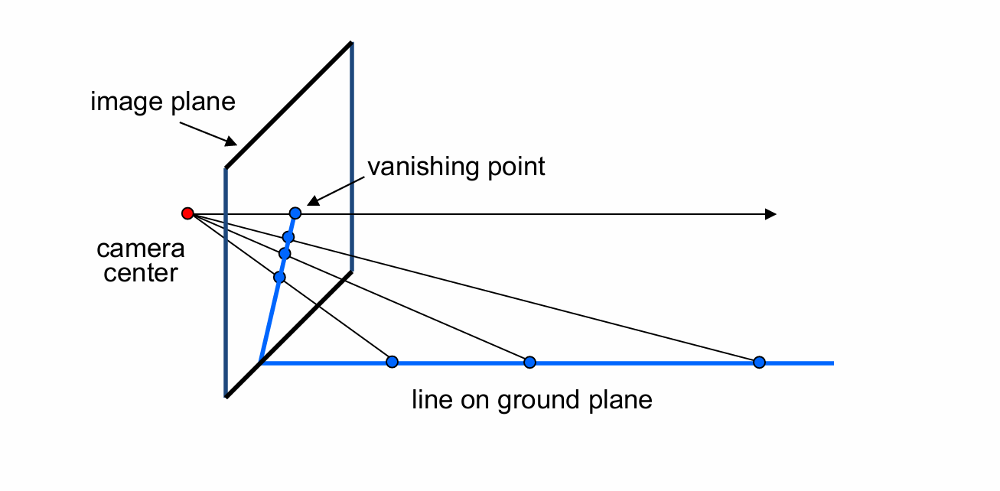

vanishing point 由透视投影引起。

* 如果三维空间中的线垂直于投影平面，则 vanishing point 位于平面中心
* 三维空间中一组平行线的 vanishing point 相同
* vanishing point 的位置可以告诉我们直线在三维空间中的朝向，相机与 vanishing point 之间的连线与直线平行
* vanishing point 可能在图像内，也可能在图像外，也可能在无穷远处（线与投影平面平行）。

**Vanishing Line:**

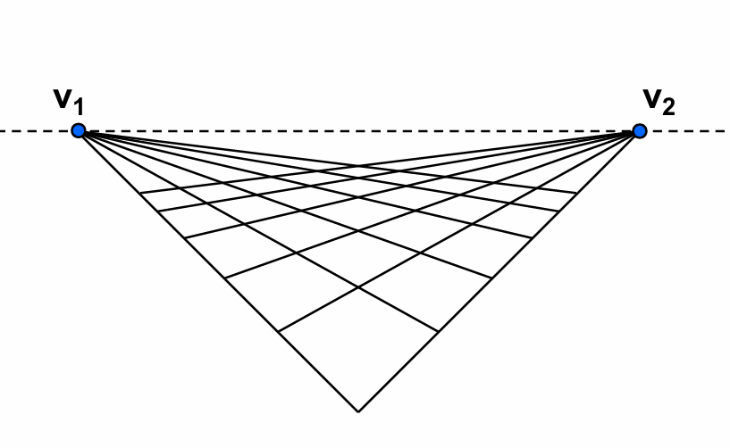

vanishing line 将 vanishing point 连接起来，表示三维空间的一个平面，这个平面是由多组不同的线构成的。

vanishing line 可以告诉我们图像中某个平面在三维空间中的朝向。

**透视畸变（perspective distortion）：**

原因：像平面和物体平面不平行。

解决方法：轴移相机（可以调整光轴位置的相机）

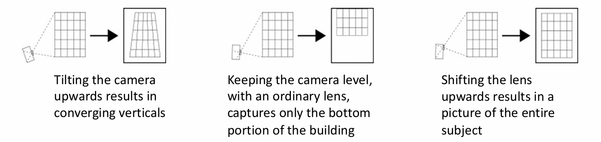

**径向畸变（radial distortion）：**

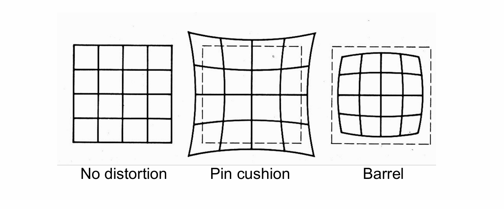

原因：镜头问题

直线变弯，不满足透视投影，产生枕形畸变或桶形畸变。广角一般会有桶形畸变，长焦一般会有枕形畸变。

畸变的程度和到图像中心的距离有关，距离越远畸变越严重。

$$r^2=x_n'^2+y_n'^2$$

$$x_d'=x_n'(1+\kappa_1r^2+\kappa_2r^4)$$

$$y_d'=y_n'(1+\kappa_1r^2+\kappa_2r^4)$$

其中，$x_n'$ 和 $y_n'$ 是没有径向畸变的投影后的坐标。

解决方法：使用标定板进行标定，求出畸变系数后再校正恢复。

**正交投影（orthographic projection）：**

正交投影是透视投影的一个特例，图像中心与相机中心距离无穷远。每个点作一条到像平面的垂线，相当于去掉 $z$ 坐标。

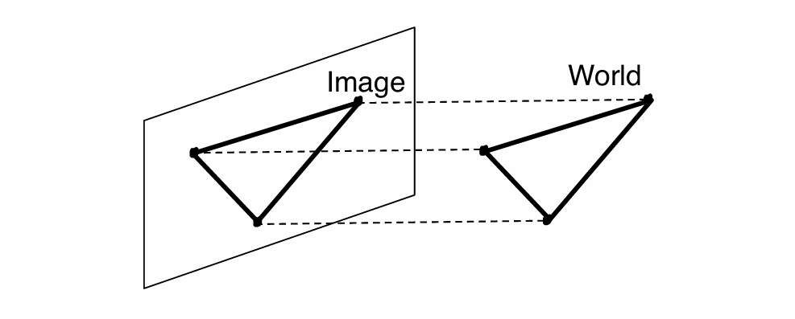

$$\begin{bmatrix}
    1 & 0 & 0 & 0 \\\
    0 & 1 & 0 & 0 \\\
    0 & 0 & 0 & 1   
\end{bmatrix}\begin{bmatrix}
    x\\\
    y\\\
    z\\\
    1
\end{bmatrix}=\begin{bmatrix}
    x\\\
    y\\\
    1
\end{bmatrix}$$

***

## Photometric Image Formation

**快门（shutter）：**

快门用于控制曝光时间：

* 快门速度太快：曝光时间太短，图像暗，欠曝
* 快门速度太慢：曝光时间太长，图像亮，过曝+模糊（物体或相机会移动）

快门的应用：

* 拍摄闪电，快门速度慢，曝光时间长，这样才有几率拍到闪电；同时光圈要小，避免过曝
* 拍摄水流动的效果，同样使用慢快门速度

**Rolling Shutter Effect:**

例如拍摄风扇高速转动的视频，分析每一帧，风扇叶片并不能保持正常的形状。

产生原因：rolling shutter 和 global shutter 的区别。前者逐行扫描，后者同时曝光，而拍视频一般使用前者。拍摄同一幅图时，每个位置不是同时曝光的，如果物体在快速移动，就会出现问题。

**RGB:**

我们可以使用 RGB 值来表示颜色。任意一种颜色都可以由红绿蓝三种颜色以不同比例混合而成。

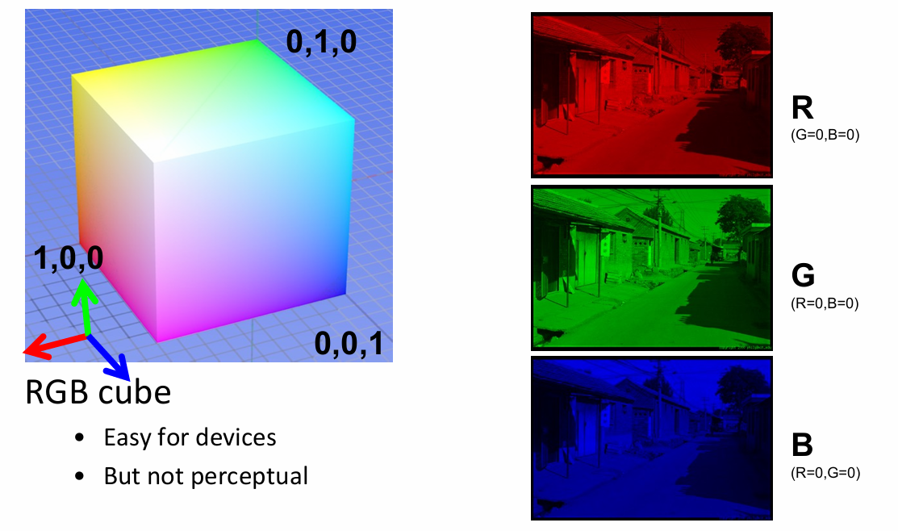

**HSV:**

* H (Hue): 色相
* S (Saturation): 饱和度
* V (Value): 亮度

HSV 和 RGB 之间有固定的转换公式。相比于 RGB，HSV 比较方便调色。

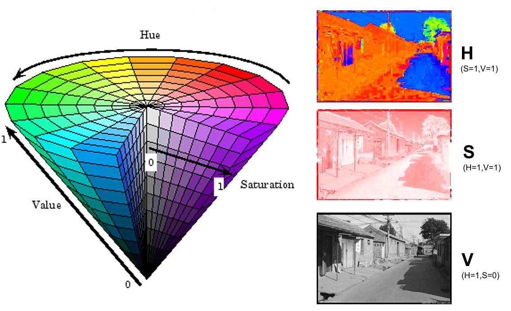

**拜耳滤波器（Bayer filter）：**

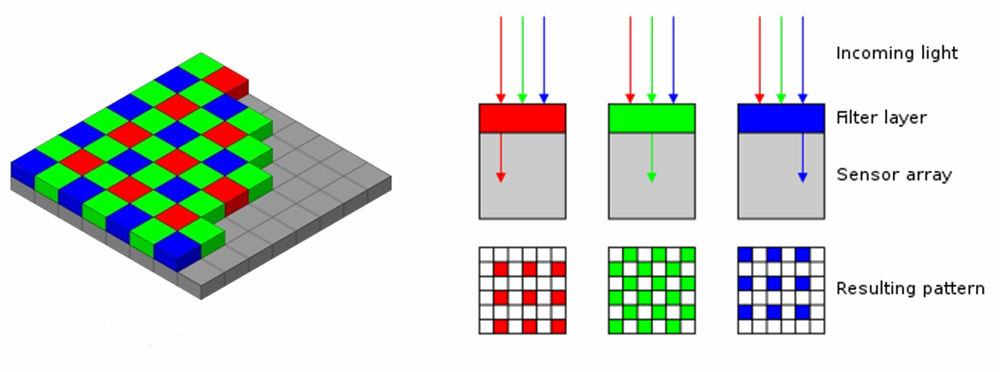

相机里一般使用拜耳滤波器，分别感知三种颜色。

每个像素实际上只能记录一种颜色的光，相当于四个像素才能表示一个完整像素。

绿色更多是因为人眼更敏感（处于感知范围中间）。

最后的图像尺寸要比图像传感器小，得到原本尺寸需要使用插值。