

# Chapter2 Image Processing

***

## Image Processing Basics

**卷积（convolution）：**

在每个位置都做某种形式的加权平均，称为卷积。卷积 = 滤波，卷积核 = 滤波器。

$$(f*g)(x)=\int_{-\infty}^{\infty}f(y)g(x-y)dy$$

* $f(y)$：filter
* $g(x-y)$：input signal
* $(f*g)(x)$：output signal

**Padding:**

在图像外面增加若干圈新的像素。

* zero values: 用 $0$ 填充
* edge values: 用边缘像素值填充，每圈都一样
* symmetric values: 用对称像素值填充，例如图像最外圈对应填充第一圈，图像第二外圈对应填充第二圈，以此类推

**高斯模糊（Gaussian blur）：**

高斯模糊用于图像模糊处理。

与均值滤波不同，高斯滤波的卷积核中间大四周小，符合高斯分布。

$$\begin{bmatrix}
    0.075&0.124&0.075\\\
    0.124&0.204&0.124\\\
    0.075&0.124&0.075
\end{bmatrix}$$

**锐化（sharpening）：**

锐化对应的卷积核：

$$\begin{bmatrix}
    0&-1&0\\\
    -1&5&-1\\\
    0&-1&0
\end{bmatrix}$$

锐化的本质是增加高频部分：

* 原图像：$I$
* 图像的高频部分：$I-\text{blur}(I)$
* 锐化后的图像：$I+(I-\text{blur}(I))$

**边缘检测（edge detection）：**

边缘检测对应的卷积核：

$$\begin{bmatrix}
    -1&0&1\\\
    -2&0&2\\\
    -1&0&1\\\
\end{bmatrix}$$

$$\begin{bmatrix}
    -1&-2&-1\\\
    0&0&0\\\
    1&2&1\\\
\end{bmatrix}$$

卷积核本身可视化后就类似于边缘的结构，这也暗示了卷积核本身就像特征检测器，图像中如果有对应特征则响应就大。

**双边滤波（bilateral filter）：**

双边滤波常用于图像去噪（磨皮），在局部模糊的情况下保留边缘。图像每个地方对应的卷积核内容都不同。

***

## Image Sampling

image sampling 本质就是在调整图像的大小（分辨率）。减小图像称为 **down-sampling**，可能导致的问题有摩尔纹、飞轮效应等，这些统称为**走样（aliasing）**，原因是**信号变化太快，但采样太慢。**

**傅里叶变换（Fourier transform）：**

对于任意信号，可以通过傅里叶变换分解成不同频率的周期信号（三角函数）的加权叠加。每个周期信号前面的系数称为**傅里叶系数**，表示需要多少该频率的周期信号。

频率 - 傅里叶系数图像称为**频谱**。

从时域到频域的傅里叶变换可以如下表示：

$$F(u)=\int_{-\infty}^{\infty}f(x)e^{-i2\pi ux}dx$$

其中，$f(x)$ 为原本的时域信号，$F(u)$ 为变换后的频域信号，即频率 $u$ 的傅里叶系数（占比）。

这个式子本质上就是在对 $f(x)$ 和频率为 $u$ 的周期信号做内积。

从频域到时域的傅里叶逆变换可以如下表示：

$$f(x)=\int_{-\infty}^{\infty}F(u)e^{i2\pi ux}du$$

这个式子本质上就是在对所有频率的周期信号做加权叠加，还原原本的时域信号 $f(x)$。

!!! Example
    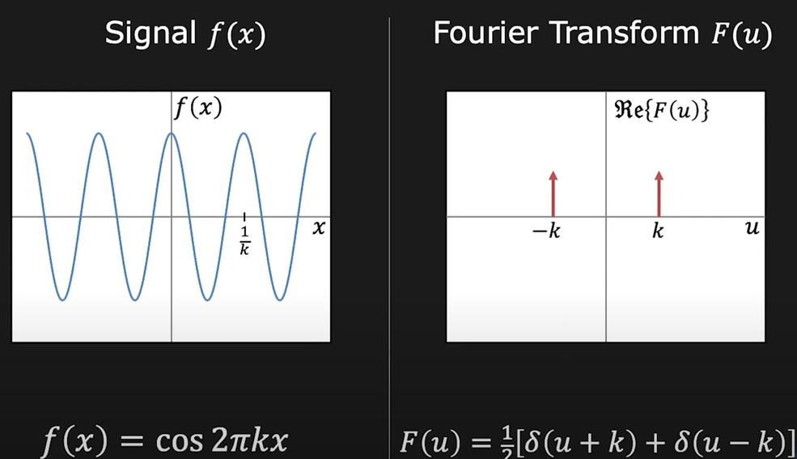
    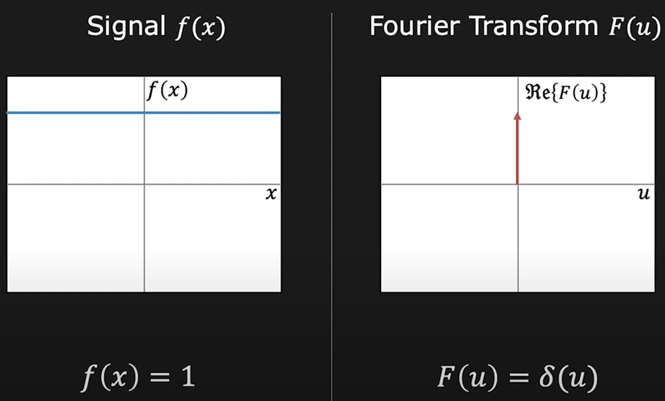
    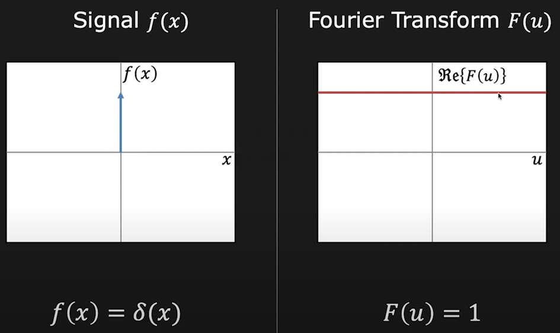
    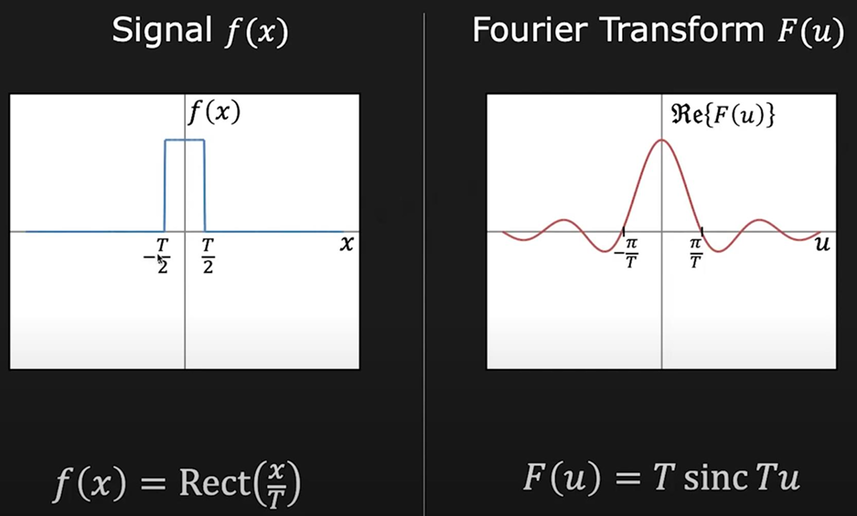
    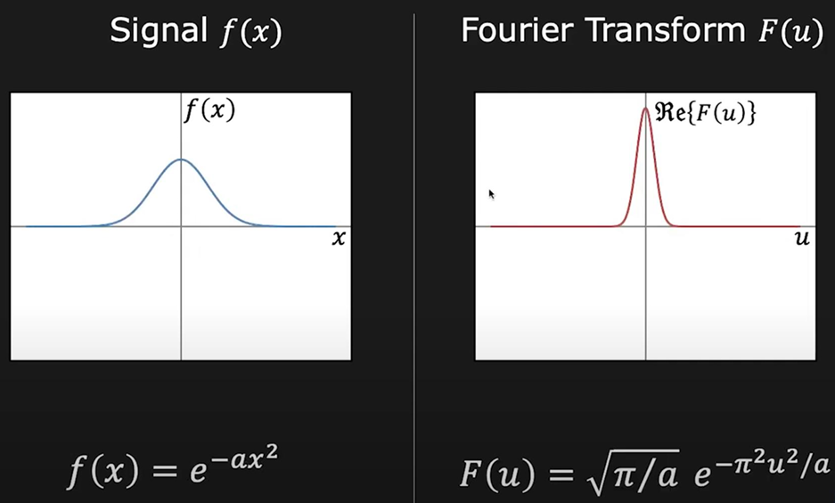

    !!! Note
        $\delta$ 表示冲激信号，该点的值为无穷大。

**卷积定理（convolution theorem）：**

时域上两个信号的卷积对应于频域上两个信号的乘积；频域上两个信号的卷积对应于时域上两个信号的乘积。

因此我们得到卷积的另一种形式：先将两个时域上的信号分别做傅里叶变换，得到频域信号；然后将两个频域信号相乘；最后对乘积做逆傅里叶变换，得到的结果与时域信号直接卷积是一样的。

回到图像上，二维空间的傅里叶变换与一维类似，时域现在是空间域，频谱现在是二维的。

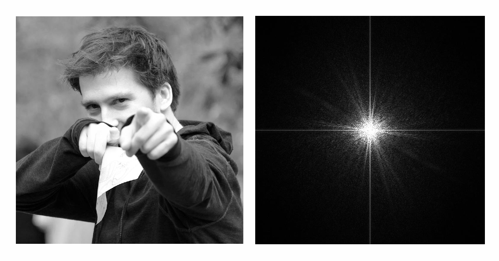

频谱上的任意一点 $(x,y)$ 表示，横向上频率为 $x$、纵向上频率为 $y$ 的周期信号的占比。

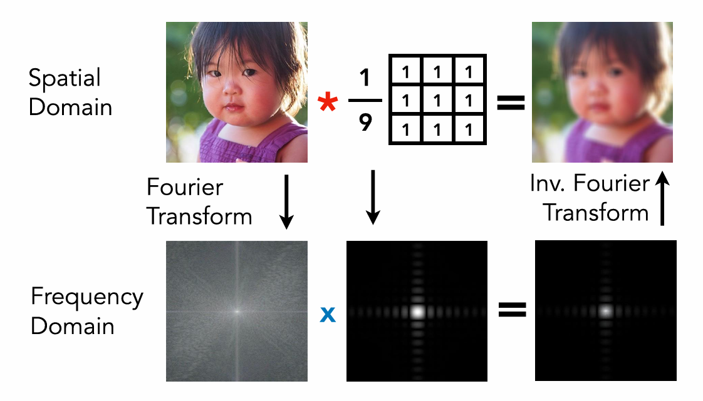

卷积核就像窗口函数（见上面的 Example4），卷积的过程就是去掉高频成分、保留低频成分的过程，因此又叫滤波。

**采样（sampling）：**

Sampling a signal = Multiply the single by a 
Dirac comb function

采样的数学本质就是对原本的信号乘上一个周期性（$f=f_s$）的冲激函数（Dirac comb function）。

冲激列的傅里叶变换也是冲激列，频率变为原本的倒数，因此$f=\frac{1}{f_s}$，$T=f_s$，即频谱的间隔为 $f_s$。

时域上的乘法对应频域上的卷积，频域上的卷积本质上就是对频谱进行周期性复制。

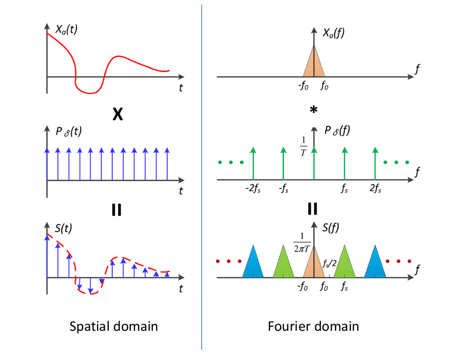

假设采样频率 $f_s$ 过低，频谱上的峰会重叠，无法还原原本的信号，导致走样。

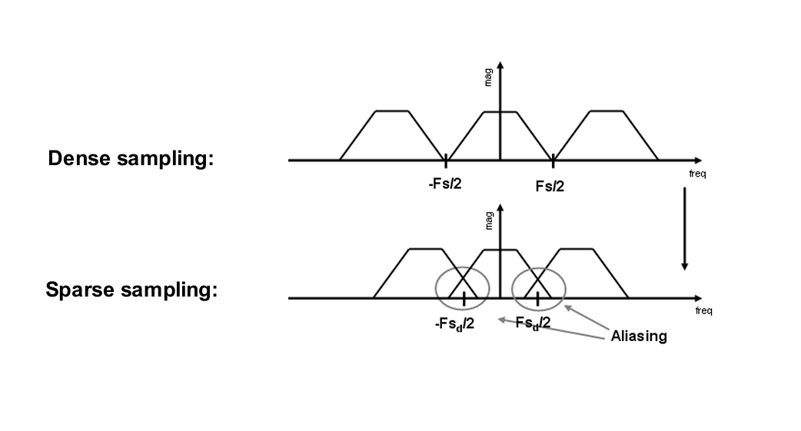

因此，根据 **Nyquist-Shannon 采样定理**，采样频率 $f_s$ 必须大于图像信号中最高频率 $f_0$ 的两倍，才能还原原本的信号。

综上：减少走样的方法有两个。一个是增加采样频率 $f_s$，另一个是减少图像信号中的高频成分 $f_0$，即在采样前对图像进行模糊处理（低通滤波）。

***

## Image Magnification

图像放大要解决的问题是：原本没有值的像素应该怎么填。一般使用**插值（interpolation）** 的方法。

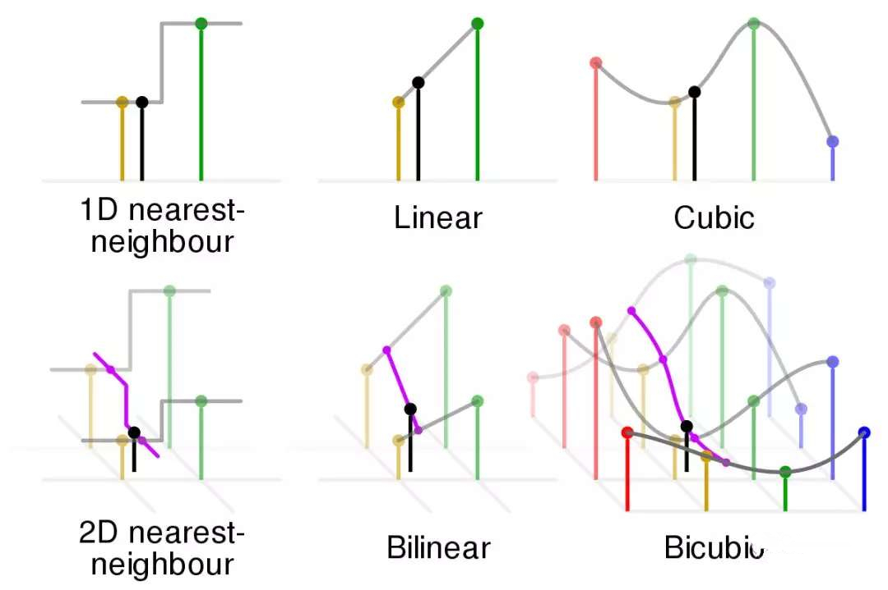

其中，**最近邻插值（nearest-neighbor interpolation）** 的问题是不连续、不光滑；**线性插值（linear interpolation）** 连续但不光滑；**多项式插值（polynomial interpolation）** 每一段用不同的多项式拟合，要保证光滑至少需要三次多项式。

**双线性插值（bilinear interpolation）：**

双线性插值是在二维空间中插值的方法。对于任意一个点的周围四个已知点，先两两进行线性插值，得到一组中间值，然后再对中间值进行线性插值，得到最终值。

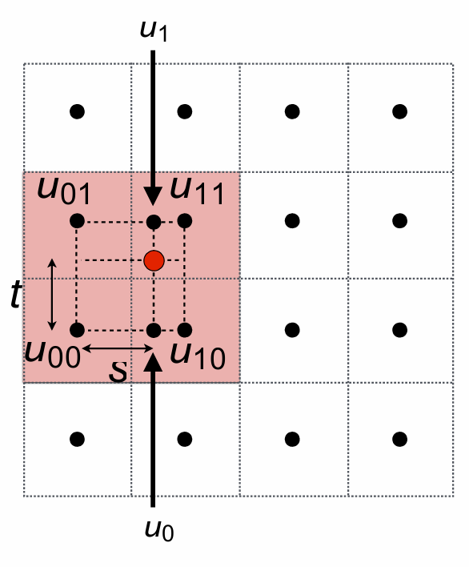