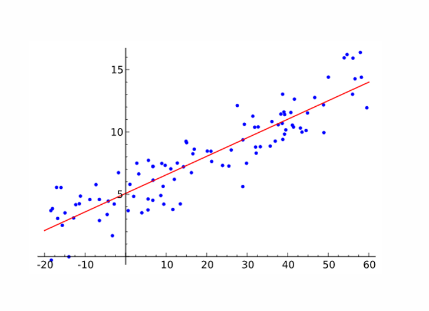
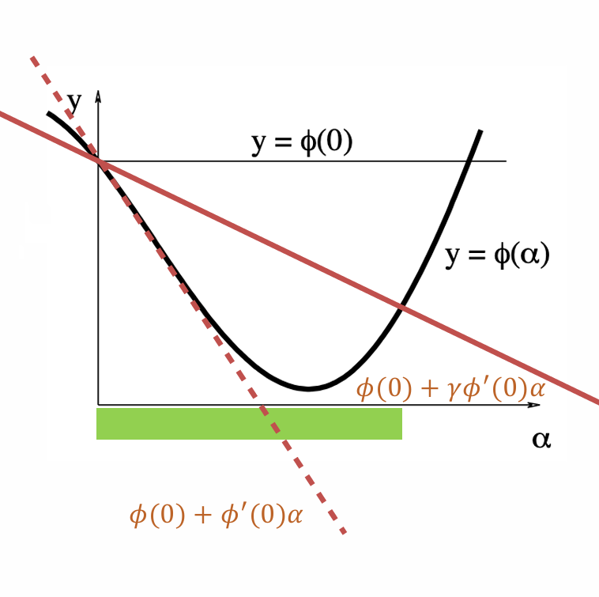
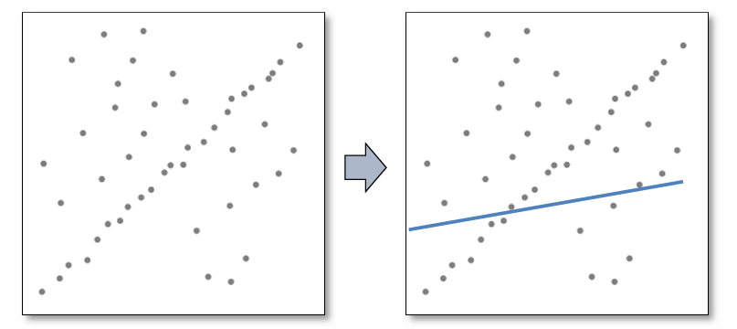
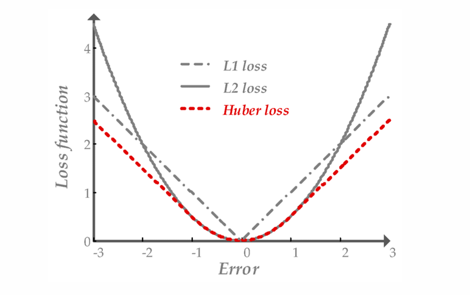
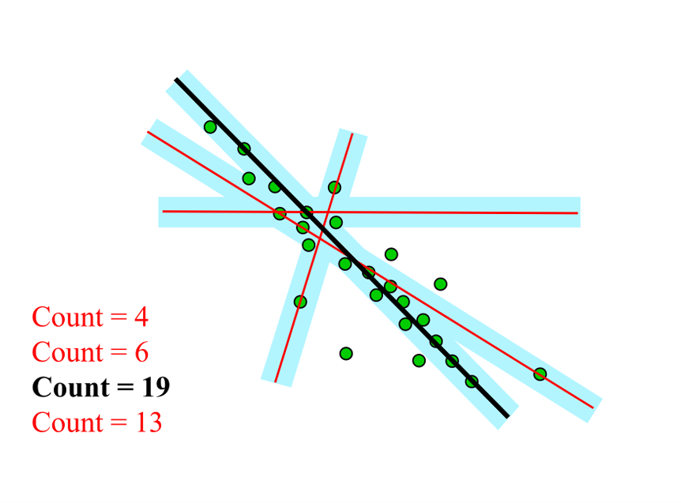

# Chapter3 Model Fitting and Optimization

***

## Numerical Methods

**Model Fitting:**

$$b=f_x(a)$$

模型本质就是函数，输入为 $a$，输出为 $b$，$x$ 为模型参数。

如何得到参数 $x$？归结到优化问题，优化的目标函数是 **mean squared error (MSE)**：

$$\hat{x}=\operatorname*{arg\,min}_{x}||Ax-b||_2^2$$

考虑最低点处导数为 $0$：

$$A^T(Ax-b)=0$$

这种就是分析解法（求导）。

**Steepest Descent Method:**

通过**一阶近似（first-order approximation）** 决定方向 $\Delta x$。

由泰勒展开：

$$F(x_0+\Delta x)\approx F(x_0)+J_F\Delta x$$

其中，$J_F$ 为雅可比矩阵：

$$J_F=(\frac{\partial F}{\partial x_1}, \frac{\partial F}{\partial x_2}, ..., \frac{\partial F}{\partial x_n})$$

最佳下降方向：

$$\Delta x=-J_F^T$$

缺点：接近谷底时效果不好。

**Backtracking Algorithm:**

一种决定步长 $\alpha$ 的策略。

先用一个较大的值初始化 $\alpha$，然后不断缩小 $\alpha$，直到满足：

$$\phi(\alpha)\leqslant\phi(0)+\gamma\phi'(0)\alpha$$

其中，$\phi(\alpha)=F(x_0+\alpha\Delta x)$，$x_0$ 和 $\Delta x$ 为当前点和下降方向（固定），$\gamma\in(0,1)$ 为参数。从下图理解就是要落在绿色区间内：

**Newton Method:**

通过**二阶近似（second-order approximation）** 决定方向 $\Delta x$。

由泰勒展开：

$$F(x_0+\Delta x)\approx F(x_0)+J_F\Delta x+\frac{1}{2}\Delta x^TH_F\Delta x$$

其中，$H_F$ 为 Hessian 矩阵：

$$H_F=\begin{bmatrix}
    \frac{\partial^2 F}{\partial x_1^2} & \frac{\partial^2 F}{\partial x_1\partial x_2} & ... & \frac{\partial^2 F}{\partial x_1\partial x_n}\\\
    \frac{\partial^2 F}{\partial x_2\partial x_1} & \frac{\partial^2 F}{\partial x_2^2} & ... & \frac{\partial^2 F}{\partial x_2\partial x_n}\\\
    ... & ... & ... & ...\\\
    \frac{\partial^2 F}{\partial x_n\partial x_1} & \frac{\partial^2 F}{\partial x_n\partial x_2} & ... & \frac{\partial^2 F}{\partial x_n^2}\\\
\end{bmatrix}$$

为了让 $F(x_0+\Delta x)$ 最小化，右边的 $J_F\Delta x+\frac{1}{2}\Delta x^TH_F\Delta x$ 也要最小化，因此求导可得：

$$H_F\Delta x+J_F^T=0$$

最佳下降方向：

$$\Delta x=-H_F^{-1}J_F^T$$

缺点：计算 Hessian 矩阵开销大。

**Gauss-Newton Method:**

专门用于最小化**非线性最小二乘（non-linear least squares）** 问题：

$$\hat{x}=\operatorname*{arg\,min}_{x}||R(x)||_2^2$$

之前的最速下降法和牛顿法都是对完整的目标函数 $F(x)$ 进行一阶和二阶泰勒展开，而 Gauss-Newton 法只对残差函数 $R(x)$ 进行一阶泰勒展开：

$$||R(x_k+\Delta x)||_2^2\approx||R(x_k)+J_R\Delta x||_2^2=||R(x_k)||_2^2+2R(x_k)^TJ_R\Delta x+\Delta x^TJ_R^TJ_R\Delta x$$

同样像之前的牛顿法那样求导得到：

$$J_R^TJ_R\Delta x+J_R^TR(x_k)=0$$

最佳下降方向：

$$\Delta x=-(J_R^TJ_R)^{-1}J_R^TR(x_k)=-(J_R^TJ_R)^{-1}J_F^T$$

因此，Gauss-Newton 法实际上是用 $J_R^TJ_R$ 去近似 Hessian 矩阵 $H_F$，从而减小计算开销。

缺点：当 $J_R^TJ_R$ 不可逆时无法使用。

**Levenberg-Marquardt Method (LM):**

对Gauss-Newton法的最佳下降方向进行改进：

$$\Delta x=-(J_R^TJ_R+\lambda I)^{-1}J_R^TR(x_k)$$

对于 $\forall \lambda>0$，$J_R^TJ_R+\lambda I$ 一定正定，因此一定可逆。

* $\lambda\rightarrow\infty$：趋向于最速下降法
* $\lambda\rightarrow0$：趋向于 Gauss-Newton 法

***

## Robust Estimation

**Outlier & Inlier:**

outlier 是外点，定义为偏离模型非常远的点，即脏数据，反义词是 inlier。

因为 MSE 涉及平方，outlier 的误差影响远大于 inlier，因此 outlier 会导致 MSE 失效。

如何减小 outlier 的影响？

**Robust Functions:**

* L1：误差绝对值求和（问题是在零点不可导）
* Huber loss：L1 和 L2 的结合

**随机采样一致（random sample consensus, RANSAC）：**

* 随机找两个点得到一条直线
* 设定一个阈值，看有多少点离这条直线的距离在阈值范围内，得到票数
* 不断重复随机找两个点，得到票数最多的直线
* 用所有对该直线投票的点拟合最终的直线

* 好处：可以有效地排除 outlier 的影响，因为 outlier 一般不参与该直线的投票
* 坏处：如果需要拟合的不是直线而是维度更高的模型（更多参数），每一次随机采样的样本需求会增大，拟合和投票的计算复杂度也会增大

**病态问题（ill-posed problem）：**

例如 $\min\limits_x\\|Ax-b\\|^2$，$b$ 的长度就是样本数，$x$ 的长度就是参数数，如果参数数 > 样本数，$Ax=b$ 一定会有解，而且有可能有无穷多解，优化的最小值总归是 $0$，这种问题就是病态问题，模型的参数过多，容易过拟合。解决方法是**正则化（regularization）**。

目标函数加一个约束：

* L1 norm: $\\|x\\|_1=\sum |x_i|$
* L2 norm: $\\|x\\|_2^2=\sum x_i^2$

L1 norm 会让解变得稀疏化，即很多参数变为 $0$。

如果把 L2 norm 放到目标函数中，则优化问题一定会有唯一解。