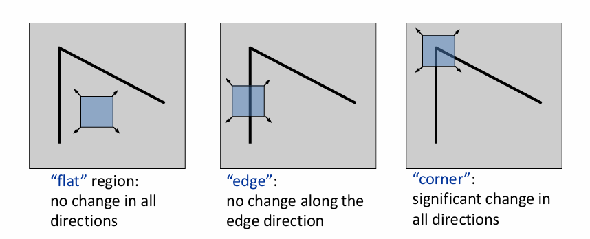
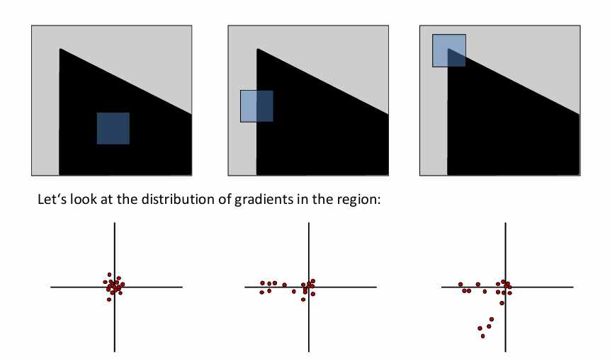
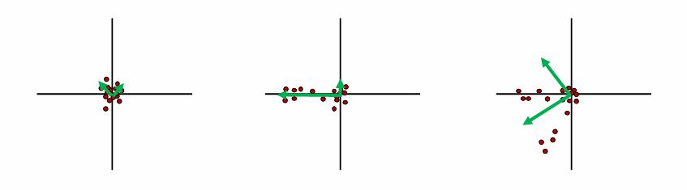
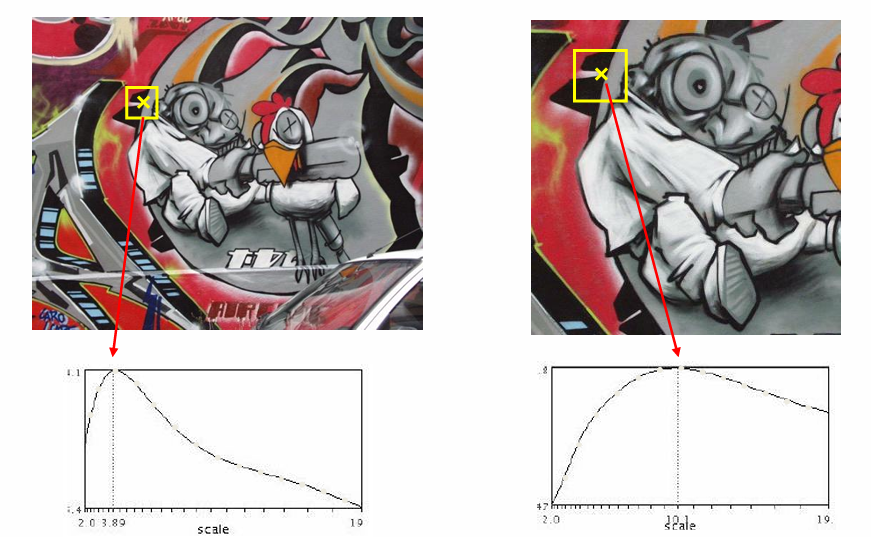
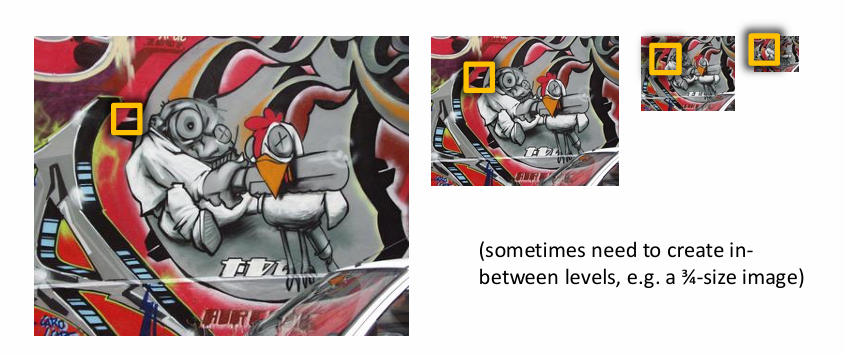
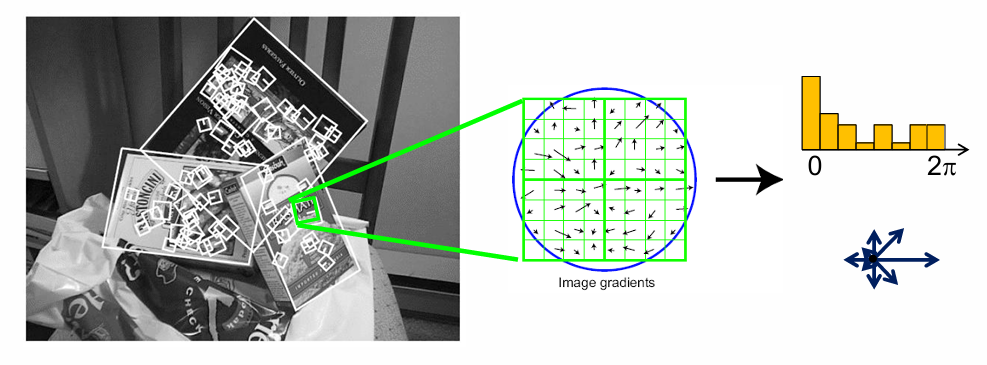
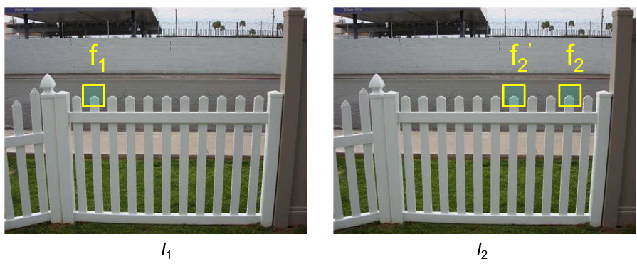
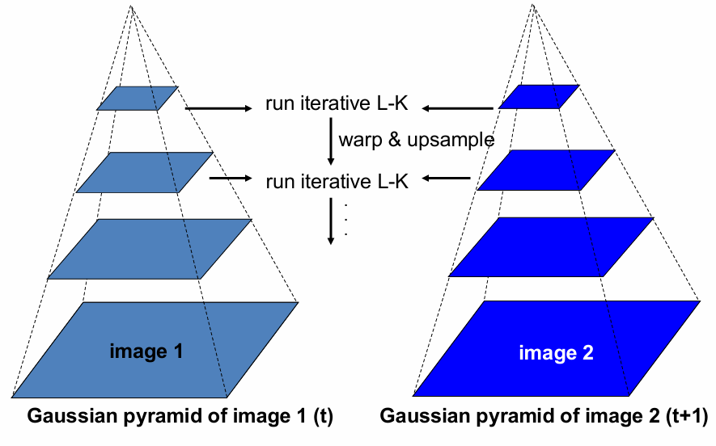

# Chapter4 Image Matching and Motion Estimation

***

## Image Matching

* 第一步：检测特征点（detection）
* 第二步：描述特征点（description）
* 第三步：匹配特征点（matching）

### Detection

什么样的点适合做特征点，即适合用于图像匹配？

**Corner Detection:**

假设以点为中心构造一个小的窗口，往任意一个方向移动一点，这个窗口的内容都会发生较大变化，则这样的点具有比较好的唯一性。

数学/程序如何描述？

研究梯度的分布。图像的梯度是二维的向量，每个像素对应一个梯度向量。如下图：图一没有梯度，图二梯度方向一致，图三梯度方向不一致。

**Principal Component Analysis (PCA):**

使用 $2\times 2$ 的协方差矩阵可以定量描述梯度分布。

PCA 的本质是对协方差矩阵做特征值分解，告诉我们哪一个方向上数据分散最散最均匀。因此，对上述 $2\times 2$ 协方差矩阵做特征值分解，得到两个特征值和两个特征向量。

第一个特征向量（对应大的特征值）告诉我们分布最散的方向，对应的特征值就是这个方向上的方差；第二个特征向量与第一个特征向量垂直，对应的特征值同样也是该方向上的方差。

图一：两个特征值都很小；图二：一个特征值大，一个小；图三：两个特征值都大。

若两个特征值都很大，则该点适合做特征点。

**The Harris Operator:**

$$f=\frac{\lambda_1\lambda_2}{\lambda_1+\lambda_2}=\frac{\text{determinant}(H)}{\text{trace}(H)}$$

综上，角点检测的步骤为：

* 计算每个像素的梯度
* 计算协方差矩阵
* 计算特征值，得到 $f$
* 进行非极大值抑制，即在一块区域内找到精准的最大值（角点）

**Repeatability:**

除了具有唯一性，特征点最好还要满足重复性。例如，两张人物的图片，选择眼睛作为特征点，则两张图片都要有明显露出的眼睛，这样才能匹配。即：对应位置的特征点要同时出现在两张图中，对应位置（比如眼睛对眼睛）的 $f$ 值最好要接近（不变性）。

* 假设发生亮度变化 $I\rightarrow aI+b$，那么梯度会变，$f$ 值会变，和 $a$ 有关，和 $b$ 无关。因此 Harris corner 对于亮度是 partially invariant 的
* 假设发生平移，那么梯度不变，$f$ 值不变，因此 Harris corner 对于平移是 invariant 的
* 假设发生旋转，那么梯度方向会变，协方差矩阵会变，但是协方差矩阵的特征值不变，因此 $f$ 值不变，因此 Harris corner 对于旋转是 invariant 的
* 假设发生缩放，梯度和 $f$ 值是否改变和窗口大小有关，因此 Harris corner 对于缩放不是 invariant 的

如何确定合适的窗口大小？

**Automatic Scale Selection:**

对于每张图每个像素点，尝试不同的窗口大小，得到不同的 $f$ 值，画出曲线，一定会有极大值，此时说明窗口内图案最像一个角，这个窗口称为这个像素点对应的**尺度**。

那么，在两张图像对应位置的最佳的 $f$ 值应该是一致的。假设对每个位置都使用不同的窗口取最值，这个最值关于缩放是不变的。

实际实现时，往往利用相对性：固定窗口的大小，对图像进行缩放，得到**图像金字塔（image pyramid）**：

### Description

如何将特征点编码成特征向量？

对于每个像素，我们需要同时关注周围的像素，即 image patch。

**Scale Invariant Feature Transform (SIFT Descriptor):**

对于作为特征点的像素，考虑其对应的 image patch，其中每个像素的梯度都有一个方向，在 $[0,2\pi)$ 范围内，统计便可得到直方图分布，这就是对应的特征向量。

SIFT对于亮度具有不变性，对于旋转，向量会整体平移。因此，为了保持旋转不变性，两张图的直方图进行朝向归一化，即最大的地方作为向量起点（第一个元素）。

对于缩放，由于 SIFT 和 Harris corner 是配合使用的，沿用尺度，因此缩放仍然具有不变性。

### Matching

现在，两张图片各自有一组特征点和对应的特征向量，如何进行匹配？我们常常使用**距离函数**。

但是很多时候会有问题。例如，当两张图像出现重复性纹理，前一张图的某个特征点在后一张图中有多个相似的特征点时，匹配有可能出错。

如何消除这种不可靠的匹配？

**Ratio Test:**

假设经过比较，第一张图中的 $f_1$ 和第二张图中的 $f_2$ 距离最近，和第二张图中的 $f_2'$ 距离次近。若

$$\text{ratio score}=\frac{\\|f_1-f_2\\|}{\\|f_1-f_2'\\|}$$

接近 $1$，说明 $f_1$ 和 $f_2$、$f_2'$ 分别的距离差不多，匹配不可靠，舍弃该匹配。

**Mutual Nearest Neighbor:**

我们可以反过来，给定第二张图中某个特征点，找第一张图中最接近的特征点。若相互为最近邻，则匹配可靠。

* $f_2$ 是 $f_1$ 对应到第二张图中的最近邻
* $f_1$ 是 $f_2$ 对应到第一张图中的最近邻

***

## Motion Estimation

motion estimation 研究的对象是**视频**。目标是**给定一个视频的前后两帧，求得第一帧的每个点在第二帧中对应的位置。**

“点”的定义有两种：

* **feature tracking**：研究特征点，目标稀疏
* **optical flow**：研究每个像素，目标稠密

解决这两个问题的传统方法都是 **Lucas-Kanade Method**。

### Lucas-Kanade Method

**Modeling:**

LK 算法有三个假设：

* **small motion**：两帧之间的运动比较小
* **brightness constancy**：同一个点在两帧中的亮度不变
* **spatial coherence**：相邻点的运动是相似的

给定 $t$ 时刻的图像（考虑灰度图），点对应的坐标为 $(x,y)$，则其灰度值为 $I(x,y,t)$。

假设其在 $t+1$ 时刻移动到了$(x+u,y+v)$，则其灰度值为 $I(x+u,y+v,t+1)$。

我们的目标：对于每个点 $(x,y)$，求解对应的 $(u,v)$。

根据 brightness constancy 假设，有：

$$I(x,y,t)=I(x+u,y+v,t+1)$$

对于每个点 $(x,y)$，都要求解对应的 $(u,v)$。

根据 small motion 假设，对右式进行泰勒展开：

$$I(x+u,y+v,t+1)\approx I(x,y,t) + I_x\cdot u + I_y\cdot v+I_t$$

其中，$I_x$ 和 $I_y$ 表示 $I$ 关于 $x$ 和 $y$ 的偏导数，即边缘检测器卷积的结果；$I_t$ 表示同一个位置 $(x,y)$ 灰度值的变化。

结合两式得到：

$$I_x\cdot u + I_y\cdot v + I_t = 0$$

$$\nabla I\cdot(u,v)^T+I_t=0$$

根据 spatial coherence 假设：对于当前关注的点 $(x,y)$，考虑 $5\times 5$ 的邻域窗口，窗口内有 25 个方程，这 25 个方程对应的 $(u,v)$ 近似相等：

$$\begin{bmatrix}
    I_x(p_1) & I_y(p_1) \\\
    I_x(p_2) & I_y(p_2) \\\
    \vdots & \vdots \\\
    I_x(p_{25}) & I_y(p_{25})
\end{bmatrix}
\begin{bmatrix}
    u \\\
    v
\end{bmatrix}
=-\begin{bmatrix}
    I_t(p_1) \\\
    I_t(p_2) \\\
    \vdots \\\
    I_t(p_{25})
\end{bmatrix}$$

形式化为

$$\underset{25\times 2}{A}\underset{2\times 1}{d}=\underset{25\times 1}{b}$$

上述方程组的方程个数大于变量个数，大部分情况下没有精确解，因此问题转化为求

$$\min\limits_d\\|Ad-b\\|^2$$

解析解为

$$(A^TA)d=A^Tb$$

!!! Note
    假设在这个窗口内，$I_x$ 和 $I_y$ 的均值为 $0$，则

    $$A^TA=\begin{bmatrix}
        I_x(p_1)^2+I_x(p_2)^2+\dots+I_x(p_{25})^2 & I_x(p_1)I_y(p_1)+I_x(p_2)I_y(p_2)+\dots+I_x(p_{25})I_y(p_{25}) \\\
        I_x(p_1)I_y(p_1)+I_x(p_2)I_y(p_2)+\dots+I_x(p_{25})I_y(p_{25}) & I_y(p_1)^2+I_y(p_2)^2+\dots+I_y(p_{25})^2
    \end{bmatrix}=25
    \begin{bmatrix}
        Var(x) & Cov(x,y) \\\
        Cov(x,y) & Var(y)
    \end{bmatrix}$$

    $A^TA$ 就是梯度向量的协方差矩阵（的倍数）。

    当 $A^TA$ 满秩时，有唯一解；当 $A^TA$ 不满秩时，说明有特征值为 $0$，有无穷多解。联系 detection 中的知识，存在为 $0$ 的特征值，说明该点特征非常不明显，这就是有无穷多解的原因，因为 LK 算法根本无法判断该点的运动。

**Coarse-to-Fine Optical Flow Estimation:**

LK 算法的三个假设是很严苛的。对于 small motion 的假设，我们常常通过 **降低分辨率** 来解决。

但是，降低分辨率有个问题，就是算出来的运动是不准确的，在低分辨率的图像上得到的位移，放回到高分辨率的图像上时，误差会被放大。

通过**图像金字塔**来解决这个问题。

考虑最上面一层，分辨率最低，在这上面应用 LK 算法，得到每个点粗略的位移。

接着，将该位移应用于下一层更高分辨率的图像上。假设上下两层的分辨率差为 2 倍，上一层图像上某个点向右位移 3 个像素，则在下一层图像上，该点向右位移 6 个像素。将该粗略的位移应用于时刻 $t$ 的图像上，再在应用后的图像和时刻 $t+1$ 的图像上使用 LK 算法，进一步得到更精确的位移，例如算出来 1 个像素的位移，则在当前这一层上，该点的总位移为 6+1=7 个像素。

从上往下不断迭代，获得越来越精确的位移。