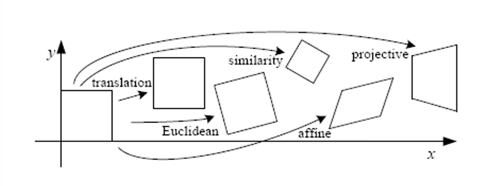
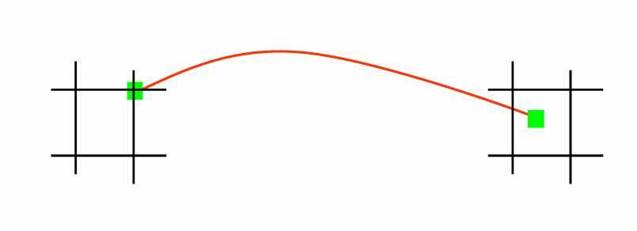
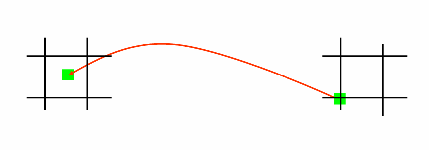

# Chapter5 Image Stitching

***

## Image Warping

**Parametric(Global) Warping:**

图像中每个像素变换方式一致，即可以统一使用同一个变换矩阵描述。

**投影变换（projective transformation / homography）：**

之前提到的仿射变换（affine transformation）：

$$
\begin{bmatrix}
    x' \\\
    y' \\\
    1
\end{bmatrix}
=\begin{bmatrix}
    a & b & t_x \\\
    c & d & t_y \\\
    0 & 0 & 1
\end{bmatrix}
\begin{bmatrix}
    x \\\
    y \\\
    1
\end{bmatrix}
$$

如果变换矩阵的最后一行不是 $[0~0~1]$，那么这个变换将进一步泛化到投影变换：

$$
\begin{bmatrix}
    x' \\\
    y' \\\
    1
\end{bmatrix}
=\begin{bmatrix}
    h_{00} & h_{01} & h_{02} \\\
    h_{10} & h_{11} & h_{12} \\\
    h_{20} & h_{21} & h_{22}
\end{bmatrix}
\begin{bmatrix}
    x \\\
    y \\\
    1
\end{bmatrix}$$

!!! Note
    投影变换的变换矩阵是 up-to-scale 的，即这 9 个参数同时乘以一个非零常数，变换不变。因此，投影变换的实际自由度是 8 个。

    
    
    * transformation: 2 个自由度
    * euclidean: 3 个自由度
    * similarity: 4 个自由度
    * affine: 6 个自由度
    * projective: 8 个自由度

哪些变换是投影变换？

* 相机不移动，只是旋转角度，拍摄的两张图之间的变换是投影变换
* 相机移动了，但是拍摄的是一个平面，拍摄的两张图之间的变换是投影变换

**Forward Warping & Inverse Warping:**

给定一个变换矩阵，怎么把一张图变换到另一张图？

一个直观的想法是 **forward warping**：把原图像每个像素变换到新的位置，但问题是变换后坐标不一定是整数。

因此我们应该考虑 **inverse warping**：先给新的图像定义好网格，每个像素点反过来找原图中对应的位置，虽然不一定在整数位置，但可以用插值法得到 rgb 值。

## Image Stitching

要想进行图像拼接，首先要知道两张图之间的变换关系，才能进行变换对齐。

$$\begin{bmatrix}
    x'\\\
    y'\\\
    1
\end{bmatrix}=T\begin{bmatrix}
    x\\\
    y\\\
    1
\end{bmatrix}$$

怎么求 $T$？

要给定方程，才能解方程。即每个 $(x,y)$ 对应哪个 $(x',y')$。使用特征匹配，每对匹配可以得到方程，有了方程组后就能求解 $T$。

此时，已知量是 $(x,y)$ 和 $(x',y')$，未知量是变换矩阵 $T$ 的元素。

**Affine Transformation Case:**

$$
\begin{bmatrix}
    x' \\\
    y' \\\
    1
\end{bmatrix}
=\begin{bmatrix}
    a & b & c \\\
    d & e & f \\\
    0 & 0 & 1
\end{bmatrix}
\begin{bmatrix}
    x \\\
    y \\\
    1
\end{bmatrix}
=\begin{bmatrix}
    ax+by+c \\\
    dx+ey+f \\\
    1
\end{bmatrix}$$

$$
\begin{bmatrix}
    x' \\\
    y'
\end{bmatrix}
=\begin{bmatrix}
    x & y & 1 & 0 & 0 & 0 \\\
    0 & 0 & 0 & x & y & 1 \\\
\end{bmatrix}
\begin{bmatrix}
    a \\\
    b \\\
    c \\\
    d \\\
    e \\\
    f
\end{bmatrix}
$$

对于仿射变换，需要求解 6 个参数。每一对匹配得到两个方程，因此至少需要 3 对匹配。

假设有 $n$ 对匹配：

$$
\begin{bmatrix}
    x_1 & y_1 & 1 & 0 & 0 & 0 \\\
    0 & 0 & 0 & x_1 & y_1 & 1 \\\
    x_2 & y_2 & 1 & 0 & 0 & 0 \\\
    0 & 0 & 0 & x_2 & y_2 & 1 \\\
    \vdots & \vdots & \vdots & \vdots & \vdots & \vdots \\\
    x_n & y_n & 1 & 0 & 0 & 0 \\\
    0 & 0 & 0 & x_n & y_n & 1
\end{bmatrix}
\begin{bmatrix}
    a \\\
    b \\\
    c \\\
    d \\\
    e \\\
    f
\end{bmatrix}
=\begin{bmatrix}
    x_1' \\\
    y_1' \\\
    x_2' \\\
    y_2' \\\
    \vdots \\\
    x_n' \\\
    y_n'
\end{bmatrix}
$$

形式化为

$$\underset{2n\times 6}{A}\underset{6\times 1}{h}=\underset{2n\times 1}{b}$$

同样是方程个数大于变量个数，可以用最小二乘法求近似解，与之前同理。

**Projective Transformation Case:**

$$
\begin{bmatrix}
    x_1 & y_1 & 1 & 0 & 0 & 0 & -x_1'x_1 & -x_1'y_1 & -x_1' \\\
    0 & 0 & 0 & x_1 & y_1 & 1 & -y_1'x_1 & -y_1'y_1 & -y_1' \\\
    x_2 & y_2 & 1 & 0 & 0 & 0 & -x_2'x_2 & -x_2'y_2 & -x_2' \\\
    0 & 0 & 0 & x_2 & y_2 & 1 & -y_2'x_2 & -y_2'y_2 & -y_2' \\\
    \vdots & \vdots & \vdots & \vdots & \vdots & \vdots & \vdots & \vdots & \vdots \\\
    x_n & y_n & 1 & 0 & 0 & 0 & -x_n'x_n & -x_n'y_n & -x_n' \\\
    0 & 0 & 0 & x_n & y_n & 1 & -y_n'x_n & -y_n'y_n & -y_n'
\end{bmatrix}
\begin{bmatrix}
    h_{00} \\\
    h_{01} \\\
    h_{02} \\\
    h_{10} \\\
    h_{11} \\\
    h_{12} \\\
    h_{20} \\\
    h_{21} \\\
    h_{22}
\end{bmatrix}
=\begin{bmatrix}
    0 \\\
    0 \\\
    0 \\\
    0 \\\
    \vdots \\\
    0 \\\
    0
\end{bmatrix}
$$

形式化为

$$\underset{2n\times 9}{A}\underset{9\times 1}{h}=\underset{2n\times 1}{0}$$

由于投影变换的自由度实际只有 8 个，因此需要进行约束，例如让 $h_{22}=1$，或者让 $h$ 的模长为 $1$。

如果考虑后者，则转换后的问题 $\min\limits_h\\|Ah-0\\|^2$ 最终解得的 $h$ 是 $A^TA$ 的最小特征值对应的特征向量。

**Outlier:**

特征匹配会有错误匹配，称为 outlier，也常常使用 RANSAC 来消除。

每次选择几对特征匹配，求解一个 $h$，投票，重复多次，选择票数最多的那个 $h$。

问题在于怎么投票。对于当前候选的 $h$，第一张图像中的任意一个特征点 $(x,y)$ 都可以通过 $h$ 得到变换预测位置 $(x',y')$，再和第二张图像中真正对应的特征点比较，如果距离小于某个阈值，则投一票。

综上：图像拼接步骤：

* 特征匹配
* 求解变换矩阵（可考虑使用 RANSAC）
* 图像变形并对齐，叠起来
* 图像融合