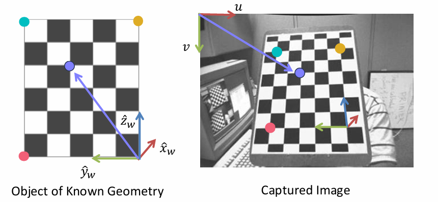
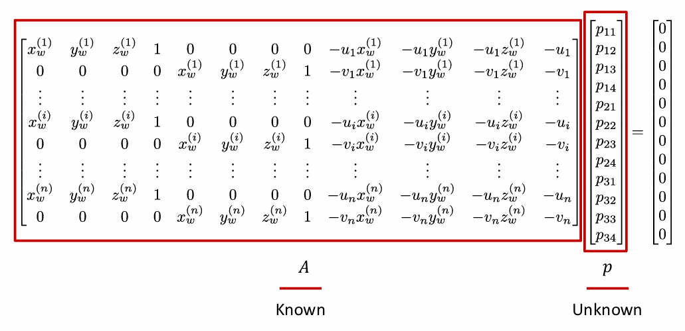
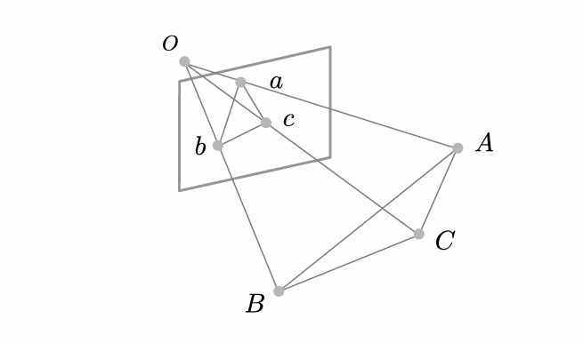
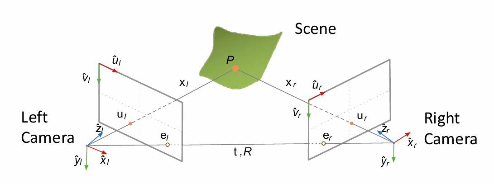
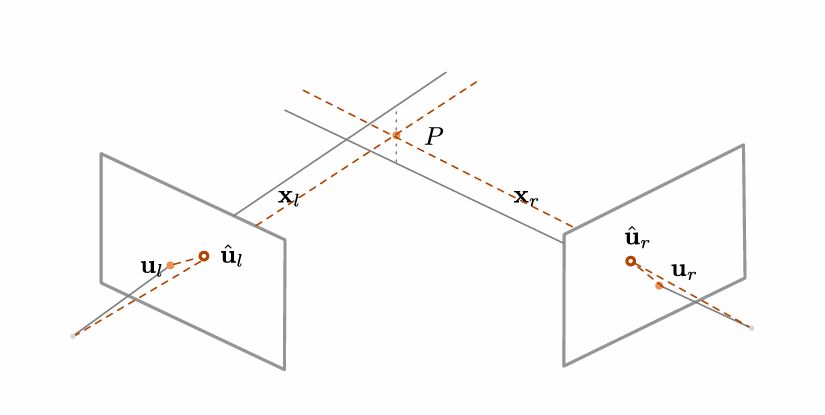
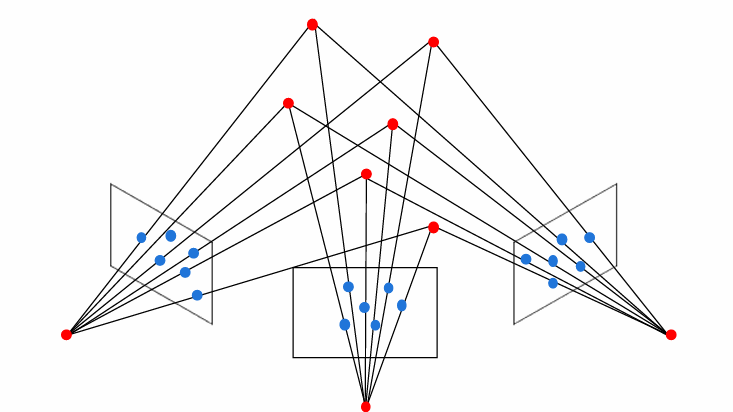
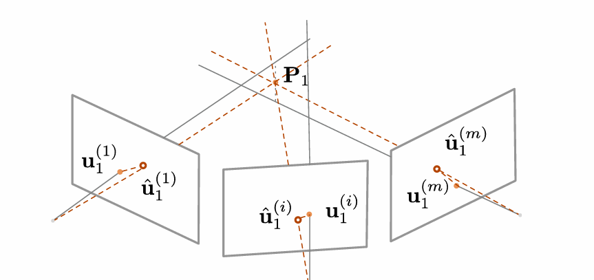

# Chapter6 Structure from Motion (SfM)

***

输入：一个场景不同角度的图片，相机内参

输出：场景的三维点云，相机的位置与朝向（相机外参）

SfM 相关的问题有以下三个：

* 如何将世界坐标系下的三维点映射到像素坐标系下的二维点（camera model）
* 如何计算相机在世界坐标系下的位置和朝向（camera calibration）
* 如何从多张图片中重建三维结构（structure from motion）

*** 

## Q1: Camera Model

输入：世界坐标系下的三维点，相机的位置与朝向，相机的相关参数

输出：像素坐标系下的二维点

以上变换经历三个步骤：

* 坐标变换：世界坐标系下的三维点 → 相机坐标系下的三维点
* 透视投影：相机坐标系下的三维点 → 二维平面上的二维点
* 光栅化：二维平面上的二维点 → 像素坐标系下的二维点

每个步骤本质上都是一个**矩阵乘法**，坐标变换的矩阵为**外参矩阵（extrinsic matrix）**，与相机的位置和朝向有关；透视投影和光栅化的矩阵为**内参矩阵（intrinsic matrix）**，与相机本身的参数有关。

### 坐标变换

世界坐标系下的三维点：

$$\mathbf{x}_w=\begin{bmatrix}
    x_w \\\
    y_w \\\
    z_w
\end{bmatrix}$$

相机在世界坐标系下的位置：

$$\mathbf{c}_w$$

相机在世界坐标系下的朝向，表示为 $3\times 3$ 的旋转矩阵，每一行表示相机坐标系的 $x$、$y$、$z$ 轴在世界坐标系下的朝向：

$$R=\begin{bmatrix}
    r_{11} & r_{12} & r_{13} \\\
    r_{21} & r_{22} & r_{23} \\\
    r_{31} & r_{32} & r_{33}
\end{bmatrix}$$

!!! Note
    $R$ 虽然有 9 个元素，但实际上只有 3 个自由度。

相机坐标系下的三维点可通过以下公式计算得到：

$$\mathbf{x}_c=R(\mathbf{x}_w-\mathbf{c}_w)=R\mathbf{x}_w-R\mathbf{c}_w\equiv R\mathbf{x}_w+\mathbf{t}$$

也就是对 $\mathbf{x}_w-\mathbf{c}_w$ 在相机的三个轴上做投影。其中，$\mathbf{t}\equiv-R\mathbf{c}_w$

写成齐次坐标的形式：

$$\tilde{\mathbf{x}}\_c=
\begin{bmatrix}
    x_c \\\
    y_c \\\
    z_c \\\
    1
\end{bmatrix}=
\begin{bmatrix}
    r_{11} & r_{12} & r_{13} & t_x \\\
    r_{21} & r_{22} & r_{23} & t_y \\\
    r_{31} & r_{32} & r_{33} & t_z \\\
    0 & 0 & 0 & 1
\end{bmatrix}
\begin{bmatrix}
    x_w \\\
    y_w \\\
    z_w \\\
    1
\end{bmatrix}$$

其中，外参矩阵即为

$$M_{ext}=\begin{bmatrix}
    r_{11} & r_{12} & r_{13} & t_x \\\
    r_{21} & r_{22} & r_{23} & t_y \\\
    r_{31} & r_{32} & r_{33} & t_z \\\
    0 & 0 & 0 & 1
\end{bmatrix}$$

### 透视投影

二维平面上的点可以通过以下公式计算得到：

$$\mathbf{x}_i=\begin{bmatrix}
    x_i \\\
    y_i
\end{bmatrix}=f\cdot\begin{bmatrix}
    \frac{x_c}{z_c} \\\
    \frac{y_c}{z_c}
\end{bmatrix}$$

### 光栅化

设横向的像素密度为 $m_x$，纵向的像素密度为 $m_y$，横向的像素数量的一半为 $c_x$，纵向的像素数量的一半为 $c_y$，则像素坐标系下的二维点可以通过以下公式计算得到：

$$u=m_xx_i+c_x$$

$$v=m_yy_i+c_y$$

将透视投影和光栅化合并，并写成齐次坐标的形式：

$$\tilde{\mathbf{u}}=\begin{bmatrix}
    u \\\
    v \\\
    1
\end{bmatrix}\cong\begin{bmatrix}
    \tilde{u} \\\
    \tilde{v} \\\
    \tilde{w}
\end{bmatrix}=\begin{bmatrix}
    f_x & 0 & c_x & 0 \\\
    0 & f_y & c_y & 0 \\\
    0 & 0 & 1 & 0
\end{bmatrix}\begin{bmatrix}
    x_c \\\
    y_c \\\
    z_c \\\
    1
\end{bmatrix}$$

其中，$f_x\equiv m_xf$，$f_y\equiv m_yf$，内参矩阵即为

$$M_{int}=\begin{bmatrix}
    f_x & 0 & c_x & 0 \\\
    0 & f_y & c_y & 0 \\\
    0 & 0 & 1 & 0
\end{bmatrix}$$

综上，投影矩阵 $P$ 记为内参矩阵和外参矩阵的乘积：

$$P=M_{int}M_{ext}$$

$$\begin{bmatrix}
    \tilde{u} \\\
    \tilde{v} \\\
    \tilde{w}
\end{bmatrix}=\begin{bmatrix}
    p_{11} & p_{12} & p_{13} & p_{14} \\\
    p_{21} & p_{22} & p_{23} & p_{24} \\\
    p_{31} & p_{32} & p_{33} & p_{34}
\end{bmatrix}\begin{bmatrix}
    x_w \\\
    y_w \\\
    z_w \\\
    1
\end{bmatrix}$$

***

## Q2: Camera Calibration

### Camera Calibration Procedure

输入：多组世界坐标系下的三维点和对应的像素坐标系下的二维点

输出：内参矩阵和外参矩阵

使用**棋盘格**。以棋盘格本身为世界坐标系，那么棋盘格上每一个角点的 $\mathbf{x}_w$ 都是已知的。

现在拿相机拍一张棋盘格的图像，使用特定算法检测出角点，这样也知道了棋盘格上每一个角点的像素坐标 $\mathbf{u}$。

由上一部分的公式：

$$\begin{bmatrix}
    \tilde{u} \\\
    \tilde{v} \\\
    \tilde{w}
\end{bmatrix}=\begin{bmatrix}
    p_{11} & p_{12} & p_{13} & p_{14} \\\
    p_{21} & p_{22} & p_{23} & p_{24} \\\
    p_{31} & p_{32} & p_{33} & p_{34}
\end{bmatrix}\begin{bmatrix}
    x_w \\\
    y_w \\\
    z_w \\\
    1
\end{bmatrix}$$

我们可以得到第 $i$ 组对应点提供的两个方程：

$$u^{(i)}=\frac{p_{11}x_w^{(i)}+p_{12}y_w^{(i)}+p_{13}z_w^{(i)}+p_{14}}{p_{31}x_w^{(i)}+p_{32}y_w^{(i)}+p_{33}z_w^{(i)}+p_{34}}$$

$$v^{(i)}=\frac{p_{21}x_w^{(i)}+p_{22}y_w^{(i)}+p_{23}z_w^{(i)}+p_{24}}{p_{31}x_w^{(i)}+p_{32}y_w^{(i)}+p_{33}z_w^{(i)}+p_{34}}$$

把 $P$ 的 12 个元素展开成列向量 $p$，可以用与之前类似的方法，得到

也就是说，我们要求解

$$Ap=0$$

由于 $p$ 尺度无关，因此需要加上约束条件，要么最后一个元素为 $1$，要么 $||p||^2=1$。加上约束条件后，一般不会有精确解，因此转变成优化问题，求解

$$\operatorname*{arg\,min}_p\\|Ap\\|^2$$

解得 $p$ 之后恢复成矩阵 $P$，通过 **QR 分解**获得内参矩阵和外参矩阵。

### Visual Localization Problem

Visual Localization Problem 也称为 **Perspective-n-Point Problem (PnP)**，其与 camera calibration problem 的区别在于，前者内参矩阵已知，后者内参矩阵未知。

输入：多组世界坐标系下的三维点和对应的像素坐标系下的二维点，以及内参矩阵

输出：外参矩阵

**Direct Linear Transform (DLT):**

直接像 camera calibration 那样求出 $P$，再解出外参矩阵。

**P3P:**

如图，$a$、$b$、$c$ 为像素坐标系下的二维点，已知。

像平面到相机光心的距离为 $f$，因此如果把这个平面放在相机坐标系下的三维空间内，那么 $a$、$b$、$c$ 的三维坐标也已知，于是射线 $Oa$、$Ob$、$Oc$ 也已知。

$A$、$B$、$C$ 为世界坐标系下的三维点，也已知。因此，$AB$、$BC$、$AC$ 也已知。

在相机坐标系下，$A$、$B$、$C$ 分别在射线 $Oa$、$Ob$、$Oc$ 上，再加上 $AB$、$BC$、$AC$ 的长度限制，就可以解出 $A$、$B$、$C$ 在相机坐标系下的坐标。

最后，就可以还原出相机在世界坐标系下的位置和朝向，即外参矩阵。

!!! Note
    这样做会得到四组解，还需要额外一对点来确定正确解。因此，对于 visual localization problem，至少需要四对点。

**Minimize the Reprojection Error:**

转化成优化问题：找到最佳的 $R$ 和 $\mathbf{t}$，能够使

$$\sum\limits_i\\|p_i-M_{int}(RP_i+\mathbf{t})\\|^2$$

取最小值。其中，$p_i$ 为已知的二维像素坐标，$M_{int}(RP_i+\mathbf{t})$ 将原本的三维点 $P_i$ 投影到二维像素坐标系下。我们希望投影后的点与实际观测到的点尽可能接近。

可以使用 P3P 初始化，然后使用 Gauss-Newton 法进行优化。

***

## Q3: Structure from Motion

输入：两张图像和对应相机的内参

输出：重建出的三维点云和对应相机的外参

接下来，我们先想办法求解相机外参，即两个相机相对的平移和旋转（以左相机的相机坐标系为世界坐标系）。

### Epipolar Geometry 对极几何

* $\mathbf{u}_l$：三维点 $P$ 在左相机二维像素坐标，与右相机对应点 $\mathbf{u}_r$ 匹配，已知
* $\mathbf{u}_r$：三维点 $P$ 在右相机二维像素坐标，与左相机对应点 $\mathbf{u}_l$ 匹配，已知
* $\mathbf{x}_l$：三维点 $P$ 在左相机坐标系下的三维坐标，未知
* $\mathbf{x}_r$：三维点 $P$ 在右相机坐标系下的三维坐标，未知
* $R$：右相机坐标系相对于左相机坐标系的旋转矩阵，未知
* $\mathbf{t}$：右相机坐标系相对于左相机坐标系的平移向量，未知

对极几何描述了 $\mathbf{u}_l$ 和 $\mathbf{u}_r$ 的变换关系，即相机之间的变换关系（$\mathbf{t}$ 和 $R$）。

**极点（epipole）：**

极点在图中表示为 $e_l$ 和 $e_r$，是两个相机在对方图像平面上的投影（不一定在画面里），对于每一对给定的相机都是唯一的。

**对极平面（epipolar plane）：**

对极平面由三维点 $P$ 和两个相机中心 $O_l$、$O_r$ 组成，每个三维点都有自己的对极平面。

如图所示，对极平面的三条边都有各自的意义：

* $\vec{O_lP}=\mathbf{x}_l$：描述的是三维点$P$在左相机坐标系下的位置
* $\vec{O_rP}=\mathbf{x}_r$：描述的是三维点$P$在右相机坐标系下的位置
* $\vec{O_lO_r}=\mathbf{t}$：描述的是右相机在左相机坐标系下的位置，即两个相机的相对位移

**对极约束（epipolar constraint）：**

假设对极平面的法向量：

$$\mathbf{n}=\mathbf{t}\times\mathbf{x}_l$$

此时有

$$\mathbf{x}_l\cdot\mathbf{n}=\mathbf{x}_l\cdot(\mathbf{t}\times\mathbf{x}_l)=0$$

将点乘和叉乘展开成矩阵形式：

$$\begin{bmatrix}
    x_l & y_l & z_l
\end{bmatrix}
\begin{bmatrix}
    0 & -t_z & t_y \\\
    t_z & 0 & -t_x \\\
    -t_y & t_x & 0
\end{bmatrix}
\begin{bmatrix}
    x_l \\\
    y_l \\\
    z_l
\end{bmatrix}=0$$

中间的矩阵记为 $T_{\times}$。已知

$$\mathbf{x}_l=R\mathbf{x}_r+\mathbf{t}$$

!!! Note
    这里的 $R$ 和 $t$ 与上面的定义略有区别。

代入上述的矩阵形式，最终得到

$$\begin{bmatrix}
    x_l & y_l & z_l
\end{bmatrix}
\begin{bmatrix}
    e_{11} & e_{12} & e_{13} \\\
    e_{21} & e_{22} & e_{23} \\\
    e_{31} & e_{32} & e_{33}
\end{bmatrix}
\begin{bmatrix}
    x_r \\\
    y_r \\\
    z_r
\end{bmatrix}=0$$

这个公式就是对极约束。我们记中间的矩阵为 $E$，称为**本质矩阵（essential matrix）**，它实际上是

$$E=T_{\times}R$$

只要我们知道了 $E$，就可以通过 **SVD 奇异值分解**，把 $E$ 分解为 $T_\times$（对应平移）和 $R$（对应旋转）。

问题是如何求解 $E$？我们需要获得若干组 $(\mathbf{x}_l,\mathbf{x}_r)$ 来解这个方程，但我们现在只有若干组 $(\mathbf{u}_l,\mathbf{u}_r)$。

**Incorporating the Image Coordinates:**

对于左相机：

$$z_l\begin{bmatrix}
    u_l \\\
    v_l \\\
    1
\end{bmatrix}=K_l
\begin{bmatrix}
    x_l \\\
    y_l \\\
    z_l
\end{bmatrix}$$

对于右相机：

$$z_r\begin{bmatrix}
    u_r \\\
    v_r \\\
    1
\end{bmatrix}=K_r
\begin{bmatrix}
    x_r \\\
    y_r \\\
    z_r
\end{bmatrix}$$

其中，$K_l$ 和 $K_r$ 分别为左、右相机的内参矩阵（已知）。

!!! Note
    这里的 $K_l$ 和 $K_r$ 是 $3\times 3$ 矩阵，不是之前提到的 $3\times 4$ 矩阵，其实本质不变，只是去掉没什么用的最后一列。

因此

$$\mathbf{x}_l^T=\begin{bmatrix}
    u_l & v_l & 1
\end{bmatrix}z_lK_l^{-1T}$$

$$\mathbf{x}_r=K_r^{-1}z_r\begin{bmatrix}
    u_r \\\
    v_r \\\
    1
\end{bmatrix}$$

代入原式，得到

$$\begin{bmatrix}
    u_l & v_l & 1
\end{bmatrix}z_lK_l^{-1T}EK_r^{-1}z_r\begin{bmatrix}
    u_r \\\
    v_r \\\
    1
\end{bmatrix}=0$$

去掉常数 $z_l$ 和 $z_r$，将中间的矩阵记为 $F$，称为**基础矩阵（fundamental matrix）**，得到

$$F=K_l^{-1T}EK_r^{-1}$$

$$E=K_l^TFK_r^T$$

有了多组 $(\mathbf{u}_l,\mathbf{u}_r)$，就可以用类似之前的方法解 $F$；解出 $F$ 后，由于内参矩阵已知，可以解 $E$；解出 $E$ 后，可以通过 SVD 分解得到相机的相对变换 $\mathbf{t}$ 和 $R$。

### Triangulation 三角化

知道了一组对应点 $(\mathbf{u}_l,\mathbf{u}_r)$，以及两个相机的相对位置与朝向 $\mathbf{t}$ 和 $R$ 后，就可以得到两条射线，射线交点即为三维点 $P$（得到在世界坐标系/左相机坐标系下的三维坐标）。

多组对应点可以得到多个三维点，最终得到三维点云。

!!! Note
    **为什么知道了一个相机的内参和外参，不能直接把图像上的点直接还原到世界坐标系下，而是要通过两个相机的射线求交获得？**

    如果考虑从世界坐标系到图像像素坐标系，那么是一个从三维到二维的投影过程，深度信息丢失，因此是**不可逆**的！

但大多数情况下，两条射线并不一定能完美地相交，因此这里依然可以考虑**重投影误差（reprojection error）**。目标是得到一个三维点 $P$，使得它投影回两张图像后，得到的重投影 $(\hat{\mathbf{u}}_l, \hat{\mathbf{u}}_r)$ 和对应的二维点 $(\mathbf{u}_l,\mathbf{u}_r)$ 尽可能接近：

$$\text{cost}(\mathbf{P})=\\|\mathbf{u}_l-\hat{\mathbf{u}}_l\\|^2+\\|\mathbf{u}_r-\hat{\mathbf{u}}_r\\|^2$$

### Multi-frame Structure from Motion

现在考虑多张图像的情况。如何得到三维点云和相机外参？

* 用两张图，按照上述过程得到三维点云和两个相机的外参
* 用第三张图和第二张图进行特征匹配
* 对于第三张图进行视觉定位，得到第三个相机的外参
* 第三张图和第二张图的特征匹配可能会带来新的三维点，加入到点云中
* 以此类推

上述过程称为**序列化（增量式）SfM**，问题是会有累计误差。

解决方法是：

$$\\|\mathbf{u}_l-\hat{\mathbf{u}}_l\\|^2+\\|\mathbf{u}_r-\hat{\mathbf{u}}_r\\|^2$$

依然是考虑这个重投影误差，但这个时候优化的参数不仅仅只有 $P$ 的三维坐标，还有相机的内外参。

按照上述的步骤得到初始的结果后，进行**集束优化（bundle adjustment）**，利用下面的误差同时优化所有的三维点和相机参数：

$$E(P_{proj},\mathbf{P})=\sum\limits_{i=1}^m\sum\limits_{j=1}^n\\|u_j^{(i)}-P_{proj}^{(i)}\mathbf{P}_j\\|^2$$

变量说明：

* $P_{proj}$：投影矩阵（包含内外参）
* $\mathbf{P}$：三维点
* $m$：相机数量
* $n$：三维点数量

!!! Note
    注意有些点在某些图上是看不到的，这些点不计入重投影误差。