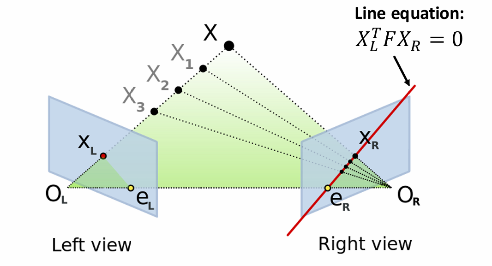
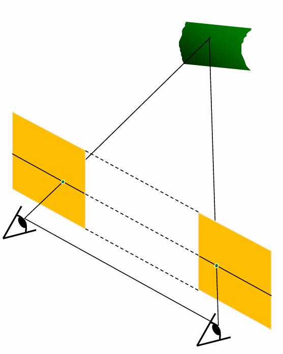
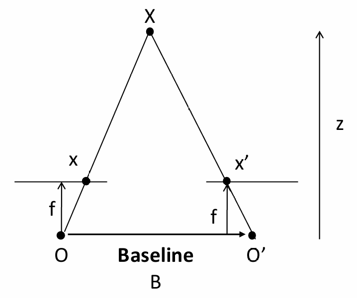
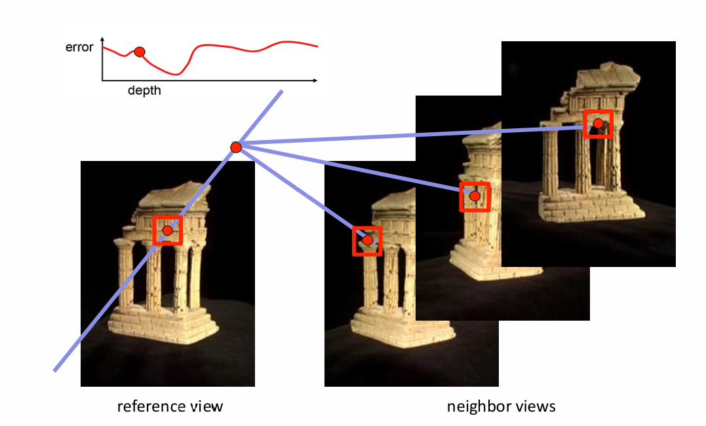
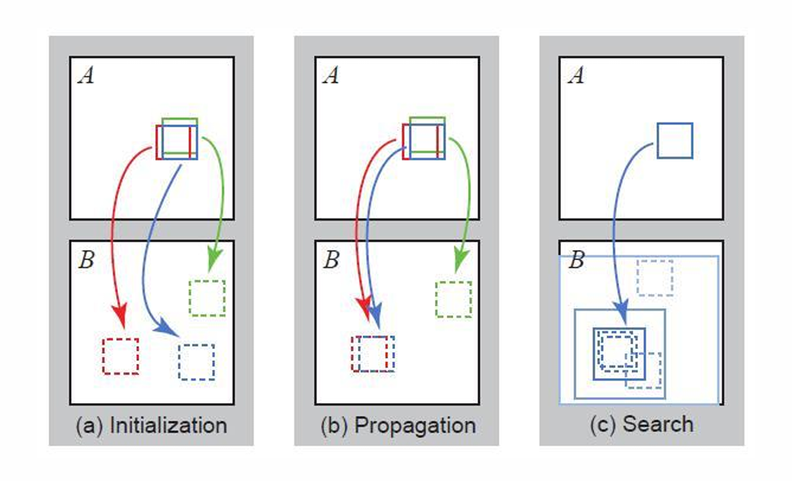
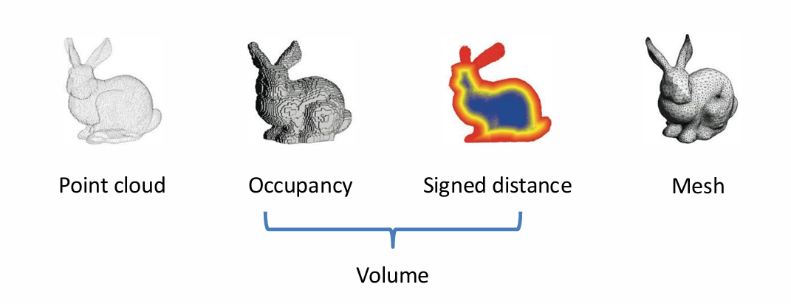
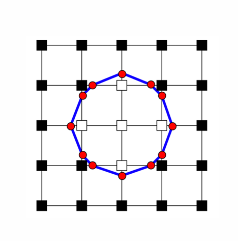
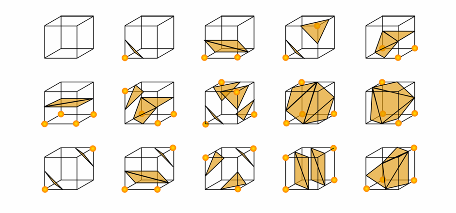

# Chapter7 Depth Estimation and 3D Reconstruction

***

## Stereo Matching

输入：两张图像和对应相机的内外参

输出：深度图

但是，之前的匹配只针对特征点，现在如果要得到深度图，就需要对每一个像素都进行匹配。

**对极几何：**

利用之前的对极几何，我们可以得到以下信息：

若我们想知道左图中的 $X_L$ 在右图中的对应点 $X_R$，设对应的三维点为 $X$，则 $X_R$ 一定在右图的一条直线上，这条直线就是 $O_LX_L$ 在右图中的投影。直线方程：

$$X_L^TFX_R=0$$

因此，要匹配左图的某个像素，只要在右图的对应直线范围内搜索即可。

看两个像素是否匹配，可以直接比较两个像素所在窗口的像素值接近程度，这样做是因为两个相机同时拍摄，光照变化不大。

**视差（disparity）：**

当两个相机高度一致，焦距一致，朝向一致时，目标直线就是水平线。

这个时候，两张图对应像素的 $u$ 坐标不等，$v$ 坐标相等。定义视差为

$$d=u_L - u_R=\frac{Bf}{z}$$

其中，$B$ 为相机间距，$f$ 为焦距，$z$ 为深度。

**图像校正（Image Rectification）：**

当相机不满足上述条件时，可以通过图像校正将图像变换为满足条件的样子（投影变换），从而简化匹配过程。

综上，stereo matching 的步骤为：

* 相机标定（获得内外参）
* 图像校正（让相机满足条件）
* 像素匹配
* 计算视差
* 计算深度

***

## Multi-View Stereo (MVS)

如果给定的图像和相机数量更多，又该如何获得深度图？

选择一张参考图像（一般选最中间的图），要求解这张图像每个像素的深度。

若所有相机参数已通过 SfM 获得，那么，对于这张参考图像中的某个像素，我们可以让其尝试不同的深度。如果假设为某个深度，那么可以获得该像素对应的三维点的坐标，再将其投影到其他图像上，看投影点的像素值和参考图像的像素值是否相似。

只需要找到误差最小时的深度值即可。

**PatchMatch:**

PatchMatch 是一种加速 MVS 的方法.基于的假设是：相邻像素的某个值相似。

第一步：

对每个像素进行随机匹配，获得随机的值（大部分都是错的）。

第二步：

传播。例如图中的红色像素，将其值传播给临近的蓝色像素。若传播后误差减小，则更新蓝色像素的值为传播过来的值，否则保持不变。

第三步：

蓝色像素保留了传播过来的值后，在其周围很小的范围内微调值，看看是否能让误差更小，若能则更新。

重复进行第二步和第三步，直到收敛。

将 PatchMatch 应用在 MVS 上：随机初始化所有像素的深度值，然后进行传播和微调，直到收敛。

***

## 3D Reconstruction

**3D Representations:**

* 点云（point cloud）
* 占用率（occupancy）：，每个体素如果被占据则为 $1$，否则为 $0$
* 距离场（signed distance field, SDF）：三维空间中每个体素到最近表面的距离
* 网格（mesh）

!!! Success "Definition"
    **体素：**

    即三维的像素，常用立方体

### 3D Surface Reconstruction

先通过 SfM，可以获得相机的参数。

再通过 MVS，可以获得每张图像的深度图。

接下来，如何将多个深度图转换为最终的三维表示？

深度图 → 体素（occupancy / sdf） → 网格

$~$

**泊松重建（Poisson reconstruction）：深度图 → 体素**

第一步：将深度图转换为点云。

每个像素可以知道在三维空间上的哪条射线上（相机参数），再加上深度，就可以知道三维坐标。

多张图像可以得到多组三维点，合并后形成点云（反投影）。

第二步：计算点云中每个点的法向量。

使用 PCA，找到分布最稀疏的方向，即沿着表面的方向，然后就可以得到垂直于表面的方向，即法向量。

第三步：得到体素表示。

我们已经知道了点和对应的法向量，每个点的梯度方向应该与法向量方向一致，以此作为目标函数进行优化。

!!! Note
    这里讲述的泊松重建最后得到的是 $0$ 或 $1$ 的占用率表示。

**移动立方体（marching cubes）：体素 → 网格**

对于二维的情况，假设白色像素为 $1$，黑色像素为 $0$，那么边界就会经过黑白相邻的像素边界：

对于三维的情况同理，但更复杂一些，有一些特殊的范式：

