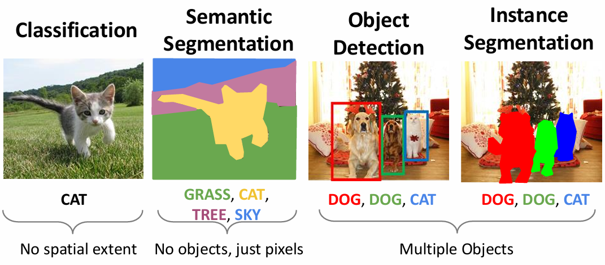
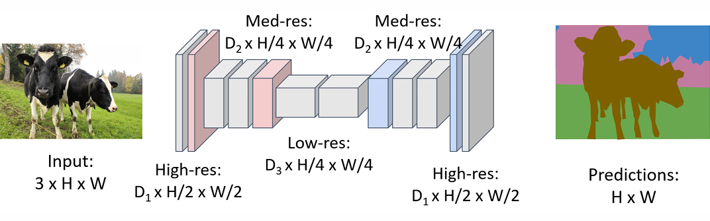
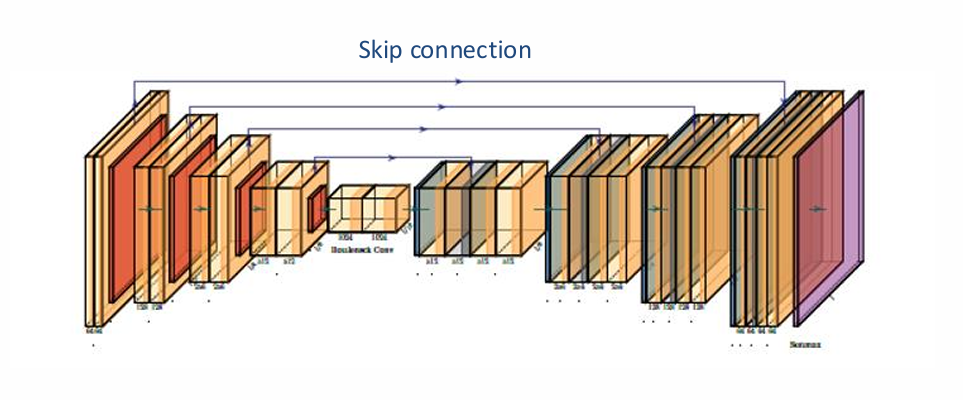
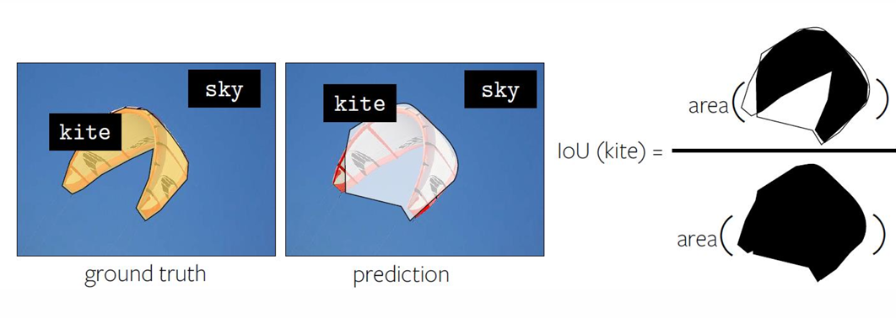
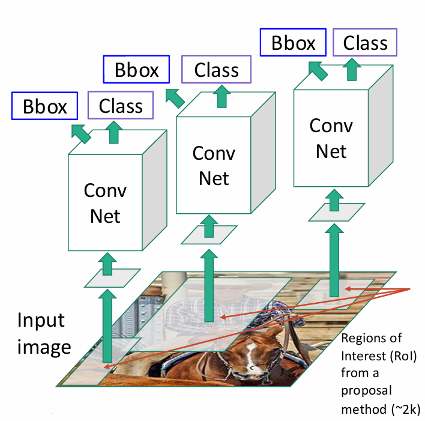
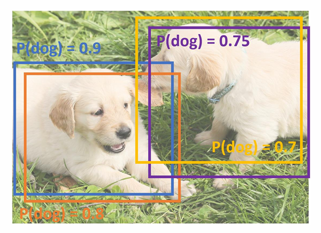
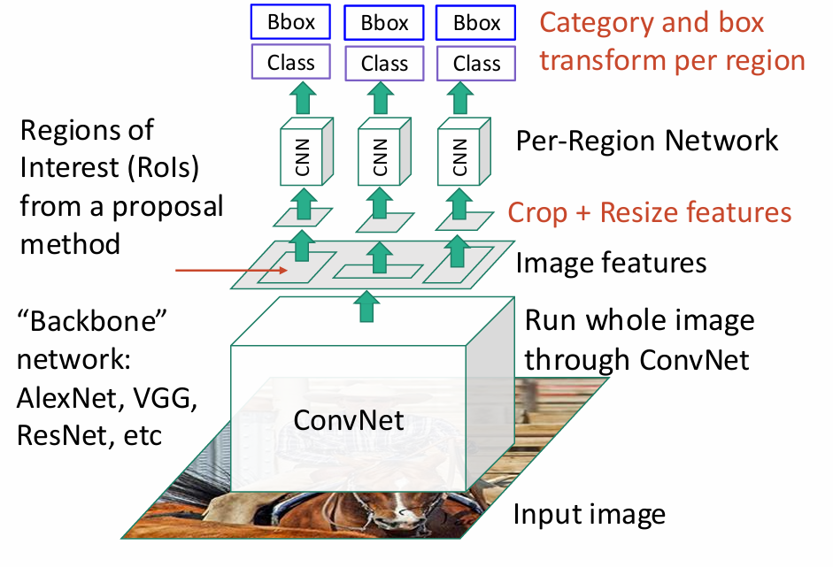
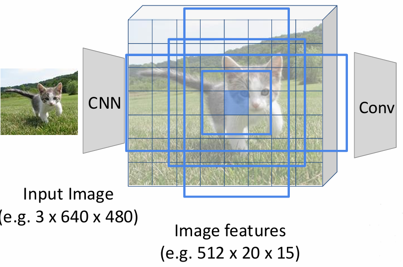
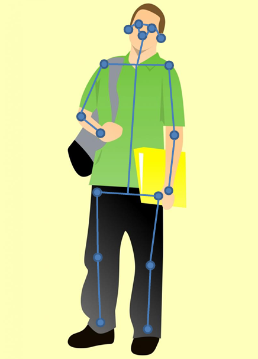
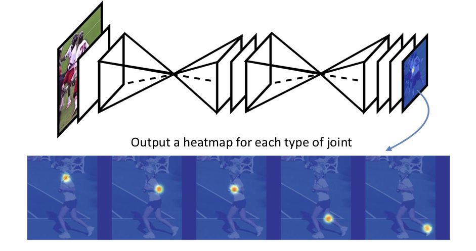

# Chapter8 Recognition

***

## Semantic Segmentation

输入：图像

输出：每个像素的类别标签（不区分实例）

回忆之前的图像分类，直接使用卷积神经网络便可。对于语义分割，也可以对于每个像素裁剪出一个窗口，输入给卷积神经网络进行分类。

但是，这有两个问题：

* 速度慢
* 受限的感受野（即每个窗口信息过于有限）

**Fully Convolutional Network (FCN):**

FCN 的基本思路：把整个图像输入给一个 CNN，该 CNN 直接输出每个像素属于各个类别的概率分布（通道数）；再取概率最大的类别作为该像素的类别标签，得到最终的**语义图**。

损失函数定义：逐像素的交叉熵。

FCN 的感受野取决于网络深度，网络越深，感受野越大。

**Transposed Convolution:**

FCN 的加速方法是：在网络中加入池化层或步幅卷积来减小尺寸，称为**下采样**。

但有一个受限的地方是：输入和输出的分辨率要一致。因此，需要将下采样后的特征图还原到原始尺寸，称为**上采样**。

先使用插值进行 **unpooling** 来放大尺寸，再利用深度学习学习卷积核来对 unpooling 后的图像进行优化处理，这两步合称 **transposed convolution**。

**U-Net:**

下采样总归会丢失信息，如何在上采样时加回来原本丢失的信息？

U-Net 是 FCN 的改进。在上采样的反卷积之前，先将下采样过程中相同尺寸的特征图（红色部分）与当前上采样的特征图（蓝色部分）进行拼接，再进行反卷积，称为 **skip connection**，这样就可以加回来丢失的信息。

**Per-pixel Intersection-over-Union (IoU):**

IoU 用于衡量语义分割的好坏。假设图像分为前景和背景，有一个标准答案图像和一个预测图像，计算两张图像前景的交集和并集的比值（面积大小）。结果越大则语义分割效果越好，等于 $1$ 时表示完全重合。

***

## Object Detection

输入：图像

输出：若干 **bounding box**，每个 bounding box 有类别、位置（$x,y$）、大小（$w,h$）

bounding box 的数量不确定，这是最困难的地方。最早的方法是 **sliding window**。可以假设一个框，这个框在图像上不断滑动，对于每个位置，都截出来输入网络，输出截出图像的类别（或背景）。

问题是计算量太大了。不仅每个位置都要试，而且不同的大小也要试。

**Region Proposal:**

实际上不需要每个位置都去穷举，我们只在图像的几处地方产生 proposal。

如何生成 proposal？常用的方法包括 **over-segmentation**：根据图像颜色做聚类，集中的区域很有可能对应一个物体，这个区域就可以作为一个 proposal。

**R-CNN:**

基于 region proposal 的 CNN 方法称为 **R-CNN**：

* 使用 region proposal 的方法生成一系列 proposal
* 每个 proposal 缩放规范化到固定大小
* 输入 CNN，输出类别得分（分类任务）和 bounding box 的微调（4 个值，回归任务）

检验是否正确时，类别检查相对简单，bounding box 则依然使用 IoU 衡量（预测框和真实框的交集除以并集）。

**Non-Maximum Suppression (NMS):**

有一个问题：如果有两个重合度很高的 proposal 对应同一个物体怎么办？

我们可以使用 NMS 删掉多余的 bounding box。如果两个 bounding box 的重合度足够大，我们就认为它们对应同一个物体，只保留概率最大的那个 bounding box：

* 找到分数最高的 bounding box
* 删除与其重合度超过阈值的其他 bounding box
* 重复上述步骤

例如下图，分数最高的是蓝色 bounding box，将其分别与橙色、紫色和黄色的 bounding box 比较，发现橙色的 bounding box 的重合度很大，超过阈值，因此删除橙色 bounding box，只保留蓝色 bounding box。

然后，除去蓝色 bounding box，分数最高的是紫色 bounding box，将其与黄色 bounding box 比较，发现重合度也很大，超过阈值，因此删除黄色 bounding box，只保留紫色 bounding box。

最终图上保留的只有蓝色和紫色的 bounding box，即识别出两个物体。

**Fast R-CNN:**

Fast R-CNN 是对 R-CNN 的加速。其先将整张图输入给一个 CNN 处理，得到一张特征图。然后根据每个 proposal，在特征图上截取对应区域，再输入一个小的网络进行处理。

这样相当于最初几层用于特征提取的网络被共用，称为 **backbone**。

**Faster R-CNN:**

Faster R-CNN 进一步加速。其希望减少 proposal 的数量（提高 proposal 的准确性），因此专门训练了一个网络来生成 proposal，称为 **Region Proposal Network (RPN)**。

RPN 的输入是最原始的图像。其先将图像划分为多格，例如下图所示的 $20\times 15$。假设每个格子对应一个 proposal；然后，对于每个格子，预设多种尺寸的 **anchor box**，例如下图中的四种。对于每个格子和每个 anchor box，RPN 输出两部分内容：

* 是否有一个物体（$1$ 维）
* anchor box 的微调（$4$ 维）

综上，RPN 的输出维度为：格子数量 $\times$ anchor box 数量 $\times (1+4)$。

**Single-Stage Object Detection:**

上述关于 R-CNN 的一系列方法均为 **two-stage object detection**，即先生成 proposal，再对 proposal 进行分类和回归。

事实上，在 Faster R-CNN 的 RPN 中，如果 RPN 输出的不仅仅是“是不是一个物体”，而是“是什么物体”，那么就可以省去第二阶段的分类和回归，直接得到最终的检测结果。这就是 **single-stage object detection**，代表算法是 **YOLO (You Only Look Once)**。

!!! Note
    two-stage object detection 更精确；  
    single-stage object detection 更快。

***

## Instance Segmentation

输入：图像

输出：每个像素的标签（区分实例）

常见做法是先进行 object detection，得到 bounding box；再对每个 bounding box 内的像素进行 semantic segmentation。这个时候在 Faster R-CNN 的基础上增加一个分支，专门用于 semantic segmentation，输出为一个 mask，前景为 $1$，背景为 $0$，称为 **Mask R-CNN**。

***

## Human Pose Estimation

输入：图像

输出：人体关键点位置

我们依然可以使用 FCN，输出若干张热力图，每个热力图的高值位置对应一个关键点的位置。

若图像中有多个人，则有以下两种方法。

**Top-Down:**

先进行 object detection，得到每个人的 bounding box；再对每个 bounding box 内的人进行关键点检测。

主要问题有两个：

* 速度慢
* 当人比较密集时，bounding box 可能会把多个人都框进去，影响效果

**Bottom-Up:**

先检测出所有关键点，再尝试连成骨架。连成骨架的方法是 **OpenPose**：

训练一个网络用来连接关键点，输出为部位关联性的一个向量场，每个点的向量方向表示这个点到下一个关键点的方向。

!!! Note
    top-down 方法更准确；  
    bottom-up 方法更快。