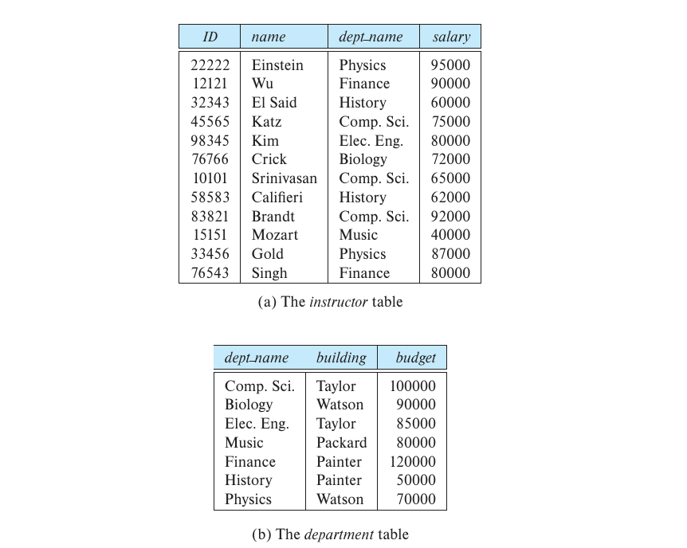
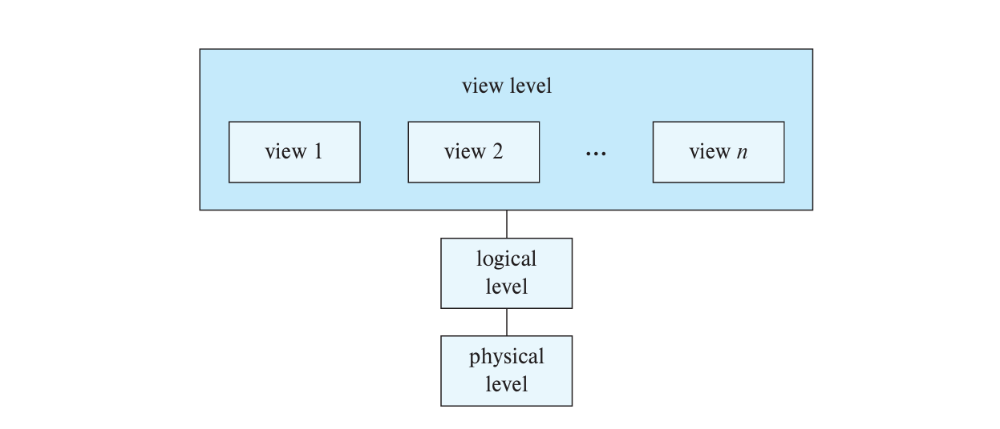
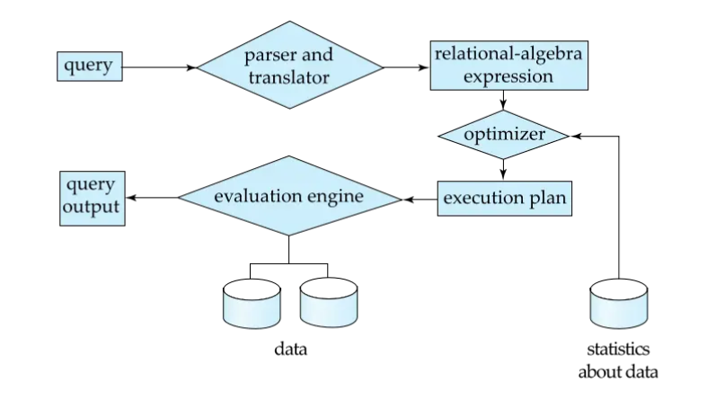
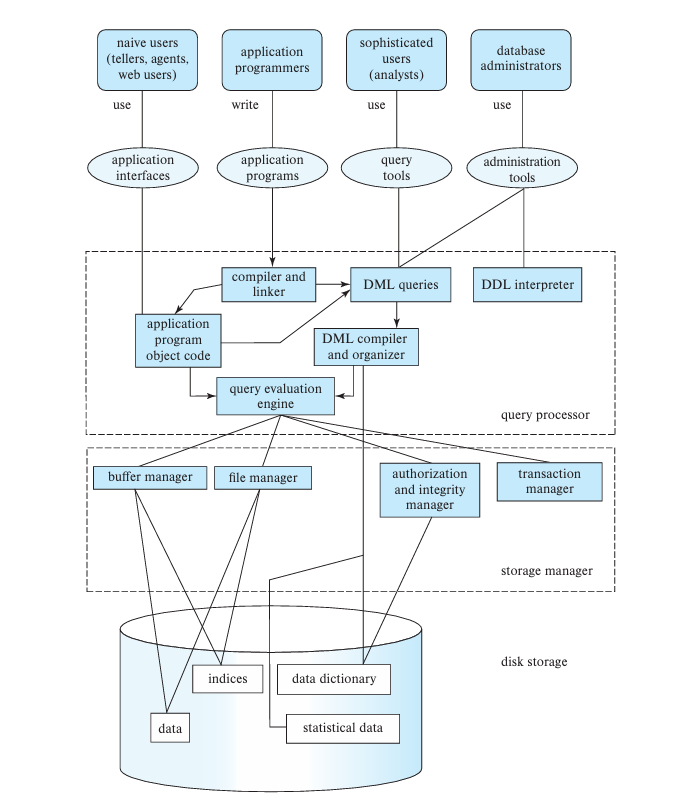
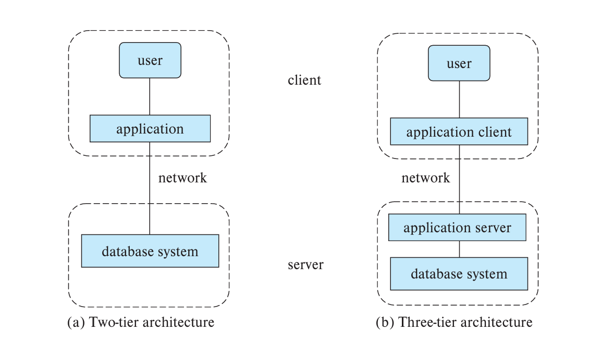

<span style="font-family: 'Times New Roman';">

# Chapter1 Introduction to Database Systems

***

## 1.1 Database System Applications

**Database Management System (DBMS):**

DBMS包含的信息：

* 数据
* 处理数据的程序
* 友好的环境（convenient and efficient）

DBMS处理的数据的特征：

* 高价值
* 大体量
* 常被并发访问

***

## 1.2 Purpose of Database Systems

**Drawbacks of File Systems:**

早期的数据库应用直接建立在文件系统之上，会导致以下问题：

* data redundancy and inconsistency  
  数据冗余与不一致：数据在多个文件中重复存储，修改需要在多个地方进行
* difficulty in accessing data  
  存取数据困难：对于每一个任务都要写新的程序
* data isolation  
  数据孤立：多个文件，多种格式
* integrity problems  
  完整性问题：程序无法显式声明完整性约束
* atomicity problem  
  原子性问题
* concurrent access by multiple users  
  并发访问异常
* Security problems  
  安全性问题

!!! Success "Definition"
    **integrity constraint 完整性约束：** 

    数据库中用于确保数据一致性和准确性的规则。它定义了数据必须满足的条件，以防止无效或不一致的数据进入数据库。例如：

    account balance >= 0  
    银行卡上金额非负

**Characteristics of Databases:**

* data persistence 数据持久性  
* convenience in accessing data 数据访问便捷性
* data integrity 数据完整性
* concurrency control for multiple users 多用户并发控制
* failure recovery 故障恢复
* security control 安全控制

***

## 1.3 View of Data

**Data Models:**

数据模型是用来描述以下内容的工具集合：

* data 数据
* data relationships 联系
* data semantics 语义
* data constraints 约束

有两种主要模型：

* Relation model 关系模型
* Entity-relationship model 实体-关系模型（常用）

**Relational Model:**

每一张表格称为一个**关系（relation）**，表格中的每一行称为一个**元组（tuple）**，每一列称为一个**属性（attribute）**。



**Levels of Abstraction:**

* physical level 物理层  
  如何存储
* logical level 逻辑层  
  如何联系
* view level 视图层  
  如何展示



**Schemas and Instances:**

模式（schema）类似于编程语言中的变量类型。

* logical schema 逻辑模式
* physical schema 物理模式

实例（instance）类似于编程语言中的变量赋值。

!!! Note
    Applications depends on the **logical schema**.

!!! Success "Definition"
    **Physical Data Independence 物理数据独立性：**  
    修正物理模式时不会改变逻辑模式。

***

## 1.4 Database Language

**Data Definition Language (DDL) 数据定义语言：**

定义数据库的模式。例如：

```sql
create table instructor(
    ID char(5),
    name varchar(20),
    dept_name varchar(20),
    salary numeric(8, 2)
);
```

DDL编译器生成的表格模板储存在**数据字典（data dictionary）**中，作为**元数据（metadata）**。

**Data Manipulation Language (DML) 数据操作语言：**

对数据库中的数据进行操作（增删改查）。有两种基本的类型：

* procedural DML  
  过程式：要求用户声明需要什么数据，如何获得数据等
* declarative DML  
  陈述式（非过程式）：只要声明需求即可，具体怎么获得无需声明

包含information retrieval功能的DML称为**查询语言（query language）**。

**SQL Query Language:**

属于陈述式DML。一个query的输入是至少一张表，输出是一张表（注意：不是value）。例如：

```sql
select name
from instructor
where dept_name = 'Comp.Sci';
```

SQL不是一种图灵机完备语言，需要和高级语言交互，例如将SQL嵌入C，Python（host language）等，或者使用API调用。

***

## 1.5 Database Engine

**Functional Components:**

数据库的功能组件包括：

* storage manager 存储管理
* query processor component 查询处理
* transaction management component 事务管理

**Storage Manager:**

storage manager包含：

* authorization and integrity manager
* transaction manager
* file manager
* buffer manager

存储的数据结构包括：

* data files
* data dictionary
* indices

**Query Processor:**

query processor包含：

* DDL interpreter  
  解释DDL，在data dictionary中记录definitions
* DML compiler  
  用query language解释DML，进行query optimization，生成evaluation plan
* query evaluation engine  
  执行DML compiler生成的指令

!!! Success "Definition"
    **Evaluation Plan 评估计划：**  
    用于执行query的详细步骤和策略。它是查询优化器的输出，定义了如何高效地访问和处理数据。

**Query Processing:**



**Transaction Management:**

**事务（transaction）** 是单个逻辑工作单元执行的一系列操作。

**transaction manager**确保数据库的一致性。

**concurrency control manager**确保多个用户同时访问数据库时的数据一致性。

***

## 1.6 Database Architecture



***

## 1.7 Database Users and Administrators

**Two-tier and Three-tier Architectures:**

两层架构：client + server

三层架构：client + application server + database system

