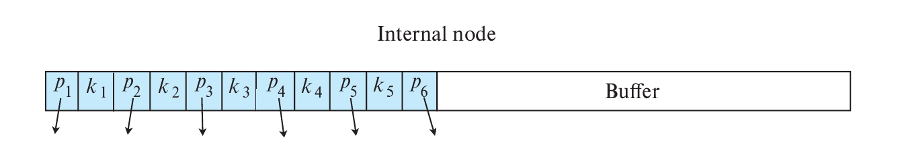

# Chapter10 Indexing

***

## 10.1 Basic Concepts

索引是一种加快查询的数据结构，一个索引文件中包含一组索引项（index entry），每个索引项（index entry）由search key和pointer组成。

**search key**通常是一个或多个属性值的组合，作为查询依据，用以标识记录。

***

## 10.2 Ordered Index

**Ordered index:**

顺序索引的索引项按照search key的顺序排列存储。

第一种分类方法：

* **主索引（primary index，又称clustering index）**：
  记录在数据文件中的存储按照search key的顺序排列，这时的数据文件又称**index-sequential file**
  
* **辅助索引（secondary index，又称nonclustering index）**：
  记录在数据文件中的存储不按照search key的顺序排列
  

!!! Note
    这里的记录存储采用顺序文件组织。

第二种分类方法：

* **稠密索引（dense index）**：    
  对于数据文件的每一条记录，其search key都有一个索引项
  
* **稀疏索引（sparse index）**：  
  只有一部分记录的search key有索引项，适用于主索引的情况
  

稀疏索引相比于稠密索引节省更多存储空间，对于记录插入与删除也减少了维护开销；但其查询效率更低。

对于主索引，常配合稀疏索引使用，只需要给文件的每一个block建立一个索引项，search key即为该block中的第一条记录的search key，也即最小值。

辅助索引必须是稠密索引。

**Multilevel Index:**

如果索引文件本身还是比较大，不能放在内存，只能放在磁盘，那么我们可以在其之上再建一个索引文件（outer index，为稀疏索引）。

**Index Update with Deletion:**

当一条记录从表中删除时，如果表中还有其他记录和该记录的search key相同，那么无需改变；否则：

* 对于稠密索引，删掉该search key对应的索引项
* 对于稀疏索引，用该记录下一条的search key替换对应的索引项；如果下一条的search key已经有对应的索引项，则被删除记录的search key对应的索引项直接被删除，无需替换

**Index Update with Insertion:**

* 对于稠密索引，如果search key已经存在，则不需要插入；否则，直接插入新的索引项
* 对于稀疏索引，假设每个block对应一个索引项，只要不创建新的block就不需要更新索引项

***

## 10.3 B+ Tree Index

[跳转指路](../ADS/Chapter2.md#second-chapter)

$n$阶的B+树（$n$又称fan-out）有以下的结构性质：

* 根节点要么直接是一个叶子，要么有$[2,n]$个孩子
* 除了根节点或叶子的其他节点有$[\lceil \frac{n}{2}\rceil,n]$个孩子
* 每个非根的叶子有$[\lceil \frac{n-1}{2}\rceil,n-1]$个键值

在数据库中，B+树索引的每一个节点都单独保存在一个block中。这说明B+树的$n$很大，进一步说明B+树很矮，查找效率高。若一共有$K$个search key值，则树高不会超过$\lceil\log_{\lceil\frac{n}{2}\rceil}K\rceil$。

**Node Structure:**

对于B+树索引的一个节点：

$K_1\sim K_{n-1}$为search key，$P_1\sim P_n$为指向数据记录的pointer（对于叶子节点）或指向子节点的pointer（对于非叶子节点）。

对于叶子节点：

每个search key（$K_i$）前面的pointer（$P_i$）指向该search key对应的数据记录，最后一个pointer（$P_n$）指向下一个叶子节点，这样做的好处是所有的叶子节点顺序相连，有利于范围查询。

对于非叶子节点：

非叶子节点实际上是叶子节点的多层稀疏索引。

$P_1$指向的子树的所有search key都小于$K_1$；当$w\leqslant i\leqslant n-1$时，$P_i$指向的子树的所有search key都在$K_i$和$K_{i+1}$之间（左闭右开区间）；$P_n$指向的子树的所有search key都大于等于$K_{n-1}$。

**Updates on B+ Trees:**

!!! Example
    **Insertion1: "Adams"**
    

    **Insertion2: "Lamport"**
    

    **Deletion1: "Srinivasan"**
    

    **Deletion2: "Singh" and "Wu"**
    

    **Deletion3: "Gold"**
    

**Height and Size Estimation:**

在我们知道了一条数据记录的大小和总共的记录数量等相关信息，如何确定B+树索引的相关参数？

!!! Example
    **假设`person`表的定义如下：**

    **`person(pid char(18), name char(8), age smallint, address char(40), primary key(pid))`**

    **已知一个block的大小为4KB，一共有1000000条`person`的记录，确定B+树索引的$n$值和合适的高度。**

    一条记录的大小：  
    18+8+2+40=68B

    每个block能存放的记录数量：  
    4096/68=60.235→60

    存储1000000条记录需要的block数量：  
    1000000/60=16666.67→16667

    如果我们假设一个节点占一个block，那么算$n$值就是在算一个block最多放几个索引项（+1）。

    如果以`pid`作为search key，假设一个pointer占4B，那么一个索引项的大小为18+4=22B，一个block能存放的索引项数量：

    (4096-4)/22=186  
    186+1=187

    注意这里的-4是因为有一个额外的pointer指向sibling，此时$n$值为187。

    因此，一个非叶子节点的孩子节点最少为$\lceil\frac{n}{2}\rceil$=94个，最多为187个；每个叶子节点的索引项最少为$\lceil\frac{n-1}{2}\rceil$=93个，最多为186个。

    因此，通过枚举，我们可以得到不同高度的B+树索引所支持的索引项数量的取值范围：

    2 levels:  
    min=2×93=186  
    max=187×186=34782

    3 levels:  
    min=2×94×93=17484  
    max=187×187×186=6504234

    4 levels:  
    min=2×94×94×93=1643496  
    max=187×187×187×186=1216291758

    ……

    由于34782<1000000<1643496，因此选择高度为3 levels。

    此外，对于B+树索引节点数的最大值和最小值，详见下表：

    
    
**Indexing Strings:**

如果search key的长度不定，也就是索引项的长度不定，那么如果叶子节点全满，占用的空间大小也不定。如果用之前的计算方法是无法算出$n$值的。

一个解决方法是前缀压缩（prefix compression）：我们没必要保存完整的search key，通过截断，如果前面一定的位数已经能区分不同的search key了（例如“Silas”和“Silberschatz”只需要前4位就可以区分），那么我们可以只保存前面一定的位数。

**Non-Unique Search Keys:**

之前的B+树索引中，我们默认了一个search key对应一条数据记录，但实际上，search key并不一定是唯一对应的，不同的数据记录可能有相同的search key。

对于主索引还好说，因为数据记录在数据文件中按照search key的顺序排列，因此B+树索引的叶子节点的指针可以指向第一个对应的记录，然后往后逐个检查就行。

但是对于辅助索引，每个叶子节点的search key绑定的pointer就不止一个了。

一个解决方法是：在原本的search key上再加上其他的属性值（例如主键），直到唯一对应，形成一个复合search key。

***

## B+ Tree Extensions

**B+ Tree File Organization:**

B+树索引和B+树文件组织的区别：

* B+树索引的叶子节点存放的是索引项，包括search key和指针
* B+树文件组织的叶子节点存放的就是**数据记录本身**

下图为B+树文件组织的示意图：

**Record Relocation and Secondary Indices:**

但是，如果使用B+树文件组织管理数据记录会有一个问题。我们目前已知的索引都是与数据记录的物理位置（指针）息息相关的，因此数据记录的位置变化越小越好。但在B+树文件组织中，时不时会出现叶子节点的分裂与合并，叶子节点本身就是数据记录，因此数据记录的物理位置会批量地发生变化，导致索引的更新和维护代价十分昂贵。（尤其针对辅助索引）

一个解决方法是：我们已知B+树文件组织会有一个自己的search key，那么对于其他索引，可以把pointer换成B+树文件组织的search key。当要查询一条记录时，先根据该索引的search key找到B+树文件组织的search key，再根据B+树文件组织的search key找到数据记录。

这个时候，查询效率会降低，因为原本根据其他索引就能找到指向对应记录的pointer，但现在只能找到search key，再用这个search key去B+树文件组织中查找对应的记录。

**Indexing Strings:**

如果索引对应的search key是变长字符串，可以采用**前缀压缩（prefix compression）**，即只保存search key的能进行区分的前缀部分，这样就相当于定长了。

**Bulk Loading and Bottom-Up Build:**

对于批量插入（bulk loading），如果使用传统的方法，一个一个地插入B+树索引，则效率会很低。

第一个解决方法：

提前对索引项按照search key的顺序排序，再依次插入。这样很好地利用了局部性原理，前一个索引项的插入路径和后一个的插入路径是相似的，这样前一个索引项使用到的文件往往位于buffer内，后一个索引项在插入时就不需要再去磁盘读取了。

但是，这也导致大部分叶子节点都是半满的。

第二个解决方法：

重新构建新的B+树索引，既然已经知道了所有的索引项，就可以从叶子节点开始构造，一直构造到根节点。

具体步骤是：同样地，提前对索引项按照search key的顺序排序；之后构建叶子节点，顺序地写入磁盘（存放在磁盘的连续的block，这样有利于开始时的顺序查询）；接着一层一层向上构造，直到根节点。

***

## 10.4 Hash Index

**Static Hashing:**

哈希索引的基本思想是：

每一个记录的search key都可以通过一个哈希函数映射到一个值；

不同的值对应不同的**bucket**，每个bucket为一个block的大小，里面存放的是该bucket对应的所有记录的search key和pointer；

因此，当依靠哈希索引查询一条记录时，首先根据search key计算出哈希值，然后根据哈希值找到对应的bucket，再在该bucket中顺序查找确定索引项，最后根据pointer找到对应的记录。

!!! Note
    与B+树类似，哈希文件组织的bucket中存记录，而哈希索引的bucket中存索引项。

之所以称此时的哈希索引是**静态**的，是因为其对应的bucket不变。但是，数据库的体量是随着时间变化的，bucket会面临太满或太空的情况。

**Dynamic Hashing:**

* periodic rehashing  
  如果索引项数量达到一定阈值，则扩充bucket空间，并rehash
* linear hashing  
  线性扩展bucket空间
* extendable hashing  
  允许多个哈希值对应一个bucket

**Comparison of Ordered Indexing and Hashing:**

顺序索引更适合处理范围查询，哈希索引更适合处理特殊值的查询。

***

## 10.5 Write Optimized Index

假设B+树索引的非叶子节点全在内存中，叶子节点全在磁盘中。如果有一连串的随机写操作（插入），那么会进行多次IO，对写操作不友好。

**Log Structured Merge Tree (LSM Tree):**

!!! Question
    LSM树存的是数据记录，有序存储，数据按键值排序，因此本身就可以作为索引使用？

$L_0$树在内存中，$L_1$，$L_2$和$L_3$树在磁盘中。

现在考虑插入。每一条记录先进入$L_0$，等$L0$满后就转移到$L_1$，$L_1$原有的记录和$L_0$新来的记录会通过**bottom-up build**的方式构建B+树，当$L_1$也到达一定阈值之后就转移到$L_2$，以此类推。

优点：

* 先将数据缓存在内存，再批量刷写到磁盘，避免了随机写操作，减少平均IO
* 叶子节点全满，节省空间

缺点：

* 查询需要经过多棵树
* 层级之间的复制耗时

LSM树的删除并不立刻清除记录本身，而是打上delete的标签，等到层级合并的时候再真正删除。

LSM树的更新采用插入+删除的模式。

**Buffer Tree:**

buffer tree的核心思想是在B+树的每个内部节点划分出一块buffer，用于临时存储插入的数据。

插入操作不会立即影响叶子节点，而是先存入内部节点的buffer；buffer满了后，数据批量移动至下一层。

优点：

* 查询开销较小
* 可以应用于任何树型索引

缺点：

* 比LSM树有更多随机IO

***

## 10.6 Bitmap Index

对于属性取值有限（性别等）的情况，可以考虑bitmap索引。

对于多个属性的查询，bitmap索引格外方便，因为可以通过位运算得到结果。