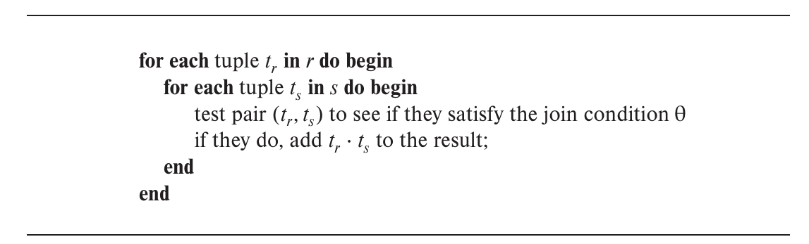

# Chapter11 Query Processing

***

***

## 11.1 Measures of Query Cost

以**磁盘访问时间**为主，其又分成：

* **transfer**：一次block数据传输的时间记为$t_T$，次数记为$b$
* **seek**：一次磁头移动定位的时间记为$t_S$，次数记为$S$

总耗时：

$$b*t_T + S*t_S$$

!!! Note
    一般情况下，一个block的写操作比读操作要慢，但为了简单起见，假设二者transfer时间相同。  
    同样的，算法分析中忽略了CPU时间。

***

## 11.2 Selection Operation

**Algorithm1: Linear Search (File Scan)**

遍历所有记录，检查每条记录是否满足条件，这是适用范围最广的算法。

最差情况下，seek次数为1（假定连续存储），transfer次数为$b_r$（$b_r$为表格占用的总block数），因此，总开销为：

$$b_r*t_T+t_S$$

!!! Note
    如果查询目标唯一，那么一旦查到满足条件的记录即可停止。平均开销为：

    $$(\frac{b_r}{2})*t_T+t_S$$

!!! Note

    二分查找一般不起作用，因为数据不一定排好序后存储，除非配合索引使用。

除了顺序扫描，还可以使用索引进行查询。

**Algorithm2: Primary B+ Tree Index, Equality on Key**

* B+树索引
* search key即为查询属性
* 记录在表中按search key顺序存储（primary）
* 查询结果唯一（equality）

假设B+树索引的高度为$h_i$，那么查询过程要经过$h_i$个索引节点（block），transfer次数为$h_i$，同时还有一次记录数据的transfer，因此transfer次数为$h_i+1$。

由于索引节点和记录数据对应的block并不是顺序排列的，因此seek次数也为$h_i+1$。

总开销为：

$$(h_i+1)*(t_T+t_S)$$

**Algorithm3: Primary B+ Tree Index, Equality on Nonkey**

* B+树索引
* search key即为查询属性
* 记录在表中按search key顺序存储
* 查询结果不唯一

与A2相比，transfer次数多了，假设满足条件的记录分布在$b$个block中，那么transfer次数为$h_i+b$。

但是，seek次数不变，还是$h_i+1$，因为记录顺序存储，不管是在物理空间上还是在search key层面上。

总开销为：

$$(h_i+b)\*t_T+(h_i+1)\*t_S$$

**Algorithm4: Secondary B+ Tree Index, Equality on Key**

* B+树索引
* search key即为查询属性
* 记录在表中并不按search key顺序存储
* 查询结果唯一

实际上其与A2的seek次数和transfer次数都一样，因为实际差别只有记录在表中存储的顺序不同，但因为查询结果唯一，因此只需要锁定一个block，并没有影响。

总开销为：

$$(h_i+1)*(t_T+t_S)$$

!!! Note
    **Algorithm4': Secondary B+ Tree Index, Equality on Nonkey**

    * B+树索引
    * search key即为查询属性
    * 记录在表中并不按search key顺序存储
    * 查询结果不唯一

    

    假设有$n$个记录block中存储着满足条件的记录，所有的block在物理空间上都没有关联。因此，seek次数和transfer次数都为$h_i+n$。

    总开销为：

    $$(h_i+n)*(t_T+t_S)$$

**Algorithm5: Primary B+ Tree Index, Comparison**

* B+树索引
* search key即为查询属性
* 记录在表中按search key顺序存储
* 范围查询

与A3类似，总开销为：

$$(h_i+b)\*t_T+(h_i+1)\*t_S$$

!!! Note
    当查询为$\sigma_{A\leqslant V}(r)$时，可以选择直接顺序扫描，总开销为：

    $$b*t_T+t_S$$

**Algorithm6: Secondary B+ Tree Index, Comparison**

* B+树索引
* search key即为查询属性
* 记录在表中并不按search key顺序存储
* 范围查询

与A4'类似，总开销为：

$$(h_i+n)*(t_T+t_S)$$

!!! Note
    当查询为$\sigma_{A\leqslant V}(r)$时，可以选择直接顺序扫描，总开销为：

    $$b*t_T+t_S$$

**Conclusion:**

此外，还有

* conjunction: $\sigma_{\theta_1\wedge\theta_2\wedge...\wedge\theta_n}(r)$
  
  * **A7: Conjunctive Selection using One Index**  
    看看哪个$\theta_i$上用索引开销最小，再将筛选后的结果线性扫描，检查其他属性的要求
  * **A8: Conjunctive Selection using Composite Index**
  * **A9: Conjunctive Selection by Intersection of Identifiers**
    能使用索引的条件先将记录筛选出来取交集，然后线性扫描检查无法使用索引的条件
* disjunction: $\sigma_{\theta_1\vee\theta_2\vee...\vee\theta_n}(r)$：与A9类似，只是取并集
* negation: $\sigma_{\neg\theta}(r)$：直接线性扫描

总体上的思想就是线性扫描与索引相结合，随机应变。

***

## 11.3 Sorting

大多数情况下，内存无法容纳所有待排序的记录，因此需要用到**外部排序**。[跳转指路](../ADS/Chapter15.md)

起始参数：内存的block数$M$。

**步骤一：产生run（归并段）**

重复以下过程：

* 将$M$个block大小的记录读入内存；
* 排序；
* 得到第$i$条run，记为$R_i$，写回磁盘。

假设表格总占用的block数为$b_r$，则生成的run数为：

$$N=\lceil\frac{b_r}{M}\rceil$$

transfer次数：

$$2*b_r$$

seek次数：

$$2*N$$

**步骤二：归并run**

情况一：如果$N<M$：

在内存中使用$N$个block作为输入，1个block作为输出，并将每个run的第一个block读入内存。

重复以下过程：

* 在内存的$N$个block中找到最小的记录，写入输出block；如果输出block满了，则写回磁盘；
* 将刚刚的记录从内存中（$N$个block之一）删除，实际上可以用指针的移动表示；
* 如果$N$个block中有一个block的记录已经被删光了（指针移动到末尾），那么从对应的run中读入下一个block。

直到所有的run都被读完为止，也就是说$N$个block全部清空。

transfer次数：

$$2*b_r$$

seek次数：

$$2*b_r$$

情况二：如果$N\geqslant M$：

一次只能进行$M-1$个run的归并（内存剩下一个block作为输出），因此需要归并$\lceil\log_{M-1}(\frac{b_r}{M})\rceil$次。

transfer次数：

$$2*\lceil\log_{M-1}(\frac{b_r}{M})\rceil$$

seek次数：

$$2*\lceil\log_{M-1}(\frac{b_r}{M})\rceil$$

!!! Note
    上述表达式对于$N<M$的情况也成立。

综上，考虑完整过程。

transfer次数为：

$$b_r+2b_r*\lceil\log_{M-1}(\frac{b_r}{M})\rceil$$

seek次数为：

$$2\lceil\frac{b_r}{M}\rceil+2b_r*\lceil\log_{M-1}(\frac{b_r}{M})\rceil-b_r$$

!!! Note
    无论是transfer还是seek，原本都应该是步骤一的结果加上步骤二的结果。但我们假设最后一次归并后最终的排序结果并不需要写回磁盘，而是传递给诸如上层操作等，那么就可以减少一次整体transfer和整体seek，即$b_r$。

**Advanced Version:**

如果归并时，每一个run分配到的内存的block不止一个，可以减少transfer次数和seek次数，记分配到的block数为$b_b$。（输出block数也改为$b_b$）

那么，一次归并的run数为$\lfloor\frac{M}{b_b}\rfloor-1$

综上：transfer次数为：

$$b_r+2b_r*\lceil\log_{\lfloor\frac{M}{b_b}\rfloor-1}(\frac{b_r}{M})\rceil$$

对于每一次归并，seek次数减少为$2\lceil\frac{b_r}{b_b}\rceil$

综上：seek次数为：

$$2\lceil\frac{b_r}{M}\rceil+2\lceil\frac{b_r}{b_b}\rceil*(\lceil\log_{\lfloor\frac{M}{b_b}\rfloor-1}(\frac{b_r}{M})\rceil)-\lceil\frac{b_r}{b_b}\rceil$$

***

## 11.4 Join Operation

**Nested-Loop Join:**

简而言之，就是做两层循环。

此时，$r$称为**outer relation**，$s$称为**inner relation**。

设$r$有$n_r$条记录，$b_r$个block；$s$有$n_s$条记录，$b_s$个block。假设最坏情况下，内存只能给两张表各提供一个block，则

transfer次数为：

$$b_r+n_r*b_s$$

seek次数为：

$$b_r+n_r$$

!!! Note
    如果较小的那一张表可以完全放入内存，则应当将其作为inner relation。这个时候transfer次数减少为$b_r+b_s$，seek次数减少为$2$。

!!! Note
    在这种情况下，小的表格作为outer relation，大的表格作为inner relation。

**Block Nested-Loop Join：**

四层循环，先确定一对block，再在两个block之间逐条记录地连接。

注意，里面的两层循环只在内存中进行，因此没有transfer和seek开销。同样假设如上的最坏情况。

transfer次数为：

$$b_r+b_r*b_s$$

seek次数为：

$$2*b_r$$

!!! Note
    最好情况下，所有记录都能读进内存，此时的transfer次数为$b_r+b_s$，seek次数为$2$。

!!! Note
    如果内存大小为$M$个block，使用$M-2$个block放outer relation，剩下两个block分别放inner relation和输出。此时的transfer次数为$b_r+b_s*\lceil\frac{b_r}{M-2}\rceil$，seek次数为$2\lceil\frac{b_r}{M-2}\rceil$。

**Indexed Nested-Loop Join:**

针对连接属性上有索引的情况。

对于外关系$r$的每一个记录$t_r$，使用索引去寻找内关系$s$中每一个能连接的记录$t_s$。

在最坏情况下，对于$r$的每一个block，都要seek一次，transfer一次。设根据一个$t_r$通过索引寻找所有匹配的$t_s$的总时间为$c$，则总开销为：

$$b_r\*(t_T+t_S)+n_r\*c$$

!!! Note
    当两个表在连接属性上都有索引时，使用更小的表格作为outer relation。

!!! Example
    **假设`student`表有5000条记录，占100个block；`takes`表有10000条记录，占400个block。`takes`表上有B+树索引，每个索引节点有20个索引项。计算使用block nested-loop join和indexed nested-loop join的开销。**

    block nested-loop join:

    小表格`student`作为outer relation，大表格`takes`作为inner relation。  
    transfer次数：100+100\*400=40100  
    seek次数：2\*100=200

    indexed nested-loop join:

    B+树的树高为$\lceil\log_{\lceil\frac{21}{2}\rceil}10000\rceil=4$  
    每一次索引需要走5个block，4个索引block，1个记录block   
    transfer次数和seek次数均为100+5000\*5=25100

**Merge-Join:**

针对两张表在连接属性上都已经排好序的情况。

这个时候，两张表格都各自有一个移动的指针，每个记录都只会进入内存一次。

transfer次数为：

$$b_r+b_s$$

seek次数为：

$$b_r+b_s$$

如果内存分别给$r$和$s$分配的block数不是一个而是$b_b$个，则transfer次数不变，seek次数变为：

$$\lceil\frac{b_r}{b_b}\rceil+\lceil\frac{b_s}{b_b}\rceil$$

!!! Note
    优化问题：

    假设可用内存的block数不是2个而是$M$个，那么如何根据两张表格的大小来分配这$M$个block呢？  
    实际上应该按照两张表格大小开根号后的比值按比例划分，能最小化开销，可以尝试用数学方法推导。

**Hash-Join:**

将大表格的连接细化成小表格的连接。

对于表格$r$，在连接属性上应用哈希函数$h$，将其划分成$n$个bucket；同理，对于表格$s$，在连接属性上也应用相同的$h$，划分出来的bucket数也为$n$。

接下来，只要对应的bucket进行单层循环的连接即可，因为只有对应的bucket中才会有连接属性相同的记录。

具体操作如下：

分片阶段：

一个一个block读到内存，对每条记录计算哈希函数值，每一个可能的值都需要内存中有对应的缓冲块，计算好哈希函数值的记录就被放到对应的缓冲块中，缓冲块满了则写回磁盘。

连接阶段：

把$s$的每个bucket读入内存，然后一块一块地将$r$的对应bucket的block读入内存，进行连接。

$h$和$n$的选择是有讲究的，一般要求$s$的每个bucket的内容都可以完整放入内存。因此，$n$至少要满足$n\geqslant\lceil\frac{b_s}{M}\rceil$。此时，$r$称为**probe input**，$s$称为**build input**。

问题：

如果$b_s$很大，$M$很小，那么需要设计很大的$n$，这也带来了更大的缓冲区需求，因为分片阶段每个bucket都需要一个block作为缓冲区，怎么办？

因此，如果需要一次性完成分片阶段，有不等式$M>\frac{b_s}{M}+1$，$M>\sqrt{b_s}$

解决方法：**recursive partioning**，即不断地分片，直到每个bucket都能放入内存为止。

代价估算（不考虑recursive partitioning）：

对于transfer：

在分片阶段，$r$和$s$都各自需要被完整读入内存进行分组，然后写回磁盘，因此transfer次数为$2*(b_r+b_s)$。

在连接阶段，同样的，$r$和$s$都各自需要被完整读入内存进行连接（虽然这里是以bucket的顺序读入的），transfer次数为$b_r+b_s$。

但是别忘了，对于每一个bucket，其都可能超出整数个block一点点，对于分片阶段的写回和连接阶段的读入，实际还要考虑那些不够满的block。设哈希函数一共分成$n_h$个bucket，则还有$4*n_h$次额外的transfer（两张表两个阶段）。

综上，transfer次数为：

$$3\*(b_r+b_s)+4\*n_h$$

对于seek：

假设输入和输出的单位有$b_b$个block的大小，则分片阶段的seek次数为$2(\lceil\frac{b_r}{b_b}\rceil+\lceil\frac{b_s}{b_b}\rceil)$。而在连接阶段，由于一个bucket是顺序存储的，因此seek次数为$2*n_h$。

综上，seek次数为：

$$2(\lceil\frac{b_r}{b_b}\rceil+\lceil\frac{b_s}{b_b}\rceil)+2*n_h$$

!!! Note
    $n_h$项一般可以忽略。

!!! Note
    考虑recursive partitioning的情况：

    transfer次数：

    $$2(b_r+b_s)\lceil\log_{\lfloor\frac{M}{b_b}\rfloor-1}(\frac{b_s}{M})\rceil+(b_r+b_s)$$

    seek次数：

    $$2(\lceil\frac{b_r}{b_b}\rceil+\lceil\frac{b_s}{b_b}\rceil)\lceil\log_{\lfloor\frac{M}{b_b}\rfloor-1}(\frac{b_s}{M})\rceil$$

***

## 11.5 Other Operations

**Duplicate Elimination:**

去重有两种实现方式。

一种是排序，重复的记录会排在一起。

另一种是哈希，重复的记录会进入同一个bucket。

**Aggregation:**

聚合的实现与去重类似，排序或者哈希能将同组的记录聚集在一起，然后再进行聚合操作。

优化：**partial aggregation**

在运行生成阶段和中间合并阶段，提前计算部分聚合值，减少最终计算的开销。比较好的应用有`count`，`min`，`max`，`sum`等。

**Set Operations:**

先通过哈希函数将两张表分别分成$n$组。对于每一划分$i$，在$r_i$上另建一个哈希索引：

* $r\cup s$：如果$s_i$中的记录不在索引上，就加入索引，保留索引上的记录作为结果；最后$n$组结果之和即为最终结果。
* $r\cap s$：逐一检查$s_i$中的记录是否已经出现在索引上，保留$s_i$中已经在索引上的记录作为结果；最后$n$组结果之和即为最终结果。
* $r-s$：如果$s_i$中的记录在索引上，则从索引上删除，保留索引上的记录作为结果；最后$n$组结果之和即为最终结果