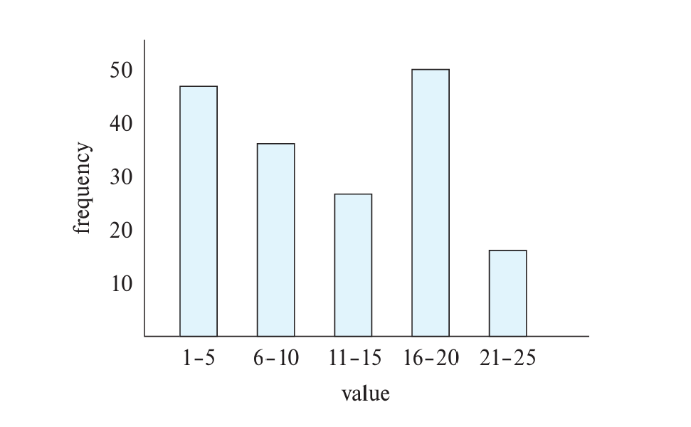
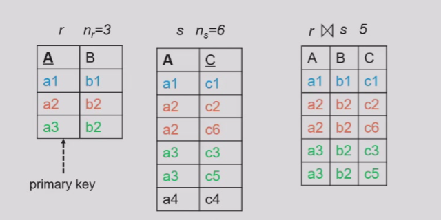
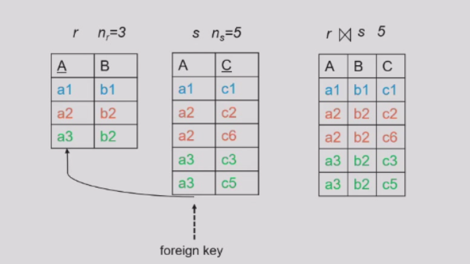
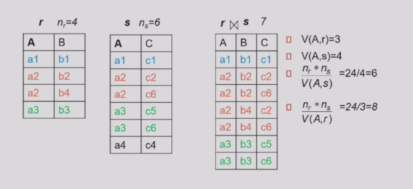
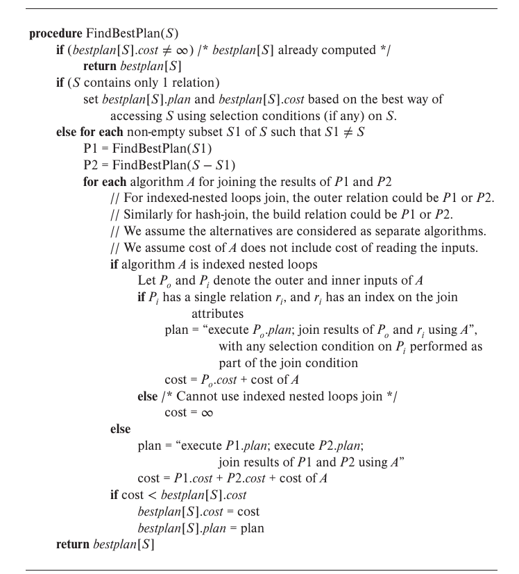
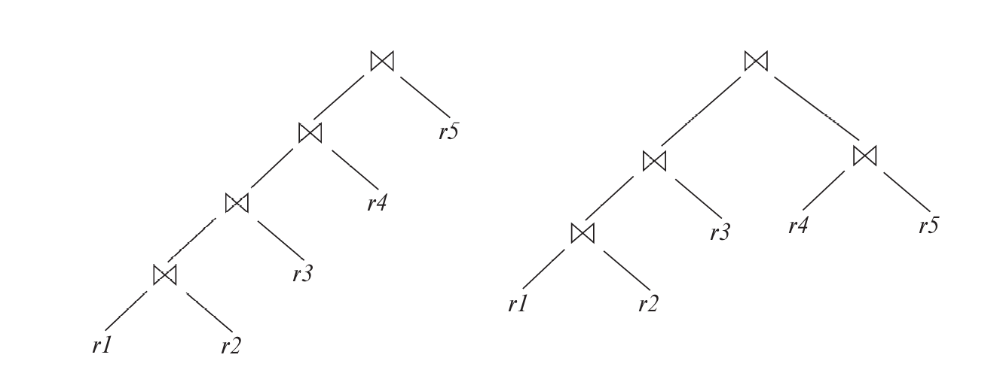

<span style="font-family: 'Times New Roman';">

# Chapter12 Query Optimization

***

## 12.1 Transformation of Relational Expressions

两个关系代数式等价当且仅当对每个合法的数据库上都产生相同的结果。

1.选择的分解：

$$\sigma_{\theta_1\wedge\theta_2}(E)\equiv\sigma_{\theta_1}(\sigma_{\theta_2}(E))$$

2.选择的交换：

$$\sigma_{\theta_1}(\sigma_{\theta_2}(E))\equiv\sigma_{\theta_2}(\sigma_{\theta_1}(E))$$

3.投影的省略：

$$\Pi_{L_1}(\Pi_{L_2}(...(\Pi_{L_n}(E))))\equiv\Pi_{L_1}(E)$$

4.选择与笛卡尔积/条件连接的结合：

$$\sigma_{\theta}(E_1\times E_2)\equiv E_1\Join_{\theta}E_2$$

$$\sigma_{\theta_1}(E_1\Join_{\theta_2}E_2)\equiv E_1\Join_{\theta_1\wedge\theta_2}E_2$$

5.条件连接的交换：

$$E_1\Join_{\theta}E_2\equiv E_2\Join_{\theta}E_1$$

6(a).自然连接的结合：

$$(E_1\Join E_2)\Join E_3\equiv E_1\Join(E_2\Join E_3)$$

6(b).条件连接的结合，要求$\theta_2$只包含$E_2$和$E_3$的属性：

$$(E_1\Join_{\theta_1}E_2)\Join_{\theta_2\wedge\theta_3}E_3\equiv E_1\Join_{\theta_1\wedge\theta_3}(E_2\Join_{\theta_2}E_3)$$

7(a).选择算子在条件连接上的分配，要求$\theta_0$只包含$E_1$的属性：

$$\sigma_{\theta_0}(E_1\Join_{\theta}E_2)\equiv(\sigma_{\theta_0}(E_1))\Join_{\theta}E_2$$

7(b).当$\theta_1$只包含$E_1$的属性，$\theta_2$只包含$E_2$的属性：

$$\sigma_{\theta_1\wedge\theta_2}(E_1\Join_{\theta}E_2)\equiv(\sigma_{\theta_1}(E_1))\Join_{\theta}(\sigma_{\theta_2}(E_2))$$

8.投影算子在条件连接上的分配：

(a) 如果$\theta$只包含$L_1\cup L_2$的属性：

$$\Pi_{L1\cup L_2}(E_1\Join_{\theta}E_2)\equiv (\Pi_{L_1}(E_1))\Join_{\theta}(\Pi_{L_2}(E_2))$$

(b) 设$L_1$和$L_2$各自只包含$E_1$和$E_2$的属性，$L_3$表示$E_1$参与条件连接但不在$L_1\cup L_2$中的属性，$L_4$表示$E_2$参与条件连接但不在$L_1\cup L_2$中的属性：

$$\Pi_{L_1\cup L_2}(E_1\Join_{\theta}E_2)\equiv \Pi_{L_1\cup L_2}((\Pi_{L_1\cup L_3}(E_1))\Join_{\theta}(\Pi_{L2\cup L_4}(E_2)))$$

9.集合交并的交换：

$$E_1\cap E_2\equiv E_2\cap E_1$$

$$E_1\cup E_2\equiv E_2\cup E_1$$

10.集合交并的结合：

$$E_1\cap(E_2\cap E_3)\equiv(E_1\cap E_2)\cap E_3$$

$$E_1\cup(E_2\cup E_3)\equiv(E_1\cup E_2)\cup E_3$$

11.选择算子对集合操作的分配：

$$\sigma_{\theta}(E_1-E_2)\equiv\sigma_{\theta}(E_1)-\sigma_{\theta}(E_2)$$

$$\sigma_{\theta}(E_1\cap E_2)\equiv\sigma_{\theta}(E_1)\cap\sigma_{\theta}(E_2)$$

$$\sigma_{\theta}(E_1\cup E_2)\equiv\sigma_{\theta}(E_1)\cup\sigma_{\theta}(E_2)$$

$$\sigma_{\theta}(E_1-E_2)\equiv\sigma_{\theta}(E_1)-E_2$$

$$\sigma_{\theta}(E_1\cap E_2)\equiv\sigma_{\theta}(E_1)\cap E_2$$

注意：后两个式子对于$\cup$不成立。

12.投影算子对集合并的分配：

$$\Pi_{L}(E_1\cup E_2)\equiv(\Pi_{L}(E_1))\cup(\Pi_{L}(E_2))$$

13.选择算子在聚合上的分配，要求$\theta$只包含分组属性：

$$\sigma_{\theta}(_G\gamma_A(E))\equiv _G\gamma_A(\sigma_{\theta}(E))$$

14.全外连接的交换：

$$E_1⟗E_2\equiv E_2⟗E_1$$

左/右外连接不可交换，但有：

$$E_1⟕E_2\equiv E_2⟖E_1$$

15.选择算子在左/右外连接上的分配，要求$\theta_1$只包含$E_1$的属性：

$$\sigma_{\theta_1}(E_1⟕\_{\theta}E_2)\equiv(\sigma_{\theta_1}(E_1))⟕\_{\theta}E_2$$

$$\sigma_{\theta_1}(E_2⟖\_{\theta}E_1)\equiv E_2⟖\_{\theta}(\sigma_{\theta_1}(E_1))$$

16.有时候外连接可以被替换成内连接，要求$\theta_1$在$E_2$上是null rejecting的：

$$\sigma_{\theta_1}(E_1⟕\_{\theta}E_2)\equiv\sigma_{\theta_1}(E_1\Join_{\theta}E_2)$$

$$\sigma_{\theta_1}(E_1⟖\_{\theta}E_2)\equiv\sigma_{\theta_1}(E_1\Join_{\theta}E_2)$$

***

## 12.2 Statistical Information Estimation

**Statistic Information for Cost Estimation:**

用于查询优化代价估算的统计信息：

* $n_r$：表格$r$中的元组数
* $b_r$：表格$r$占用的block数
* $l_r$：一个元组的大小
* $f_r$：一个block能放下多少元组，即$b_r=\lceil\frac{n_r}{f_r}\rceil$
* $V(A,r)$：表格$r$中属性$A$所有出现的取值个数，相当于$\Pi_A(r)$的大小

**直方图**也能表示统计信息：



**Selection Size Estimation:**

对于查询$\sigma_{A=v}(r)$，我们粗略估计有$\frac{n_r}{V(A,r)}$条记录满足要求；

对于查询$\sigma_{A\leqslant v}(r)$（$\sigma_{A\geqslant v}(r)$同理），分两种情况讨论：

* 若$v<\min(A,r)$，则没有记录满足要求；
* 否则，满足要求的记录大约有$n_r\cdot\frac{v-\min(A,r)}{\max(A,r)-\min(A,r)}$

**Size Estimation od Complex Selections:**

我们称$r$中一条记录满足条件$\theta$的概率为$\theta$的**selectivity（中选率）**。若$s_i$为满足条件$\theta_i$的记录数，则$\theta_i$的selectivity为$\frac{s_i}{n_r}$。

* $\sigma_{\theta_1\wedge\theta_2\wedge...\wedge\theta_n}(r)$：满足要求的记录数大约为$n_r\cdot\frac{s_1\cdot s_2\cdot...\cdot s_n}{n_r^n}$
* $\sigma_{\theta_1\vee\theta_2\vee...\vee\theta_n}(r)$：满足要求的记录数大约为$n_r\cdot(1-(1-\frac{s_1}{n_r})(1-\frac{s_2}{n_r})...(1-\frac{s_n}{n_r}))$
* $\sigma_{\neg\theta}(r)$：满足要求的记录数大约为$n_r-\text{size}(\sigma_{\theta}(r))$

!!! Note
    需要各个条件相互独立。

**Estimation of Size of Joins:**

对于笛卡尔积$r\times s$，结果一共有$n_r\cdot n_s$条记录，每条记录长度为$l_r+l_s$。

对于自然连接$r\Join s$，如果$r$和$s$没有公共属性，那么和笛卡尔积的结果相同。（也可以返回空表，这里没有统一标准）

如果$r$和$s$的公共属性是$r$的key，那么对于$s$的每一条记录，其最多只会和$r$中一条记录连接，因此，结果不会超过$n_s$条记录。



如果$r$和$s$的公共属性是$s$的foreign key，指向$r$，则结果一共有$n_s$条记录。（不考虑foreign key为null的情况）



如果$r$和$s$的公共属性不是key或foreign key，固定$r$中一条记录，则公共属性确定，$s$中大约有$\frac{n_s}{V(A,s)}$条记录可以与之连接，现在$r$中有$n_r$条记录，因此结果大约有$\frac{n_r\cdot n_s}{V(A,s)}$条记录。

同样的，反过来也能得到$\frac{n_r\cdot n_s}{V(A,r)}$的结果，两个结果中更小的一个一般是更精确的一个。



**Size Estimation of Other Operations:**

对于投影操作$\Pi_A(r)$，结果估计为$V(A,r)$。

对于聚合操作$_G\gamma_A(r)$，结果估计为$V(G,r)$。

对于集合操作：

如果在同一张表上，将其转换成selection。例如：$\sigma_{\theta_1}(r)\cup\sigma_{\theta_2}(r)$可以转换成$\sigma_{\theta_1\text{or}\theta_2}(r)$。

如果不在同一张表上：

* $r\cup s$的大小估计为$n_r+n_s$
* $r\cap s$的大小估计为$\min(n_r,n_s)$
* $r-s$的大小估计为$n_r$

这三个估计都及其不精确，但都提供了上界。

对于左外连接$r⟕s$，大小估计为$n_{r\Join s}+n_r$。（右外连接同理）

对于全外连接$r⟗s$，大小估计为$n_{r\Join s}+n_r+n_s$。

***

## 12.3 Other Optimization Techniques

**Cost-Based Join Order Selection:**

对于一连串表格的连接$r_1\Join r_2\Join...\Join r_n$，寻找代价最小的连接次序。

使用的是**动态规划**的思想。



**Left Deep Join Trees:**

可以用树形结构来表示连接次序：



左边的树为左深连接树，满足严格线性，即连接节点的右子树始终是一个原始表格，而不是中间结果。

左深连接树能更好地利用索引，适合pipelining。

**Heuristic Optimization:**

* 优先进行选择
* 优先进行投影
* 优先进行限制条件比较严格的连接
* 连接时采用左深连接树结构

**Nested Subqueries:**

例如：

```sql
select name
from instructor
where exists (select *
              from teaches
              where instructor.ID=teaches.ID and teaches.year=2022)
```

像`instructor`表那样同时出现在外层和内层查询中的变量称为**correlated variable（相关变量）**。

如果对于`instructor`表中的每一条记录，内层查询都要执行一次，这称为**correlated evaluation（相关执行）**。

显然，相关执行的效率是很低下的。对于这种情况，最好的方法就是转换成表格的连接：

```sql
select name
from instructor,teaches
where instructor.ID=teaches.ID and teaches.year=2022
```

对应的关系代数式为：

$$\Pi_{\text{name}}(\text{instructor}\Join_{\text{instructor.ID=teaches.ID}\wedge\text{teaches.year=2022}}\text{teaches})$$

但是，如果不去重，那么后者会有重复，因为`teaches.ID`会有重复。为了去重（即达到和原本一样的效果），可以考虑使用**semijoin（半连接）**。

对于半连接$r⋉s$，其本质上是在对$r$的元组进行筛选，只有能和$s$中某个元组连接的元组才会被保留。

因此，上一个关系代数式可以改写为：

$$\Pi_{\text{name}}(\text{instructor}⋉_{\text{instructor.ID=teaches.ID}\wedge\text{teaches.year=2022}}\text{teaches})$$

!!! Note
    类似的还有**anti-semijoin（反半连接）**，符号为$\overline{⋉}$，其本质上是对$r$的元组进行筛选，只有不能和$s$中某个元组连接的元组才会被保留。

以上操作称为**decorrelation（去相关）**。

**Materialized Views:**

物化视图是有实际存储数据的视图，相当于从原表格衍生出来的一张真实的表。

物化视图的代价是需要维持与原表格对应的数据，即同步更新。

一种方法是：一旦原表格数据发生变化，就重新生成一次物化视图。

另一种方法是**incremental view maintenance（增量视图维护）**，只修改物化视图局部的数据。接下来，我们来看看增量视图维护时涉及到的运算。

Join Operation:

假设物化视图$v=r\Join s$，然后$r$有更新，从$r_{\text{old}}$变成$r_{\text{new}}$。

若更新为插入$i_r$，则$r_{\text{new}}\Join s$可以被写成$(r_{\text{old}}\cup i_r)\Join s$，也即$(r_{\text{old}}\Join s)\cup(i_r\Join s)$

并的前者即为原本的物化视图，因此只需要算出$i_r\Join s$再加到原本的物化视图中即可：

$$v_{\text{new}}=v_{\text{old}}\cup(i_r\Join s)$$

!!! Note
    对于删除同理：

    $$v_{\text{new}}=v_{\text{old}}-(d_r\Join s)$$

Selection:

假设物化视图$v=\sigma_{\theta}(r)$，则：

$$v_{\text{new}}=v_{\text{old}}\cup\sigma_{\theta}(i_r)$$

$$v_{\text{new}}=v_{\text{old}}-\sigma_{\theta}(d_r)$$