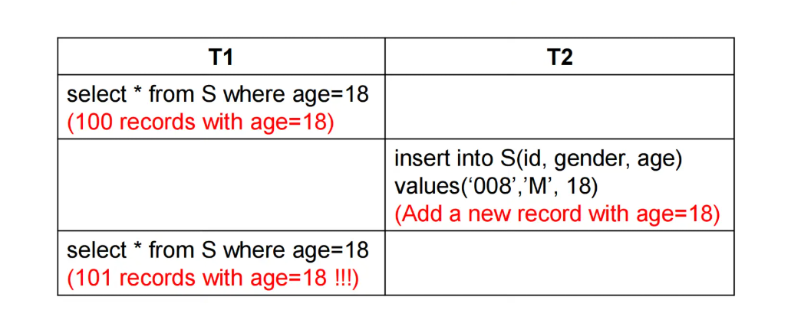
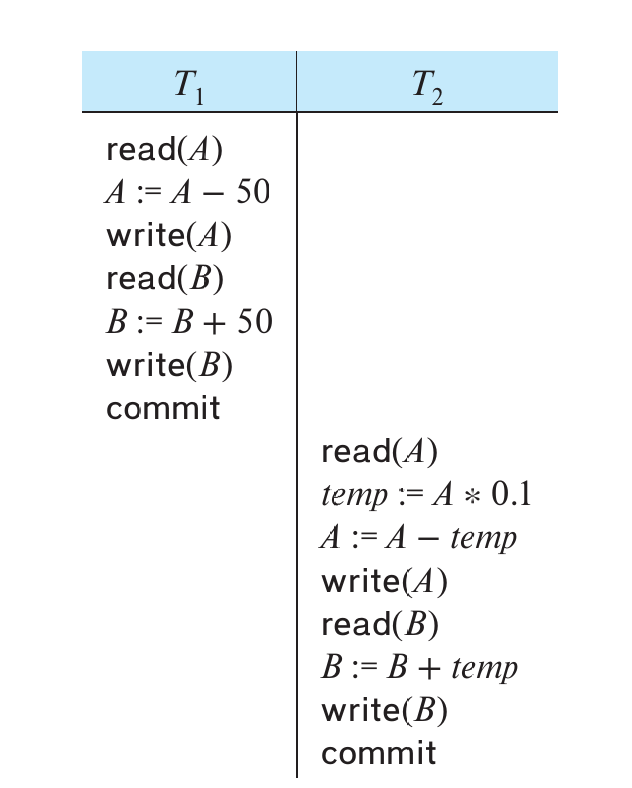
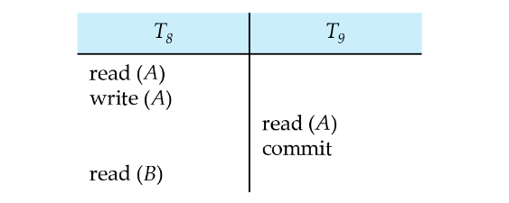

<span style="font-family: 'Times New Roman';">

# Chapter13 Transactions

***

## 13.1 Transaction Concept

**事务（transaction）** 是一系列操作组成的序列。

**ACID Properties:**

* **Atomicity 原子性**: 事务不可分割，要么全部完成，要么全部不完成；
* **Consistency 一致性**: 也就是正确性，包括各种完整性约束；
* **Isolation 隔离性**: 事务对其他事务无感，互不干扰，不能将一个事务执行到一半的数据库中间状态暴露给另一个事务；
* **Durability 持久性**: 在成功提交之后，事务对数据库的修改是持久保留的。

!!! Example
    考虑从A账户转账到B账户的操作，这些操作构成一个事务：

    ```
    1. read(A)
    2. A:=A-50
    3. write(A)
    4. read(B)
    5. B:=B+50
    6. write(B)
    ```

    原子性：  
    如果在第3步和第6步之间发生了系统崩溃，那么A账户的余额会减少50，而B账户的余额不会增加50，导致错误，因此需要保持原子性。

    一致性：  
    通常，一致性包括：  

    * 显式约束：主键、外键等
    * 隐式约束：余额之和是保持不变等

    隔离性： 
    如果在第3步和第6步之间有另一事务介入，且其能感知到前一事务，那么其看到的内容就会有误，因此需要保持隔离性。

    持久性：   
    一旦成功提交，A账户和B账户的余额的修改是持久保留的，即使系统崩溃也不会丢失。

**Transaction State:**


!!! Note
    提交分为partially committed和committed，前者是指所有操作都完成了，但是还没有写入数据库（比如将结果先写入buffer）；后者是指真正写入数据库。

***

## 13.2 Concurrent Executions

**Lost Update 丢失修改：**


在T1读出A并修改的同时，T2也进行同样的操作。但由于T1的修改还没有写入数据库，因此T2读到的A是T1修改前的A（本来应该是T1修改后的A）。最终，二者写回的A的值是相同的，导致T1的修改丢失。

**Dirty Read 读脏数据：**


T1虽然对A进行了修改并写回，T2也读到了修改后的A，但T1并没有提交，之后反而回滚了，但T2已经读了并且不知道，导致T2读到的A最终是错误的。

**Unrepeatable Read 不可重复读：**


在T1两次读A之间，T2对A进行了修改并写回。但是，在同一个事务中，连续两次读同一个数据的值应该是相同的（T1并不知道T2的存在），导致问题。

**Phantom Problem 幽灵问题：**



不可重复读的泛化版本，更多强调数据的凭空出现而不是更新。

***

## 13.3 Schedules

**调度（schedule）** 是按一定顺序执行的指令序列。

schedule中涉及的事务的每一条指令都要参与，且每个事务内部的指令顺序不能改变。

**Schedule1:**

串行调度，一定能保证ACID属性。



**Schedule2:**

同样也是串行调度，将T1和T2顺序交换，但和schedule1是**不等价**的。因此，事务的执行是要有顺序的。


**Schedule3:**

并发调度，但和串行调度schedule1是等价的。


**Schedule4:**

同样也是并发调度，但和schedule1是不等价的。


***

## 13.4 Serialazability

如果一个调度和另一个串行调度等价，那么这个调度是**可串行化**的。根据等价的性质可以分为：

* conflict serializability 冲突可串行化
* view serializability 视图可串行化

!!! Note
    简单起见，我们只考虑read操作和write操作。

**Conflicting Instructions:**

若指令$I_i$属于事务$T_i$，指令$I_j$属于事务$T_j$，两条指令都是对同一数据项$Q$的操作，则

* $I_i=\text{read}(Q)$，$I_j=\text{read}(Q)$：不冲突
* $I_i=\text{write}(Q)$，$I_j=\text{write}(Q)$：冲突
* $I_i=\text{read}(Q)$，$I_j=\text{write}(Q)$：冲突
* $I_i=\text{write}(Q)$，$I_j=\text{read}(Q)$：冲突

如果$I_i$和$I_j$冲突，则二者形成逻辑上的先后顺序；如果$I_i$和$I_j$不冲突，则二者交换顺序后调度结果不变。

!!! Note
    如果针对的是不同数据项的操作，则肯定不冲突。

**Conflict Serializability：**

对于两个schedule S和S'，如果S通过一系列不冲突指令的交换能得到S'，那么S和S'是**冲突等价（conflict equivalent）** 的。

如果在此基础上，S'是串行的，那么S是**冲突可串行化（conflict serializable）** 的。

例如下图：


左边为S，右边为S'，S可以通过一系列不冲突指令的交换得到串行的S'，因此S是冲突可串行化的。

**View Serializability：**

**视图等价（view equivalent）** 主要考虑以下三个方面，如果对于每个数据项$Q$：

* 初始读取：在S中，如果Ti读取了Q的初始值，那么在S'中，也要是Ti读取Q的初始值；
* 读取依赖：在S中，如果Ti读取了Q的值，并且该值是由Tj写入的，那么在S'中，也要Ti读取Q的值，并且该值也是由Tj写入的；
* 最终写入：在S中，如果Ti最终写入Q，那么在S'中，也要是Ti最终写入Q。

也就是说，视图等价允许调度中某些冲突操作的顺序改变，只要这种改变不影响事务读到的值和数据的最终状态就行。**视图可串行化（view serializable）** 同理。

**冲突可串行化一定是视图可串行化，但反之不一定成立。** 例如下图是视图可串行化，但不是冲突可串行化：


每个不是冲突可串行化，但是是视图可串行化的调度都有**blind write**。

!!! Note
    还有其他的可串行化，例如下图：

    

    其既不是冲突可串行化，也不是视图可串行化，但其与串行调度的结果是一样的，因此也是可串行化的。
    这里实际上是利用的数学上的性质（+和-可交换），但数据库难以理解这个性质，因此难以应用。

**Testing for Conflict Serializability:**

除了从定义角度出发，还可以通过**前驱图（precedence graph）** 来判断冲突可串行化。


如图：节点表示事务，如果两个事务之间有一对冲突操作，则进行连线，箭头的起始表示操作的先后。

前驱图无环 $\Longleftrightarrow$ 冲突可串行化

如果前驱图无环，则可以通过**topological sort**的方式获得串行化的事务次序。

!!! Example
    **根据下图事务画出前驱图，并判断是否冲突可串行化。**

    

    连线的过程类似于多重循环。对于T1的每一个操作，在其他事务中找出所有在其之后进行且冲突的操作，连线（涉及同样节点同样方向则只需要画一条）。然后以此类推，对于其他事务的每一个操作也进行类似遍历。

    前驱图没有成环，因此是冲突可串行化的。并且，我们还可以从前驱图中得到串行化后的次序：

    T1→T2→T3→T4或T1→T3→T2→T4，其中T5可以插在任何一个位置，一共有10种可能。

!!! Note
    前驱图环的检测是$O(N^2)$，其中$N$是节点数。

    但是，该检测不能直接用于视图可串行化，视图可串行化的检测是指数级的，属于NP-complete问题。

***

## 13.5 Recoverability

**Recoverable Schedule：**

**可恢复调度（recoverable schedule）** 满足：如果T2读了T1写的数据，那么T2的提交必须在T1提交之后。

例如，下图就是不可恢复调度，因为$T_8$一旦回滚，$T_9$的错误就不可恢复了：



**Cascading Rollback：**

**级联回滚（cascading rollback）** 的意思是，一个单独事务的回滚会导致一系列其他事务也跟着回滚。

例如，下图$T_{10}$的回滚会要求$T_{11}$和$T_{12}$一起回滚，因为后二者读到了脏数据：


**Cascadeless Schedule：**

如果T2要读T1写的数据，那么T1必须提交之后，T2才能读。

无级联调度一定是可恢复调度，但可恢复调度不一定是无级联调度。无级联调度强制要求读在提交之后，二可恢复调度只要保证提交顺序正确，可以先写再读最后按序提交。