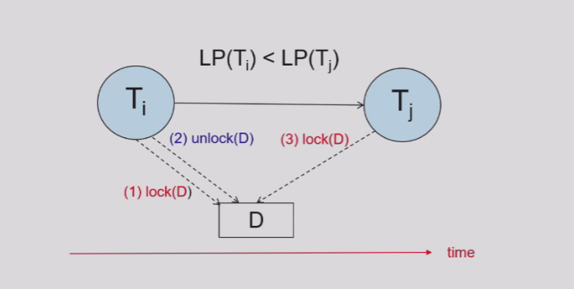
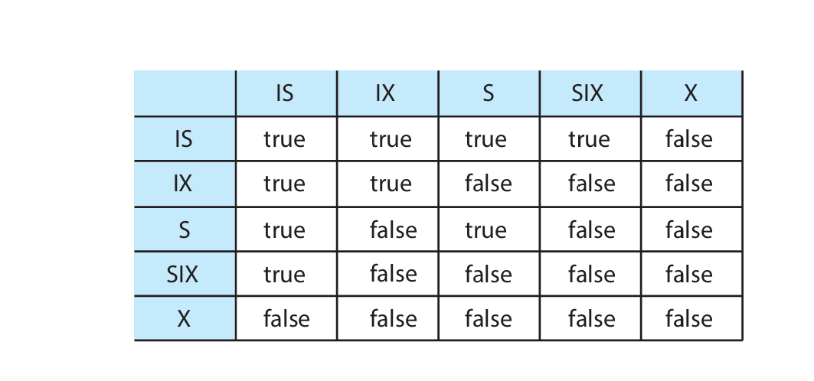

# Chapter14 Concurrency Control

***

## 14.1 Lock-Based Protocols

访问数据需要获得相应的锁。

* **exclusive lock (X) 排他锁**：可以同时获得数据的读和写权限
* **shared lock (S) 共享锁**：只能获得数据的读权限

**Lock-Compatibility Matrix:**

这个矩阵表明：同一个数据上可以有多个共享锁，分别被不同事务持有；但最多只能有一个排他锁，且有排他锁时不能有共享锁。

**Two-Phase Locking Protocol:**

两阶段封锁协议分为：

* **Growing Phase**: 事务可以获得锁，但不能释放锁；
* **Shrinking Phase**: 事务可以释放锁，但不能获得锁。

!!! Note
    这里的两个阶段是针对于同一事务而言，而不是整体而言。因此，不同事务的**lock point**（该事务获得最后一个锁的时间）也不尽相同。

两阶段封锁协议最优雅的地方在于其保证了**冲突可串行化**。也就是说，只要所有事务都遵循两阶段封锁协议，即一开始先获得锁，一旦开始释放锁就不能再获得锁，就一定是冲突可串行化的。

此外，串行化的结果也可以根据达到lock point的顺序来决定。

!!! Tip "Proof"
    冲突可串行化$\Longleftrightarrow$前驱图无环  
    如果前驱图有环，因为一个箭头对应的前后操作是冲突的，意味着一个T1先放锁T2再加锁的过程（LP(T1)<LP(T2)），而另一个箭头意味着T2先放锁T1再加锁的过程（LP(T1)\>LP(T2)），这在两阶段封锁协议下是矛盾的。
    因此，由反证法即可得证。

    

    至于按照lock point的顺序排序，同样结合前驱图，lock point最小的事务一定是最早加锁的事务，入度为0，最早执行；去掉这个事务，剩下的事务以此类推。

!!! Note
    如果重新定义lock point为释放第一个锁的时间，那么同样可以得到一个可能不同的串行结果。

然而，两阶段封锁协议**并不能保证无死锁**。

然而，当前的两阶段封锁协议**并不能保证可恢复**，需要**严格两阶段封锁（strict two-phase locking）**，即X锁需要在事务提交后才能释放，这样可以做到无级联恢复。

此外，还有**强两阶段封锁（rigorous two-phase locking）**，即X锁和S锁都需要在事务提交后才能释放。此时，串行次序也可以根据事务提交的顺序来决定。

两阶段封锁协议是冲突可串行化的充分条件，但不是必要条件。一个很简单的反例就是：每个事务各自访问的数据都不同，那么一定是冲突可串行化的，但一个事务怎么访问对应的数据是随意的，也就是说不一定遵循两阶段封锁协议。

**Lock Conversions:**

在原本的两阶段封锁协议上进一步修改，允许锁的转换。因此，两阶段有所更新：

* **Growing Phase**: 事务可以获得锁，或者将S锁转换为X锁（lock-upgrade）
* **Shrinking Phase**: 事务可以释放锁，或者将X锁转换为S锁（lock-downgrade）

该协议同样是冲突可串行化的。

**Automatic Acquisition of Locks:**

事务在读写时的加锁不需要显示声明。

read：

write:

**Lock Table:**

事务在数据上的锁由数据结构lock table集中维护。

我们可以将lock table看作一个哈希表，每一个数据都会对应一个哈希值，在图中用白色矩形表示；不同的数据可能会有相同的哈希值，这些数据相连，即图中的每一行。

对于每一个数据，其各自底下有相应的上锁的事务和等待的事务。上锁的事务用深蓝色方形表示，等待的事务用浅蓝色方形表示。

**Graph-Based Protocols:**

图协议对数据项组成的集合$D=\\{d_1,d_2,...,d_h\\}$加上了偏序关系。

如果数据项$d_i\rightarrow d_j$，那么任何一个要访问$d_i$和$d_j$的事务，必须先访问$d_i$再访问$d_j$。

此时，$D$应当看作有向无环图，称为**database graph**。

**Tree Protocol:**

树协议是图协议的一种。如果对事务有先验知识，可以使用树协议。

树协议的图是针对每个事务而言的，每个节点都是一个数据。

* 只使用X锁；
* 第一个锁可以加在任何一个数据上，之后，如果一个数据想要加锁，前提是其父节点对应的数据也一定要加锁；
* 可以随时释放锁；
* 同一个数据不能释放锁后再加锁

树协议既可以保证**冲突可串行化**，又可以保证**没有死锁**；但树协议**不能保证可恢复性和无级联调度**，也会对许多不必要访问的数据上锁。

!!! Note
    不能通过两阶段封锁协议生成的调度，可能可以通过树协议生成；
    不能通过树协议生成的调度，可能可以通过两阶段封锁协议生成。

***

## 14.2 Deadlock Handling

**Deadlock Prevention:**

以下是一些预防策略：

* 对于每个事务，要么一次性获得全部需要的锁，要么什么锁都不要，只是等待；
* 对所有数据添加偏序关系，一个事务对数据的上锁顺序也要严格按照偏序关系来进行（例如树协议）。

**Timeout-Based Schemes:**

等待超过一定时间就回滚，但有时并没有死锁，也会迫使不必要的回滚。

依然存在starvation的可能。

**Wait-Die:**

非抢占式（non-preemptive）

对每个事务分配一个时间戳，表示其“年龄”，年老的事务可以等待年轻的事务，但年轻的事务一旦无法立刻得到想要的锁就会立刻回滚重开。

**Wound-Wait:**

抢占式（preemptive）

同样也有年龄的概念，年轻的事务可以等待年老的事务，但年老的事务一旦无法立刻得到想要的锁就会“杀死”年轻的事务来抢夺锁，迫使年轻的事务回滚重开。

比wait-die产生的回滚次数少。

!!! Note
    wait-die和wound-wait都保证年老的事务比年轻的事务优先级更高，避免starvation。

**Deadlock Detection:**

由于lock table包含所有的锁信息，因此可以定期检查是否有死锁。

通过**wait-for graph**来检查，节点为事务，有向边表示事务的等待，若发现成环则表示存在死锁（充要条件）。

**Deadlock Recovery:**

当检测到死锁时，一些事务（victim）需要回滚。回滚分为：

* total rollback: 回滚到事务开始时
* partial rollback: 回滚直到释放某个其他事务等待的锁

依然会有starvation的可能。

!!! Example
    

***

## Multiple Granularity

在数据库中，锁可以加在一条记录的一个属性上，可以加在一整条记录上，可以加在一整张表上，可以加在一个表空间上，这些都是不同的粒度。

* 细粒度（fine granularity）：
  并发度较好，但锁的开销较大
* 粗粒度（coarse granularity）：
  并发度较差，但锁的开销较小

例如，在下图中，粒度从粗到细依次为数据库→表空间→表→记录。

在多粒度情况下，只有S锁和X锁是不够的，还需要引入**意向锁（intention lock）**，分为以下三种：

* intention-shared (IS): 表示当前节点的更低级节点上会使用S锁；通俗来讲，一个事务对某个节点有IS锁，表示该事务需要读某个子节点
* intention-exclusive (IX): 表示当前节点的更低级节点上会使用S锁或X锁；通俗来讲，一个事务对某个节点有IX锁，表示该事务需要读或写某个子节点
* shared and intention-exclusive (SIX): 表示当前节点被显式锁定为S模式，但更低级的节点可能使用X锁；通俗来讲，就是S锁+IX锁

当事务$T_i$要对某个节点$Q$上锁时，需要遵循以下规则：

* 遵循compatibility matrix
* 先要从根节点开始锁
* $T_i$只有对$Q$的父节点加IX锁或IS锁，才能对$Q$加S锁或IS锁
* $T_i$只有对$Q$的父节点加IX锁或SIX锁，才能对$Q$加X锁、IX锁或SIX锁
* 一旦之前释放过任何锁，就不能再进行上锁（两阶段）
* 只有$Q$的子节点都没有$T_i$的锁，才能释放$Q$的锁

!!! Note
    上锁从根到叶子，释放锁从叶子到根。

***

## Insert and Delete Operations

对于之前的read和write，都是针对已有的数据加锁；但考虑insert和delete，其涉及数据的存在性变化，如何加锁？

如果要删除一个数据项，需要先加X锁；如果要插入一个数据项，会自动加X锁。

**Handling Phantoms:**

对于之前的幽灵问题，有如下解决方法：

让表格关联一个额外的数据项，该数据想可以表示表格的元信息。如果一个事务需要扫描表格，则需要先获得该数据项的S锁；如果一个事务需要插入或删除记录，则需要先获得该数据项的X锁。

但是，这样会降低并发度。

**Index Locking Protocol:**

索引锁定协议也可以解决幽灵问题。

每一张表格至少含有一个索引，一个事务要访问记录，需要根据索引路径寻找，并且对索引叶子节点加S锁；而对于进行插入、更新或删除的事务，需要更新索引，并获得相应索引叶子节点的X锁。

同时，还需要遵守两阶段封锁协议。

**Next-Key Locking Protocol:**

next-key锁定协议与索引锁定协议不同之处在于，其并不将整个索引叶子节点都上锁，而是以索引项的粒度上锁。

例如，如果第一个叶子节点的值为3, 5, 8, 11, 14，第二个叶子节点的值为18, 24, 38, 55，现在有范围查询[7, 16]，那么会对8, 11, 14, 18这四个索引项加S锁。接下来，如果要插入15或者7，都会导致冲突。