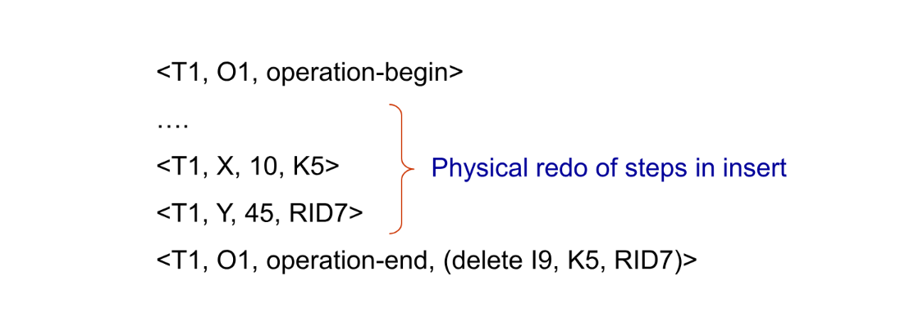

# Chapter15 Recovery System

***

## 15.1 Basic Concepts

**Failure Classification:**

* transaction failure  
  
    * 违反约束
  
* system crash  
  
    * 断电
  
* disk failure  
  
    * 磁盘损坏

**Storage Structure:**

* volatile storage: 主存、缓存等易失介质
* nonvolatile storage: 磁盘、磁带、闪存等非易失介质
* stable storage: 永远不会丢失的介质（理想情况，可以通过多重备份无限逼近与模拟）

***

## 15.2 Log-Based Recovery

**Log:**

**日志（log）** 记录事务对数据库的修改，存储在稳定存储器中。

* 开始：`<Ti,start>`
* 更新：`<Ti,X,V1,V2>`
* 提交：`<Ti,commit>`
* 回滚：`<Ti,abort>`

有两种使用日志的方法：

* immediate database modification  
  
    * 事务在提交之前就可以对数据库（buffer或disk）进行修改
    * 对于每个更新操作，先写日志再修改数据
    * 日志直接记到稳定存储器中
    * buffer刷写回磁盘可以在任何时候发生
    * buffer被修改和刷写回磁盘的顺序可以不同
  
* deferred database modification  
  
    * 事务只有在提交时才会对数据库（buffer或disk）进行修改

例如，下图就是一个immediate database modification的例子。$B$在对应事务提交之后刷写回磁盘，而$B_C$在对应事务提交之前刷写回磁盘。

**Transaction Commit:**

当提交日志写回稳定存储器后，事务就被认为是提交了，之前所有相关日志已经写回稳定存储器。

但事务修改的数据可能还在buffer里，没有刷写回磁盘。

**Redo and Undo:**

redo指的是从头开始将日志中记录的修改操作重新执行一遍，不会产生新的日志。

undo指的是从最新日志开始，逆向执行日志中记录的修改操作每undo一条日志，都会产生`<Ti,X,V>`**补偿日志（compensate log）**。当一个事务undo完成，会产生`<Ti,abort>`日志。

从故障中恢复时，如果一个事务有开始日志，且有配套的提交日志或回滚日志，则认为该事务已经被完整执行，需要redo。

如果一个事务有开始日志，但没有配套的提交日志或回滚日志，则认为该事务在故障时仍然处于活跃状态，需要undo。

!!! Note
    对于那些在故障发生之前有开始日志和回滚日志的事务，我们发现其在恢复时需要redo，虽然相当于什么都没做，称为**重复历史（repeating history）**，但能极大地简化恢复过程。

!!! Example
    **以下是三个瞬间发生故障时日志的内容，分别应该如何恢复？**

    

    (a) undo$T_0$：$B$恢复成2000，$A$恢复成1000，增加新的日志`<T0,B,2000>`，`<T0,A,1000>`，`<T0,abort>`。

    (b) redo$T_0$，undo$T_1$：$A$设置成950，$B$设置成2050，$C$恢复成700，增加新的日志`<T1,C,700>`，`<T1,abort>`。

    (c) redo$T_0$，redo$T_1$：$A$设置成950，$B$设置成2050，$C$设置成600，没有新的日志。

**Checkpoint:**

如果undo或者redo所有的日志会非常耗时。如果事务对数据的修改已经反映到磁盘上，则无需redo。

检查点的作用是将buffer中所有的日志和脏数据刷写回磁盘（稳定存储器），并向磁盘中写入检查点日志`<checkpoint L>`，$L$是当时的活跃事务表。

进行检查点相关操作时，所有更新都停止。

**Recovery Algorithm:**

在引入检查点机制后，恢复算法如下：

正常情况下：记录日志

正常情况下的回滚：undo之前的日志，增加补偿日志和回滚日志

恢复：

* redo phase:  
  
    * 找到最近的检查点`<checkpoint L>`，初始化活跃事务表为$L$
    * 从检查点开始，redo之后的所有日志
    * 如果遇到开始日志`<Ti,start>`，则将$T_i$添加到活跃事务表
    * 如果遇到提交日志`<Ti,commit>`或回滚日志`<Ti,abort>`，则将$T_i$从活跃事务表中删除
  
* undo phase:  
  
    * 从最新日志开始，往回undo所有活跃事务的日志，并添加补偿日志
    * 如果遇到开始日志`<Ti,start>`且$T_i$在活跃事务表中，则添加回滚日志`<Ti,abort>`，并将$T_i$从活跃事务表中删除
    * 直到活跃事务表清空

!!! Example
    

***

## 15.3 Buffer Management

现在，情况更加复杂，数据和日志既可以在buffer中，也可以在磁盘中，总共有四种情况。

**Log Record Buffering:**

日志在内存中有自己的buffer，与之前日志直接写入磁盘不同，只有buffer block满了或者有强制操作（log force），才会将日志刷写回磁盘。

所谓的强制操作，就是当一个事务提交时，必须将该事务的所有日志（包括提交日志）写入磁盘。

如果日志有自己的buffer，需要遵循以下规则：

* 日志从buffer刷写回磁盘的顺序必须与日志生成的顺序一致
* 只有`<Ti,commit>`写回磁盘，才意味着事务$T_i$已经提交
* 如果有脏的data buffer需要刷写回磁盘，则必须先将所有相关的日志（操作这个data block的）先刷写回磁盘（**write-ahead logging, WAL**）

**Database Buffering:**

数据库的buffer写回磁盘有三种策略：

* force policy: 事务提交时，数据和日志必须同时写入磁盘。
* no-force policy: 事务提交时，只要日志写入磁盘就可以了，数据不需要立即跟随着写入。
* steal policy: 事务没提交之前，就可以将数据写回磁盘。

如果数据想要在事务提交之前写回磁盘，需要先生成undo日志写回磁盘，但并不执行。

**Fuzzy Checkpointing:**

一般的检查点会导致其他事务的长时间阻塞，并且IO负担很重。

模糊检查点只会要求事务短暂地停一下，只将所有buffer中的日志写回磁盘（还有`<checkpoint L>`），而对于脏数据则在之后慢慢刷写入磁盘。此时，检查点并不是一个瞬间，而是一个过程。

比如，对于数据buffer中要在检查点写回磁盘的几块，每一块都进行标记，写回一块就打一个勾，直到所有块都打勾为止，表示检查点完成。

这个时候我们发现，有些检查点是无效的，因为其表示的只是开始刷写，而不是刷写完成。数据库系统会维护一个**last_checkpoint**，表示最新一个刷写完成的检查点。

***

## 15.4 Recovery with Early Release and Logical Undo Operations

**Logical Undo Logging:**

诸如B+树的插入、删除等操作会很快释放锁，很难通过**physical undo**进行撤销，因为一旦释放锁，其他的事务可能很快接着修改了数据项的值。但如果使用**logical undo**，那么插入的undo操作就变成删除，删除的undo操作就变成插入，只需要记住操作是什么，而不需要记住最后的结果是什么。

再举一个更简单的例子：对于一个更新`<T1,A,200,300>`，在原本的physical undo中，恢复一定要保证最后的A值回到200；但在logical undo中，上述更新可能表示的是A的200加上了100后变成了300，那么undo时直接将A的值减去100，而不用在意结果是多少。这种情况下，可以提前释放锁，因为只要记得操作就行。

!!! Note
    在physical undo中，我们记录的是数据项在更新前的实际值（“before image”），以便在事务出错或中止时能将数据恢复到其原始状态。这一做法的关键在于数据项的物理值必须保持不变，直到事务最终决定提交或回滚。  
    如果在physical undo的场景下提前释放锁，就可能允许其他事务访问或修改该数据项，从而改变了该数据项的当前物理值。这样一来，当需要进行回滚时，直接将数据恢复为之前记录的“before image”就无法保证数据的一致性，因为记录中的旧值已经不再反映数据在物理上的真实状态。

**Operation Logging:**

在logical undo中，当一个操作开始时，记录日志`<Ti,Oj,operation-begin>`，其中$O_j$是该操作实例的唯一标识符。

当这个操作在执行时，正常地记录日志，记录physical undo和physical redo的信息，就像之前一样。

当这个操作结束时，记录日志`<Ti,Oj,operation-end,U>`。其中$U$保存着logical undo的信息。

例如：

如果数据库故障或者事务回滚发生在操作完成之前，则使用physical undo；否则，使用logical undo，忽略`<Ti,Oj,operation-begin>`和`<Ti,Oj,operation-end,U>`之间的所有日志，并生成日志`<Ti,Oj,operation-abort>`。

!!! Example
    

!!! Example
    

***

## 15.5 ARIES Recovery Algorithm

**Physiological Redo:**

ARIES使用physiological redo来恢复数据。

例如，当表中的一条记录被删除，其他记录移动来填补空缺时，使用传统的physical redo要求记录该page的完整的前后状态，但physiological redo只需要记录删除操作的日志以及“删除”这个操作即可。

**ARIES Data Structures:**

* log sequence number (LSN)：日志的编号，顺序递增
* pageLSN
* log record
* dirty page table

**PageLSN:**

在buffer或磁盘中，每一个数据页都包含一个pageLSN，表示最近一次修改该页的日志的LSN。

pageLSN的作用是减少恢复过程中重复的redo操作。

**Log Record:**

每条日志会记录同一事务中的前一条日志的LSN。

当正常执行时遇到回滚，会记录下特殊的回滚日志，称为**compensation log record (CLR)**，其中包含对应的回滚操作，其还记录着遇到故障在undo阶段下一条（更早一条）需要被undo的日志（如下图箭头所示）。

**Dirty Page Table:**

dirty page table记录了buffer的数据页中哪些是脏的，具体来说包含：

* 脏页的pageLSN
* **recLSN**：表示该条日志之前的日志对该页的修改操作已经刷写回磁盘

当buffer中的某个数据页被更新变脏后，其会被加入dirty page table（如果不在里面），并将当前日志的LSN作为recLSN。

**Example:**

我们以下图为例进行说明：

磁盘中编号为4894的数据页，其pageLSN为4566，说明该页的内容是第4566号日志修改后的结果，该日志之后的操作还没有反映到这一页。

我们再看buffer中与之对应的数据页，编号也为4894，但其pageLSN为7567，说明该页的内容是第7567号日志修改后的结果，这也说明从第4566号日志之后到第7567号日志都只对buffer中的对应页进行了修改，而没有刷写到磁盘上。

!!! Note
    如果buffer中的数据页和磁盘中的数据页对应同一页，则buffer中的pageLSN一般晚于磁盘中的pageLSN。

我们可以看看第7567号日志的内容，这个日志还放在log buffer中，具体内容为`<T145,4894.1,40,60>`，是第145号事务修改编号为4894的数据页的第1个数据项，将其从40修改为60。

通过比较buffer和磁盘中的数据页，我们可以发现只有编号为9923的数据页的pageLSN是相同的，说明该页的内容已经刷写到磁盘上了，剩下两页是脏的，其也反映在了dirty page table中。

我们就编号为4894的数据页进行完整说明：首先，在磁盘对应页刷新之前，最后一次对该页的修改是第4566号日志，反映在磁盘页的pageLSN中；然后，一直到第7564号日志，才再次对该页进行修改，这个时候buffer变脏，被记录到dirty page table中，同时记下recLSN为7564；然后该页的buffer又被修改若干次但没有写回磁盘，最新一次修改的LSN为7567，反映在buffer页的pageLSN中。

**Checkpoint Log:**

ARIES的检查点日志包含：

* dirty page table
* 活跃事务表，包括当前每个活跃事务的最新日志（lastLSN）

ARIES使用的是fuzzy checkpointing，因此脏页在起始检查点并没有立刻刷写到磁盘。

**Recovery: 3 Passes:**

* analysis pass：  
  
    * 找到哪些事务要undo
    * 找到哪些页在出现故障时是脏的
    * 找到redo的起点（redoLSN）
  
* redo pass：  
  
    * 从redoLSN开始，redo所有日志
    * recLSN和pageLSN用来减少冗余redo
  
* undo pass：  
  
    * undo所有活跃事务的日志

**第一阶段：Analysis Pass**

从最近一个完整结束的检查点开始分析，从日志中读出当时的dirty page table，设置**redoLSN为dirty page table中所有页的recLSN的最小值**。（如果当时没有脏页，则redo的起点就是该检查点）

初始化**undo-list**为当时的活跃事务表，并读出当时每个活跃事务的lastLSN。

从检查点开始一直分析到故障瞬间，不断更新dirty page table和undo-list，得到崩溃瞬间的最新的dirty page table和undo-list。

当分析到一条更新相关的日志，如果对应的数据页不在dirty page table中，则将其添加到dirty page table中，并设置recLSN为该日志的LSN。

当分析到一条日志，其对应的事务不在undo-list中，则将其添加到undo-list中。

当分析到一条提交日志或回滚日志时，如果对应的事务在undo-list中，则将其从undo-list中删除。

同样，还要记录undo-list中每个事务的LastLSN，之后的undo会用到。

综上：analysis pass得到三个最重要的结果：

* redoLSN
* 发生故障时的dirty page table中每个脏页的recLSN。
* 发生故障时的undo-list。

**第二阶段：Redo Pass**

从redoLSN开始，对于每一个执行更新相关操作的日志进行判断：

* 如果日志操作的页不在dirty page table中，则跳过；
* 如果日志的LSN小于该页的recLSN，则跳过；
* 否则，读出磁盘对应页，如果读出来的页的pageLSN小于日志的LSN，则说明该日志的更新还没有反映到磁盘上，需要redo；否则不用redo。

!!! Note
    第一个跳过的原因：  
    由于analysis pass中dirty page table只增不减，因此只要最后不在dirty page table中，就说明该页在检查点时就没有被修改过，因此不需要redo。

    第二个跳过的原因：  
    recLSN的定义就表明了在这之前的所有日志操作都已经刷写回磁盘。

    第三个跳过的原因：  
    如果读出来的页的pageLSN大于等于日志的LSN，pageLSN对应的日志已经反映到磁盘上了，那更早的日志就更不用说了。

**第三阶段：Undo Pass**

从后往前undo所有活跃事务（undo-list）的日志。

优化可以如下操作：

* 定义新的结构nextLSN，表示每一个活跃事务下一个要undo的日志的LSN，初始化为undo-list中每个事务的LastLSN
* 在undo的每一步，挑选nextLSN中最大的LSN对应的日志进行
* 在undo一条日志之后：  
  
    * 对于普通日志，将该日志所在事务的nextLSN更新为该日志的prevLSN（已经记录在日志中）
    * 对于CLR，将该日志所在事务的nextLSN更新为该日志的undonextLSN（也已经记录在日志中）

其他和原来的算法一样，直到undo-list清空。

!!! Example
    