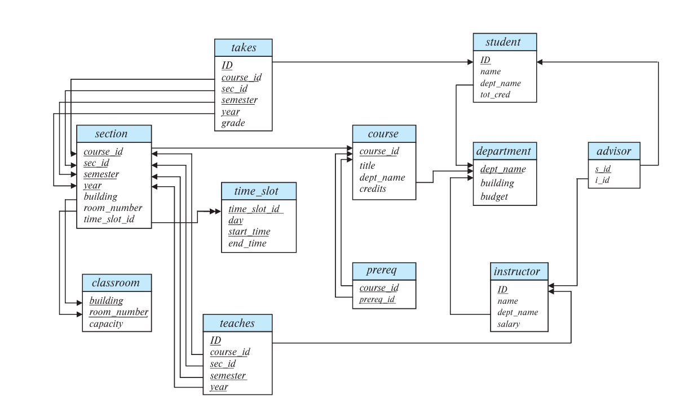
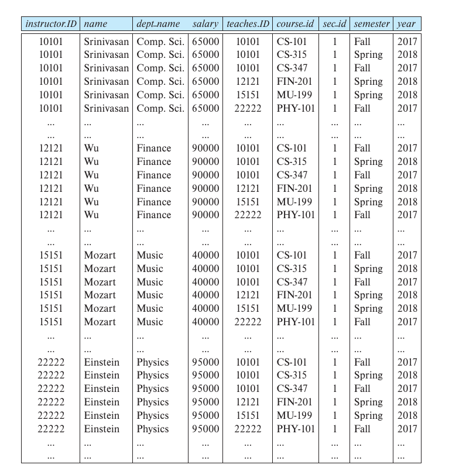

# Chapter2 Introduction to Relational Model

***

## 2.1 Structure of Relational Databases

**Relation Schema and Instance:**

* 属性 attribute：用$A_1,A_2,...A_n$表示
* 关系模式 relation schema：$R=(A_1,A_2,...A_n)$  
  关系模式定义了变量类型，包括名字、属性等
* 实例 instance：$r$  
  在关系模式$R$下定义的实例$r$记作$r(R)$
* 元组 tuple：$t$  
  实例中的元素，也就是一行数据

**Attributes:**

每一个属性的取值范围称为该属性的**域（domain）**。

属性通常具有原子性，即属性的值是不可分的。

!!! note
    对于关系模型，属性一般要求原子性，但实际上是不一定的。  
    例如：地址属性，实际上可以继续拆分（省市区等）。
    因此属性的原子性是一个相对概念。

每一个属性的域中都有**null（空值）**。

***

## 2.2 Database Schema

* 数据库模式 database schema：  
  整个数据库的逻辑架构，包括多个关系模式
* 数据库实例 database instance：  
  当前数据库和其中数据的快照

***

## 2.3 Keys

键$K$是一个关系模式$R$的子集，是一组属性的集合。

**superkey 超键：**

超键中的属性被赋值后能唯一确定一个对应的元组。

例如{ID}、{ID,name}都是超键，可以唯一确定一名学生。

**candidate key 候选键：**

超键的子集，不能再删除属性，也就是最小的超键。

例如：{ID}、{ID,name}都是超键，但只有{ID}是候选键，因为{ID}不能再删除属性。
    
!!! Note
    最小是相对概念，是用集合的包含关系确定的，而不是看元素个数。  
    例如：$K_1=\{A,B\},K_2=\{B,C,D\}$，如果二者都不能再删除属性，则二者都是候选键。

**primary key 主键：**

选一个候选键作为主键，是人为确定的。

主键要求所有属性都不为空，但候选键不要求。

**foreign key 外键：**

当表1的一组属性对应到表2的另一组属性，对应到的属性是表2的主键时，这组属性称为表1的外键，形成foreign-key constraint。

如果对应到的属性只是另一张表的主键的一部分或者根本不在主键内，则称为referential integrity constraint。

***

## 2.4 Schema Diagrams

!!! Note
    单箭头表示foreign-key constraint，双箭头表示referential integrity constraint。

***

## 2.5 Relational Algebra

关系代数是一种过程式查询语言，其并不是图灵机等价的，有六个基本算子（返回的均为表格）。

**Select $\sigma$:**

选择算子选出满足要求的元组（行），符号表示为：

$$\sigma_p(r)$$

其中，$p$是选择谓词（selection predicate）。

!!! Example
    **选择职工表中物理系的人。**

    $\sigma_{\text{dept\_name=“Physics”}}(\text{instructor})$

选择谓词中可以使用比较算符（comparison）和连接算符（connective）：

!!! Example
    **选择职工表中物理系工资高于$90,000的人。**

    $\sigma_{\text{dept\_name=“Physics”}\wedge\text{salary}>90,000}(\text{instructor})$

**Project $\Pi$:**

投影算子选出需要的属性（列），符号表示为：

$$\Pi_{A_1,A_2,...A_n}(r)$$

!!! Note
    对于投影算子，如果返回的表格中有几行信息一样，则只保留一个（去重）。

!!! Example
    **去掉职工表中的部门名。**

    $\Pi_{\text{ID,name,salary}}(\text{instructor})$

**Cartesian Product $\times$:**

笛卡尔积算子将两张表中前一张表的元组和后一张表的元组两两组合，形成一张新的表，且不去重。符号表示为：

$$r_1\times r_2$$

!!! Example
    **职工表和教学表的笛卡尔积。**

    Query:
    $\text{instructor}\times\text{teaches}$

    Result:
    

!!! Success "Definition"
    **Join $\Join$:**  
    连接算子是笛卡尔积和选择算子的组合，不在六大算子中。符号表示为：

    $$r_1\Join_pr_2=\sigma_p(r_1\times r_2)$$

    !!! Example
        **获取职工表与教学表中ID相同的元组。**

        写法一：$\sigma_{\text{instructor.ID=teaches.ID}}(\text{instructor}\times\text{teaches})$

        写法二：$\text{instructor}\Join_{\text{instructor.ID=teaches.ID}}\text{teaches}$

**Union $\cup$:**

并算子将两张表进行合并，需要两张表**同质**（属性数量（即**元数（arity）**）一致，对应位置属性的域一致），**并去重**。符号表示为：

$$r_1\cup r_2$$

!!! Example
    **查询课程表中2017秋学期的课或2018春学期的课。**

    $\Pi_{\text{course\_id}}(\sigma_{\text{year=2017}\wedge\text{semester=“Fall”}}(\text{section}))\cup\Pi_{\text{course\_id}}(\sigma_{\text{year=2018}\wedge\text{semester=“Spring”}}(\text{section}))$

!!! Success "Definition"
    **Intersection $\cap$:**  
    交算子与并算子类似，需要两张表同质，符号表示为：

    $$r_1\cap r_2$$

    !!! Example
        **查询课程表中2017秋学期和2018春学期都上的课。**

        $\Pi_{\text{course\_id}}(\sigma_{\text{year=2017}\wedge\text{semester=“Fall”}}(\text{section}))\cap\Pi_{\text{course\_id}}(\sigma_{\text{year=2018}\wedge\text{semester=“Spring”}}(\text{section}))$

**Set Difference $-$:**

差算子在两张表同质的情况下，返回前一张表中有而后一张表中没有的元组。符号表示为：

$$r_1-r_2$$

!!! Example
    **查询课程表中2017秋学期上的课但2018春学期没有上的课。**

    $\Pi_{\text{course\_id}}(\sigma_{\text{year=2017}\wedge\text{semester=“Fall”}}(\text{section}))-\Pi_{\text{course\_id}}(\sigma_{\text{year=2018}\wedge\text{semester=“Spring”}}(\text{section}))$

**Rename $\rho$:**

重命名算子将表格中的属性重命名，符号表示为：

$$\rho_x(r)$$

$$\rho_{x(A_1,A_2,...,A_n)}(r)$$

其中，$x$是属性的新名字。

!!! Success "Definition"
    **Assignment $\leftarrow$:**  
    赋值算子与重命名算子类似，符号表示为：

    $$E_1\leftarrow E_2$$

    !!! Example
        **在职工表中查询物理系和音乐系的人。**

        $\text{Physics}\leftarrow\sigma_{\text{dept\_name=“Physics”}}(\text{instructor})$
        $\text{Music}\leftarrow\sigma_{\text{dept\_name=“Music”}}(\text{instructor})$
        $\text{Physics}\cup\text{Music}$

**Equivalent Expressions:**

!!! Example
    $\sigma_{\text{dept\_name=“Physics”}\wedge\text{salary>90,000}}(\text{instructor})$
    $\sigma_{\text{dept\_name=“Physics”}}(\sigma_{\text{salary>90,000}}(\text{instructor}))$

!!! Example
    $\sigma_{\text{dept\_name=“Physics”}}(\text{instructor}\Join_{\text{instructor.ID=teaches.ID}}\text{teaches})$
    $(\sigma_{\text{dept\_name=“Physics”}}(\text{instructor}))\Join_{\text{instructor.ID=teaches.ID}}\text{teaches}$