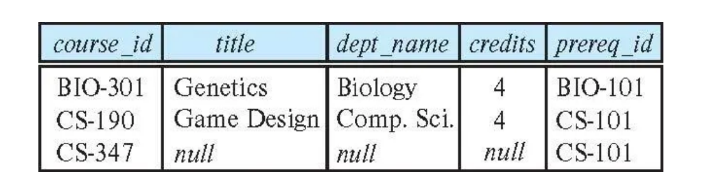

<span style="font-family: 'Times New Roman';">

# Chapter4 Intermediate SQL

***

## 4.1 Join Expressions

**`inner join` 内连接:**

`inner join`相当于笛卡尔积，与使用逗号连接两张表的效果相同，使用时可直接写成`join`。

`on`关键字类似于`where`，用于约束，常与`join`联用。例如：

```sql
# 写法一：
select *
from student join takes on student_ID=takes_ID

# 写法二：
select *
from student,takes
where student_ID=takes_ID
```

**`natural join` 自然连接:**

如果两张表有相同名字的属性，各自有元组对应该属性的值相同（所有共同属性的对应值都相同），则`natural join`会将这两个元组连接形成一个新的元组，并且**相同的属性只保留一个（列）**。

例如，查询学生与其对应上过的课的编号：

```sql
# 写法一：
select name,course_id
from students,takes
where student.ID=takes.ID

# 写法二：
select name,course_id
from student natural join takes
```


值得注意的是，`natural join`会自行寻找相同的属性合并，但相同的属性在两张表里的含义可能不同。例如，查询学生与其对应上过的课的名称：

```sql
# 正确写法：
select name,title
from student natural join takes,course
where takes.course_id=course.course_id

# 错误写法：
select name,title
from student natural join takes natural join course
```

错误原因在于：`student`的`dept_name`属性与`course`的`dept_name`属性含义不同，但被连接。

为了避免这类情况，使用`using`关键字可以指定合并的属性名。因此，上例的错误写法可改为：

```sql
select name,title
from (student natural join takes) natural join course using (course_id)
```

**`outer join` 外连接:**

`outer join`是连接操作的扩展，避免了信息丢失，其有三种类型：

* `left outer join`：保留前一张表格的信息，剩余用null填充，符号为$r_1⟕r_2$
* `right outer join`：保留后一张表格的信息，剩余用null填充，符号为$r_1⟖r_2$
* `full outer join`：保留两张表格的信息，剩余用null填充，符号为$r_1⟗r_2$

`outer join`有四种用法：

* 什么都不加：退化为笛卡尔积或报错
* 与`on`联用：进行相应的null填充，但不合并相同列
* 与`using`联用：进行相应的null填充，且合并相同列
* 与`natural`联用：进行相应的null填充，且合并相同列

假设有以下两张表：


其中，BIO-301和CS-190在两张表中都有出现，CS-315只在course表中出现，CS-347只在prereq表中出现。

`natural left outer join`：

course表的内容全部保留，因此即使CS-315只在course表中出现，也会保留并用null填充其他属性。


`natural right outer join`： 

prereq表的内容全部保留，因此即使CS-347只在prereq表中出现，也会保留并用null填充其他属性。


`natural full outer join`：  

两张表的内容全部保留，因此即使CS-315和CS-347只在一张表中出现，也会保留并用null填充其他属性。


!!! Example
    **还是以这两张表为例：**

    

    ```sql
    course inner join prereq on course.course_id=prereq.course_id
    ```

    

    ```sql
    course left outer join prereq on course.course_id=prereq.course_id
    ```

    

    ```sql
    course natural right outer join prereq
    ```

    

    ```sql
    course full outer join prereq using (course_id)
    ```

    

***

## 4.2 Views

**View Definition and Use:**

视图（view）是一种虚拟表，与数据库中原本就存在的真实表相对，其基于查询结果构建，本质上是一个重命名的查询表达式。语法如下：

```sql
create view <name> as <query expression>
```

视图的使用与真实表格类似，其也能进行查询，定义时可以依赖其他视图，也可以依赖自己（递归）。

如果视图$v_1$的定义中用到了视图$v_2$，则称$v_1$关于$v_2$是**depend directly**的。

如果视图$v_1$关于$v_2$是depend directly的，或者二者之间存在依赖链，则称$v_1$关于$v_2$是**depend on**的。

!!! Example
    **建立instructor的视图，不包括工资属性：**

    ```sql
    create view faculty as
        select ID,name,dept_name
        from instructor
    ```

    **在faculty视图上查询所有生物系的教授：**

    ```sql
    select name
    from faculty
    where dept_name='Biology'
    ```

    **建立关于院系总工资的视图：**

    ```sql
    create view departments_total_salary(dept_name,total_salary) as
        select dept_name,sum(salary)
        from instructor
        group by dept_name
    ```

**View Expansion:**

由于视图的本质是查询表达式，因此当需要解析的视图中包含其他视图时，会迭代进行视图的展开，最终展开为不包含任何视图的查询表达式（递归除外）。

**Materialized Views:**

物化视图（materialized view）与普通的视图不同，其对应的数据会真实地存储在硬件上，而不是表达式的抽象。因此，其解析时不需要展开，而是直接使用结果。

* 物化视图的优点：  
  
    * 频繁查询时速度更快

* 物化视图的缺点：  
  
    * 维护代价：一旦原始数据更新，物化视图也要进行对应的更新
    * 存储代价

**Update of View:**

问题一：属性缺失

假设faculty视图是instructor表忽略salary属性的视图，现在更新faculty视图，插入一条新的数据，但这条数据没有salary属性，那么instructor表应该如何更新？

当遇到属性缺失的情况，通常有两种做法：

* 拒绝操作
* 空值填充

问题二：更新不唯一

例如：

```sql
create view instructor_info as
    select ID,name,building
    from instructor,department
    where instructor.dept_name=department.dept_name;

insert into instructor_info
    values('69987','White','Taylor');
```

出现的问题是，如果有多个院系位于Taylor楼中，那么插入的数据应该属于哪个院系？如果没有院系在Taylor楼中，那么插入的数据又该何去何从？

因此，大部分SQL只支持简单视图的更新，这些视图可能需要满足：

* `from`子句后面只有一张表格
* `select`子句后面的属性不含表达式、聚合函数、`distinct`关键字等
* 没有列在`select`子句后面的属性可以设为null
* 查询表达式中没有`group by`或`having`子句

***

## 4.3 Index

索引（index）是用来提高查询性能的数据结构。在查询范围很大，但目标数据很小的情况下，可以为表格的某个属性建立索引（单维索引），加速查询。语法如下：

```sql
create index <name> on <relation-name> (<attribute>)
```

例如，在学生表中为ID属性建立索引，能更快地查询到ID为12345的学生：

```sql
create table student
(
    ID varchar(5),
    name varchar(20) not null,
    dept_name varchar(20),
    tot_cred numeric(3,0) default 0,
    primary key (ID)
);

create index studentID_index on student (ID);
    
select *
from student
where ID='12345';
```

***

## 4.4 Integrity Constraints

完整性约束涉及以下方面：

* not null
* primary key
* unique
* check(P), where P is a predicate
* ...

**`unique` 唯一性：**

`unique`关键字确保表中的某一列或某组列的数据具有唯一性，即对应的数据不能重复：

```sql
unique (A1,A2,...,An)
```

从数据库理论的角度来看，这些属性组成的集合构成了超键。

**`check` 检查:**

`check`关键字会检查每个元组是否满足之后的谓词，确保数据符合特定的规则，从而保持数据的一致性和完整性。例如，确保semester属性为Spring, Summer, Fall, Winter之一：

```sql
create table section
(
    course_id varchar(8),
    sec_id varchar(8),
    semester varchar(6),
    year numeric(4,0),
    building varchar(15),
    room_number varchar(7),
    time_slot_id varchar(4),
    primary key (course_id,sec_id,semester,year),
    check (semester in ('Spring','Summer','Fall','Winter'))
);
```

!!! Note
    `check`不止在元组插入或更新的时候会进行检查，当谓词发生变化时也会对现有元组进行检查。

    例如：

    ```sql
    check(time_slot_id in (select time_slot_id from time_slot));
    ```

    当time_slot表格发生变化时，谓词也发生变化，这时候所有的元组都会被再次检查。

**Integrity Constraint Violation During Transactions:**

对于以下例子：

```sql
create table person
(
    ID char(10),
    name varchar(40),
    mother char(10),
    father char(10),
    primary key (ID),
    foreign key (mother)    references person(ID),
    foreign key (father) references person(ID)
);
```

外键自己参照自己，为了不违反完整性约束，有以下几种方法：

* 在插入一个人的数据之前先插入其父母的数据，即考虑顺序
* 插入数据时父母属性默认为空，所有的数据插入完后再更新父母属性
* 延迟检查

**Assertions:**

断言（assertion）确保数据库中的数据满足特定的条件：

```sql
create assertion <assertion-name> check (<predicate>);
```

**Triggers:**

触发器（trigger）是一种自动执行的语句，遵循ECA原则（Event事件、Condition条件、Action动作）。

* 触发的事件可以是`insert`，`delete`或`update`，如果是`update`，还可以指定具体的属性
* 触发的时间可以是`before`或`after`
* 触发的数据可以是`old row`或`new row`

例如，将空白的grade改为null：

```sql
create trigger setnull_trigger before update of takes on (grade)
referencing new row as nrow
for each row
    when (nrow.grade='')
    begin atomic
        set nrow.grade=null;
    end;
```

!!! Example
    **更新学生的总学分：**

    ```sql
    create trigger credits_earned after update of takes on (grade)
    referencing new row as nrow
    referencing old row as orow
    for each row
    when nrow.grade<>'F' and nrow.grade is not null and (orow.grade='F' or orow.grade is null)
    begin atomic
        update student
        set tot_cred=tot_cred+(select credits
                               from course
                               where course.course_id=nrow.course_id)
        where student.id=nrow.id;
    end;
    ```

***

## 4.5 Data Types

**Built-in Data Types:**

* `date`: `date '2005-7-27'`
* `time`: `time 09:00:30`
* `timestamp`: `timestamp '2005-7-27 09:00:30.75'`
* `interval`: `interval '1' day`

**Large-Object Types:**

图像、视频、CAD文件等大型数据对应特殊的数据类型：

* `blob`: binary large object
* `clob`: character large object

查询large object时使用的是pointer（指针、定位器）。

**User-Defined Types:**

使用`create type`关键字创建自定义数据类型。例如：

```sql
create type Dollars as numeric (12,2) final; # final表示这个类型是最终类型，不能被进一步继承或修改

create table department
(
    dept_name varchar(20),
    building varchar(15),
    budget Dollars
);
```

**Domains:**

使用`create domain`关键字创建域（domain）。例如：

```sql
create domain person_name char(20) not null;

create domain degree_level varchar(10) 
    constraint degree_level_test    # 设置约束
        check (value in ('Bachelors','Masters','Doctorate'));
```

!!! Note
    类型和域类似，但域会有更多的约束条件，如非空等。

***

## 4.6 Authorization

SQL在以下几个方面可以设置权限：

* read
* insert
* update
* delete
* reference
* all：所有权限

每一种类型的授权称为一个**权限（privilege）**。

**`grant` 授权:**

`grant`关键字用于授权：

```sql
grant <privilege list> on <relation or view> to <user list>
```

其中，`<user list>`可以是用户ID，public（所有用户）或特定的role。

例如：

```sql
grant select on department to Amit,Satoshi;
```

授予视图的权限并不意味着授予视图底下表格的权限。

授权者自己要有对应的权限（或者是database administrator）。

**`revoke` 撤回授权:**

`revoke`关键字用于撤回授权：

```sql
revoke <privilege list> on <relation or view> from <user list>
```

例如：

```sql
revoke select on student from U1,U2,U3;
```

如果`<user list>`是public，那么那些被明确授权的用户并不会受到影响。

对于相同权限，如果A和B都将该权限授予给C，那么A撤回权限后，C的权限可能仍然保留，需要考虑级联。

若A授予B权限，B授予C相同权限，那么当A撤回权限时，C的权限也会被撤回。

**Roles:**

role是对user的分组，语法如下：

```sql
create role <name>
```

设置user为指定的role：

```sql
grant <role> to <users>
```

授予指定的role权限：

```sql
grant <privilege> on <relation> to <role>
```

role也可以继承（role2得到role1的所有权限）：
 
```sql
grant <role1> to <role2>
```

**Transfer of Privileges:**

允许user再次给其他人授权：

```sql
grant <privilege> on <relation> to <role/user> with grant option
```

级联撤回，之前再次给出去的授权也撤回：

```sql
revoke <privilege> on <relation> from <role/user> cascade
``` 

拒绝操作：

```sql
revoke <privilege> on <relation> from <role/user> restrict
```