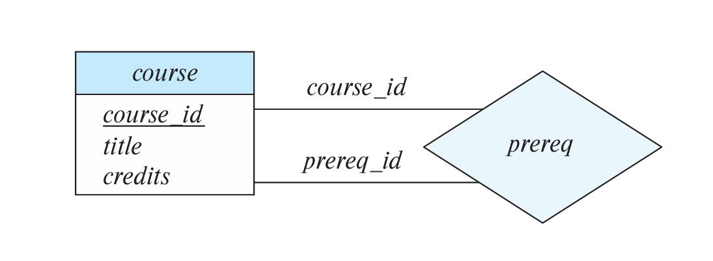
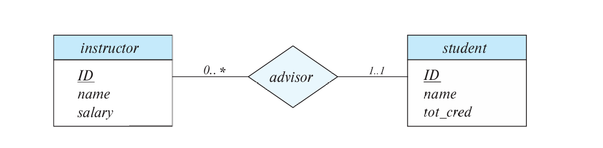

<span style="font-family: 'Times New Roman';">

# Chapter6 Database Design using the ER Model

***


## 6.1 Entity-Relationship Model (ER Model)

ER模型全称**实体关系模型（entity-relationship model）**，通过**ER图（ER diagram）** 表示，其包含三个基本元素：

* 实体（集合）
* 关系（集合）
* （关系/实体）属性

**Entity Sets:**

**实体（entity）** 是一个对象，比如instructorA，studentB等。**实体集合（entity set）** 由具有共同属性的实体组成，比如instructor集合，student集合等。

实体集合在ER图中用矩形表示，下划线表示主键：


**Relationship Sets:**

**关系（relationship）** 存在于两个及以上实体之间，如一个instructor实体和一个student实体之间存在advisor关系。上升一步，instructor集合和student集合之间的所有advisor关系组成advisor**关系集合（relationship set）**。

关系集合在ER图中用菱形表示：


关系集合也可以有自己的属性，就像实体集合有自己的属性一样。例如advisor关系集合可以有date属性，表示instructor和student之间何时形成advisor关系。

关系集合的属性在ER图中用矩形+虚线表示：


**Roles:**

如果关系集合涉及到的实体集合为同一个，则需要区分角色。例如prereq关系集合，其实体集合都是course集合，需要区分先修课和后修课。

角色在ER图中在标注在线上：



**Degree:**

关系集合的度是指涉及到的实体集合的数量。二元关系是最常见的，三元关系也可以表示成多个二元关系，只是用三元关系比较好解释。比如student、instructor、project三者形成的关系。

在ER图中，多元关系的表示与二元关系同理：


***

## 6.2 Complex Attributes

某些属性可以进一步细分，例如address可以细分成street、city、state、postal_code等。因此，属性可以分成**简单属性（simple）**和**复合属性（composite）**。

某些属性可以对应多值，例如一个person实体对应的phone_number可以有两个。因此，属性可以分为**单值属性（single-valued）**和**多值属性（multivalued）**。

某些属性可以由其他的属性确定，例如age可以由date_of_birth确定。因此，这种属性称为**派生属性（derived）**。

复合属性在ER图中用缩进标明，多值属性在ER图中用{ }标明，派生属性在ER图中用( )标明。


## 6.3 Mapping Cardinalities

对于一个给定的二元关系集合，每个实体能和多少个实体相关联，分为以下四种情况：

* one to one
* one to many
* many to one
* many to many


!!! Note
    实体也可以不参与任何关系，即不连线。

在ER图中，one对应的那一边带箭头，many对应的那一边不带箭头：


!!! Note
    对于三元关系，最多只能有一个箭头，否则会引起歧义。

**Total and Partial Participation:**

如果一个实体集合的每个实体都参与到了关系集合中，则称为**全部参与（total participation）**；否则称为**部分参与（partial participation）**。

全部参与在ER图中用双线段表示：


**Notation for Expressing More Complex Constraints:**

可以通过a..b的形式表示约束，a表示每个实体集合中每个实体最少要参与的关系数，b表示最多能参与的关系数：



左边的0..*表示每个instructor可以不参与advisor关系，也可以参与无限多的advisor关系；右边的1..1表示每个student必须参与且只能参与一个advisor关系。

***

## 6.4 Primary Key

**Primary Key for Relationship Sets:**

一个关系集合的主键包括两部分，一部分是**关系集合本身的属性**，另一部分是**其涉及的所有实体集合的主键的并**。

事实上，关系集合的主键取决于关系集合的映射基数：

* one to one：任意一个实体集合的主键都可以直接等同于关系集合的主键
* one to many/many to one：many一边的实体集合的主键可以直接等同于关系集合的主键
* many to many：实体集合的主键的并可以直接作为关系集合的主键

**Weak Entity Sets:**

假设实体集合section的主键为{course_id，semester，year，sec_id}，其和另一个实体集合course（主键为{course_id}）通过关系集合sec_course相关联。

不难发现，如果将section，course和sec_course三者整体考虑（即考虑sec_course的主键），则section主键中的course_id属性是冗余的。

这种情况下，section实体集合是依赖于course实体集合的，我们将section实体集合称为**弱实体集合（weak entity set）**，course实体集合称为**标识性实体集合（identifying entity set）**，sec_course关系集合称为**标识性关系集合（identifying relationship set）**。弱实体集合依赖于标识性实体集合。

在ER图中，弱实体集合冗余的主键属性并不写出（因为标识性实体集合已经标明了），只用虚线标明剩下的主键属性（称为**discriminator/partial key**），弱实体集合的矩形框和标识性关系集合的菱形框全部用双线段表示：


!!! Note
    虽然在ER图中如此表示，但弱实体集合的主键依然不变（其下用虚线标明的partial key和冗余的写在标识性实体集合之下的属性），标识性关系集合的主键和弱实体集合的主键是一样的。

***

## 6.5 Reducing ER Diagrams to Relational Schemas:

ER图可以转换成一系列表格，对于每一个实体集合或关系集合就可以转换成单独的一张表（以该实体集合或关系集合命名）。

**Representing Entity Sets:**

对于强实体集合：

可以直接转换成一张表，表的属性就是集合的属性。

对于弱实体集合：

也可以直接转换成一张表，但是表的属性并不能只看ER图中该实体集合下方的属性，因为还有冗余的主键属性写在标识性实体集合下方。

**Representing Complex Attributes:**

对于复合属性：

将复合属性拆分成简单属性作为表格的属性。

对于多值属性：

单独转换成一张表，表的属性包括实体集合的主键和这个多值属性。例如，一个ID对应多个phone_number，那么针对phone_number可以单独转换成一张表，表的属性包括ID和phone_number，包括元组(22222,456-7890)，(22222,123-4567)等。

对于派生属性：

直接忽略，不写在表格中。

!!! Example
    **写出以下实体集合转换成表格后的属性。**

    

    ```sql
    instructor(ID,first_name,middle_initial,last_name,street_number,street_name,apt_number,city,state,zip,date_of_birth)
    ```

**Representing Relationship Sets:**

对于many to many：

将关系集合转换成一张表，这张表的属性包括两个实体集合的主键（其余属性可加）和关系集合的所有属性。

对于many to one/one to many：

如果many一方的实体集合是**全部参与**的，那么只要将many一方转换成一张表，然后在这张表上再加上one一方的主键和关系集合的所有属性，就可以表示这一关系。

对于one to one：

可以随意挑选一个实体集合作为上述的“many”一方，然后加上另一方的主键和关系集合的属性。

!!! Note
    对于many to one/one to many/one to one，“many”乙方如果是部分参与的，则需要考虑null填充的情况。

***

## 6.6 Extended ER Features

**Specialization:**

**特化（specialization）** 指的是一个实体集合派生多个子实体集合，每个子实体集合有自己额外的属性，或者参与自己的关系，是一种**自上而下**的设计过程。

子实体集合继承父实体集合的所有属性和关系。有以下两种特化方式：

* **重叠特化（overlapping）：** 子实体集合之间有重叠，即一个实体可以同时属于多个子实体集合。例如下图中，一个person既可以属于instructor，又可以属于student。
* **不相交特化（disjoint）：** 子实体集合之间没有重叠，即一个实体只能属于一个子实体集合。例如下图中，一个employee要么属于instructor，要么属于secretary。


!!! Note
    注意此处两种特化方式的箭头表示。

对于特化的实体集合，有两种转换成表格的方式：

* 方法一：父实体集合正常转换，子实体集合只包含父实体集合的主键和子实体集合的独有属性。
  
  * person(ID, name, street, city)
  * student(ID, tot_credits)
  * employee(ID, salary)
  
    缺点：例如获得一个student的完整信息需要查两张表

* 方法二：每一个实体集合都包含完整属性。
  
  * person(ID, name, street, city)
  * student(ID, name, street, city, tot_credits)
  * employee(ID, name, street, city, salary)
  
    缺点：对于既是student又是employee的实体，name, street, city等属性冗余。

**Generalization:**

**概化（generalization）** 是特化的逆操作，将多个子实体集合归纳成一个更高一层的实体集合，是一种**自下而上**的设计过程。在ER图中的表示与特化一致。

**Completeness Constraints:**

!!! Note
    注意区分完全性约束（completeness）和完整性约束（integrity）。

在特化和概化中，如果高层级的实体集合一定属于低层级的某个实体集合，则称为**total**，否则称为**partial**。默认为partial。

**Aggregation:**

假设student，instructor和project之间存在proj_guide的三元关系，现在有一个新的三元关系eval_for，我们会发现proj_guide和eval_for之间存在冗余，每一个eval_for关系会对应到唯一的一个proj_guide关系，但部分proj_guide关系并不对应到eval_for关系。所以并不能单纯丢弃proj_guide关系集合。


对于这种冗余的情况，我们采用**聚合（aggregation）** 的方法，将关系看作一个抽象的实体，也就是允许存在关系之间的关系。


***

## 6.7 Alternative Notations for Modeling Data

