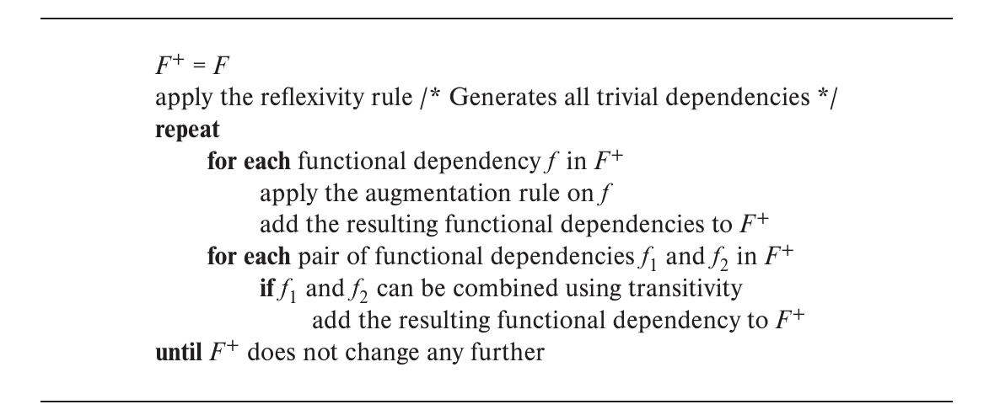

# Chapter7 Normalization

***

### 7.1 Decomposition

对于存在信息冗余的schema，可以考虑将其分解，得到多个schema。

**Lossy/Lossless Decomposition:**

如果分解得到的schema通过自然连接可以还原为原本的schema，则称为**无损分解（lossless decomposition）**，否则称为**有损分解（lossy decomposition）**。

例如：

    
重新自然连接的schema并不能还原为原本的schema，反而增加了干扰信息，因此为有损分解。

用$R$代表原本的schema，$R_1$和$R_2$代表分解后的schema，其也代表对应schema的属性集合。若对于任何表格实例$r$，都有：

$$\Pi_{R_1}(r)\Join\Pi_{R_2}(r)=r$$

则为无损分解。若存在：

$$r\in \Pi_{R_1}(r)\Join\Pi_{R_2}(r)$$

则为有损分解。

**Normalization Theory：**

范式理论用于确定一个relation $R$ 是否为一种好的形式（good form）。

如果$R$并不为一种好的形式，则将其分解为$R_1,R_2,...,R_n$，满足：

* $R_1,R_2,...,R_n$均为好的形式
* 无损分解

!!! Note
    好的形式是人为定义的相对概念。

***

## 7.2 Functional Dependency

**Function Dependency：**

设一个schema的属性集合为$R$（本质上代表了整个schema），$\alpha$和$\beta$分别是$R$的子集，称$R$上存在函数依赖

$$\alpha\rightarrow\beta$$

当且仅当对于任何合法的relation $r(R)$，其中的tuple只要$\alpha$中的属性值全部相同，则$\beta$中的属性值也一定全部相同，即$\alpha$唯一确定$\beta$。

可以用函数依赖对键进行定义，函数依赖实际上是键的泛化概念：

* $K$是schema $R$的超键 $\Leftrightarrow$ $K\rightarrow R$
* $K$是schema $R$的候选键 $\Leftrightarrow$ $K\rightarrow R$ 且不存在$K$的真子集$\alpha$使得$\alpha\rightarrow R$

函数依赖有两个作用：

* 检查$r$在给定的函数依赖集合$F$下是否合法，若合法，则称$r$ **satisfies** $F$
* 声明$R$上的约束，如果$R$的所有实例$r$都满足$F$，则称$F$ **holds on** $R$

!!! Note
    仅从一个relation中不能判断函数依赖是否成立，需要结合$R$对应的所有relation。

**Trivial Functional Dependency：**

若属性集合$\alpha$和$\beta$满足$$\beta\subseteq\alpha$$

则称$\alpha\rightarrow\beta$这一函数依赖是**平凡**的。

**Lossless Decomposition：**

有了函数依赖，就可以定义无损分解的充分条件。

设$R$分解为$R_1$和$R_2$（同样表示属性集合），则无损分解的**充分条件**为：

$$R_1\cap R_2\rightarrow R_1$$

或

$$R_1\cap R_2\rightarrow R_2$$

可以这么理解：如果$R_1$和$R_2$共享的属性能够唯一确定一个子关系中的所有属性，那么在自然连接的时候，通过这些公共属性就能准确地把对应的元组匹配起来，避免产生错误的组合或遗漏。

!!! Note
    若依赖只有函数依赖一种而不存在其他类型的依赖，则上述条件也是必要条件。

!!! Example
    **$R=(A,B,C),~F=\\{A\rightarrow B,B\rightarrow C\\}$，有哪些无损分解的结果？**

    第一种无损分解：$R_1=(A,B),~R_2=(B,C)$  
    原因：$R_1\cap R_2=B$且$B\rightarrow BC$

    第二种无损分解：$R_1=(A,B),~R_2=(A,C)$  
    原因：$R_1\cap R_2=C$且$A\rightarrow AB$

    !!! Note
        $B\rightarrow BC$是$B\rightarrow(B,C)$的简写。

***

## 7.3 Functional Dependency Theory

**Closure of a Set of Functional Dependencies：**

设$F$为函数依赖组成的集合，$F$中的函数依赖可以推导出其他函数依赖，所有推导出的函数依赖组成的集合称为$F$的**闭包**，记作$F^+$。

$F$是$F^+$的子集，$F^+$是$F$的超集。

已知$F$求$F^+$需要重复应用**Armstrong's Axiom**：

* 自反（reflexivity）：若$\beta\subseteq\alpha$，则$\alpha\rightarrow\beta$
* 增补（augmentation）：若$\alpha\rightarrow\beta$，则$\gamma\alpha\rightarrow\gamma\beta$
* 传递（transitivity）：若$\alpha\rightarrow\beta$且$\beta\rightarrow\gamma$，则$\alpha\rightarrow\gamma$

这三条公理是正确（sound）且完备（complete）的。通过这三条公理还可以推导出以下规则：

* 合并（union）：若$\alpha\rightarrow\beta$且$\alpha\rightarrow\gamma$，则$\alpha\rightarrow\beta\gamma$
* 分解（decomposition）：若$\alpha\rightarrow\beta\gamma$，则$\alpha\rightarrow\beta$且$\alpha\rightarrow\gamma$
* 伪传递（pseudotransitivity）：若$\alpha\rightarrow\beta$且$\gamma\beta\rightarrow\delta$，则$\alpha\gamma\rightarrow\delta$

!!! Example
    **已知$R(\alpha,\beta,\gamma)$有函数依赖$\alpha\gamma\rightarrow\beta\gamma$，求证其与$\alpha\gamma\rightarrow\beta$等价。**

    左推右：自反：$\beta\gamma\rightarrow\beta$，再加上传递即可

    右推左：两边增补$\gamma$即可

    **很重要的结论！**

通过重复应用Armstrong's Axiom，可以从$F$开始推导出$F^+$，这是计算$F^+$的第一个方法：

**Closure of Attribute Sets：**

对于属性集合$\alpha$，定义其闭包为在函数依赖集合$F$下可由$\alpha$决定的所有属性集合，记作$\alpha^+$。

!!! Example
    **设$R=(A,B,C,G,H,I)$，$F=\\{A\rightarrow B,A\rightarrow C,CG\rightarrow H,CG\rightarrow I,B\rightarrow H\\}$，求$(AG)^+$。**

    result = $AG$  
    result = $ABCG$ ($A\rightarrow C$ and $A\rightarrow B$)  
    result = $ABCGH$ ($CG\rightarrow H$ and $CG\subseteq ABCG$)  
    result = $ABCGHI$ ($CG\rightarrow I$ and $CG\rightarrow AGBCH$)  

属性的闭包有以下几个作用：

* 检查一个属性集合$\alpha$是否为超键：计算$\alpha^+$，若$\alpha^+$包含$R$的所有属性，则$\alpha$是$R$的超键
* 检查是否存在函数依赖$\alpha\rightarrow\beta$：若$\beta\subseteq\alpha^+$，则存在函数依赖$\alpha\rightarrow\beta$
* 计算$F$的闭包$F^+$：对于$R$的任意一个非空子集$\gamma$（$2^n-1$个，$n$为$R$的属性个数），都可以算出其闭包$\gamma^+$；对于$\gamma^+$的任意一个非空子集$S$，都能得到函数依赖$\gamma\rightarrow S$。所有函数依赖组成的集合即为$F^+$。（此即为计算$F^+$的第二个方法）

!!! Example
    **已知$R(A,B,C)$，$F=\\{A\rightarrow B,B\rightarrow C\\}$，求$F^+$。**

    $A^+=ABC$  
    $B^+=BC$  
    $C^+=C$  
    $(AB)^+=ABC$  
    $(AC)^+=ABC$  
    $(BC)^+=BC$  
    $(ABC)^+=ABC$

    

    !!! Note
        这是机器的算法，人没必要做这种无聊的事！

**Extraneous Attribute：**

在函数依赖集合$F$中，若对于某个函数依赖，移走其中某个属性并不影响$F^+$，则称这个函数依赖中该属性是**无关属性**。

考虑函数依赖$\alpha\rightarrow\beta$的左侧：

移走左侧的属性可能会得到**stronger constraint**。

例如：$AB\rightarrow C$，移走$B$，剩下$A\rightarrow C$。$A\rightarrow C$能推导出$AB\rightarrow C$，但$AB\rightarrow C$不能推导出$A\rightarrow C$，因此$A\rightarrow C$更强。

但在$F=\\{AB\rightarrow C,A\rightarrow D,D\rightarrow C\\}$中，的确可以直接移走，因为$F$的其他依赖也可以推导出$A\rightarrow C$。

考虑函数依赖$\alpha\rightarrow\beta$的右侧：

移走右侧的属性可能会得到**weaker constraint**。

例如：$AB\rightarrow CD$，移走$C$，剩下$AB\rightarrow D$。$AB\rightarrow CD$能推导出$AB\rightarrow D$，但$AB\rightarrow D$不能推导出$AB\rightarrow CD$，因此$AB\rightarrow D$更弱。

但在$F=\\{AB\rightarrow CD,A\rightarrow C\\}$中，的确可以直接移走，因为$F$的其他依赖也可以推导出$AB\rightarrow C$。

综上：

若$A\in\alpha$且去掉$\alpha\rightarrow\beta$的$F$可以推出$(\alpha-A)\rightarrow\beta$，则$A$是无关属性。

($F$ logically implies $F'=(F-\\{\alpha\rightarrow\beta\\})\cup\\{(\alpha-A)\rightarrow\beta\\}$)

若$A\in\beta$且将$\alpha\rightarrow\beta$替换成$\alpha\rightarrow(\beta-A)$的$F$可以推出$\alpha\rightarrow\beta$，则$A$是无关属性。

($F'=(F-\\{\alpha\rightarrow\beta\\})\cup\\{\alpha\rightarrow(\beta-A)\\}$ logically implies $F$)

**Canonical Cover 正则覆盖：**

函数依赖集合$F$的正则覆盖是一个函数依赖集合$F_c$，满足：

* $F$可以推导出$F_c$的所有函数依赖
* $F_c$可以推导出$F$的所有函数依赖
* $F_c$的所有函数依赖都没有无关属性
* $F_c$的所有函数依赖的左侧都是唯一的（不存在$\alpha_1\rightarrow\beta_1$和$\alpha_2\rightarrow\beta_2$，且$\alpha_1=\alpha_2$）

简单点说，$F_c$就是对$F$进行化简，但仍然保持闭包不变。所以说，要分解$R$时，考虑$F_c$会更加方便。

由$F$计算$F_c$需要重复以下步骤：

* 将所有形如$\alpha_1\rightarrow\beta_1$和$\alpha_1\rightarrow\beta_2$合并成$\alpha_1\rightarrow\beta_1\beta_2$
* 检查每一个函数依赖，去掉无关属性

!!! Note
    注意检查无关属性时的依据是当前的$F$而不是最初的$F$。

!!! Example
    **已知$R=(A,B,C)$，$F=\\{A\rightarrow BC,B\rightarrow C,A\rightarrow B,AB\rightarrow C\\}$，求$F_c$。**

    先将$A\rightarrow BC$和$A\rightarrow B$合并成$A\rightarrow BC$，得到新的集合$F=\\{A\rightarrow BC,B\rightarrow C,AB\rightarrow C\\}$。

    在$AB\rightarrow C$中，$A$是无关属性，因为$B\rightarrow C$本身就在集合中。合并后得到新的集合$F=\\{A\rightarrow BC,B\rightarrow C\\}$。

    在$A\rightarrow BC$中，$C$是无关属性，证明同理。

    综上，$F_c=\\{A\rightarrow B,B\rightarrow C\\}$。

    !!! Note
        这是机器的算法，人跟着感觉走！

!!! Example
    **对于$R(A,B,C,D,E)$，$F=\\{A\rightarrow BC,AD\rightarrow E,B\rightarrow C,D\rightarrow E\\}$，求：**

    * **$F_c$**
    * **$(AE)^+$**
    * **$R$的所有候选键**

    $F_c=\\{A\rightarrow B,B\rightarrow C,D\rightarrow E\\}$

    $(AE)^+=ABCE$

    $AD$

***

## 7.4 Normal Forms

**Dependency Preservation：**

通俗定义：

设$R$有一个函数依赖集合$F$，$R$分解成$R_1,R_2,...,R_n$，若$F$中的任意一个函数依赖都可以在某个$R_i$中保留（验证），而不需要进行连接，则称该分解为依赖保持的。

符号化定义：

设$R$有一个函数依赖集合$F$，$R$分解成$R_1,R_2,...,R_n$，$F_i$是$F^+$中只涉及到$R_i$中属性的函数依赖集合，若：

$$(F_1\cup F_2\cup...\cup F_n)^+=F^+$$

则该分解是依赖保持的。

**Testing for Dependency Preservation:**

法一：

即上面的符号化定义，需要**指数级**的时间。

法二：

首先检查某个函数依赖$\alpha\rightarrow\beta$是否依赖保持：

若result包含$\beta$中的所有属性，则该函数依赖是依赖保持的。

若$F$中所有的函数依赖都符合上述情况，则该分解是依赖保持的。需要**多项式级**的时间。

**Boyce-Codd Normal Form（BCNF）：**

设$R$有一个函数依赖集合$F$，$F^+$是$F$的闭包，$R$为BCNF当且仅当$F^+$中的每一个函数依赖$\alpha\rightarrow\beta$满足以下条件之一：

* $\alpha\rightarrow\beta$是平凡函数依赖（$\beta\subseteq\alpha$）
* $\alpha$是$R$的超键

更简单的说法：$F^+$的任何一个非平凡函数依赖$\alpha\rightarrow\beta$中的$\alpha$都是$R$的超键。

**Testing for BCNF:**

在之前的定义中，我们要检查$R$是否为BCNF，需要计算$F^+$，并检查其中每个函数依赖是否满足要求。但事实上有**simplified test**，只需要检查$F$中的每个函数依赖即可。

但是，如果分解后再使用simplified test就不行了。

例如，考虑$R=(A,B,C,D,E)$，$F=\\{A\rightarrow B,BC\rightarrow D\\}$，将$R$分解成$R_1=(A,B)$，$R_2=(A,C,D,E)$，对于$R_2$，如果单纯看$F$，会发现没有相关的函数依赖，就会错误地认为$R_2$为BCNF。

但是事实上，$F^+$中有$AC\rightarrow D$，该函数依赖表明$R_2$不是BCNF。

**BCNF Decomposition Algorithm：**

若存在不满足任何条件的函数依赖$\alpha\rightarrow\beta$，则将$R$分解为$(R-(\beta-\alpha))$和$(\alpha\cup\beta)$。

不断分解下去，直到所有的$R$都为BCNF。

!!! Note
    检查分解得到的$R_i$是否是BCNF，需要检查$F^+$中所有只涉及$R_i$属性的函数依赖。

!!! Example
    **已知$R(A,B,C,D)$，$F=\\{A\rightarrow B,B\rightarrow CD\\}$，求$R$的BCNF分解。**

    超键为$A$，$AB$，$AC$，$AD$，$ABC$，$ABD$，$ACD$，$ABCD$，候选键为$A$。

    $R$不是BCNF，原因是$B\rightarrow CD$，$B$不是超键。

    分解成$R_1=(BCD)$和$R_2=(AB)$，分别有$F_1=\\{B\rightarrow CD\\}$和$F_2=\\{A\rightarrow B\\}$，都是BCNF。 

需要强调的是，如果要把一个$R$分解成BCNF，分解方式是不唯一的。上述分解方法**一定能保证无损分解**，但**依赖保持不一定能满足**。例如：

$R=(A,B,C)$，$F=\\{A\rightarrow B,B\rightarrow C\\}$，可以发现$R$不是BCNF。
    
第一种分解：$R_1=(A,B)$，$R_2=(B,C)$，函数依赖$A\rightarrow B$可以在$R_1$中验证，函数依赖$B\rightarrow C$可以在$R_2$中验证，因此是依赖保持的。

第二种分解：$R_1=(A,B)$，$R_2=(A,C)$，函数依赖$B\rightarrow C$无法单独在$R_1$或$R_2$中验证，因此不是依赖保持的。

有时候，无论怎么分解成BCNF都无法满足依赖保持。

**Third Normal Form（3NF）：**

设$R$有一个函数依赖集合$F$，$F^+$是$F$的闭包，$R$为3NF当且仅当$F^+$中的每一个函数依赖$\alpha\rightarrow\beta$满足以下条件之一：

* $\alpha\rightarrow\beta$是平凡函数依赖（$\beta\subseteq\alpha$）
* $\alpha$是$R$的超键
* $\beta-\alpha$中的每一个属性$A$都属于$R$的某个候选键（不同的$A$可能属于不同候选键）

由此可以看出，BCNF一定是3NF，3NF是BCNF的妥协（minimal relaxation）。

缺点：存在冗余。

考虑$R=(J,L,K)$，$F=\\{JK\rightarrow L,L\rightarrow K\\}$，$R$满足3NF，但观察以下这张对应的表：

会发现存在两个问题：

* $L$和$K$有很多重复
* 存在null值

优点：可以同时满足**无损分解**和**依赖保持**。

**3NF Decomposition Algorithm：**

首先对$F$化简，化简为$F_c$；

$F_c$中的每个函数依赖$\alpha\rightarrow\beta$，都分解出一个$R_i=\alpha\beta$；

若没有一个$R_i$包含候选键，则挑选某个候选键再变成一个$R_i$。

如果分解得到的$R_i$之间存在包含关系，则删掉小的那个。

可以同时满足3NF，无损分解和依赖保持。

***

## 7.5 Multivalued Dependency (MVD)

**Multivalued Dependency:**

设属性集合$\alpha$和$\beta$是$R$的子集，称$R$上存在**多值依赖**

$$\alpha\rightarrow\rightarrow\beta$$

当且仅当对于任何实例$r$，只要存在元组$t_1$和$t_2$满足$t_1[\alpha]=t_2[\alpha]$，就存在另外两个元组$t_3$和$t_4$，满足：

$$t_1[\alpha]=t_2[\alpha]=t_3[\alpha]=t_4[\alpha]$$

$$t_3[\beta]=t_1[\beta]$$

$$t_4[\beta]=t_2[\beta]$$

$$t_3[R-\beta]=t_2[R-\beta]$$

$$t_4[R-\beta]=t_1[R-\beta]$$

上面的定义还有如下的版本：

如果$R$的属性分成三个非空子集$Y$，$Z$，$W$，我们称

$$Y\rightarrow\rightarrow Z$$

当且仅当对于任何实例$r$，如果存在

$$<y_1,z_1,w_1\>\in r \text{ and }<y_1,z_2,w_2\>\in r$$

就有

$$<y_1,z_1,w_2\>\in r \text{ and }<y_1,z_2,w_1\>\in r$$

!!! Note
    由对称性：也有$Y\rightarrow\rightarrow W$。

**Theory of MVD:**

函数依赖一定是多值依赖，即

$$\alpha\rightarrow\beta\Longrightarrow\alpha\rightarrow\rightarrow\beta$$

**Fourth Normal Form (4NF):**

对于一个$R$，其有函数依赖和多值依赖的集合$D$。如果$D^+$中的每一个多值依赖$\alpha\rightarrow\rightarrow\beta$至少满足以下条件之一：

* $\alpha\rightarrow\rightarrow\beta$是平凡的（$\beta\subseteq\alpha$或$\alpha\cup\beta=R$）
* $\alpha$是$R$的超键

如果一个$R$是4NF，则它一定是BCNF。

**Restriction of Multivalued Dependency:**

$D$在$R_i$上的restriction记作$D_i$，包含：

* $D^+$中所有只包含$R_i$属性的函数依赖
* 所有如下形式的$\alpha\rightarrow\rightarrow(\beta\cap R_i)$，其中，$\alpha\in R_i$且$\alpha\rightarrow\rightarrow\beta\in D^+$

**4NF Decomposition Algorithm:**

保证分解出来的$R_i$均为4NF，且为无损分解。

***

## 7.6 Additional Issues

!!! Warning
    上图为AI生成，请仔细甄别。