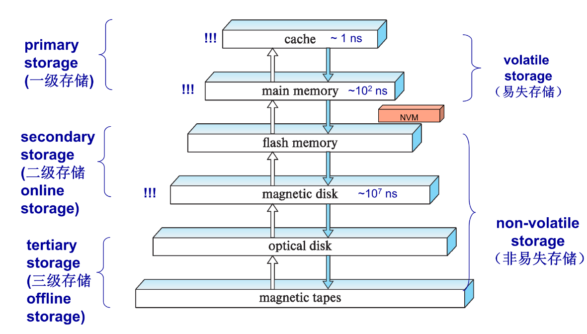
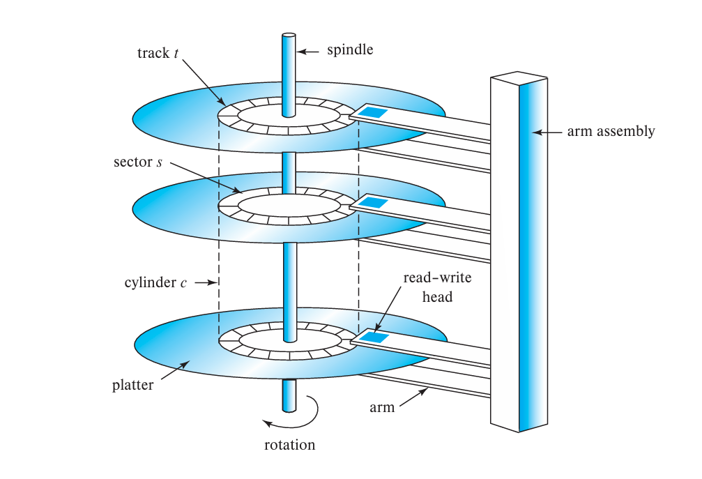

# Chapter8 Physical Storage Systems

***

**Classification:**

分类一（是否易失）：

* volatile storage: 断电后内容丢失
* non-volatile storage: 断电后内容不丢失

分类二（层级）：

* primary storage
* secondary storage: 又称online storage
* tertiary storage: 又称offline storage

**Storage Interfaces:**

磁盘接口标准：

* SATA：常用于个人电脑，传输速率达到6Gbps
* SAS：常用于服务器，传输速率达到12Gbps
* NVMe：常用于固态硬盘（SSD），传输速率达到24Gbps

连接方式：

* 直接连接：常用
* SAN：通过网络和服务器连接
* NAS：使用网络文件协议访问数据

**Magnetic Disks:**

每个磁盘分成多个**磁道（track）**，每个磁道分成多个**扇区（sector）**，扇区是读写的最小数据单元。

**访问时间（access time）** 指的是从发出读写请求到数据开始传输的时间，包括**寻道时间（seek time）** 和 **rotational latency（旋转等待时间）**。

**块（block）** 是存储分配与回收的最小单位，通常是多个扇区的组合。换而言之，物理意义上最小单位为扇区，逻辑意义上最小单位为块。