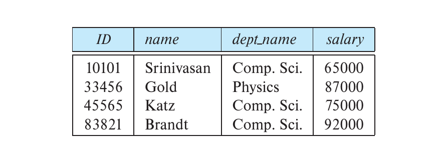
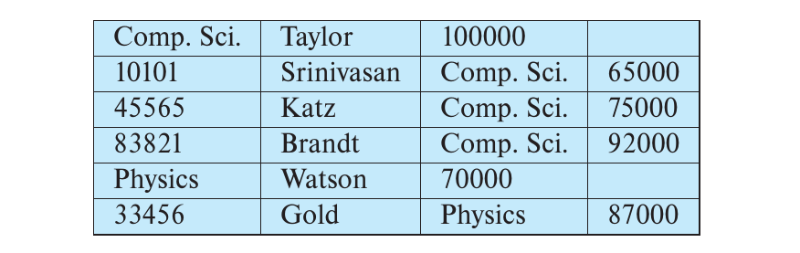
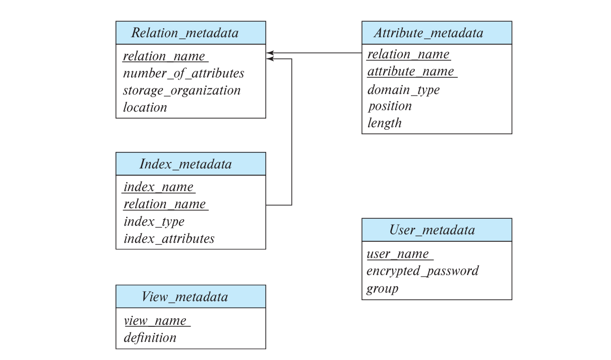
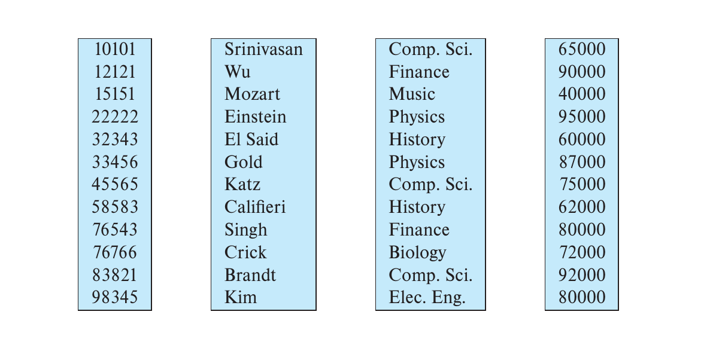

# Chapter9 Data Storage Structures

***

## 9.1 File Organization

前提假设：

数据库存储的形式是一组文件，每个文件对应一张表，存储一组记录，每一条记录的大小远小于一个block的大小。

**Fixed-Length Records:**

若每条记录的长度固定，则可以直接计算出每条记录的起始地址。

!!! Note
    请尽量不要出现一条记录跨块存储的情况。

对于某一条记录的删除，有以下三种方法：

* 方法一：删除该条记录后，后面的记录全部向前移动。
* 方法二：删除该条记录后，用最后一条记录来填补。
* 方法三：删除该条记录后，不做任何移动，但使用free list连接并记录所有空闲空间。

**Variable-Length Records:**

有以下几种情况可能导致变长记录：

* 某个属性的类型是`varchar`；
* 一个文件中的记录类型不止一种；
* 允许重复字段（古早版本）。

以`instructor(id,name,dept_name,salary)`为例，前三个属性长度不固定，最后一个属性固定，使用以下结构存储一条记录：

该结构分为两部分。

若属性长度不固定，则将该属性值的具体内容存到第二部分，而将对应的偏移量和长度存到第一部分（例如属性`id`，其具体内容存到从该记录起始地址开始的第21个字节，长度为5，因此在第一部分就会存21，5）。

若属性长度固定，则直接存到第一部分（例如属性`salary`，其具体内容65000直接存到第一部分）。

第一部分和第二部分之间还有一串**空位图（null-value bitmap）**，每一个bit表示对应的属性是否为`null`，0表示`not null`，1表示`null`。

**Slotted Page Structure:**

此时再来看一个block的结构，称为**分槽页（slotted page）**，如下图所示：

一个分槽页分为三部分。最前面的部分是block header，存放记录的数量，每条记录的起始地址和长度，free space的末尾地址等元数据；最后面的部分是一串不定长的记录，增长方向为从后往前；中间是free space，没有任何数据。

这种结构的好处是，记录在同一页内可以移动并保持记录之间的连续性，只需要更新block header就行。

如果要找该页的某一条记录，指针应该指向的是block header中的对应entry，而不是记录本身。

***

## 9.2 Organization of Records in Files

* heap file organization
* sequential file organization
* multitable clustering file organization
* B+ tree file organization (Chapter 14)
* hashing file organization (Chapter 14)

**Heap File Organization：**

在堆文件组织中，只要文件中有空闲空间，就可以存放记录，即记录没有固定顺序。

记录一旦存放，通常便不再移动，因此高效地找到空闲空间是关键。

使用**自由空间图（free-space map）** 来记录一个文件中哪些block是空闲的，有多空闲。

例如，下图是某个自由空间图，每个方块（entry）对应一个block，一个方块实际由3bits组成，取值记作$x$，范围为0-7，表示对应的block有$\frac{x}{8}$的空间是空闲的。因此，取0时表示block全满，取8时表示block全空。

还可以使用第二级自由空间图，如下图所示：

可以发现，第二级自由空间图的每一个方块实际是第一级自由空间图四个方块中的最大值。当我们要寻找空闲的block时，先查询第二级自由空间图，找到值最大的方块，得到其对应的四个方块；然后再查询第一级自由空间图中这四个方块，找到值最大的方块，其对应的block中有最多的空闲空间。

空闲空间图会定期写回磁盘，并进行错误检测和修复。

**Sequential File Organization：**

在顺序文件组织中，记录按照search key的顺序存储。

对于插入操作，如果有空闲空间则直接插入；如果没有，为了维持记录存储的顺序性，需要将新的记录插入到**溢出块（overflow block）**。两种情况都需要更新指针链接。

!!! Note
    由于溢出块的存在，顺序文件组织需要定期重新安排记录的存储顺序。

**Multitable Clustering File Organization：**

在多表聚集文件组织中，多个表的记录存储在同一个文件中。这样，相关的记录即使不属于同一表格也能存放在相同的block中，减少IO。

例如以下两张表`department`和`instructor`：

将其所有记录存到同一个文件中：

我们发现两张表的记录是交错存放的。首先是`department`表中`Comp.Sci.`系的记录，后面跟着的`instructor`表中的记录都是`Comp.Sci.`系的教职工；接下来是`department`表中`Physics`系的记录，后面跟着的`instructor`表中的记录都是`Physics`系的教职工。

当查询涉及到这两张表的连接，则可以在一个block中完成连接操作，减少了IO的开销；当查询只针对单一的department和对应的instructor，也比较方便；但当查询只涉及到一张表时，多表聚集文件组织并不占优。

**Partitioning 划分：**

对于一张表，其中的部分记录可以被划分出来，形成一张更小的表，与原来的表分开存储。

例如，总交易表可以按照年份划分为多个交易表，分别存储每一年的交易记录。

好处：

* 减少一些操作的开销，例如空闲空间管理
* 不同部分可以存储在不同设备上，例如较新的存SSD，较老的存磁盘
* 针对某一些访问更加频繁的记录，将其作为单独的一张表存储，每次要载入的体量减少，降低了IO的开销。

***

## 9.3 Data Dictionary Storage

data dictionary又称**system catalog**，存储的是**元数据（metadata）**。

元数据包括：

* 表的信息
  * 表的名字
  * 属性的名字、类型、长度
  * 视图的名字与定义
  * 完整性约束
* 用户信息
  * 密码
* 统计和描述性数据
  * 每张表的记录数量
* 物理文件组织信息
  * 文件组织形式（堆文件组织、顺序文件组织等）
  * 表的起始地址
* 索引信息

对于元数据的存储，往往也将其视作不同的表：

***

## 9.4 Database Buffer

**Buffer：**

buffer是主存的一部分，用于暂存从磁盘中读取的数据。

**Buffer Manager：**

缓冲区管理器负责将磁盘的数据读到缓冲区，或者将缓冲区的数据写回磁盘；其还决定缓冲区满后的替换策略。

**Pinned Block:**

对于buffer的一块block，如果一个程序想要访问（读写），则将该block标记为pinned,该block对应的pin count加一；等到访问完成，则将该block标记为unpinned,该block对应的pin count减一。

当一个buffer block被标记为pinned时（pin count大于0），该block即被锁定，无法被替换。

**Shared and Exclusive Locks:**

可以对buffer block上锁，锁的类型分为共享锁和排他锁，二者不能共存。

例如从buffer读数据时，由于不更新数据，因此一个block可以并发地读，此时加共享锁；但是写的时候加排他锁；排他锁只能被一个进程持有。

**Buffer Replacement Policies 缓冲区替换策略：**

* least recently used strategy (LRU)：替换最近最少被访问的block（常用）
* most recently used strategy (MRU)：替换最近最常被访问的block
* toss-immediate strategy：当一个block的最后一条记录被访问后就立刻释放

***

## 9.5 Column-Oriented Storage

又被称作columnar representation，相比于传统的以记录为最小单位的存储，列存储将每个属性的值分开存储。

优点（适用于数据分析类查询）：

* 查询只涉及部分属性时，可以减小IO开销，提高CPU cache performance
* 有利于压缩（同一属性的数据类型相同，且值相同的概率更大）
* 适用于现代CPU架构的向量处理

缺点（不适用于事务处理）：

* 以记录为单位的操作开销较大，如记录删除和更新，需要恢复出完整的记录
* 解压缩相对复杂，开销较大