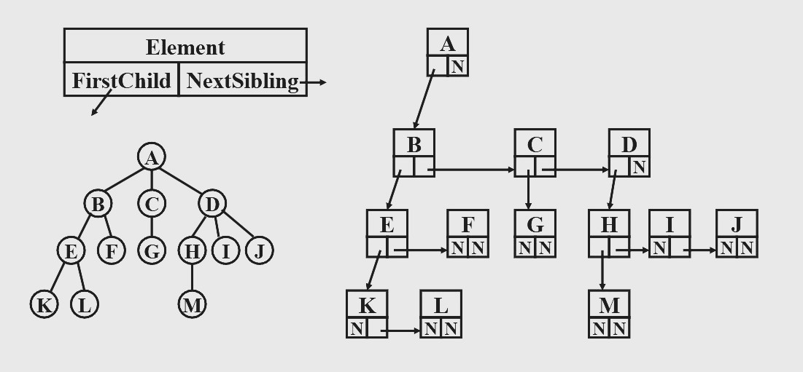
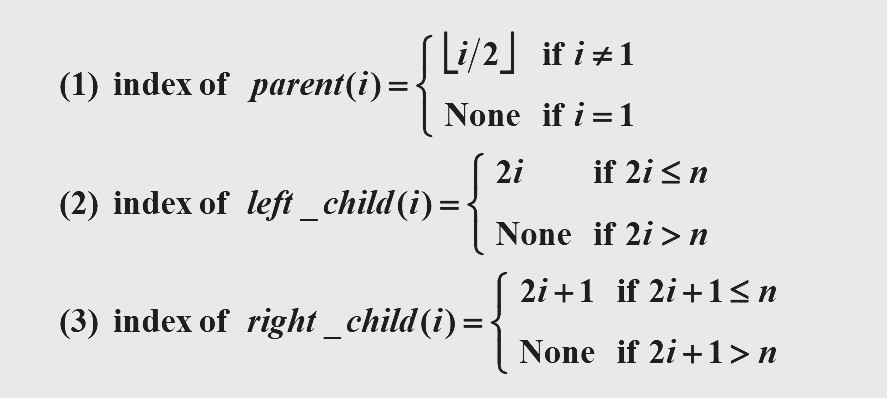
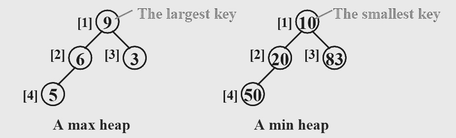

<span style="font-family: 'Times New Roman';">

# Chapter1 Basic Data Structures

***

## 1.1 Algorithm Analysis

**$$T(N)=O(f(N))$$**

There are positive constants $c$ and $n_0$ such that $T(N)\leqslant c·f(N)$ for all $N\geqslant n_0$.

**$$T(N)=\Omega(f(N))$$**

There are positive constants $c$ and $n_0$ such that $T(N)\geqslant c·f(N)$ for all $N\geqslant n_0$.

**$$T(N)=\Theta(f(N))$$**

If and only if $T(N)=O(f(N))$ and $T(N)=\Omega(f(N))$.

**$$T(N)=o(f(N))$$**

If and only if $T(N)=O(f(N))$ and $T(N)\neq\Theta(f(N))$.

**Rules:**

* $T_1(N)+T_2(N)=\max(O(f(N)),O(g(N)))$

* $T_1(N)\*T_2(N)=O(f(N)\*g(N))$

* If $T(N)$ is a polynomial(多项式) of degree $k$, then $T(N)=\Theta(N^k)$.

* $\log^k N=O(N)$ for any constant $k$.

***

## 1.2 Lists, Stacks and Queues

**Abstract data type（ADT）:**

由 object 和 operation 组成，且二者与其具体表示形式无关。

**List:**

重要操作：finding, inserting, deleting

cursor implementation 静态链表，即用数组的形式实现一个链表。

**Stack:**

重要操作：push, pop, top

**Queue:**

重要操作：enqueue, dequeue, front

***

## 1.3 Binary Tree

### Basic

* **edge（边）**  
  connection between two nodes

* **degree of a node（节点的度数）**  
  number of the subtrees of the node

* **degree of a tree（树的度数）**  
  maximum of degree（node）of the tree

* **path from $n_1$ to $n_k$（路径）**  
  a (unique) sequence of nodes $n_1,n_2,···,n_k$ such that $n_i$ is the parent of $n_{i+1}$ for $1\leqslant i < k$

* **length of path（路径长度）**  
  number of edges on the path

* **depth of $n_i$（深度）**  
  length of the unique path from the root to $n_i$（根的深度为 0 ）

* **height of $n_i$（高度）**  
  length of the longest path from $n_i$ to a leaf（叶子的高度为 0 ）

* **height (depth) of a tree（树的高度/深度）**  
  height（root）= depth（deepest leaf）

* **ancestors of a node（祖先）**  
  all the nodes along the path from the node up to the root

* **descendants of a node（后代）**  
  all the nodes in its subtrees

**Some Special Categories:**

* **Skewed Binary Tree**  
  Every node has either left subtree or right subtree.

* **Complete Binary Tree**  
  All the nodes correspond to the nodes numbered from 1 to n in the perfect binary tree.

* **Perfect Binary Tree**  
  All the leaf nodes are at the same depth.

**Properties of Binary Trees:**

* The maximum number of nodes in a binary tree of depth $k$ is $2^k-1$,  $k\geqslant 1$.

* For any nonempty binary tree, $n_0=n_2+1$ where $n_0$ is the number of leaf nodes and $n_2$ the number of nodes of degree 2.
### Representation

**Firstchild-Nextsibling Representation:**



!!! Note
    The representation is **not unique** since the children in a tree can be of any order.
    
**Threaded Binary Tree:**

* 如果节点的左子树为空，则将其左指针指向中序遍历的前一个节点
* 如果节点的右子树为空，则将其右指针指向中序遍历的后一个节点
* 对于中序遍历的第一个节点和最后一个节点，其分别的左指针和右指针指向一个 head node

### Tree Traversals

**Preorder Traversal:**

```c linenums="1"
void preorder(Node* root)
{
    if(root==NULL)return;
    else
    {
        printf("%d",root->key);
        preorder(root->left);
        preorder(root->right);
    }
}
```

**Inorder Traversal:**

Similar to preorder traversal, but has an iterative program.

```c linenums="1"
void  iter_inorder ( tree_ptr  tree )
{ Stack  S = CreateStack( MAX_SIZE );
  for ( ; ; )  {
     for ( ; tree; tree = tree->Left )
        Push ( tree, S ) ;
     tree = Top ( S );  Pop( S );
     if ( ! tree )  break;
     visit ( tree->Element );
     tree = tree->Right;   }
}
```

先一直往左走并不断入栈，等到走到底后，先出栈，再往右走，然后重复过程。

**Postorder Traversal:**

Similar

**Levelorder Traversal:**

```c linenums="1"
void  levelorder ( tree_ptr  tree )
{   enqueue ( tree );
    while (queue is not empty) {
        visit ( T = dequeue ( ) );
        for (each child C of T )
            enqueue ( C );
    }
}
```

每当遍历到一个节点时，该节点出队的同时将其子节点入队。

***

## 1.4 Binary Search Tree

### Definition of Binary Search Tree

A binary search tree is a binary tree. It may be empty. If it is not empty, it satisfies the following properties:  

* Every node has a key which is an integer, and the keys are distinct.
* The keys in a nonempty left subtree must be smaller than the key in the root of the subtree.
* The keys in a nonempty right subtree must be larger than the key in the root of the subtree.
* The left and right subtrees are also binary search trees.

### Operations

$$T=O(d)$$

其中$d$为树高。

**Find:**

```c linenums="1"
Position  Find( ElementType X,  SearchTree T ) 
{ 
      if ( T == NULL ) 
          return  NULL;  /* not found in an empty tree */
      if ( X < T->Element )  /* if smaller than root */
          return  Find( X, T->Left );  /* search left subtree */
      else 
          if ( X > T->Element )  /* if larger than root */
	  return  Find( X, T->Right );  /* search right subtree */
          else   /* if X == root */
	  return  T;  /* found */
} 
```

**Insert:**

```c linenums="1"
SearchTree  Insert( ElementType X, SearchTree T ) 
{ 
      if ( T == NULL ) { /* Create and return a one-node tree */ 
	T = malloc( sizeof( struct TreeNode ) ); 
	if ( T == NULL ) 
	   FatalError( "Out of space!!!" ); 
	else { 
	   T->Element = X; 
	   T->Left = T->Right = NULL; } 
      }  /* End creating a one-node tree */
     else  /* If there is a tree */
 	if ( X < T->Element ) 
	   T->Left = Insert( X, T->Left ); 
	else 
	   if ( X > T->Element ) 
	      T->Right = Insert( X, T->Right ); 
	   /* Else X is in the tree already; we'll do nothing */ 
    return  T;   /* Do not forget this line!! */ 
}
```

**Delete:**

* 若删除叶子节点，则直接将其 parent 置为 null
* 若删除度数为 1 的节点，则用其子节点来替换
* 若删除度数为 2 的节点，则用左子树中最大的元素或者右子树中最小的元素来替换，然后删除用于替换的节点，此时又回到第一、二种情况

```c linenums="1"
SearchTree  Delete( ElementType X, SearchTree T ) 
{    Position  TmpCell; 
      if ( T == NULL )   Error( "Element not found" ); 
      else  if ( X < T->Element )  /* Go left */ 
	    T->Left = Delete( X, T->Left ); 
               else  if ( X > T->Element )  /* Go right */ 
	           T->Right = Delete( X, T->Right ); 
	         else  /* Found element to be deleted */ 
	           if ( T->Left && T->Right ) {  /* Two children */ 
	               /* Replace with smallest in right subtree */ 
	               TmpCell = FindMin( T->Right ); 
	               T->Element = TmpCell->Element; 
	               T->Right = Delete( T->Element, T->Right );  } /* End if */
	           else {  /* One or zero child */ 
	               TmpCell = T; 
	               if ( T->Left == NULL ) /* Also handles 0 child */ 
		         T = T->Right; 
	               else  if ( T->Right == NULL )  T = T->Left; 
	               free( TmpCell );  }  /* End else 1 or 0 child */
      return  T; 
}
```

***

## 1.5 Priority Queue

### Definition of Priority Queue

A finite ordered list with zero or more elements, implemented by a linked list.

**Properties of Complete Binary Tree:**

下标从 1 开始。



**Min Heap:**

A complete binary tree in which the key value in each node is no larger than the key values in its children (if any).（要求每个节点都比它的孩子小）

!!! Note
    Analogously, we can declare a **max heap** by changing the heap order property.



### Operations

**Insert:**

$$T(N)=O(\log N)$$

```c linenums="1"
void  Insert( ElementType  X,  PriorityQueue  H ) 
{ 
     int  i; 

     if ( IsFull( H ) ) { 
	Error( "Priority queue is full" ); 
	return; 
     } 

     for ( i = ++H->Size; H->Elements[ i / 2 ] > X; i /= 2 ) 
	H->Elements[ i ] = H->Elements[ i / 2 ]; 

     H->Elements[ i ] = X; 
}
```

**DeleteMin:**

$$T(N)=O(\log N)$$

```c linenums="1"
ElementType  DeleteMin( PriorityQueue  H ) 
{ 
    int  i, Child; 
    ElementType  MinElement, LastElement; 
    if ( IsEmpty( H ) ) { 
         Error( "Priority queue is empty" ); 
         return  H->Elements[ 0 ];   } 
    MinElement = H->Elements[ 1 ];  /* save the min element */
    LastElement = H->Elements[ H->Size-- ];  /* take last and reset size */
    for ( i = 1; i * 2 <= H->Size; i = Child ) {  /* Find smaller child */ 
         Child = i * 2; 
         if (Child != H->Size && H->Elements[Child+1] < H->Elements[Child]) 
	       Child++;     
         if ( LastElement > H->Elements[ Child ] )   /* Percolate one level */ 
	       H->Elements[ i ] = H->Elements[ Child ]; 
         else     break;   /* find the proper position */
    } 
    H->Elements[ i ] = LastElement; 
    return  MinElement; 
}
```

!!! Note
    Finding any key except the minimum one will have to take a **linear** scan through the entire heap.

***

## 1.6 Disjoint Set

### Definition of Disjoint Set

A forest with a number of trees, each tree having its own structure.

!!! Example
    Given $S=\\{1,2,3,4,5,6,7,8,9,10,11,12\\}$  
    $12\equiv4, 3\equiv1, 6\equiv10, 8\equiv9, 7\equiv4, 6\equiv8, 3\equiv5, 2\equiv11, 11\equiv12$  
    The equivalence classes are  $\\{2,4,7,11,12\\},\\{1,3,5\\},\\{6,8,9,10\\}$  

### Operations

**Union-by-Size:**

**Union-by-Height:**

**Find(Path-Compression):**

```c linenums="1"
SetType  Find ( ElementType  X, DisjSet  S )
{   ElementType  root,  trail,  lead;
    for ( root = X; S[ root ] > 0; root = S[ root ] )
        ;  /* find the root */
    for ( trail = X; trail != root; trail = lead ) {
       lead = S[ trail ] ;   
       S[ trail ] = root ;   
    }  /* collapsing */
    return  root ;
}
```