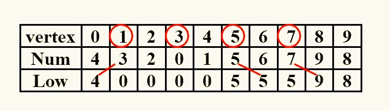

<span style="font-family: 'Times New Roman';">

# Chapter2 Graph

## 2.1 Terminologies

* **$G(V,E)$**  
where $G$ is graph, $V$ is finite nonempty set of vertices（顶点）, and $E$ is finite set of edges（边）

* **complete graph**  
graph that has the maximum number of edges
（for undirected graph: $E=\frac{n(n-1)}{2}$）
（for directed graph: $E=n(n-1)$）

* **subgraph**  
$V(G')\subseteq V(G), E(G')\subseteq E(G)$

* **simple path**  
the path passing $v_{i1},···,v_{in}$ which are distinct

* **connected undirected graph**  
for every pair of $v_i$ and $v_j$, there exist undirected paths between $v_i$ and $v_j$

* **component of undirected graph**  
the maximal connected subgraph

* **strongly connected directed graph**  
for every pair of $v_i$ and $v_j$, there exist directed paths from $v_i$ to $v_j$ and from $v_j$ to $v_i$  
（if the graph is connected without direction to the edges, then it is said to be **weakly connected**）

* **degree**
number of edges incident to $v$

## 2.2 Representation

**Adjacency Matrix 邻接矩阵:**

!!! Note
    如果表示的是一个无向图，则甚至可以用一维数组表示：

    $$a[\frac{n(n+1)}{2}]=\{a_{11},a_{21},a_{22},···,a_{n1},···,a_{nn}\}$$

    其中$a_{ij}$对应于$a$的数组下标为$\frac{i(i-1)}{2}+j$

**Adjacency Lists 邻接链表:**


**Adjacency Multilists 邻接多重链表:**


## 2.3 Variation and Application

### Topological Sort

!!! Success "Definition"
    **AOV:** Activity On Vertex Network （顶点表示活动）  
    **AOE:** Activity On Edge Network（边表示活动）  
    **predecessor（前驱）**：在有向图中，如果从$i$到$j$有路径，则称$i$为$j$的前驱  
    **DAG:** Directed Acyclic Graph（有向无环图）

可行的AOV网络一定是DAG。

拓扑排序不是唯一的。

判断AOV网络是否可行：

* 寻找一个入度为0的点
* 若存在则打印该点，若不存在则说明不可行
* 将其指向的点的入度减1
* 重复1~3步

```c linenums="1"
void Topsort( Graph G )
{   int  Counter;
    Vertex  V, W;
    for ( Counter = 0; Counter < NumVertex; Counter ++ ) {
	V = FindNewVertexOfDegreeZero( );
	if ( V == NotAVertex ) {
	    Error ( “Graph has a cycle” );   break;  }
	TopNum[ V ] = Counter; /* or output V */
	for ( each W adjacent from V )
	    Indegree[ W ] – – ;
    }
}
```

时间复杂度：

$$T=O(N^2)$$

优化方法：寻找入度为0的点若采用遍历的方法很耗时，因此可以考虑将这些入度为0的点存放到栈/队列中。

```c linenums="1"
void Topsort( Graph G )
{   
    Queue  Q;//该队列用于存放入度为0的点
    int  Counter = 0;//用于计数
    Vertex  V, W;
    Q = CreateQueue( NumVertex );  
    MakeEmpty( Q );
    for ( each vertex V )
    {
	    if ( Indegree[ V ] == 0 )
        {
            Enqueue( V, Q );//如果入度为0则入队
        }
    }
    while ( !IsEmpty( Q ) ) 
    {
	    V = Dequeue( Q );//从队列中取出一个点
	    TopNum[ V ] = ++ Counter; //记录已被拓扑排序的点的数量
	    for ( each W adjacent from V )//将该点指向的点的入度减1，如果得到入度为0的点则入队
        {
	        if ( – – Indegree[ W ] == 0 )
            {
                Enqueue( W, Q );
            }
        }
    }
    if ( Counter != NumVertex )
	Error( “Graph has a cycle” );
    DisposeQueue( Q );
}
```

时间复杂度：

$$T=O(|V|+|E|)$$

### Shortest Path Algorithms

**Dijkstra's Algorithm:**

```c linenums="1"
void Dijkstra(Graph G)
{
    initialize every V unknown//将所有点初始化为未访问
    initialize every V.dist infinite except the chosen one 0//将起始点的距离定为0，其余为无穷大
    while(1)
    {
        V=smallest unknown distance vertex//在所有未访问的点中找到一个距离最小的点
        if(not find such V)
        {
            break;//表示都访问完了
        }
        V.known=true;//V已访问
        for(each W adjacent to V)//对V每个相邻的未访问的点进行距离的更新
        {
            if(W is unknown)
            {
                if(V.dist+dist(V,W)<W.dist)
                {
                    decrease W.dist to V.dist+dist(V,W)
                }
            }
        }
    }
}
```

常规算法（如上）：

$$T=O(V^2+E)$$

适用于稠密的图。

另一种算法（优先队列）：

$$T=O(E\log V)$$

适用于稀疏的图。

### AOE Network

点表示状态，边表示事件。


* EC：earliest time of completion  
  表示最早能够完成的时间  
  $EC[w]=\max\\{EC[v]+C_{v,w}\\}$，$v$指向$w$  
  是正着算的  
* LC：latest time of completion  
  表示最晚必须完成的时间  
  $LC[v]=\min\\{LC[w]-C_{v,w}\\}$，$v$指向$w$  
  是倒着算的  
* slack time 松弛时间  
  衡量事件的紧迫程度  
  $sl(v,w)=LC[w]-EC[v]-C_{v,w}$  
* critical path 关键路径  
  包含全部松弛时间为0的事件的路径  

### Network Flow Problems

* 画两张图$G_f$，$G_r$，其中$G_f$一开始没有流，$G_r$一开始和原图一致
* 在$G_r$中寻找增广路径，即可以从起点流向终点的路径
* 将该路径及对应的流量画在$G_f$上
* 在$G_f$中画出对应的逆向路径（如果本来就有逆向路径则加上对应的值），并且将本来的正向路径的流量减去对应的值
* 重复2，3步，直到$G_r$中没有箭头指向终点或没有箭头来自起点

### Minimum Spanning Tree

**Prim's Algorithm**

**Kruskal's Algorithm**

### DFS

**articulation point 关节点:**

如果删掉关节点及所连的边，那么连通分量就会增多。

**biconnected graph 重连通图:**

连通图且没有关节点。

**biconnected component 重连通分量:**

最大的重连通子图。


寻找关节点的标准步骤：

* 任取一个顶点开始深度优先搜索，并按照搜索顺序从0开始编号
    

* 获得深度优先搜索树，编号小的在上，编号大的在下，如果有没有在深度优先搜索时遍历到的边，则在树上用虚线连接，表示back edge
    

* 判断：root是关节点当且仅当它至少有两个孩子  
  其他点是关节点当且仅当它至少有一个孩子，且不可能在往下至少走一步的情况下回到它的祖先

* 更进一步：令$Low(u)$等于  
  1———$Num(u)$  
  2———$\min\\{Low(w)\\}$，其中$w$是$u$的孩子  
  3———$\min\\{Num(w)\\}$，其中$(u,w)$是一条back edge
  这三者中的最小值，列一张表  
  

* 新的判断：关节点$u$的充要条件：  
  有至少两个孩子的root或者  
  至少有一个满足$Low(child)\geqslant Num(u)$的孩子

### Euler Circuits

略。

### Union and Find

**Union-by-Size 根据大小合并:**

总是把小的树连到大的树上。

$S[root]=-size$，即根存储的数据不再是$-1$，而是$-size$、

设有$N$个合并，$M$个查找，则时间复杂度为$O(N+M\log N)$、

**Union-by-Height 根据高度合并:**

总是把矮的树连到高的树上。

**Path Compression 路径压缩:**

与根据高度合并不兼容。

让所有的结点都直接跟根节点连接，在寻找根结点的时候将经过的节点依次往更高一级连接。