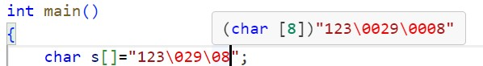

<span style="font-family: 'Times New Roman';">

# Appendix 题目整理

***

## 判断

!!! Question "Question1"
    **为了检查以下`if-else`语句的三个分支是否正确，至少需要设计5组测试用例，即x的取值至少有五组（小于0的数、0、大于0且小于15的数、15和大于15的数）。**

    ```c linenums="1"
    if (x < 0){
        y = 0;
    }else if (x <= 15){
        y = 4 * x / 3;
    } else{ 
        y = 2.5 * x - 10.5;
    }  
    ```

    - [x] T
    - [ ] F
  
    解析：`if-else`分支的测试需同时检测分界区间和分界点。

!!! Question "Question2"
    **`sizeof()`是C语言的一个函数，可以计算参量所占内存的字节数。如`sizeof(int)`可计算整型所占的内存字节数。**

    - [ ] T
    - [x] F

    解析：`sizeof()`是C语言的运算符而不是函数。

!!! Question "Question3"
    **关于C语言指针的运算：指针只有加减操作，没有乘除操作。指针可以加常数、减常数；相同类型的指针可以相加、相减。**

    - [ ] T
    - [x] F

    解析：指针加减常数表示所指地址向后或向前移动相应的字节，指针相减反映的是两个地址之间相差的元素个数（注意：不是字节数），但相加和乘除无意义。

!!! Question "Question4"
    **假设有定义如下：`int array[10]`; 则该语句定义了一个数组`array`，其中`array`的类型是整型指针（即：`int*` ）。**

    - [ ] T
    - [x] F

    解析：`array`是数组名，有类似于指针的用法，但不等同于指针。

!!! Question "Question5"
    **若有宏定义：`#define S(a,b) t=a;a=b;b=t` 由于变量`t`没定义，所以此宏定义是错误的。**

    - [ ] T
    - [x] F

    解析：宏定义起的是一个替换的作用，若程序中有用到`S(a,b)`，则会有`t`未定义的报错，但若程序中没有用到或有定义`t`，则没有问题，因此该宏定义本身是没有问题的。

***

## 选择

!!! Question "Question1"
    **若有以下调用语句，则不正确的`fun()`函数的首部是（ ）：**

    ```c linenums="1"
    main( )
    { …
    int a[50]， n；
    …
    fun(n， &a[9])；
    …
    }
    ```

    - [ ] A.`void fun(int m,int x[ ])`
    - [ ] B.`void fun(int s,int h[41])`
    - [ ] C.`void fun(int p,int *s)`
    - [x] D.`void fun(int n,int a)`

    解析：`&a[9]`是`a[9]`所在的地址，即函数第二个参数为指针变量，A和B中第二个参数均为数组变量，数组名代表数组的首地址；C中`s`即为指针变量；D中`a`为整型变量。

!!! Question "Question2"
    **以下说法正确的是：**

    - [ ] A.一个C语言源文件（.c文件）必须包含`main`函数
    - [ ] B.一个C语言源文件（.c文件）可以包含两个以上`main`函数
    - [ ] C.C语言头文件（.h文件）和源文件（.c文件）都可以进行编译
    - [x] D.在一个可以正确执行的C语言程序中，一个C语言函数的声明（原型）可以出现任意多次

    解析：A,B：`main`函数是程序默认的入口，多个.c文件组成的项目中有且仅有一个入口；C：.h文件的作用是被其他.c文件包含，无法单独编译，编译器编译.c文件时，会把.h文件的内容合并到.c文件进行编译。

!!! Question "Question3"
    **According to the declaration: `int a[10]; *p=a; `the expression __ is wrong.**

    - [ ] A.`a[9]`
    - [ ] B.`p[5]`
    - [ ] C.`*p++`
    - [x] D.`a++`

    解析：`a`是数组名，不能像指针一样加减常数。

!!! Question "Question4"
    A mong the following assignments or initializations, __ is wrong.

    - [x] A.`char str[10]; str="string";`
    - [ ] B.`char str[ ]="string";`
    - [ ] C.`char *p="string";`
    - [ ] D.`char *p; p="string";`

    解析：`str`可看作一个指针常量，常量无法被赋值；`p`可看作一个指针变量，变量可被赋值。

!!! Question "Question5"
    **According to the declaration: `int p[5], *a[5];` the expression ______ is correct.**

    - [ ] A.`p=a`
    - [ ] B.`p[0]=a`
    - [x] C.`*(a+1)=p`
    - [ ] D.`a[0]=2`

    解析：`int *a[5]`定义了一个大小为5的数组，存放的元素为`int`类型的指针.A:`p`代表的只是`p[5]`这个数组的首地址，不是变量，无法被赋值，A错误；B：`p[0]`存放的是整型数据而不是地址，而`a`表示的是数组`a[5]`的首地址，B错误；C: `*(a+1)`表示数组`a[5]`的首地址往后移一个单位所对应的元素，即存放在`a[1]`中的元素，`p`是地址可以存放，C正确；D：数组`a`存放的是地址而不是整型数据，D错误。

!!! Question "Question6"
    **According to the declaration: `int (*p)[10];` `p` is a(n) __.**

    - [x] A.pointer
    - [ ] B.array
    - [ ] C.function
    - [ ] D.element of array
  
    解析：`int (*p)[10]`表示定义了一个指针`p`，`p`指向一个大小为10的整型数组；`int *p[10]`和`int *(p[10])`均表示定义了一个大小为10的数组`p`，`p`中存放的元素是指针。

!!! Question "Question7"
    **For the function declaration `void f(char ** p)`， the definition __ of `var` makes the function call `f(var)` incorrect.**

    - [x] A.`char var[10][10];`
    - [ ] B.`char *var[10];`
    - [ ] C.`void *var = NULL;`
    - [ ] D.`char *v=NULL, **var=&v;`

    解析：A：`char var[10][10]`定义了一个字符型的二维数组，本质上是一个大小为10的数组，存放的每个元素是大小为10的数组，`var`被转换为指向首元素（即第一个大小为10的数组）的指针，本质类型为`char (*)[10]`，因此是一级指针，A错误；B：`char *var[10]`定义了一个大小为10的数组，数组的元素为指针，因此`var`隐式转换为了指向首元素（即指针）的指针，即二级指针，B正确；C：`void` 可以表示任何类型，也就可以表示一级指针，此时的`var`即为二级指针，C正确；D显然正确。

!!! Question "Question8"
    **For definitions: `char s[2][3]={"ab", "cd"}, *p=(char *)s;` the expression __ is correct and its value is equivalent to the element `s[1][1]`.**

    - [ ] A.`*(s+3)`
    - [ ] B.`*s+2`
    - [ ] C.`p[1][1]`
    - [x] D.`*++p+2`

    解析：A：`s`指向的是第一个大小为3的数组（或者说指向字符串"ab"），`s+3`表示指针向后移三位，即指向第四个大小为3的数组，但不存在，A错误；`*s`表示的是s指向的第一个大小为3的数组（"ab"），`*s+2`表示的将`*s`隐式转换为该数组的首地址然后向后移两位得到的地址，但还要在最外面再加一个\*才能表示具体元素（"\0"），B错误；C：`p`是一个指针，存放的是s的首地址，没有二维的表示，C错误；D：先运算`++p`，得到`p`向后移一个单位得到的地址，加上\*得到对应的元素`b`，再运算`b+2`，字符`b`向后2位得到字符`d`，即`s[1][1]`，D正确。

!!! Question "Question9"
    **若有定义`char \*str[ ]={“Python”, “SQL”, “JAVA”, “PHP”, “C++”};`则表达式`*str[1] > *str[3]`比较的是：**

    - [ ] A.字符P和字符J
    - [ ] B.字符串SQL和字符串PHP
    - [ ] C.字符串Python和字符串JAVA
    - [x] D.字符S和字符P

    解析：`char *str[]`定义了一个数组`str`，数组元素是指向字符串字面量的指针（根据隐式转换规则，在多数表达式中，字符串字面量将会隐式转换为指向它的指针），`str[1]`是字符串字面量"SQL"的地址，加上\*即表示"SQL"的第一个元素"S"，`**str[3]`同理。

!!! Question "Question10"
    **Given the declaration: `int s[3][3]={1,2,3,4,5,6,7,8,9};` the value of expression `s[0][1]`is equivalent to:**

    - [ ] A.`s[2][0]-1`
    - [ ] B.`s[-1][2]`
    - [ ] C.`s[2][-1]`
    - [x] D.`s[1][-2]`

    解析：表达式`s[i][j]`与表达式`*(*(s+i)+j)`等价，例如D：s是指向第一个大小为3的数组的指针，`s+1`使`s`指向第二个大小为3的数组，`*(s+1)`表示的即为第二个大小为3的数组，如果要在`*(s+1)`的基础上-2，则`*(s+1)`这个数组会隐式转换为指向该数组的指针，即该数组的首地址，-2将本来在`s[1][0]`的地址前移了两个单位，对应到`s[0][1]`。

!!! Question "Question11"
    **The following code fragment will output:**

    ```c linenums="1"
    int n=1;
    char ch='\012'; 
    printf("%d", ch*n++);
    ```

    - [x] A.10
    - [ ] B.12
    - [ ] C.20
    - [ ] D.24

    解析：'\000'表示ASCII八进制下对应的字符，如'\012'转换成的是十进制下10所对应的字符；'\xhh'表示ASCII十六进制下对应的字符，如'\x41'转换成的是十进制下65所对应的字符。

!!! Question "Question12"
    **有如下多文件组织：**

    **`header.h`**
    ```c linenums="1"
    #ifndef _HEADER_H
    #define _HEADER_H
    char school[] = “Sanben”;  
    void fun(char* s);
    #endif
    ```

    **`File1.c`**
    ```c linenums="1"
    #include "header.h"
    int main()
    {
        fun(school);
        printf("%s",school);
    }
    ```

    **`File2.c`**
    ```c linenums="1"
    #include "header.h"
    #include <string.h>
    void fun(char* s)
    {
        strcpy(s, "Yiben");
        return;
    }
    ```

    **程序输出结果为：**

    - [ ] A.Sanben
    - [ ] B.Yiben
    - [ ] C.编译错误
    - [x] D.链接错误

    解析：`header.h`内出现了变量的定义`char school[]="Sanben"`，两份.c文件各自引用并编译，链接时会重复定义。

!!! Question "Question13"
    **Given: `int *p;` which of the following statements is ABSOLUTELY correct?**

    - [ ] A.`*p=0`
    - [x] B.`p=0`
    - [ ] C.`scanf("%d",p)`
    - [ ] D.`scanf("%d",&p)`

    解析：A：让指针`p`指向一个整型0，但0不是变量，没有对应地址，A错误；B：相当于让`p`成为一个空指针，B正确；C，D：`%d`对应的应该是`*p`，C，D错误。

***

## 填空

!!! Question "Question1"
    **The following code fragment prints out______.**

    ```c linenums="1"
    int x=-1;
    printf("%d",(unsigned int)x );
    ```

    答案：-1  
    解析：强制转换将`int`型转换为`unsign int`型，但`%d`控制的是`int`型的输出，所以前后抵消，输出还是`int`型。

!!! Question "Question2"
    **The value of expression `!("01/24/2019"+5)[5]` is ______.**

    答案：1  
    解析：`"01/24/2019"`是字符串字面量，+5时该字符串隐式转换为字符串第一个元素的地址，地址向后移5位指到第二个'/'，然后`[5]`再向后移5位指到'\0'，'\0'对应的ASCII码的值为0，取非后为1。

!!! Question "Question3"
    **Given: `char s[]=”123\029\08”;` then `sizeof(s)` and `strlen(s)` will be______ respectively .**

    答案：8，5  
    解析：字符串中的'\0'表示后面是八进制对应的字符，在这个字符串的第一处'\0'后面，是一个有效字符2，但其后为9，是无效字符，读取截断，2扩充为02，即'\02'扩充为'\002'，后面一处'\0'扩充为'\000'，整个字符串可拆解为'1','2','3','\002','9','\000','8',再加上一个结尾的'\0'，共8个字符，一个字符占一个字节，所以`sizeof`为8；`strlen`读到第一个休止符为止，而'\000'在ASCII码中对应的就是休止符，所以`strlen`只计算'1','2','3','\002','9'共5个字符。
    
    