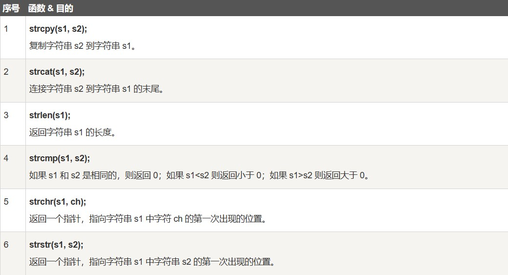

<span style="font-family: 'Times New Roman';">

# Chapter3 C语言进阶

***

## 3.1 指针

```c linenums="1"
int a[5]={1,2,3,4,5};
    int *p=a;//将数组a的首地址赋值给指针p

    printf("%p\n",p);//0000002b045ff7c0
    printf("%p\n",a);//0000002b045ff7c0
    printf("%p\n",&a);//0000002b045ff7c0
    printf("%p\n",&p[0]);//0000002b045ff7c0
    printf("%p\n",&p[1]);//0000002b045ff7c4
    printf("%p\n",&a[0]);//0000002b045ff7c0
    printf("%p\n",&a[1]);//0000002b045ff7c4

    printf("%d\n",*p);//1
    printf("%d\n",*a);//1
    printf("%d\n",p[0]);//1
    printf("%d\n",p[1]);//2
    printf("%d\n",a[0]);//1
    printf("%d\n",a[1]);//2

    p++;

    printf("%p\n",p);//0000002b045ff7c4
    printf("%d\n",*p);//2
    printf("%d\n",*a);//1
    printf("%d\n",p[0]);//2
    printf("%d\n",p[1]);//3
    printf("%d\n",a[0]);//1
    printf("%d\n",a[1]);//2
    
    p=a;
    (*p)++;
    
    printf("%d\n",*p);//2
    printf("%d\n",*a);//2
    printf("%d\n",p[0]);//2
    printf("%d\n",a[0]);//2

    (*p)--;

    printf("%d\n",*p++);//1
    //(备注：取出p所指的那个数据来，操作之后顺便把p移到下一个位置去)
    printf("%d\n",*p);//2
```

***

## 3.2 字符串

```c linenums="1"
char *str ="Hello"; 
char word[] = "Hello"; 
char line[10] = "Hello";
char word[] = {'H', 'e', 'l', 'l', 'o','\0'};
```

```c linenums="1"
    char *str1="hello";
    char str2[]="hello";
    char *str3=str1;
    char *str4=str2;

    printf("%s\n",str1);//hello
    printf("%c\n",str1[0]);//h
    str1++;
    printf("%s\n",str1);//ello
    printf("%c\n",str1[0]);//e
    str1="world";
    printf("%s\n",str1);//world
    printf("%c\n",str1[0]);//w
    
    printf("%s\n",str2);//hello
    printf("%c\n",str2[0]);//h
    str2[0]='H';
    printf("%s\n",str2);//Hello
    printf("%c\n",str2[0]);//H

    printf("%s\n",str3);//hello
    printf("%c\n",str3[0]);//h
    str3++;
    printf("%s\n",str3);//ello
    printf("%c\n",str3[0]);//e
    str3="life";
    printf("%s\n",str3);//life
    printf("%c\n",str3[0]);//l
    printf("%s\n",str1);//world
    
    printf("%s\n",str4);//Hello
    str4[0]='K';
    printf("%c\n",str4[0]);//K
    printf("%s\n",str4);//Kello
    printf("%s\n",str2);//Kello
    str4="world";
    printf("%s\n",str4);//world
    printf("%s\n",str2);//Kello
```
**字符串相关函数：**

头文件：`string.h`



***

## 3.3 链表

**链表基础：**

```c linenums="1"
//声明结点
typedef struct _node
{
    int value;//每个结点包含的数据
    struct _node *next;//指向下一个节点的指针
}Node;

//创建结点
Node* create_node(int x)
{
    Node *n=(Node*)malloc(sizeof(Node));
    n->value=x;
    n->next=NULL;
    return n;
}

//从头插入结点
Node* insert_head(Node *head,Node *n)
{
    n->next=head;
    head=n;
    return head;
}

//打印链表
void prt(Node* head)
{
    for(Node *p=head;p!=NULL;p=p->next)
    {
        printf("%d",p->value);
    }
}

//倒序构建链表
Node *head=NULL;
while(1)
{
    int x;
    scanf("%d",&x);
    if(x==-1)break;
    Node *n=create_node(x);
    head=insert_head(head,n); 
}
prt(head);
```

**链表升级-结构体List：**

```c linenums="1"
typedef struct{
    Node* head;
}List;//一个用来表达整个链表的结构体

//创建结点+从头部插入结点
void insert_head(List *pList,int x)
{
    Node *n=create_node(x);
    n->next=pList->head;
    pList->head=n;
}

//打印链表
void prt(List *pList)
{
    for(Node *p=pList->head;p!=NULL;p=p->next)
    {
        printf("%d",p->value);
    }
}

//实现输入输出链表的完整代码
int main()
{
    List list={NULL};
    while(1)
    {
        int x;
        scanf("%d",&x);
        if(x==-1)break;
        insert_head(&list,x);
    }
    prt(&list);
}

//创建结点+从尾部插入结点
void append_tail(List *pList,int x)
{
    Node *p;
    Node *n=create_node(x);
    n->next=NULL;
    for(p=pList->head;p!=NULL&&p->next!=NULL;p=p->next)
    {
        ;
    }//将指针移到链表的尾部
    if(p!=NULL)
    {
        p->next=n;
    }
    else
    {
        pList->head=n;
    }
}//检查技巧：检查所有箭头之前的变量是否有可能是NULL

//在升序链表中插入结点
void insert(List *pList,int x)
{
    Node *p,*q;
    for(q=NULL,p=pList->head;p!=NULL;q=p,p=p->next)
    {
        if(p->value>x)break;//找到插入位置，此时新的节点应该插在p所指位置的前一个
    }
    Node *n=create_node(x);
    if(q)
    {
        q->next=n;
    }
    else//空链表或插在头部的情况
    {
        pList->head=n;
    }
    n->next=p;
}

//删除结点
void delete(List *pList,int x)
{
    Node *p,*q;
    for(q=NULL,p=pList->head;p!=NULL;)
    {
        if(p->value==x)
        {
            Node *r=p;
            if(q)
            {
                p=q->next=p->next;
            }
            else//删除头结点的情况
            {
                p=pList->head=p->next;
            }
            free(r);
        }
        else
        {
            q=p;
            p=p->next;
        }
    }
}

//清除链表
void clear(List *pList)
{
    for(Node *p=pList->head;p;)
    {
        Node *q=p;
        p=p->next;
        free(q);
    }
}
```

**链表升级-双向：**

```c linenums="1"
//双向结点定义
typedef struct _node{
    int value;
    struct _node *next;
    struct _node *prev;
}Node;

//创建结点
Node* create_node(int x)
{
    Node *n=(Node *)malloc(sizeof(Node));
    n->value=x;
    n->next=NULL;
    n->prev=NULL;
    return n;
}

//创建结点+从头部插入结点
void insert_head(List *pList,int x)
{
    Node *n=create_node(x);
    n->next=pList->head;
    pList->head->prev=n;
    pList->head=n;
}

//创建结点+从尾部插入结点
void append_tail(List *pList,int x)
{
    Node *p;
    Node *n=create_node(x);
    for(p=pList->head;p!=NULL&&p->next!=NULL;p=p->next)
    {
        ;
    }if(p!=NULL)
    {
        p->next=n;
    }
    else
    {
        pList->head=n;
    }
    n->prev=p;
}

//删除结点
void delete(List *pList,int x)
{
    Node *p;
    for(p=pList->head;p!=NULL;)
    {
        if(p->value==x)
        {
            Node *r=p;
            if(p->prev)
            {
                p->prev->next=p->next;
            }
            else
            {
                pList->head=p->next;
            }
            if(p->next)
            {
                p->next->prev=p->prev;
            }
            p=p->next;
            free(r);
        }
        else
        {
            p=p->next;
        }
    }
}
```

**链表升级-双头：**

```c linenums="1"
//双头链表
typedef struct{
    Node* head;
    Node* tail;
}List;

//创建结点+从头部插入结点
void insert_head(List *pList,int x)
{
    Node *n=create_node(x);
    n->next=pList->head;
    pList->head->prev=n;
    if(pList->head==NULL)
    {
        pList->tail=n;
    }
    pList->head=n;
}

//创建结点+从尾部插入结点
void append_tail(List *pList,int x)
{
    Node *p=pList->tail;
    Node *n=create_node(x);
    if(p!=NULL)
    {
        p->next=n;
    }
    else
    {
        pList->head=n;
    }
    n->prev=p;
}

//在升序链表中插入结点
void insert(List *pList,int x)
{
    Node *p,*q;
    for(q=NULL,p=pList->head;p;q=p,p=p->next)
    {
        if(p->value>x)break;
    }
    //1 p is head 
    //2 p=NULL,q=tail
    //3 p in middle
    Node *n=create_node(x);
    if(p==pList->head)
    {
        n->next=pList->head;
        pList->head->prev=n;
        pList->head=n;
    }
    else if(p==NULL)
    {
        n->prev=q;
        pList->tail->next=n;
        pList->tail=n;
    }
    else
    {
        n->next=p;
        n->prev=q;
        q->next=n;
        p->prev=n;
    }
}
```

**链表升级-头结点（哨兵）:**

```c linenums="1"
//在升序链表中插入结点
void insert(List *pList,int x)
{
    Node *p,*q;
    for(q=pList->head,p=pList->head->next;p!=NULL;q=p,p=p->next)
    {
        if(p->value>x)break;
    }
    Node *n=create_node(x);
    n->next=p;
    q->next=n;
}

//删除结点
void delete(List *pList,int x)
{
    Node *p,*q;
    for(q=pList->head,p=q->next;p;)
    {
        if(p->value==x)
        {
            Node *r=p;
            q->next=p->next;
            p=p->next;
            free(r);
        }
        else
        {
            q=p;
            p=p->next;
        }
    }
}
```

***

## 3.4 可变数组

```c linenums="1"
//可变数组结构体的定义
typedef struct 
{ 
    int *array; 
    int size;
}Array;


//创建可变数组
Array array_create(int init_size) 
{ 
    Array a; 
    a.array = (int*)malloc(sizeof(int)*init_size); 
    a.size = init_size; 
    return a; 
}

//清空可变数组
void array_free(Array *a) 
{ 
    free(a->array); 
    a->array = NULL; 
    a->size = 0; 
}

//得到数组的长度
int array_size(const Array *a) 
{ 
    return a->size; 
}

//得到数组index位置的元素
int* array_at(Array *a, int index) 
{ 
    if ( index >= a->size ) 
    { 
        array_inflate(a, index-a->size); 
    } 
    return &(a->array[index]); 
}

//加长可变数组
void array_inflate(Array *a, int more_size) 
{ 
    int* p = (int*)malloc(sizeof(int)*(a->size+more_size)); 
    for ( int i=0; i<a->size; i++ )p[i] = a->array[i]; 
    free(a->array); 
    a->array = p; 
    a->size = a->size+more_size; 
}
```