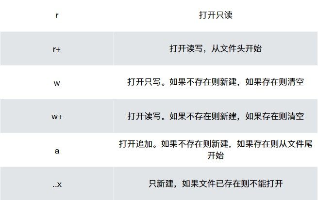

<span style="font-family: 'Times New Roman';">

# Chapter4 数据结构与文件

***

**c文件流程：**

a.c（初始c文件）
$\downarrow$
a.i（预处理后的文件）
$\downarrow$
a.s（汇编代码文件）
$\downarrow$
a.o（目标文件）
$\downarrow$
a.out（输出）

**编译预处理指令：**

预处理的特点：

* 以#开头，区别于c语言

* 每条命令独占一行

* 结尾没有“;”

**宏定义：**

* `\#define <名字> <值>`
* 将函数中所有名字出现的地方替换为值（文本替换）

```c linenums="1"
//一般的无参宏：
#define A 1    //将所有A替换为1
#define A 1+2   //将所有A替换为1+2
#define A 1,2   //将所有A替换为1,2（如输出时对应两个%d）

#define A 1
#define C A+2   //将所有C替换为1+2（如果宏里面有其他宏的名字，也会被替换）

#define IF if(A==1)\
printf("yes");\
else\
printf("no")   //要进行替换的值如果过长需要在行末加上"\"，表示索要替换的值还没结束

//没有值的宏：
#define _DEBUG_  //这类宏是用于条件编译的，后面有其他的编译预处理指令来检查这个宏是否已经被定义过了

#ifdef _DEBUG_
IF
#endif  //如果程序一开始有定义_DEBUG_（即出现上一条语句），则执行IF语句，否则不执行

//含参数的宏：
#define CUBE(x) ((x)*(x)*(x))   //注意：值的总体外边要加括号，每个参数外面也要加括号

#define MIN(a,b) ((a)>(b)?(b):(a)) //可带多个参数

//宏的特殊运算：
#define PRINT_INT(n) printf(#n "=%d",n) //#可以把变量名作为字符串原样输出，例如：已知a=1，PRINT_INT(a)输出的是“a=1”

#define MYCASE(item,id)\
case id:\
    item##_##id=id;\
    break   //将两个量用“_”紧密连接
```

**条件编译：**

```c linenums="1"
\#ifdef 标识符
程序段1
\#else
程序段2
\#endif
```

如果标识符已被`\#define`命令定义过则对程序段1进行编译；否则对程序段2进行编译。如果没有程序段2（为空），则`\#else`可以没有。

**编译单元：**

* 一个c文件是一个编译单元
* 编译器每次编译只处理一个编译单元
* `\#include`的作用：预处理时把`include`对应的文件下的内容都贴到原文件下
* 只有声明才能放在头文件中（结构体一般也放在头文件中）
* 当需要引用多个头文件，且头文件直接可能相互引用，则有可能出现函数重复声明的情况，因此需要加一个“保护开关”，即条件编译`\#ifndef`

**文件：**

