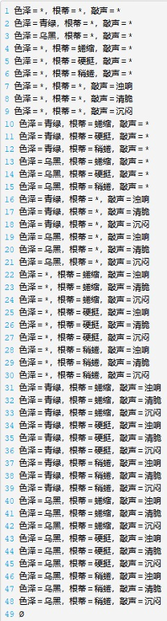
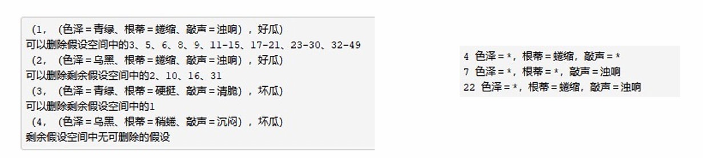

# Chapter1 基本术语

机器学习的根本目标是**泛化能力**（应对未来未见测试样本的能力）。

***

**数据：**

* **示例（instance）/ 样本（sample）**：一个对象的输入，不含标记
* **样例（example）**：示例 + 标记

**任务：**

根据标记的取值情况，可以分为：

* **分类任务**：标记为离散值
* **回归任务**：标记为连续值
* **聚类任务**：标记为空值

根据标记的完整情况，可以分为：

* **监督学习**：所有示例都有标记，例如分类任务，回归任务
* **无监督学习**：所有示例都没有标记，例如聚类任务
* **半监督学习**：少量示例有标记，大量示例没有标记
* **噪音标记学习**：有标记，但不完全准确

**概念学习：**

最理想的机器学习是学习到**概念**（人类学习，可理解的）。

* **假设空间**：所有可能假设的集合
* **版本空间**：假设空间的子集，包含所有与训练数据一致的假设，训练数据越多，版本空间越小
* **归纳偏好**：学习过程中对某种假设的偏好

!!! Example
    假设空间由形如 “(色泽=?)$\wedge$(根蒂=?)$\wedge$(敲声=?)” 的可能取值所形成的假设组成。若三个属性分别有 2、3、3 种可能取值，则假设空间的大小为

    $$3\times4\times4+1=49$$

    每个属性可取值数加 $1$（通配，怎样都行），最后加 $1$ 表示空假设（世界上没有正例）。

    

    如果有如下的训练集，那么对应的版本空间的元素有以下要求：

    * 可以表示所有正例
    * 不能表示任一负例

    

    剩下的三种假设对于“色泽=青绿；敲声=沉闷”的瓜会预测出不同结果，这就是归纳偏好。