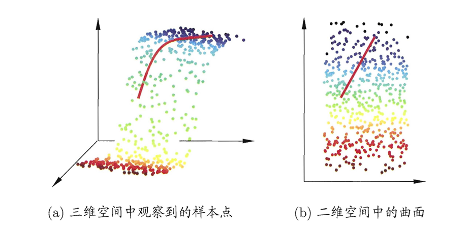
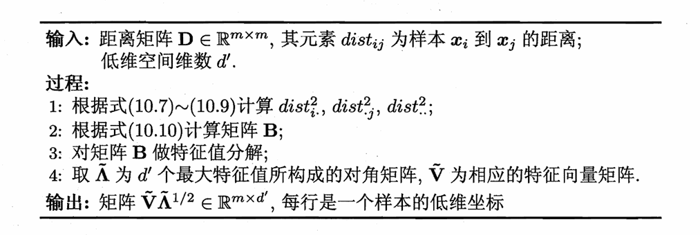
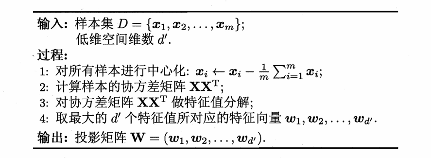
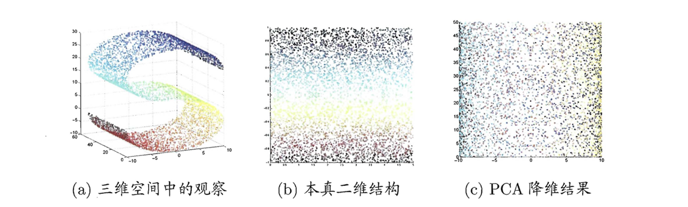
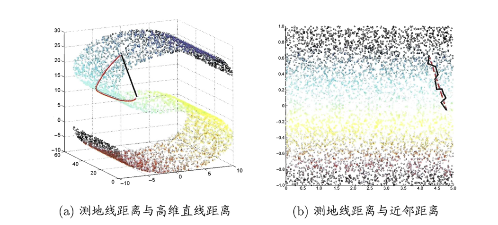
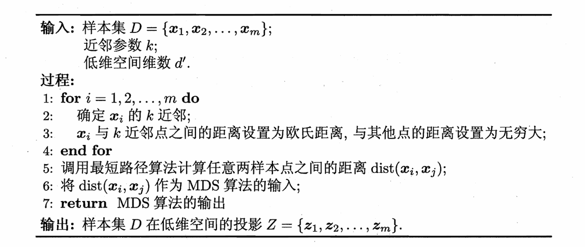
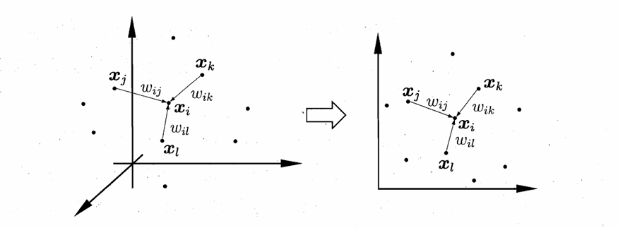
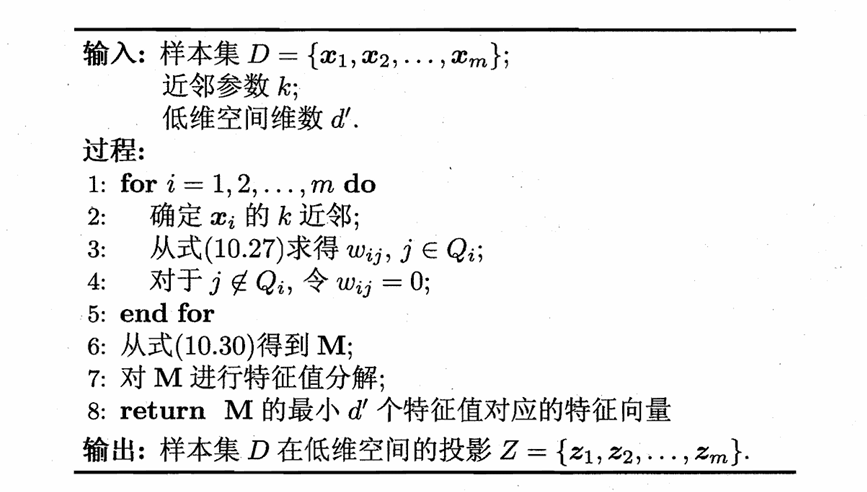

# Chapter10 降维与度量学习

***

## k 近邻学习 kNN

给定测试样本，找出训练集中最靠近的 $k$ 个训练样本，基于这$k$个样本的标签来预测测试样本的标签，没有显式的训练过程。

设测试样本为 $\mathbf{x}$，若其最近邻样本为 $\mathbf{z}$，则最近邻分类器出错的概率就是 $\mathbf{x}$ 和 $\mathbf{z}$ 标签不同的概率：

$$P(err)=1-\sum\limits_{c\in\mathcal{Y}}P(c|\mathbf{x})P(c|\mathbf{z})$$

***

## 低维嵌入

**维数灾难（curse of dimensionality）：**

在高维情形下出现的数据样本稀疏、距离计算困难等问题。缓解维数灾难的重要途径是**降维**。

### 多维缩放 Multi-Dimensional Scaling（MDS）

多维缩放通过数学变换将高维空间转变为低维空间，可以提高样本密度，简化距离计算，要求高维空间中样本之间的距离在低维空间中得以保持。

**数学建模：**

* $m$：样本数
* $d$：高维空间维数
* $d'$：低维空间维数
* $\mathbf{X}\in \mathbb{R}^{d\times m}$：高维空间样本矩阵
* $\mathbf{Z}\in \mathbb{R}^{d'\times m}$：低维空间样本矩阵
* $\mathbf{D}\in \mathbb{R}^{m\times m}$：高维空间距离矩阵，$D_{ij}=dist_{ij}$ 表示样本 $\mathbf{x}_i$ 和 $\mathbf{x}_j$ 之间的距离

目标：获得 $\mathbf{Z}$，满足 $\\|\mathbf{z}\_i-\mathbf{z}\_j\\|=dist_{ij}$，即距离保持。

**内积矩阵 $\mathbf{B}$：**

我们考虑先求降维后样本的内积矩阵 $\mathbf{B}=\mathbf{Z}^T\mathbf{Z}$，$b_{ij}=\mathbf{z}_i^T\mathbf{z}_j$，根据距离保持的要求：

$$
\begin{align}
dist_{ij}^2 &= \\|\mathbf{z}\_i-\mathbf{z}\_j\\|^2 \\\
&= \\|\mathbf{z}\_i\\|^2+\\|\mathbf{z}\_j\\|^2-2\mathbf{z}\_i^T\mathbf{z}\_j \\\
&= b_{ii}+b_{jj}-2b_{ij}
\end{align}
$$

我们假设降维后的 $\mathbf{Z}$ 被中心化了，即$\sum\limits\_{i=1}^m\mathbf{z}\_i=0$，因此，有$\sum\limits\_{i=1}^mb\_{ij}=\sum\limits\_{j=1}^mb\_{ij}=0$。记 $\text{tr}(\mathbf{B})=b\_{11}+b\_{22}+\cdots+b\_{mm}$，则有

$$dist_{i.}^2\equiv\frac{1}{m}\sum\limits_{j=1}^mdist_{ij}^2=\frac{\text{tr}(\mathbf{B})}{m}+b_{ii}$$

$$dist_{.j}^2\equiv\frac{1}{m}\sum\limits_{i=1}^mdist_{ij}^2=\frac{\text{tr}(\mathbf{B})}{m}+b_{jj}$$

$$dist_{..}^2\equiv\frac{1}{m^2}\sum\limits_{i=1}^m\sum\limits_{j=1}^mdist_{ij}^2=\frac{2\text{tr}(\mathbf{B})}{m}$$

综上：

$$b_{ij}=-\frac{1}{2}(dist_{ij}^2-dist_{i.}^2-dist_{.j}^2+dist_{..}^2)$$

也就是说，根据距离不变的约束，可以通过距离矩阵 $\mathbf{D}$ 计算出内积矩阵 $\mathbf{B}$。

**由 $\mathbf{B}$ 求解出 $\mathbf{Z}$：**

由于$\mathbf{B}$是实对称矩阵，因此可以进行特征值分解：

$$\mathbf{B}=\mathbf{V}\boldsymbol{\Lambda}\mathbf{V}^T$$

其中

* $\boldsymbol{\Lambda}=\text{diag}(\lambda_1,\lambda_2,\dots,\lambda_m)$，$\lambda_1\geqslant\lambda_2\geqslant\cdots\geqslant\lambda_m$
* $\mathbf{V}$ 的列向量 $\mathbf{v}_1,\mathbf{v}_2,\dots,\mathbf{v}_m$ 分别是对应的特征向量（需要单位化）

假设其中有 $d^\*$ 个非零特征值，构成的对角矩阵记为 $\boldsymbol{\Lambda}\_\*$，对应的特征向量矩阵记为 $\mathbf{V}\_\*$，则

$$\mathbf{Z}=\boldsymbol{\Lambda}\_\*^{\frac{1}{2}}\mathbf{V}\_\*^T\in\mathbb{R}^{d^\*\times m}$$

为了降维，可以近似地取前 $d'$ 个特征值，构成 $\tilde{\boldsymbol{\Lambda}}$；取对应的前 $d'$ 个特征向量，构成 $\tilde{\mathbf{V}}$，则有：

$$\mathbf{Z}\approx\tilde{\boldsymbol{\Lambda}}^{\frac{1}{2}}\tilde{\mathbf{V}}^T\in \mathbb{R}^{d'\times m}$$

***

## 主成分分析 PCA

***

## 核化线性降维

有时候，需要引入非线性映射才能找到恰当的低维表示。

!!! Warning
    此处省略核主成分分析（KPCA）。

***

## 流形学习 Manifold Learning

!!! Success "Definition"
    **流形：**

    流形是一种空间，整体很复杂，但每个小区域都像普通的欧几里得空间（二维平面或三维空间）一样简单。

流形学习的思想是：若低维流形嵌入到高维空间中，则数据样本在高维空间的分布虽然看上去非常复杂，但在局部上仍具有欧氏空间的性质。因此，可以容易地在局部建立映射关系，然后再设法将局部映射关系推广到全局。

### 等度量映射 Isometric Mapping (Isomap)

等度量映射的出发点是：低维流形嵌入高维空间后，直接在高维空间中计算直线距离具有误导性，因为高维空间中的直线距离在低维嵌入流形上是不可达的：

计算真正的测地线距离的方法是：对每个点基于欧氏距离找出其近邻点，构建连接图，图中近邻点之间存在连接，而非近邻点之间不存在连接。因此，计算两点之间测地线距离的问题就转变为计算连接图上两点之间的最短路径（Dijkstra 算法或 Floyd 算法）。得到任意两点之间的距离后，再利用 MDS 进行降维。

如上所示的过程仅仅得到了训练样本在低维空间的坐标。对于新样本，目前的做法是训练一个回归学习器，用训练样本的高维空间坐标作为训练输入，低维空间坐标作为标签与训练输出进行比较。

### 局部线性嵌入 Locally Linear Embedding (LLE)

局部线性嵌入试图保持邻域内样本之间的线性关系。

例如在上图中，样本点 $\mathbf{x}_i$ 的坐标能通过其邻域样本 $\mathbf{x}_j$，$\mathbf{x}_k$，$\mathbf{x}_l$ 线性组合得到：

$$\mathbf{x}\_i=w_{ij}\mathbf{x}\_j+w_{ik}\mathbf{x}\_k+w\_{il}\mathbf{x}\_l$$

局部线性嵌入就是希望上式在低维空间中仍然成立。

**第一步：**

在高维空间中为每个样本 $\mathbf{x}\_i$ 找到其近邻下标集合 $Q\_i$，通过下式计算出 $w\_{ij}$：

$$\min\limits\_{\mathbf{w}\_1,\mathbf{w}\_2,\dots,\mathbf{w}\_m}\sum\limits\_{i=1}^m\\|\mathbf{x}\_i-\sum\limits\_{j\in Q\_i}w\_{ij}\mathbf{x}\_j\\|\_2^2\quad\text{s.t.}\sum\limits\_{j\in Q\_i}w\_{ij}=1$$

**第二步：**

现在权重矩阵 $\mathbf{W}$ 已知，在低维空间中，通过下式求解每个高维空间的样本 $\mathbf{x}\_i$ 对应的低维空间样本 $\mathbf{z}\_i$：

$$\min\limits\_{\mathbf{z}\_1,\mathbf{z}\_2,\dots,\mathbf{z}\_m}\sum\limits\_{i=1}^m\\|\mathbf{z}\_i-\sum\limits\_{j\in Q\_i}w\_{ij}\mathbf{z}\_j\\|\_2^2$$

**第三步：**

令矩阵

$$\mathbf{M}=(\mathbf{I}-\mathbf{W})^T(\mathbf{I}-\mathbf{W})$$

求出 $\mathbf{M}$ 最小的 $d'$ 个特征值对应的特征向量，组成的矩阵即为降维后的样本矩阵 $\mathbf{Z}$。

***

## 度量学习 Metric Learning

降维的目的是找到一个合适的低维空间，在这个空间中学习效果更好。

事实上，每个空间都对应了一个定义在样本属性上的距离度量，因此寻找合适的空间，本质上就是寻找合适的距离度量。

度量学习的出发点：直接学习出一个合适的距离度量。

**距离度量表达形式：**

对于两个 $d$ 维样本 $\mathbf{x}_i$，$\mathbf{x}_j$，它们之间的平方欧氏距离可以写为

$$\text{dist}\_{\text{ed}}^2(\mathbf{x}\_i,\mathbf{x}\_j)=\\|\mathbf{x}\_i-\mathbf{x}\_j\\|\_2^2=dist\_{ij,1}^2+dist\_{ij,2}^2+\dots+dist\_{ij,d}^2$$

若假定不同属性的重要性不同，可以引入权重 $\mathbf{w}$，得到：

$$
\begin{align}
\text{dist}\_{\text{wed}}^2(\mathbf{x}\_i,\mathbf{x}\_j) &= w\_1\cdot dist\_{ij,1}^2+w_2\cdot dist\_{ij,2}^2+\dots+w_d\cdot dist\_{ij,d}^2 \\\
&= (\mathbf{x}\_i-\mathbf{x}\_j)^T\mathbf{W}(\mathbf{x}\_i-\mathbf{x}\_j)
\end{align}
$$

其中，$\mathbf{W}=\text{diag}(\mathbf{w})$为对角矩阵，通过学习获得，$\mathbf{W}_{ii}=w_i$。

**马氏距离（Mahalanobis Distance）：**

$\mathbf{W}$ 的非对角元素为 $0$，意味着属性之间无关。我们将 $\mathbf{W}$ 替换成普通的半正定对称矩阵 $\mathbf{M}$，引入属性之间的相关性：

$$\text{dist}\_{\text{mah}}^2(\mathbf{x}\_i,\mathbf{x}\_j)=\\|\mathbf{x}\_i-\mathbf{x}\_j\\|\_{\mathbf{M}}^2=(\mathbf{x}\_i-\mathbf{x}\_j)^T\mathbf{M}(\mathbf{x}\_i-\mathbf{x}\_j)$$

改成对度量矩阵 $\mathbf{M}$ 的学习。

**近邻成分分析（Neighborhood Component Analysis, NCA）：**

对 $\mathbf{M}$ 的学习设置一个目标：提高近邻分类器的性能。

近邻分类器原本采用多数投票法，现在将其替换为概率投票法。对于任意样本 $\mathbf{x}\_j$，其对样本 $\mathbf{x}\_i$ 分类结果影响的概率为：

$$p\_{ij}=\frac{e^{-\\|\mathbf{x}\_i-\mathbf{x}\_j\\|\_{\mathbf{M}}^2}}{\sum\limits\_le^{-\\|\mathbf{x}\_i-\mathbf{x}\_l\\|\_{\mathbf{M}}^2}}$$

也就是说，如果 $\mathbf{x}\_j$ 与 $\mathbf{x}\_i$ 的距离越大，那么 $\mathbf{x}\_j$ 对 $\mathbf{x}\_i$ 分类结果的影响就越小。

如果目标是最大化留一法正确率，则 $\mathbf{x}_i$ 的正确率为

$$p\_i=\sum\limits\_{j\in\Omega_i}p\_{ij}$$

其中，$\Omega\_i$ 为与 $\mathbf{x}\_i$ 同类的样本下标集合。整体正确率为

$$\sum\limits\_{i=1}^mp\_i=\sum\limits\_{i=1}^m\sum\limits\_{j\in\Omega\_i}p\_{ij}$$

由于 $\mathbf{M}$ 是半正定对称矩阵，可以将其分解为 $\mathbf{M}=\mathbf{PP}^T$，因此上式作为最终的优化目标，可以改写为

$$\min\limits\_{\mathbf{P}}[1-\sum\limits\_{i=1}^m\sum\limits\_{j\in\Omega\_i}\frac{e^{-\\|\mathbf{P}^T\mathbf{x}\_i-\mathbf{P}^T\mathbf{x}\_j\\|\_2^2}}{\sum\limits\_le^{-\\|\mathbf{P}^T\mathbf{x}\_i-\mathbf{P}^T\mathbf{x}\_l\\|\_2^2}}]$$