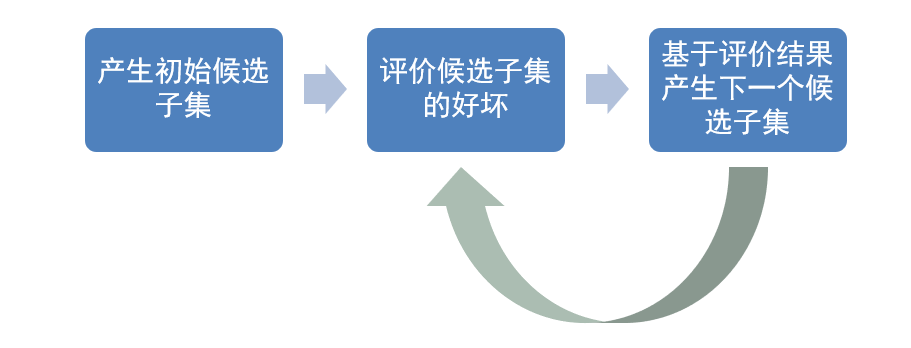
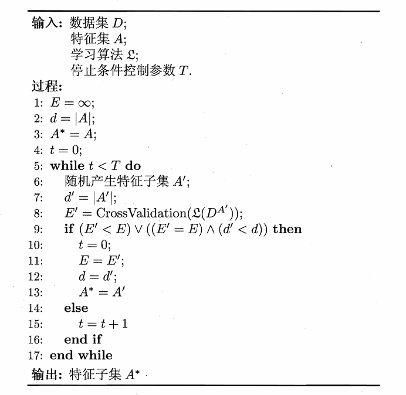
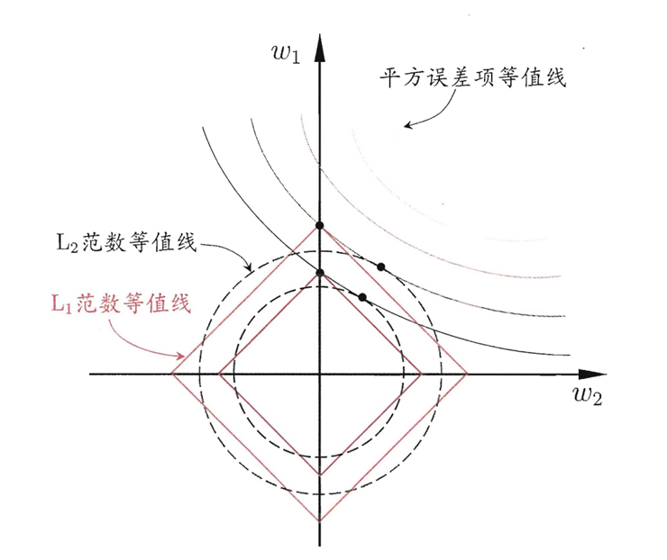

# Chapter11 特征选择与稀疏学习

***

## 子集搜索与评价

**特征分类：**

* 相关特征：与任务有关
* 无关特征：与任务无关
* 冗余特征：能被其他特征推出

**特征选择方法：**

两个关键环节是子集搜索和子集评价。

**子集搜索：**

* 前向搜索：逐步增加相关特征
* 后向搜索：逐步删除无关特征
* 双向搜索：有增有减

**子集评价：**

利用某个特征子集对数据集进行划分，每个划分区域对应特征子集的某种取值。

如果上述划分和真实划分（标签）差异越小，则特征子集越好。

例如，依据特征子集 $A$ 将数据集 $D$ 划分为 $V$ 份（即 $A$ 的取值数），每一份用 $D^v$ 表示。这样，可以计算 $D$ 和 $D^v$ 的信息熵，从而得到 $A$ 的信息增益，用来评价好坏。

***

## 过滤式选择

过滤式选择先进行特征选择，过滤掉无用数据；再进行模型训练。即：特征选择过程与后续学习器无关。

特征选择使用 **Relief 方法**：每个特征有一个表示重要程度的相关统计量，根据相关统计量进行选择。

**相关统计量：**

先给出两个定义：

* 猜中近邻（near-hit）：$\mathbf{x}\_i$ 同类样本中的最近邻，记为 $\mathbf{x}\_{i,nh}$
* 猜错近邻（near-miss）：$\mathbf{x}\_i$ 异类样本中的最近邻，记为 $\mathbf{x}\_{i,nm}$

特征 $j$ 的相关统计量为

$$\delta^j=\sum\limits\_i[-\text{diff}(x\_i^j-x\_{i,nh}^j)^2+\text{diff}(x\_i^j-x\_{i,nm}^j)^2]$$

其中：

* $j$ 为离散特征：若 $x\_a^j=x\_b^j$，则 $\text{diff}(x\_a^j-x\_b^j)=0$，否则为 $1$
* $j$ 为连续特征：$\text{diff}(x\_a^j-x\_b^j)=|x\_a^j-x\_b^j|$

如果特征 $j$ 区分对错比较有效，那么猜中近邻会很近，猜错近邻会很远，从而相关统计量比较大。

***

## 包裹式选择

包裹式选择直接将最终要使用的学习器的性能作为特征子集的评价准则。

包裹式选择比过滤式选择效果更好，但计算开销更大。

**Las Vegas Wrapper (LVW):**

基本步骤：

* 循环每一轮随机产生一个特征子集
* 交叉验证，推断当前特征子集的误差
* 多次循环后，选择误差最小的特征子集

***

## 嵌入式选择

嵌入式选择将特征选择和学习器训练融为一体，两者在同一个优化过程中完成。

考虑线性回归模型，使用平方误差作为损失函数，若使用 L2 正则化，则优化目标称为**岭回归**，其形式为

$$\sum\limits\_{i=1}^m(y\_i-\mathbf{w}^T\mathbf{x}\_i)^2+\lambda\\|\mathbf{w}\\|\_2^2$$

若使用 L1 正则化，则优化目标称为 **LASSO 回归**，其形式为

$$\sum\limits\_{i=1}^m(y\_i-\mathbf{w}^T\mathbf{x}\_i)^2+\lambda\\|\mathbf{w}\\|\_1$$

L1 正则化更容易获得稀疏解（参数中有更多 $0$）。理由见下图，平方误差项等值线与正则化等值线相交处更容易落在坐标轴上，此时某些权重为 $0$。这自然而然地实现了嵌入式特征选择。

***

## 稀疏表示与字典学习

我们将样本放在一起就形成了一个矩阵（每行对应一个样本，每列对应一个特征），刚刚我们在讨论的特征选择是一种特征的稀疏性，即可以通过特征选择去除掉矩阵中的一些无关列。

现在考虑另一种稀疏性：矩阵中有很多 $0$，但并不是整列或整行存在。这样稀疏表示的样本有利于问题的线性可分，从而简化后续的学习任务。

为稠密表示的样本找到合适的字典，将样本转化为稀疏表示，这一过程称为**字典学习（dictionary learning）**。

给定数据集 $\\{\mathbf{x}\_1,\mathbf{x}\_2,\dots,\mathbf{x}\_m\\}$，字典学习最简单的形式为

$$\min\limits\_{\mathbf{B},\boldsymbol{\alpha}\_i}\sum\limits\_{i=1}^m\\|\mathbf{x}\_i-\mathbf{B}\boldsymbol{\alpha}\_i\\|\_2^2+\lambda\sum\limits\_{i=1}^m\\|\boldsymbol{\alpha}\_i\\|\_1$$

* $\mathbf{B}\in \mathbb{R}^{d\times k}$：字典矩阵
* $k$：字典词汇量
* $\boldsymbol{\alpha}\_i\in \mathbb{R}^k$：样本 $\mathbf{x}\_i\in \mathbb{R}^d$ 的稀疏表示

上式的第一项是希望$\alpha\_i$能很好地重构$x\_i$，第二项是希望$\alpha\_i$尽可能稀疏。

**求解：**

采用变量交替优化的方法。

第一步：固定 $\mathbf{B}$，为每个样本 $\mathbf{x}\_i$ 找到相应的 $\boldsymbol{\alpha}\_i$：

$$\min\limits\_{\boldsymbol{\alpha}\_i}\\|\mathbf{x}\_i-\mathbf{B}\boldsymbol{\alpha}\_i\\|\_2^2+\lambda\\|\boldsymbol{\alpha}\_i\\|\_1$$

第二步：固定 $\boldsymbol{\alpha}\_i$，更新字典 $\mathbf{B}$：

$$\min\limits\_{\mathbf{B}}\\|\mathbf{X}-\mathbf{BA}\\|\_F^2$$

!!! Warning
    此处省略压缩感知。